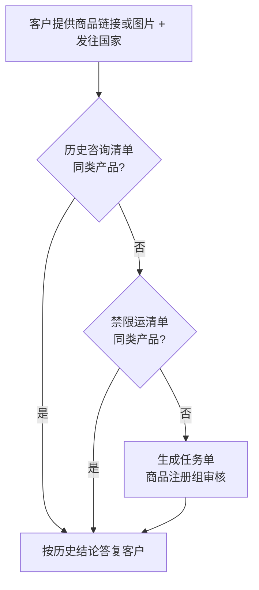

# 01 — 新品能否发货 / 能否入库

> 场景：客户尚未注册 SKU，或只有商品链接/图片，询问能否发往某国、能否入海外仓。  
> 咨询量约 **25%**（见 [consultation-taxonomy](../scenes/consultation-taxonomy.md)）。

---

## 对客起始话术 `[KB]`

您好！您可以通过如下 2 种方式快速确认商品能否发货：

1. 在 **【WINIT 禁限运清单】** 中查询  
   - 路径：万邑联 → **公告** → 搜索「禁限运清单」→ 下载最新版
2. **直接进行商品注册**，专人审核后将结果更新到万邑联并邮件通知  
   - 操作指引见万邑联帮助中心商品注册章节

---

## 客服处理流程（白板转写）`[KB]`

### 分支说明

| 步骤 | 动作 | 数据依赖 |
|------|------|----------|
| 历史清单匹配 | 识别是否已有同类产品咨询记录 | 历史咨询清单 API（待对接）`[推断]` |
| 禁限运匹配 | 对照 WINIT 禁限运清单 | KB 规则表 / 公告附件 |
| 生成任务单 | 登记后由注册组答复 | 任务单 API（待对接）`[推断]` |

---

## 客户发链接即问（习惯场景）`[KB]`

客户直接发商品链接问能否发货时，**不要先让客户自己查清单**，应：

1. 进入飞书群 **「异常解决/咨询（商品注册）」**
2. 点击顶部 **「咨询接口」**（外链表单）
3. 登记以下信息并等待注册组反馈：
   - 咨询类型：如「头程及入库要求咨询」
   - 仓库（如 USWC / USWC2 / USKY3）
   - SKU（若有）
   - **商品链接**（可多条）
   - **目的国家**
   - **运输方式**：上海空运 / 上海海运 / 华南空运 / 华南海运 / 客户直发

---

## 对客需收集的最小信息

| 字段 | 必填 | 说明 |
|------|------|------|
| 商品链接或清晰图片 | 是 | 用于归类与审核 |
| 目的国家 | 是 | 合规因国别而异 |
| 运输方式 | 建议 | 头程空海运 / 客户直发 |
| SKU | 否 | 已注册则提供 |

---

## 专家路由

| 条件 | 路由 |
|------|------|
| 教客户怎么注册 | `sku/registration-guide` |
| 已注册 SKU 查发布态/禁止入库 | `sku/profile` + `flows/05` |
| 禁限运细则长文判定 | P2 `sku/compliance-check` |
| 入库单报错「商品不存在」 | `flows/03` + `sku/registration-guide` |

---

## 原始配图

- 咨询群入口截图：`raw/new-product-shipping-inquiry/C6ImbG1DXoVnCcxRu5wckPHbnag.png`
- 流程白板（与下节相同）：`raw/inbound-carriability-flow/BH63wcY2LhjtvxbkuPncjyXdnNg.png`

---

## 接口 Gap（设计期）

| 接口 | 用途 | 状态 |
|------|------|------|
| 历史咨询清单 | 自动匹配同类产品 | `[待确认]` |
| 禁限运清单 | 结构化查询 | KB 已有，API Gap |
| 生成任务单 | 人工审核登记 | `[待确认]` |
