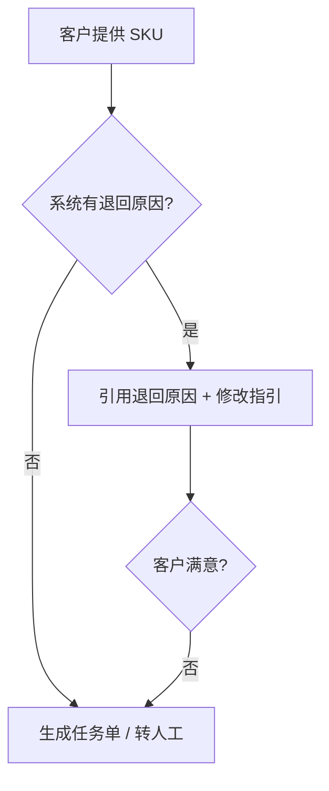

# 03 — 注册 SKU 退回原因与重提

> 场景：审核退回，客户问原因或不知如何修改。咨询量约 **2%**。

---

## 处理流程 `[KB]`

1. 机器人识别「XX 退回原因」→ 按 SKU 查系统退回原因  
2. 仍无法解决 → 转人工；人工答复后沉淀历史咨询清单

---

## 系统查询路径 `[KB]`

**万邑联** → 商品管理 → 商品信息 → 点击 SKU → **商品详情**

- 页面顶部 **粉色/红色提示条** 即为退回原因（含进口国维度，如「退回(US)」）

### 示例：链接无效 `[KB]`

| 字段 | 值 |
|------|-----|
| 状态 | 退回(US) — 链接无效 |
| 原因全文 | 进口商品链接无效：链接打不开 / 无图片 / 无交易价格 / 已下架等，请提供真实可交易链接 |
| 商品编码 | 如 `T-LT101` |
| 错误链接示例 | `www.baidu.com`（非真实售卖页） |

### 示例：尾程 DG 渠道限制 `[KB]`

| 字段 | 值 |
|------|-----|
| 状态 | 退回(US) |
| 原因 | 尾程渠道限制 — 商品涉及尾程 DG 渠道运输，USKY5 仓库暂无此渠道 |

---

## 对客 SOP（通用）

1. 打开商品详情查看 **完整退回原因**
2. 按原因修改对应字段（链接、尺重、属性、证书等）
3. 商品编辑页右下角 **提交**，等待再审
4. 若原因看不懂 → 提供 SKU + 截图转人工

---

## 产品改进方向 `[KB]`

- 客户常不看退单原因 → 退回原因需**细化描述**
- 未发布且待审核 → 计划给客户 **取消注册** 权限（系统需求已提）

---

## 专家分支

| branch | 条件 |
|--------|------|
| `guide_resubmit` | 已识别退回原因 |
| `need_info` | 缺 SKU |
| `need_human` | 系统无原因或争议 |

---

## 原始配图

- 路径示意：`raw/consultation-taxonomy-analysis/FnRLbRTHros1rOxA6MFcKqSunWc.png`
- 流程白板：`raw/consultation-taxonomy-analysis/MExUwGkD7hDb3TbG5VockrkxnQb.png`
