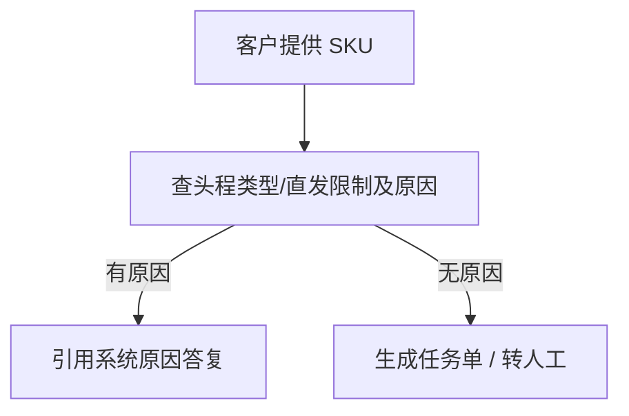

# 04 — 头程直发限制（限直发）

> 场景：客户想下 **Winit 承运** 入库单，发现无法下单，问「为什么限直发」。咨询量约 **3%**。

---

## 名词 `[KB]`

| 值 | 含义 |
|----|------|
| **限直发**（卖家直发） | SKU 注册信息仅符合直发标准，**不支持 Winit 头程入仓**；客户须自有仓验货后自行安排货代送海外仓 |
| **不限** | 可选 Winit 头程或客户直发 |

### 该不该问

| 条件 | 是否应问直发原因 |
|------|------------------|
| 头程直发限制 = **限直发** 且客户要下 Winit 头程单 | **应该** |
| 头程直发限制 = **不限** | **不应该**（引导查其他报错） |

---

## 处理流程 `[KB]`

**系统路径**：万邑联 → 商品管理 → 商品信息 → 列表列 **头程类型** → 点击旁 **红色感叹号** 查看原因弹窗。

---

## 常见原因：品牌海关 IP 备案（截图转写）`[KB]`

**限直发原因示例**：注册商品附带品牌在**中国海关知识产权保护系统**有备案，**限制为自发货入仓**。

对客说明与解法：

### 方式一：自有出口商走 Winit 头程

1. 使用 **自有出口商** 创建 Winit 运输入库单  
2. 在 SKU **备注** 填写：`我司选择自有出口商使用WINIT头程`  
3. 重新提交

### 方式二：第三方出口商 + 授权

1. 使用第三方出口商创建 Winit 运输入库单  
2. 在海关 IP 系统完成 **「Winit 第三方出口报关抬头」** 授权  
3. 将授权成功截图上传至该 SKU **资质证书** 栏

---

## 列表字段（profile 契约相关）`[KB]`

商品信息列表常见列：

- 进口地、状态（已发布）、海关建议申报价值
- **头程类型**（卖家直发 / 不限）
- **禁止入库**（是/否）
- **特殊属性**

---

## 专家分工

| Expert | 职责 |
|--------|------|
| `sku/profile` | 输出 `directShipmentRestriction`、`restrictionReason`（API 映射待实现） |
| `sku/registration-guide` | 对客解释两种解法、备注与资质上传步骤 |

---

## 原始配图

- 弹窗与列表：`raw/consultation-taxonomy-analysis/ROt0blGDioDZUMxmCWucwihAnTY.png`
- 流程白板：`raw/consultation-taxonomy-analysis/UCYxwieZHhv4zQb8SYVcuYO8nAg.png`
