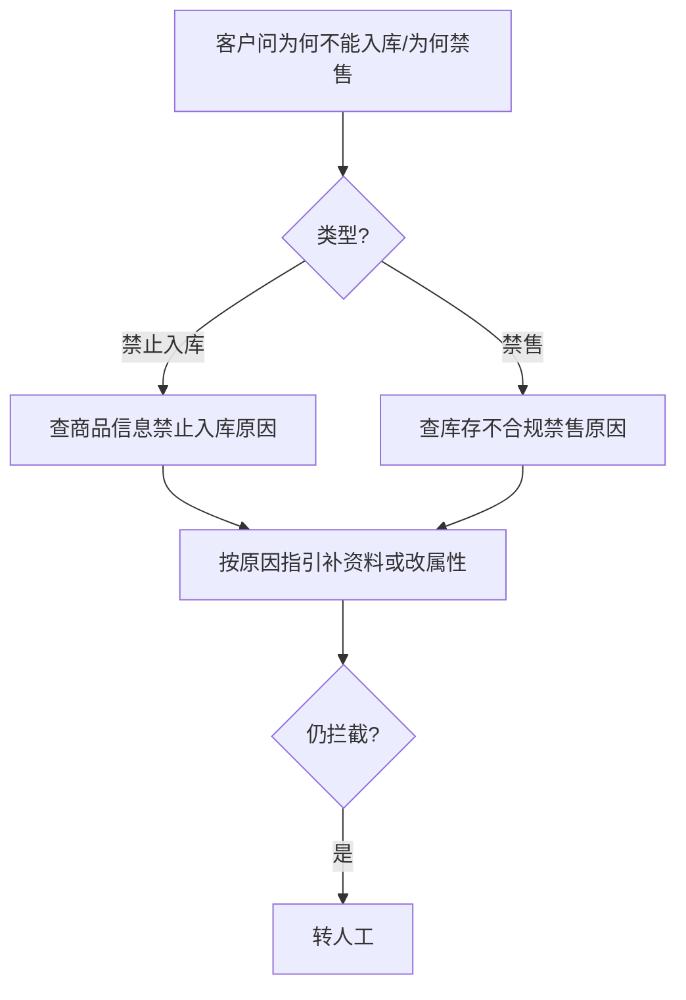

# 05 — 禁止入库与禁售

> 场景：SKU 无法下入库单，或库存被「不合规禁售」。各 <1% 但规则明确。

---

## 禁止入库 `[KB]`

### 查询路径

1. **万邑联** → 商品管理 → 商品信息  
2. 列表列 **禁止入库** =「是」→ 点击 **红色感叹号** 查看原因  
3. 或查看顶部 **待办提醒 → 待补充**

### 常见原因（截图转写）

**纯电 / DG 缺资料**：

> 纯电或 DG 商品未提供 SDS 及 UN38.3 测试报告。需提供与商品匹配且在**有效期**内的 SDS、UN38.3，否则无法接收入库。

**待补充统计**（示例）：缺 WEEE/德语说明书/GPSR/包材 91 条；缺第三方商品条码 32 条；缺证书 15 条。

### 对客要点

- 解释「禁止入库」是 SKU 维度，与「未发布」不同  
- 证书补齐路径 → [07-compliance-certificates](07-compliance-certificates.md)  
- 无法下单且已确认资料齐全 → 转人工查具体拦截

---

## 禁售 / 不合规禁售 `[KB]`

### 查询路径（客服/TOM）

**TOM** → 库存 → 库存管理 → **库存查询**

1. 必选 **仓库**，或填 **商品条码/商品编码**  
2. 查看列 **不合规禁售** 数量 → 点击数字看详情弹窗

### 常见原因（截图转写）

**缺 GPSR**：

> 需要 GPSR — 您的商品未关联 GPSR 信息，请尽快完成关联，即可解除此项禁售。【修改了禁止出库】

弹窗字段：仓库、禁售时间、更新人、禁止原因。

### 万邑联侧（卖家）

海外仓库存 → 不合规禁售详情（同类 GPSR 文案）。

---

## 处理流程

---

## 专家分工

| Expert | 输出 |
|--------|------|
| `sku/profile` | `prohibitInbound`、禁售标记（若 API 提供） |
| `sku/compliance-check`（P2） | GPSR/WEEE/证书是否齐备的长文判定 |
| `sku/registration-guide` | 对客操作步骤（关联 GPSR、上传证书） |

---

## 原始配图

- 禁止入库待办：`raw/consultation-taxonomy-analysis/OIiGbulkVoLZigxbdvCclkdCn3u.png`
- 禁售弹窗（万邑联）：`raw/consultation-taxonomy-analysis/SxZjbjgKkootTTxLtjdcS451nOf.png`
- 禁售查询（TOM）：`raw/consultation-taxonomy-analysis/F78wb0q2UoXpd8xSnjmcuKU3nof.png`
