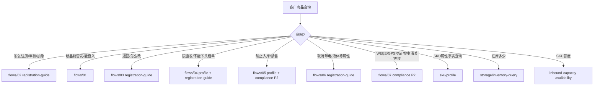

# SKU 域 Playbook

> **定位**：商品主数据与客户咨询的「知识枢纽」——术语、主决策树、专家路由。  
> 细则见 `flows/`；原始飞书导出见 `raw/`。

---

## 一、术语表

| 术语 | 说明 |
|------|------|
| **SKU / 商品编码** | 万邑联商品主数据唯一标识；下入库单前须**注册并审核通过、已发布** `[KB]` |
| **进口国** | 商品在目的国的注册维度；同一 SKU 可多进口国，属性/合规可能不同 |
| **发布态** | 草稿 / 审核中 / 已发布 / 退回 / 失效；未发布无法下入库单 `[KB]` |
| **头程类型 / 头程直发限制** | `不限` = 可选 Winit 头程或客户直发；`限直发`（卖家直发）= 不支持 Winit 头程入仓 `[KB]` |
| **禁止入库** | SKU 维度标记，导致无法创建入库单；常见原因：纯电/DG 缺 SDS+UN38.3 `[KB]` |
| **禁售 / 不合规禁售** | 库存维度冻结，常见原因：缺 GPSR 关联 `[KB]` |
| **特殊属性** | 带电池、带液体、带磁性、带粉末、带刀片、食品、化工、DG 等 `[KB]` |
| **维护任务 / MT 单** | 商品审核任务；`应维护完成时间` 为承诺审核 SLA `[KB]` |
| **禁限运清单** | 公告下载的 WINIT 标准禁限运表；客户可自助查询 `[KB]` |
| **历史咨询清单** | 客服侧已答复的同类产品咨询库；机器人优先匹配 `[KB]` |
| **商品注册咨询群** | 飞书群「异常解决/咨询（商品注册）」；新品承运须先咨询再填表 `[KB]` |

---

## 二、主决策树（客户意图路由）

---

## 三、新品能否承运/入库（总流程）`[KB]`

来源：白板流程图（见 `flows/01`）。

1. 客户需提供：**商品链接或图片**、**发往国家**（及运输方式：上海/华南 空海运、客户直发）。
2. **查历史咨询清单**：是否同类产品 → 是则直接反馈历史结论。
3. **查禁限运清单**：是否同类产品 → 是则按清单反馈。
4. 均未命中 → **生成任务单**（商品注册组人工审核）；客服登记后按反馈答复。
5. 对客也可引导：**直接商品注册**，审核结果邮件通知。

**客服登记入口**：飞书群「异常解决/咨询（商品注册）」→ 点击 **咨询接口** → 填咨询类型（如头程及入库要求）、仓库、SKU、商品链接。

---

## 四、系统事实查询（摘要）

| 要查什么 | 路径 | 详见 |
|----------|------|------|
| 头程直发限制 + 原因 | 万邑联 → 商品管理 → 商品信息 → 头程类型旁感叹号 | `flows/04` |
| 退回原因 | 万邑联 → 商品管理 → 商品信息 → 商品详情顶部红条 | `flows/03` |
| 禁止入库原因 | 商品信息列表「禁止入库」列感叹号；待办提醒区 | `flows/05` |
| 禁售原因 | TOM → 库存 → 库存查询 → 不合规禁售列 | `flows/05` |
| 德国 WEEE 类别 | 商品编辑 → 进口国「德国」→ WEEE 类别 | `appendix/weee-categories-de.md` |
| 特殊属性勾选 | 商品编辑 → 商品特性 → 商品属性 | `flows/06` |
| 审核 SLA | 商品维护任务列表 → 应维护完成时间 | `flows/02` |

完整路径表：[appendix/system-paths.md](appendix/system-paths.md)。

---

## 五、转人工条件（通用）

- 历史清单与禁限运清单均未覆盖，且客户不接受「先注册等审核」
- 个案解禁、敏感品争议、品牌/IP 例外
- 机器人引用系统原因后客户仍不满意
- 税率等无标准话术场景 → 暂转人工 `[KB]`
- 三方编码增删查 → `sku/barcode-guide`（P2）`[KB]`
- 修改包装信息（实为入/出库打包方式）→ `inbound`/`outbound` 打包专家（**待建空缺**），暂转人工 `[KB]`

转人工后应将结论沉淀至历史咨询清单 `[KB]`。

---

## 六、专家输出契约（提醒）

| Expert | 输出重点 |
|--------|----------|
| `sku/profile` | `publishStatus`、`prohibitInbound`、头程直发限制、特殊属性、`dataSource` |
| `sku/registration-guide` | `branch` + `sopSteps`；不代客写 API |
| `sku/compliance-check`（P2） | `complianceVerdict`、`missingDocuments[]` |

---

## 延伸阅读

- [scenes/consultation-taxonomy.md](scenes/consultation-taxonomy.md) — 全量场景占比
- [sku-plan.md](../plan/sku-plan.md) — 边界卡
