# 商品咨询群问题归类汇总分析
# 总体情况

| 原因类型 | 场景（什么条件下会问） | 场景（什么条件下不应该问） | 名词解释 | 举例 | 个数 | 占比 | 方案 | 策略 | 系统画面 |
| --- | --- | --- | --- | --- | --- | --- | --- | --- | --- |
| SKU注册加急 |  |  |  |  | 4570 | 0.6135 | 给客服做个加急功能，不需要填写表单，无需商品组回复 | [{'segmentStyle': {'bold': False, 'fontSize': 11, 'foreColor': 'rgb(0, 0, 0)', 'italic': False, 'strikeThrough': False, 'underline': False}, 'text': '自动加急\n1.识别到客户"SKU加急审核""注册加急”自动弹出如下话术\n尊敬的客户，您好！您提交的SKU已进入审核流程，预计审核时效：', 'type': 'text'}, {'segmentStyle': {'bold': True, 'fontSize': 11, 'foreColor': '#f54a45', 'italic': False, 'strikeThrough': False, 'underline': False}, 'text': '引用系统待审核完成时间', 'type': 'text'}, {'segmentStyle': {'bold': False, 'fontSize': 11, 'foreColor': 'rgb(0, 0, 0)', 'italic': False, 'strikeThrough': False, 'underline': False}, 'text': '。\n\n时效符合预期的话请您耐心等待；如若需加急，可点击加急（此处有加急按钮,点击后弹出加急原因选择:1.急需下入库单 2.急需打印条码标签 3.急需关联退货商品）申请，我们会尽快处理，感谢您的理解与配合！', 'type': 'text'}] |  |
| 商品是否可以承运或入库 |  |  |  |  | 1828 | 0.2454 |  | 1.识别历史咨询清单自动回复。 2.未识别到识别限运清单自动回复 3.剩余的转人工,人工回复后,相关内容也要自动同步至历史咨询清单。 |  |
| 直发原因咨询 | SKU对应进口国头程直发限制=限直发,客户想下WINIT承运入库单发现无法下单。 | SKU对应进口国头程直发限制=不限 | 1.限直发：SKU 注册信息仅符合直发标准，不支持使用 WINIT 头程入仓。客户需在自有仓/工厂完成验货，并自行委托国际货代将货物送至万邑通海外仓。 2.不限：SKU 注册信息符合承运标准，可无限制发布。客户可选择 WINIT 头程或自安排货代运输至万邑通海外仓。 | [{'text': '1.会问:', 'type': 'text'}, {'cellPosition': None, 'link': 'https://cnmmstom.winit.com.cn/ItemsManage/detail/id/20587473', 'text': 'M010000000009864105', 'type': 'url'}, {'text': '美国头程直发限制=限直发,客户在万邑联下WINIT承运入库单发现无法下单，咨询直发原因,应引用系统如下图限直发原因给客户', 'type': 'text'}, {'fileToken': 'MBrIbnUsco2Wt9xjPSicfT1JnQZ', 'mimeType': 'image/png', 'size': 26510, 'text': 'image (1).png', 'type': 'attachment'}, {'text': '\n', 'type': 'text'}, {'text': '2.不该问:', 'type': 'text'}, {'cellPosition': None, 'link': 'https://cnmmstom.winit.com.cn/ItemsManage/detail/id/20587431', 'text': 'M010000000009988049', 'type': 'url'}, {'text': ' 头程直发限制=不限,不该问直发原因', 'type': 'text'}] | 247 | 0.0332 | 1.头程无法承运的,客户想走头程 2.直发原因细化描述 | 1.机器人根据SKU引用系统现直发原因,路径见右图  2.依然无法达到客户想要的答案,转人工,客户提供SKU及期望内容  3.转人工的事后需思考同类内容如何沉淀下次AI回答 | {'fileToken': 'R8b4b9oiEonGg4xog66cC73unMp', 'height': 868, 'link': 'https://winitlink.feishu.cn/space/api/box/stream/download/v2/cover/R8b4b9oiEonGg4xog66cC73unMp/?height=1280&mount_node_token=Tdf9sIFfxhK1nft22mJctu2HnGf&mount_point=sheet_image&policy=equal&width=1280', 'text': '', 'type': 'embed-image', 'width': 2038} |
| 注册SKU退回原因咨询 |  |  |  |  | 122 | 0.0164 | 1.客户不看退单原因 2.退回原因细化描述 | 1.机器人根据SKU引用现退回原因,路径见右图  2.依然无法达到客户想要的答案,转人工,客户提供SKU及期望内容  3.转人工的事后需思考同类内容如何沉淀下次AI回答 | {'fileToken': 'AptVbEHesoxWPWxuTywcbyI2n1S', 'height': 363, 'link': 'https://winitlink.feishu.cn/space/api/box/stream/download/v2/cover/AptVbEHesoxWPWxuTywcbyI2n1S/?height=1280&mount_node_token=Tdf9sIFfxhK1nft22mJctu2HnGf&mount_point=sheet_image&policy=equal&width=1280', 'text': '', 'type': 'embed-image', 'width': 803} |
| 修改WEEE类别 |  |  |  |  | 113 | 0.0148 |  | [{'text': '1.机器人根据SKU引用系统进口国德国下面WEEE类别,尊敬的客户,您好！依据德国《电器与电子设备法》（ElektroG），您咨询的 SKU 归入:XX{系统显示类别,例如5.外部尺寸不超过50厘米的设备（小型设备）}，第1—6类产品的具体定义见下，您也可访问德国法规官网了解更多信息（', 'type': 'text'}, {'cellPosition': None, 'link': 'https://www.gesetze-im-internet.de/elektrog_2015/BJNR173910015.html#BJNR173910015BJNG000100000', 'text': 'https://www.gesetze-im-internet.de/elektrog_2015/BJNR173910015.html#BJNR173910015BJNG000100000', 'type': 'url'}, {'text': '）。\n 1.第一类:温度交换设备（Wärmeaustauschgeräte）\n 任何尺寸、以电能驱动，通过气体、油、制冷剂等非水物质实现冷却、加热或除湿功能的电子电气设备，核心特征是具备 “热交换” 功能.\n 2.第二类：屏幕、显示器和包含表面大于 100 平方厘米的屏幕的设备(Bildschirmgeräte für den privaten Haushalt)\n 以 “电子屏幕显示图像 / 信息” 为主要功能，且满足以下任一条件的设备：①屏幕表面积≥100 平方厘米；②核心用途为图像显示的设备。\n 3.第三类：灯具(Lampen)\n 可由终端用户安装 / 更换的电光源。\n 4.第四类：尺寸超过 50 厘米的设备（大型设备）（Großgeräte）\n 至少一个外部尺寸＞50 厘米，且未被归入 1-3 类的电子电气设备，核心特征是 “尺寸超限” 且功能不属于前 3 类的专用范畴。\n 5.第五类：尺寸不超过50厘米的设备（小型设备）（Kleingeräte）\n 最大外部尺寸≤50 厘米，且未被归入 1-4 类、6 类的电子电气设备，涵盖 “非 IT / 电信类” 的小型电器。\n 6.尺寸不超过 50 厘米的小型 IT 和电信设备（Kleine IT- und Telekommunikationsgeräte）\n 用于收集、传输、处理、存储和呈现信息（信息技术设备）以及在空间距离上进行电子信号（语音、视频和数据）传输的通讯设备，最大外形尺寸等于或小于50厘米，但未归为上述5类的设备。\n 2.依然无法解决客户问题,转人工\n 3.转人工的事后需思考同类内容如何沉淀下次AI回答', 'type': 'text'}] | {'fileToken': 'QSSwbaUTnoIHZxxYxMMc4sugnFh', 'height': 614, 'link': 'https://winitlink.feishu.cn/space/api/box/stream/download/v2/cover/QSSwbaUTnoIHZxxYxMMc4sugnFh/?height=1280&mount_node_token=Tdf9sIFfxhK1nft22mJctu2HnGf&mount_point=sheet_image&policy=equal&width=1280', 'text': '', 'type': 'embed-image', 'width': 2480} |
| 解除带电池 |  |  |  |  | 59 | 0.0072 | 人工 | 1.引导客户确实实物是否带电池及处理方式  尊敬的客户，您好！请先确认该SKU在发货时，商品本体或包装内是否含电池（以实际发货为准）：  - 含电池：无需更改“带电池”属性。  - 不含电池：请在 万邑联 > 商品管理 > 商品信息 中找到该SKU，取消勾选“带电池”，点击右下角“提交”，并等待审核。  2.依然无法解决客户问题,转人工  3.转人工的事后需思考同类内容如何沉淀下次AI回答 |  |
| 禁售原因咨询 |  |  |  |  | 52 | 0.007 |  | 1.机器人根据SKU引用现禁售原因,路径见右图  2.依然无法达到客户想要的答案,转人工  3.转人工的事后需思考同类内容如何沉淀下次AI回答 |  |
| 禁止入库原因咨询 |  |  |  |  | 40 | 0.0054 |  | 1.机器人根据SKU引用现禁止入库原因,路径见右图  2.依然无法达到客户想要的答案,转人工  3.转人工的事后需思考同类内容如何沉淀下次AI回答 |  |
| 品牌是否有备案 |  |  |  |  | 39 | 0.0052 | 查询路径+举例 | [{'text': '1.引导客户自己查询。\n 尊敬的客户，您好！\n 为确认品牌在发货国与目的国的备案情况，您可按以下步骤操作：\n - 将品牌名称（例如：SAMSUNG）分别输入对应国家的官方查询网站检索；\n - 若查询显示该品牌已在相应国家完成备案，请提供该国家的品牌授权文件。\n 中国：', 'type': 'text'}, {'cellPosition': None, 'link': 'http://202.127.48.145:8888/zscq/search/jsp/vBrandSearchIndex.jsp', 'text': 'http://202.127.48.145:8888/zscq/search/jsp/vBrandSearchIndex.jsp', 'type': 'url'}, {'text': ' \n 美国：', 'type': 'text'}, {'cellPosition': None, 'link': 'https://iprs.cbp.gov/s/#/', 'text': 'https://iprs.cbp.gov/s/#/', 'type': 'url'}, {'text': ' \n 英国：', 'type': 'text'}, {'cellPosition': None, 'link': 'https://iprs.cbp.gov/s/#/', 'text': 'https://iprs.cbp.gov/s/#/', 'type': 'url'}, {'text': ' \n 德国：', 'type': 'text'}, {'cellPosition': None, 'link': 'https://register.dpma.de/DPMAregister/marke/einsteiger', 'text': 'https://register.dpma.de/DPMAregister/marke/einsteiger', 'type': 'url'}, {'text': ' \n 澳大利亚：', 'type': 'text'}, {'cellPosition': None, 'link': 'https://search.ipaustralia.gov.au/trademarks/search/quick', 'text': 'https://search.ipaustralia.gov.au/trademarks/search/quick', 'type': 'url'}, {'text': ' \n 加拿大：', 'type': 'text'}, {'cellPosition': None, 'link': 'https://ised-isde.canada.ca/cipo/trademark-search/srch', 'text': 'https://ised-isde.canada.ca/cipo/trademark-search/srch', 'type': 'url'}, {'text': '\n 2.依然无法达到客户想要的答案,转人工\n 3.转人工的事后需思考同类内容如何沉淀下次AI回答', 'type': 'text'}] |  |
| 电商清关SKU未获取海关建议申报价格 |  |  |  |  | 37 | 0.005 | .自查电清关链接要求： | [{'text': '1.引导客户自己查询是否符合要求\n 尊敬的客户，您好！\n 海关建议申报价是欧盟海关依据您提交的符合要求的销售链接进行审核，审核通过后回传建议申报价，因此您注册时提交的销售链接需满足以下要求。\n 麻烦您核查已提交的销售链接是否符合规范，若不符合请及时按要求修改；若链接符合要求，需耐心等待欧盟海关审核回传结果 —— 因存在时差，审核周期通常为 1-3 个工作日，还请您提前预留好时间。\n 以下是电商清关商品的链接要求\n 1.链接需为真实交易的商品链接（即，链接有库存可交易）\n 2.链接商品需与实物一致\n 3.链接必须是市场上同类且单一售卖的商品链接（例如：捆绑类或拍卖类的链接，则不合规）\n 4.链接商品需为新品（即，不接受二手商品）\n 5.需使用Amazon或eBay售卖链接（亚马逊链接需要为AMAZON派送或欧盟本地派送，如果不是，链接为无效）\n 6.商品必须刊登为欧洲站点（即，ITEM LOCATION 需要欧州站点）\n 7.销售价格与尾程派送费不能倒挂（推荐使用FREE SHIPPING的链接）\n 8.注册时提供的链接要保持一直有效，且在途正在报关时的链接价格与注册时的价格差异合理（20%以内）\n 9.商品注册重量尺寸，真实重量尺寸以及链接刊登重量尺寸信息要保持一致，申报数量要与实际货物数量一致\n 10.如发往亚马逊仓库的货物最好使用亚马逊链接，如是其他货物建议使用ebay链接。（因为海关或者税局后续有可能会追问销售链接和最终派送目的地的关系）\n 11.如亚马逊链接销售价格低于29欧元的，将会加上4.99等或者其他的运费金额做海关建议申报价格的计算\n 12.如销售链接最终海关不认可，将会以海关认定的的建议价格做申报\n 13.如果链接为多属性链接：链接可选择型号、颜色、数量 、规格等，海关将会选择最高的销售价格确认最终申报价值（若售卖链接是是多属性链接，需要带有var.no的链接，如未带var.no会被打回。）\n 例如：', 'type': 'text'}, {'cellPosition': None, 'link': 'https://www.amazon.com/JETech-iPhone-Shock-Absorption-Bumper-Anti-Scratch/dp/B00M3Q4IFC?ref_=Oct_DLandingS_PC_5e620992_NA&smid=A1RI0YHZ8J2HZU&th=1', 'text': 'https://www.amazon.com/JETech-iPhone-Shock-Absorption-Bumper-Anti-Scratch/dp/B00M3Q4IFC?ref_=Oct_DLandingS_PC_5e620992_NA&smid=A1RI0YHZ8J2HZU&th=1', 'type': 'url'}, {'text': '\n\n ', 'type': 'text'}, {'cellPosition': None, 'link': 'https://www.ebay.de/itm/Ultraslim-LED-Panel-Leuchte-Deckenleuchte-Einbaustrahler-Wandleuchte-Weis-3W-24W-/372542869471?var=641324621972', 'text': 'https://www.ebay.de/itm/Ultraslim-LED-Panel-Leuchte-Deckenleuchte-Einbaustrahler-Wandleuchte-Weis-3W-24W-/372542869471?var=641324621972', 'type': 'url'}, {'text': '\n 14.如果是Amazon链接，需使用以下域名，且链接中需包含pd或product，并包含商品ASIN码，如', 'type': 'text'}, {'cellPosition': None, 'link': 'http://www.amazon.co.de/pd/xxxxxxxxxxx', 'text': 'www.amazon.co.de/pd/xxxxxxxxxxx', 'type': 'url'}, {'text': '\n www.amazon.es\n www.amazon.fr\n ', 'type': 'text'}, {'cellPosition': None, 'link': 'http://www.amazon.de', 'text': 'www.amazon.de', 'type': 'url'}, {'text': '\n www.amazon.it\n ', 'type': 'text'}, {'cellPosition': None, 'link': 'http://www.amazon.nl', 'text': 'www.amazon.nl', 'type': 'url'}, {'text': '\n 15.如果是Ebay的链接，需使用以下域名，且链接中需包含12位纯数字的ITEM ID，如', 'type': 'text'}, {'cellPosition': None, 'link': 'http://www.ebay.co.de/itm/251111555641', 'text': 'www.ebay.co.de/itm/251111555641', 'type': 'url'}, {'text': '\n ', 'type': 'text'}, {'cellPosition': None, 'link': 'http://www.ebay.de', 'text': 'www.ebay.de', 'type': 'url'}, {'text': '\n www.ebay.it\n www.ebay.es\n www.ebay.fr \n ', 'type': 'text'}, {'cellPosition': None, 'link': 'http://www.ebay.nl', 'text': 'www.ebay.nl', 'type': 'url'}, {'text': ' \n 2.依然无法达到客户想要的答案,转人工\n 3.转人工的事后需思考同类内容如何沉淀下次AI回答', 'type': 'text'}] |  |
| 删除三方编码 |  |  |  |  | 34 | 0.0046 | 转人工 |  |  |
| 退回注册 |  |  |  |  | 24 | 0.0032 | 1.未发布的待审核状态的给客户可取消注册的权限 | 已提系统需求 |  |
| 资料缺失无法下承运单 |  |  |  |  | 24 | 0.0032 | 1.自查电池资料是否过期  2.自查是否以提供 | 1.引导客户自查  尊敬的客户，您好！  因我司头程运输供应商对含电池类商品有明确要求：需提供当年有效期内的 MSDS及对应的 UN38.3 测试报告，麻烦您先核实对应 SKU 已上传的文件是否符合该要求。  后续操作指引：  若文件不符合（如过期、缺失、信息不一致）：请您登录万邑联平台，按以下路径上传有效文件并等待审核：  万邑联 → 商品管理 → 商品信息 → 点击目标 SKU → 进入商品详情页 → 下拉至 “资料证书” 板块 → 国家选择 “ALL” → 选择对应证书（MSDS/UN38.3 测试报告）提交上传；  若您确认已提供有效资料但依然无法下单：请联系在线客服查询具体原因，以便快速排查处理。  文件的有效性将直接影响货物运输安排，若您在上传或核实过程中遇到疑问，欢迎随时沟通！  2.依然无法达到客户想要的答案,转人工  3.转人工的事后需思考同类内容如何沉淀下次AI回答 |  |
| 解除DG |  |  |  |  | 22 | 0.003 | 1.自查电池参数是否填写错误  2.电池能量计算方式举例 | 1.引导客户自查电池参数是否填写错误  尊敬的客户，您好！  麻烦您核实一下 SKU 的电池参数是否准确，尤其请重点确认电池能量（WH）数据是否无误。  关键说明：  电池能量计算公式：电池能量（WH）= 电池电压（V）× 电池容量（AH）；  单位换算提示：1AH = 1000mAh（例：200mAh = 0.2AH）；  示例参考：耳机附带电池容量 200mAh、电压 3V，其电池能量 = 0.2AH×3V=0.6WH。  后续操作：  若发现参数有误：请及时修改 SKU 的电池参数信息并提交等待审核。  若确认电池参数填写无误，请联系在线客服查询具体原因，我们会协助快速排查处理。  2.依然无法达到客户想要的答案,转人工  3.转人工的事后需思考同类内容如何沉淀下次AI回答 |  |
| 解除带刀片 |  |  |  |  | 15 | 0.002 |  | [{'text': '1.引导客户自查\n 尊敬的客户，您好！\n 带刀片产品指 “具备切割人体皮肤能力、可能造成严重伤害的刀片类物品。相关法规可参考：', 'type': 'text'}, {'cellPosition': None, 'link': 'https://www.legislation.gov.uk/ukpga/2019/17/contents', 'text': 'https://www.legislation.gov.uk/ukpga/2019/17/contents', 'type': 'url'}, {'text': '\n 请您先核实待发货 SKU 是否属于此类商品：\n 若 SKU 确实带有上述刀片，依据法规及平台合规要求，无法取消标注；\n 若 SKU 不含此类刀片，请前往 万邑联 > 商品管理 > 商品信息，找到对应SKU，取消勾选“带刀片”，点击右下角“提交”，并等待审核结果。\n 2.依然无法达到客户想要的答案,转人工\n 3.转人工的事后需思考同类内容如何沉淀下次AI回答', 'type': 'text'}] |  |
| 资料是否可以 |  |  |  |  | 15 | 0.002 | 引导客户注册SKU | 尊敬的客户，您好！为便于留存与加快处理，请您在万邑联创建或选择对应SKU，并在“资料证书”栏上传此文件后提交审核。我们会尽快完成审核并在系统内反馈结果；如需补充材料将及时与您联系。感谢配合！ |  |
| 是否需要资料 |  |  |  |  | 13 | 0.0017 |  |  |  |
| 解除带磁 |  |  |  |  | 11 | 0.0015 |  | 1.引导客户确实实物是否带磁性及处理方式  尊敬的客户，您好！请先确认该SKU在发货时，商品本体或包装内是否带有磁性（包含弱磁性）：  - 带磁性：无需更改“带磁性”属性。  - 不带磁性：请在 万邑联 > 商品管理 > 商品信息 中找到该SKU，取消勾选“带磁性”，点击右下角“提交”，并等待审核。  2.依然无法解决客户问题,转人工  3.转人工的事后需思考同类内容如何沉淀下次AI回答 |  |
| 解除带液体 |  |  |  |  | 9 | 0.0012 |  | 1.引导客户确实实物是否带液体及处理方式  尊敬的客户，您好！请先确认该SKU在发货时，商品本体或包装内是否带有液体（带有一点液体,也算带液体,例如湿巾这种算带液体）：  - 带液体：无需更改“带液体”属性。  - 不带液体：请在 万邑联 > 商品管理 > 商品信息 中找到该SKU，取消勾选“带液体”，点击右下角“提交”，并等待审核。  2.依然无法解决客户问题,转人工  3.转人工的事后需思考同类内容如何沉淀下次AI回答 |  |
| 税率咨询 |  |  |  |  | 9 | 0.0012 | 人工 |  |  |
| 是否属于DG |  |  |  |  | 6 | 0.0008 | 人工 |  |  |
| 仓库尺重测错 |  |  |  |  | 4 | 0.0005 | 填写原因SKU明细转人工 |  |  |
| 国内仓查验异常处理 |  |  |  |  | 4 | 0.0005 | 人工 |  |  |
| 解除带粉末 |  |  |  |  | 4 | 0.0005 |  | 1.引导客户确实实物是否带粉末及处理方式  尊敬的客户，您好！请先确认该SKU在发货时，商品本体或包装内是否带有粉末（带有干燥剂,也算带粉末）：  - 带粉末：无需更改“带粉末”属性。  - 不带粉末：请在 万邑联 > 商品管理 > 商品信息 中找到该SKU，取消勾选“带粉末”，点击右下角“提交”，并等待审核。  2.依然无法解决客户问题,转人工  3.转人工的事后需思考同类内容如何沉淀下次AI回答 |  |
| 咨询没有资料可否先注册后补资料 |  |  |  |  | 4 | 0.0005 | 人工 |  |  |
| 自验核实尺重超限制 |  |  |  |  | 4 | 0.0005 | 提示 | 1.很多是客户错入错误的,提醒客户自查  尊敬的客户，您好！  万邑联系统中的“长、宽、高、重量”指的是SKU在包装完成并入库后的实际数据。请您先核对录入信息：  - 如有误，请修改后重新提交；  - 如确认无误，请联系在线客服，我们将协助尽快排查处理。  感谢您的配合！ |  |
| UN标签咨询 |  |  |  |  | 3 | 0.0004 | 人工 |  |  |
| WEEE类别咨询 |  |  |  |  | 3 | 0.0004 |  | [{'text': '1.引导客户注册SKU看注册结果,\n 尊敬的客户，您好！请先在万邑联创建SKU并提交审核，审核完成后可在系统中查看该SKU对应的WEEE类别。您也可参考《电器与电子设备法》（ElektroG）对第1—6类产品的定义，或访问德国法规官网了解更多信息（', 'type': 'text'}, {'cellPosition': None, 'link': 'https://www.gesetze-im-internet.de/elektrog_2015/BJNR173910015.html#BJNR173910015BJNG000100000', 'text': 'https://www.gesetze-im-internet.de/elektrog_2015/BJNR173910015.html#BJNR173910015BJNG000100000', 'type': 'url'}, {'text': '）\n 1.第一类:温度交换设备（Wärmeaustauschgeräte）\n 任何尺寸、以电能驱动，通过气体、油、制冷剂等非水物质实现冷却、加热或除湿功能的电子电气设备，核心特征是具备 “热交换” 功能.\n 2.第二类：屏幕、显示器和包含表面大于 100 平方厘米的屏幕的设备(Bildschirmgeräte für den privaten Haushalt)\n 以 “电子屏幕显示图像 / 信息” 为主要功能，且满足以下任一条件的设备：①屏幕表面积≥100 平方厘米；②核心用途为图像显示的设备。\n 3.第三类：灯具(Lampen)\n 可由终端用户安装 / 更换的电光源。\n 4.第四类：尺寸超过 50 厘米的设备（大型设备）（Großgeräte）\n 至少一个外部尺寸＞50 厘米，且未被归入 1-3 类的电子电气设备，核心特征是 “尺寸超限” 且功能不属于前 3 类的专用范畴。\n 5.第五类：尺寸不超过50厘米的设备（小型设备）（Kleingeräte）\n 最大外部尺寸≤50 厘米，且未被归入 1-4 类、6 类的电子电气设备，涵盖 “非 IT / 电信类” 的小型电器。\n 6.尺寸不超过 50 厘米的小型 IT 和电信设备（Kleine IT- und Telekommunikationsgeräte）\n 用于收集、传输、处理、存储和呈现信息（信息技术设备）以及在空间距离上进行电子信号（语音、视频和数据）传输的通讯设备，最大外形尺寸等于或小于50厘米，但未归为上述5类的设备。\n 2.依然无法解决客户问题,转人工\n 3.转人工的事后需思考同类内容如何沉淀下次AI回答', 'type': 'text'}] |  |
| 解除化工 |  |  |  |  | 3 | 0.0004 |  | [{'text': '尊敬的客户，您好！如您的商品属于《尼斯分类》第1—4类，或符合“通过化学方法生产/加工的物质（含提纯天然物与合成物）”的描述，即归为化工品。查询：', 'type': 'text'}, {'cellPosition': None, 'link': 'https://www.tmkoo.com/tm-class/', 'text': 'https://www.tmkoo.com/tm-class/', 'type': 'url'}] |  |
| 是否需要熏蒸 |  |  |  |  | 3 | 0.0004 |  | 尊敬的客户，您好！  根据澳大利亚农业部（AQIS）生物安全要求：发往澳大利亚的非密度板木质产品需在出运前完成熏蒸处理，以确保顺利清关。请您核实本次发货材质：  - 若为非密度板，使用Winit头程需熏蒸；  - 若为密度板（MDF）材质，则无需熏蒸。 |  |
| 修改包装信息 |  |  |  |  | 3 | 0.0004 | 转人工 |  |  |
| 注册尺重超限制 |  |  |  |  | 3 | 0.0004 |  | 1.很多是客户错入错误的,提醒客户自查  尊敬的客户，您好！  万邑联系统中的“长、宽、高、重量”指的是SKU在包装完成在入库状态的实际数据。请您先核对录入信息：  - 如有误，请修改后重新提交；  - 如确认无误，请联系在线客服，我们将协助尽快排查处理。  感谢您的配合！ |  |

# 一、注册SKU加急审核

识别到客户"SKU加急审核""注册加急”自动弹出如下话术,有加急需求的给出加急按钮操作加急审核。

尊敬的客户，您好！您提交的SKU已进入审核流程，预计审核时效：**引用系统待审核完成时间** 。

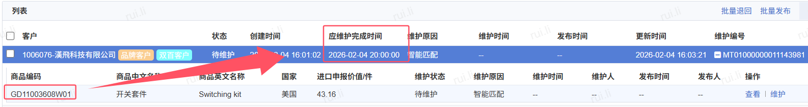

如以上时效符合预期的话请您耐心等待；如若需加急，可点击加急（此处有加急按钮,点击后弹出加急原因选择:1.急需下入库单 2.急需打印条码标签 3.急需关联退货商品）申请，我们会尽快处理，感谢您的理解与配合！

# 二、商品是否可以承运或入库

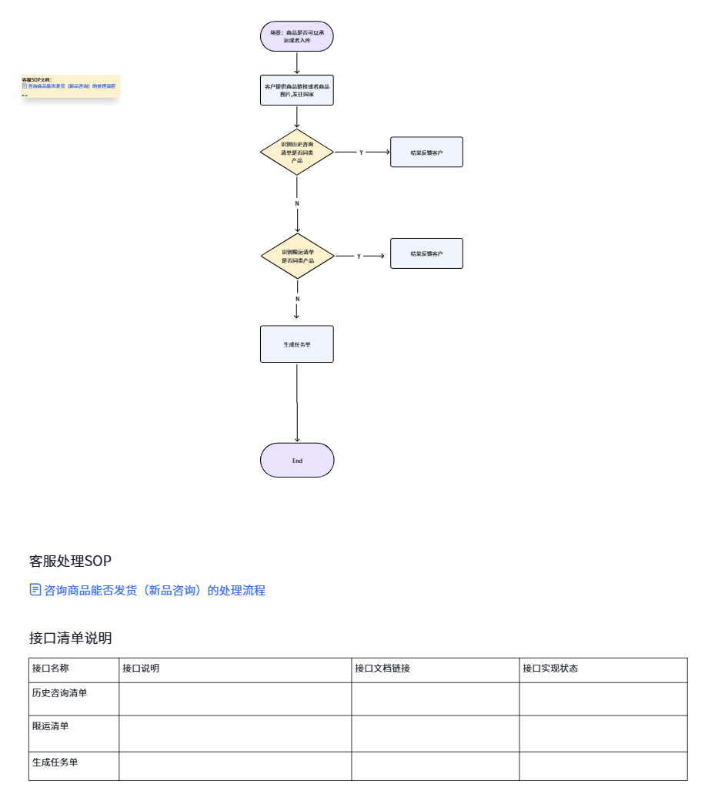

[KXSqwSk2si4tO0kMDtpccCpInkc]

# 三、直发原因咨询

1.识别到客户咨询xxSKU为什么直发,根据SKU引用系统现直发原因,路径如下图:

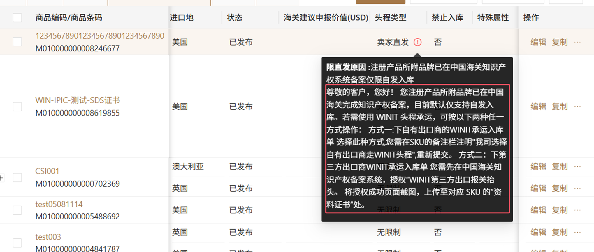

2.依然未解决客户问题的,转人工。

#

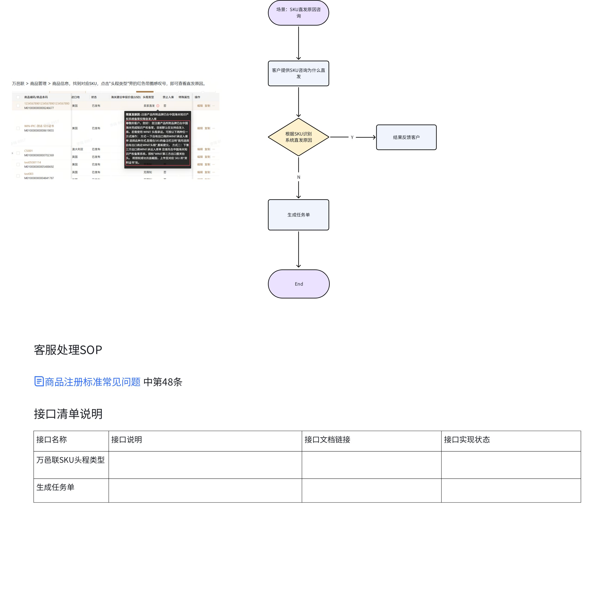

[Yy0iwbgPci8vCmkzjoLc2d4FnOd]

# 四、注册SKU退回原因咨询

1.机器人识别到"XX退回原因“根据SKU引用现退回原因,路径入下图

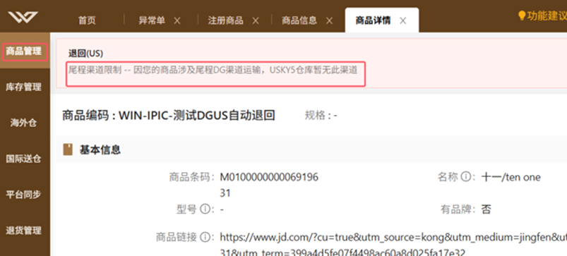

2.依然未解决客户问题的,转人工。

#

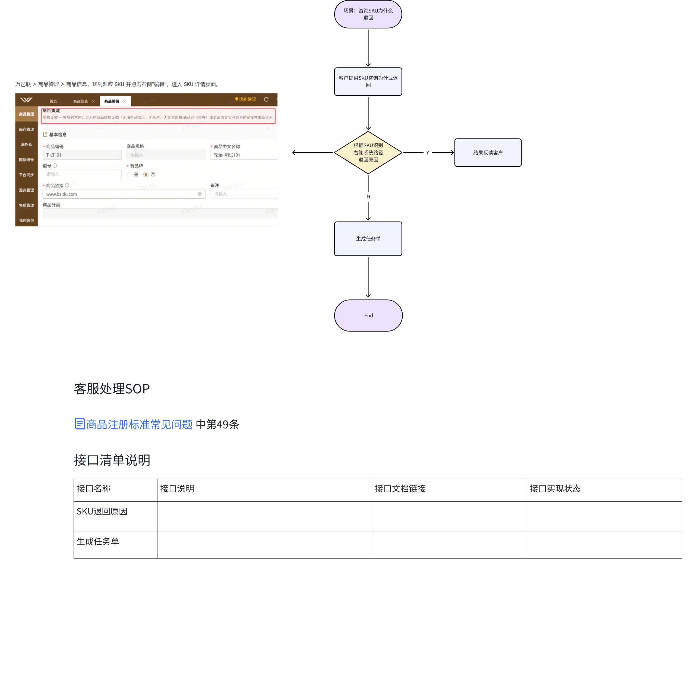

[VoFKwiGmRi1LJUkAnnscKTWNnDd]

# 五、咨询能否修改商品WEEE类别

1.识别到"XX改一下WEEE类别"根据SKU引用系统进口国德国下面WEEE类别,

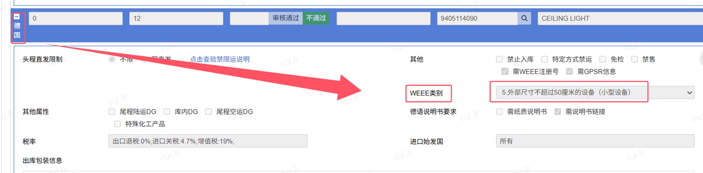

尊敬的客户，您好！根据德国《电器与电子设备法》（ElektroG），您咨询的 SKU 暂归类为：XX{系统显示类别，例如：5. 外部尺寸不超过50厘米的设备（小型设备）}。第1—6类产品的定义见下方说明，您也可访问德国法规官网了解更多信息：[https://www.gesetze-im-internet.de/elektrog_2015/BJNR173910015.html#BJNR173910015BJNG000100000](https://www.gesetze-im-internet.de/elektrog_2015/BJNR173910015.html#BJNR173910015BJNG000100000)

如您对该归类有异议，请告知您认为的 WEEE 类别及依据（如产品用途、尺寸、是否含屏幕/电池等），我们将提交后台进行复核。感谢您的配合！

1.第一类:温度交换设备（Wärmeaustauschgeräte）

任何尺寸、以电能驱动，通过气体、油、制冷剂等非水物质实现冷却、加热或除湿功能的电子电气设备，核心特征是具备 “热交换” 功能.

2.第二类：屏幕、显示器和包含表面大于 100 平方厘米的屏幕的设备(Bildschirmgeräte für den privaten Haushalt)

以 “电子屏幕显示图像 / 信息” 为主要功能，且满足以下任一条件的设备：①屏幕表面积≥100 平方厘米；②核心用途为图像显示的设备。

3.第三类：灯具(Lampen)

可由终端用户安装 / 更换的电光源。

4.第四类：尺寸超过 50 厘米的设备（大型设备）（Großgeräte）

至少一个外部尺寸＞50 厘米，且未被归入 1-3 类的电子电气设备，核心特征是 “尺寸超限” 且功能不属于前 3 类的专用范畴。

5.第五类：尺寸不超过50厘米的设备（小型设备）（Kleingeräte）

最大外部尺寸≤50 厘米，且未被归入 1-4 类、6 类的电子电气设备，涵盖 “非 IT / 电信类” 的小型电器。

6.尺寸不超过 50 厘米的小型 IT 和电信设备（Kleine IT- und Telekommunikationsgeräte）

用于收集、传输、处理、存储和呈现信息（信息技术设备）以及在空间距离上进行电子信号（语音、视频和数据）传输的通讯设备，最大外形尺寸等于或小于50厘米，但未归为上述5类的设备。

2.依然未解决客户问题的,转人工。

[ZiELwPGoAiPt2WkcJOAcTSe1nOh]

# 六、解除带电池

1.识别到”xx不带电池”“XX取消带电池”,引导客户确实实物是否带电池及处理方式.

尊敬的客户，您好！请先确认该SKU在发货时，商品本体或包装内是否含电池（以实际发货为准）：

- 含电池：无需更改“带电池”属性。

- 不含电池：请在 万邑联 > 商品管理 > 商品信息 中找到该SKU，取消勾选“带电池”，点击右下角“提交”，并等待审核。

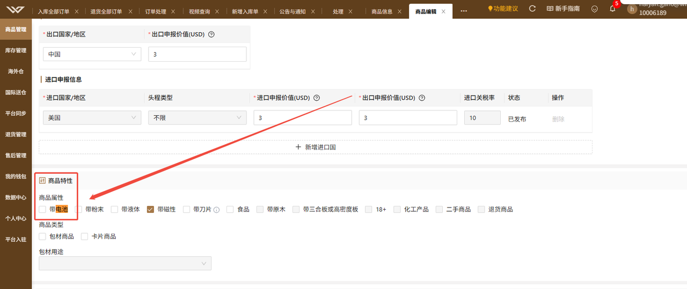

2.未解决客户问题,转人工。
[XFmIw9WkFiRzFekKP3aceg8Fn5c]

# 七、禁售原因咨询

1.识别到“XX为什么禁售”“XX为什么禁止出库”，根据SKU引用现禁售原因,路径入下图

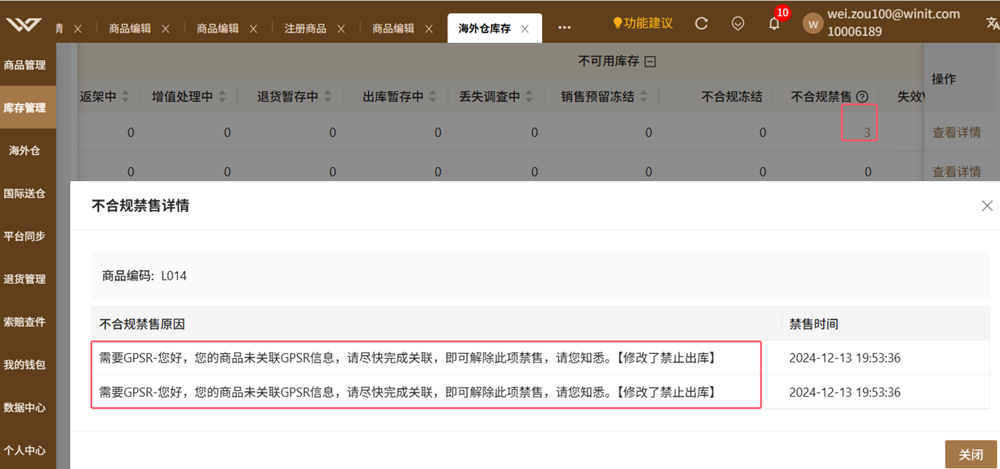

2.未解决客户问题,转人工。
58.客户咨询禁售原因。
在TOM系统>库存 >库存管理 > 库存查询,找到对应 SKU 点击查询,查看SKU是否不合规禁售及原因,引用对应原因告知客户

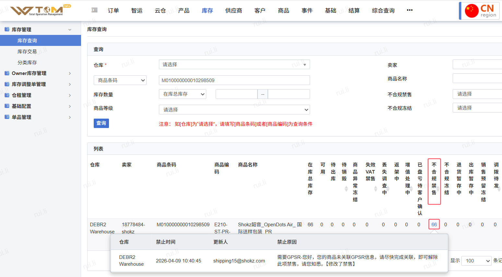

[DUbxwhErki7xuLkGibIcF3kbnsb]

# 八、禁止入库原因咨询

1.识别到"XX禁止入库的原因“”xx为什么不能入库“根据SKU引用现禁止入库原因,路径如下图

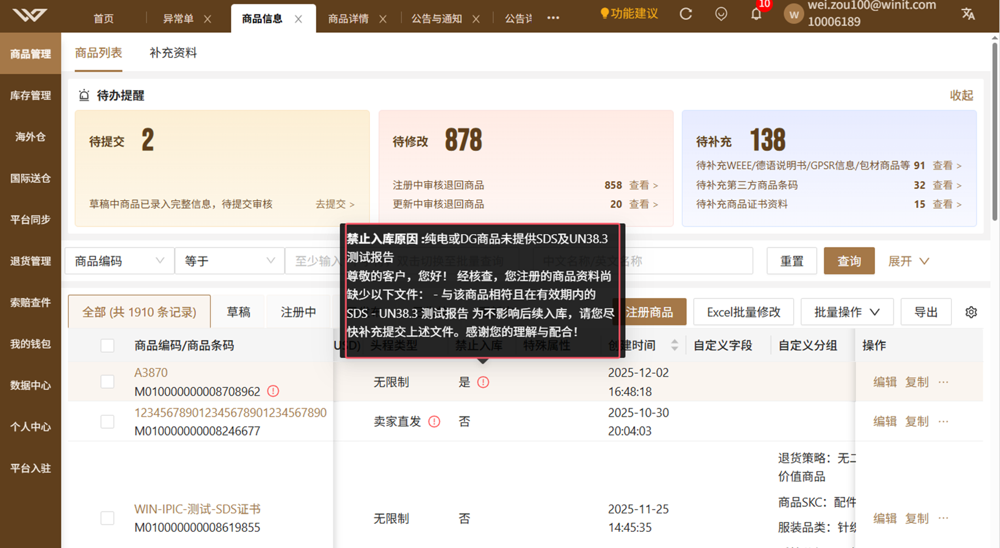

2.未解决客户问题,转人工。
[M331wQQZZiGB3DkKw2IclmPrn1b]

# 九、品牌是否有备案

1.识别到”xx有备案"”xx是否侵权“引导客户自己查询。

尊敬的客户，您好！

为确认品牌在发货国与目的国的备案情况，您可按以下步骤操作：

- 将品牌名称（例如：SAMSUNG）分别输入对应国家的官方查询网站检索；

- 若查询显示该品牌已在相应国家完成备案，请提供该国家的品牌授权文件。

中国：http://202.127.48.145:8888/zscq/search/jsp/vBrandSearchIndex.jsp

美国：https://iprs.cbp.gov/s/#/

英国：https://iprs.cbp.gov/s/#/

德国：https://register.dpma.de/DPMAregister/marke/einsteiger

澳大利亚：https://search.ipaustralia.gov.au/trademarks/search/quick

加拿大：https://ised-isde.canada.ca/cipo/trademark-search/srch

2.未解决客户问题,转人工。

[MSd8wQewSiPORukYTtOcCJ5vn0g]

# 十、电商清关SKU未获取海关建议申报价格

1.识别到”xx是否可获取海关建议申报价“”xx是否有获取海关建议申报价 “引导客户自己查询是否符合要求。

尊敬的客户，您好！

海关建议申报价是欧盟海关依据您提交的符合要求的销售链接进行审核，审核通过后回传建议申报价，因此您注册时提交的销售链接需满足以下要求。

麻烦您核查已提交的销售链接是否符合规范，若不符合请及时按要求修改；若链接符合要求，需耐心等待欧盟海关审核回传结果 —— 因存在时差，审核周期通常为 1-3 个工作日，还请您提前预留好时间。

以下是电商清关商品的链接要求：

1.链接需为真实交易的商品链接（即，链接有库存可交易）

2.链接商品需与实物一致

3.链接必须是市场上同类且单一售卖的商品链接（例如：捆绑类或拍卖类的链接，则不合规）

4.链接商品需为新品（即，不接受二手商品）

5.需使用Amazon或eBay售卖链接（亚马逊链接需要为AMAZON派送或欧盟本地派送，如果不是，链接为无效）

6.商品必须刊登为欧洲站点（即，ITEM LOCATION 需要欧州站点）

7.销售价格与尾程派送费不能倒挂（推荐使用FREE SHIPPING的链接）

8.注册时提供的链接要保持一直有效，且在途正在报关时的链接价格与注册时的价格差异合理（20%以内）

9.商品注册重量尺寸，真实重量尺寸以及链接刊登重量尺寸信息要保持一致，申报数量要与实际货物数量一致

10.如发往亚马逊仓库的货物最好使用亚马逊链接，如是其他货物建议使用ebay链接。（因为海关或者税局后续有可能会追问销售链接和最终派送目的地的关系）

11.如亚马逊链接销售价格低于29欧元的，将会加上4.99等或者其他的运费金额做海关建议申报价格的计算

12.如销售链接最终海关不认可，将会以海关认定的的建议价格做申报

13.如果链接为多属性链接：链接可选择型号、颜色、数量 、规格等，海关将会选择最高的销售价格确认最终申报价值（若售卖链接是是多属性链接，需要带有var.no的链接，如未带var.no会被打回。）

例如：https://www.amazon.com/JETech-iPhone-Shock-Absorption-Bumper-Anti-Scratch/dp/B00M3Q4IFC?ref_=Oct_DLandingS_PC_5e620992_NA&smid=A1RI0YHZ8J2HZU&th=1

https://www.ebay.de/itm/Ultraslim-LED-Panel-Leuchte-Deckenleuchte-Einbaustrahler-Wandleuchte-Weis-3W-24W-/372542869471?var=641324621972

14.如果是Amazon链接，需使用以下域名，且链接中需包含pd或product，并包含商品ASIN码，如www.amazon.co.de/pd/xxxxxxxxxxx

www.amazon.es

www.amazon.fr

www.amazon.de

www.amazon.it

www.amazon.nl

15.如果是Ebay的链接，需使用以下域名，且链接中需包含12位纯数字的ITEM ID，如www.ebay.co.de/itm/251111555641

www.ebay.de

www.ebay.it

www.ebay.es

www.ebay.fr

www.ebay.nl

2.未解决客户问题,转人工。

[QtvVwPyDdiVdVfk82zTciIqvnSg]

# 十一、资料缺失无法下承运单

1.识别到”下空运入库单提示无电池资料“”有上传电池资料的，但是下单报错“引导客户自查

尊敬的客户，您好！

因我司头程运输供应商对含电池类商品有明确要求：需提供当年有效期内的 MSDS及对应的 UN38.3 测试报告，麻烦您先核实对应 SKU 已上传的文件是否符合该要求。

后续操作指引：

-若文件不符合（如过期、缺失、信息不一致）：请您登录万邑联平台，按以下路径上传有效文件并等待审核：

万邑联 → 商品管理 → 商品信息 → 点击目标 SKU → 进入商品详情页 → 下拉至 “资料证书” 板块 → 国家选择 “ALL” → 选择对应证书（MSDS/UN38.3 测试报告）提交上传；

-若您确认已提供有效资料但依然无法下单：请联系在线客服查询具体原因，以便快速排查处理。

文件的有效性将直接影响货物运输安排，若您在上传或核实过程中遇到疑问，欢迎随时沟通！

2.未解决客户问题,转人工。

# 十二、解除DG

1.识别到“XX实际不是DG，麻烦看下是否可以解除"XX"实际不是DG货物，麻烦取消下勾选",引导客户自查电池参数是否填写错误

尊敬的客户，您好！

麻烦您核实一下 SKU 的电池参数是否准确，尤其请重点确认电池能量（WH）数据是否无误。

关键说明：

电池能量计算公式：电池能量（WH）= 电池电压（V）× 电池容量（AH）；

单位换算提示：1AH = 1000mAh（例：200mAh = 0.2AH）；

示例参考：耳机附带电池容量 200mAh、电压 3V，其电池能量 = 0.2AH×3V=0.6WH。

后续操作：

-若发现参数有误：请及时修改 SKU 的电池参数信息并提交等待审核。

-若确认电池参数填写无误，请联系在线客服查询具体原因，我们会协助快速排查处理。

2.未解决客户问题,转人工。

# 十三、解除带刀片

1.识别到"XX产品不带刀片，麻烦看下是否可以取消这个属性",引导客户自查

尊敬的客户，您好！

带刀片产品指 “具备切割人体皮肤能力、可能造成严重伤害的刀片类物品。相关法规可参考：https://www.legislation.gov.uk/ukpga/2019/17/contents

请您先核实待发货 SKU 是否属于此类商品：

若 SKU 确实带有上述刀片，依据法规及平台合规要求，无法取消标注；

若 SKU 不含此类刀片，请前往 万邑联 > 商品管理 > 商品信息，找到对应SKU，取消勾选“带刀片”，点击右下角“提交”，并等待审核结果。

2.未解决客户问题,转人工

# 十四、资料是否可以

1.识别到”SDS帮看下是否可以“”xx产品的资料，麻烦帮忙初审一下“”麻烦看看这个商品文件是否可以通过“，引导客户注册SKU,避免多次审核。

尊敬的客户，您好！为便于留存与加快处理，请您在万邑联创建或选择对应SKU，并在“资料证书”栏上传此文件后提交审核。我们会尽快完成审核并在系统内反馈结果；如需补充材料将及时与您联系。感谢配合！

2.未解决客户问题,转人工

# 十五、解除带磁

1.识别到"xx实际是没有带磁的"”xx实际货物是不带磁的  麻烦协助取消勾选带磁“，引导客户确实实物是否带磁性及处理方式。

尊敬的客户，您好！请先确认该SKU在发货时，商品本体或包装内是否带有磁性（包含弱磁性）：

- 带磁性：无需更改“带磁性”属性。

- 不带磁性：请在 万邑联 > 商品管理 > 商品信息 中找到该SKU，取消勾选“带磁性”，点击右下角“提交”，并等待审核。

2.未解决客户问题,转人工。

# 十六、解除带液体

1.识别到"xx不带液体，请帮忙修改属性""XX没带液体，需要解除勾选液体",引导客户确实实物是否带液体及处理方式

尊敬的客户，您好！请先确认该SKU在发货时，商品本体或包装内是否带有液体（带有一点液体,也算带液体,例如湿巾这种算带液体）：

- 带液体：无需更改“带液体”属性。

- 不带液体：请在 万邑联 > 商品管理 > 商品信息 中找到该SKU，取消勾选“带液体”，点击右下角“提交”，并等待审核。

2.未解决客户问题,转人工。

# 十七、解除带粉末

1.识别到”xx实物不带粉末，帮忙取消“，引导客户确实实物是否带粉末及处理方式

尊敬的客户，您好！请先确认该SKU在发货时，商品本体或包装内是否带有粉末（带有干燥剂,也算带粉末）：

- 带粉末：无需更改“带粉末”属性。

- 不带粉末：请在 万邑联 > 商品管理 > 商品信息 中找到该SKU，取消勾选“带粉末”，点击右下角“提交”，并等待审核。

2.未解决客户问题,转人工。

# 十八、自验核实尺重超限制

1.识别到”验货的时候显示尺重密度不符，无法提交验货表格“”在验货显示报错说的异常值，帮看下能不能解除限制”“xx快速自验系统提示不在正常范围内”，大部分是客户错入错误的,提醒客户自查。

尊敬的客户，您好！

万邑联系统中的“长、宽、高、重量”指的是SKU在包装完成并入库状态的实际数据。请您先核对录入信息：

- 如有误，请修改后重新提交；

- 如确认无误，请联系在线客服，我们将协助尽快排查处理。

感谢您的配合！

2.未解决客户问题,转人工。

# 十九、WEEE类别咨询

1.识别到“WEEE属于第几类”“需要几类的weee”，引导客户注册SKU看注册结果,

尊敬的客户，您好！请先在万邑联创建SKU并提交审核，审核完成后可在系统中查看该SKU对应的WEEE类别。您也可参考《电器与电子设备法》（ElektroG）对第1—6类产品的定义，或访问德国法规官网了解更多信息（https://www.gesetze-im-internet.de/elektrog_2015/BJNR173910015.html#BJNR173910015BJNG000100000）

1.第一类:温度交换设备（Wärmeaustauschgeräte）

任何尺寸、以电能驱动，通过气体、油、制冷剂等非水物质实现冷却、加热或除湿功能的电子电气设备，核心特征是具备 “热交换” 功能.

2.第二类：屏幕、显示器和包含表面大于 100 平方厘米的屏幕的设备(Bildschirmgeräte für den privaten Haushalt)

以 “电子屏幕显示图像 / 信息” 为主要功能，且满足以下任一条件的设备：①屏幕表面积≥100 平方厘米；②核心用途为图像显示的设备。

3.第三类：灯具(Lampen)

可由终端用户安装 / 更换的电光源。

4.第四类：尺寸超过 50 厘米的设备（大型设备）（Großgeräte）

至少一个外部尺寸＞50 厘米，且未被归入 1-3 类的电子电气设备，核心特征是 “尺寸超限” 且功能不属于前 3 类的专用范畴。

5.第五类：尺寸不超过50厘米的设备（小型设备）（Kleingeräte）

最大外部尺寸≤50 厘米，且未被归入 1-4 类、6 类的电子电气设备，涵盖 “非 IT / 电信类” 的小型电器。

6.尺寸不超过 50 厘米的小型 IT 和电信设备（Kleine IT- und Telekommunikationsgeräte）

用于收集、传输、处理、存储和呈现信息（信息技术设备）以及在空间距离上进行电子信号（语音、视频和数据）传输的通讯设备，最大外形尺寸等于或小于50厘米，但未归为上述5类的设备。

2.未解决客户问题,转人工。

# 二十、是否需要熏蒸

1.识别到“xx是否需要做熏蒸 ”“xx这种情况需要熏蒸吗”，

尊敬的客户，您好！

根据澳大利亚农业部（AQIS）生物安全要求：发往澳大利亚的非密度板木质产品需在出运前完成熏蒸处理，以确保顺利清关。请您核实本次发货材质：

- 若为非密度板，使用Winit头程需熏蒸；

- 若为密度板（MDF）材质，则无需熏蒸。

2.未解决客户问题,转人工。

# 二十一、注册尺重超限制

1.识别到“注册尺寸和重量提示存在异常”“注册sku 报错尺寸重量存在异常”，很多是客户填错尺重的,提醒客户自查

尊敬的客户，您好！

万邑联系统中的“长、宽、高、重量”指的是SKU在包装完成在入库状态的实际数据。请您先核对录入信息：

- 如有误，请修改后重新提交；

- 如确认无误，请联系在线客服，我们将协助尽快排查处理。

感谢您的配合！