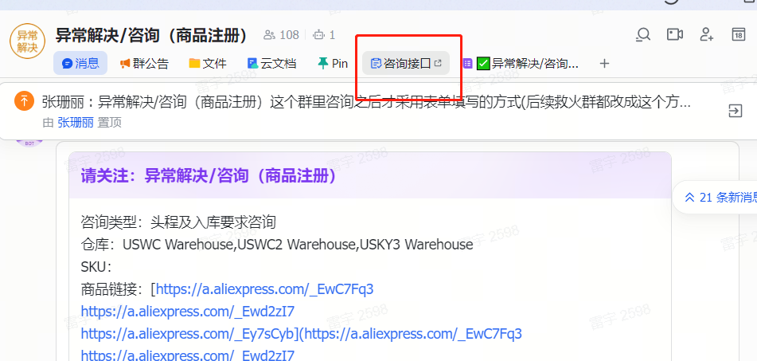

# 咨询商品能否发货（新品咨询）的处理流程
## 1  流程起始话术

您好！您可以通过如下2种方式快速确认商品能否发货：

1，在【WINIT禁限运清单】中查询；

注：登录【万邑联】-【公告】，输入【禁限运清单】搜索最新通知下载最新版本的【WINIT禁限运清单】。

2，直接进行商品注册，会有专人在线审核并将结果更新到万邑联并邮件通知您。

注：商品注册操作指引请查看 [https://help.winit.com.cn/Help/SystemGuide/index/categoryId/1679109393a02331a73406a4f498f2f0?docUrl=%2Fkms%2Fappcfg2%2Fkms_appcfg_wiki%2FkmsAppcfgMain.do%3Fmethod%3DwikiView%26fdId%3D16a9255da986eaccf46e6f846ba8ca5e%26fdAppcfgCode%3D16a68310fdcbdcc5718a06f475fafff9](https://help.winit.com.cn/Help/SystemGuide/index/categoryId/1679109393a02331a73406a4f498f2f0?docUrl=%2Fkms%2Fappcfg2%2Fkms_appcfg_wiki%2FkmsAppcfgMain.do%3Fmethod%3DwikiView%26fdId%3D16a9255da986eaccf46e6f846ba8ca5e%26fdAppcfgCode%3D16a68310fdcbdcc5718a06f475fafff9) ​

---

(内部知悉）请从以下几点回答可以减少不满意哦：

如客户直接发了链接询问是否可以发货，是客户已经习惯这样处理，这个场景请直接走以下流程处理，发异常解决/咨询（商品注册）核实是否可以承运，点击咨询接口进行登记，根据反馈回复客户。

请您提供以下货物信息，这边提交注册组审核确认给您回复。

①商品链接

②目的国家

③运输方式：上海空运/上海海运/华南空运/华南海运/客户直发