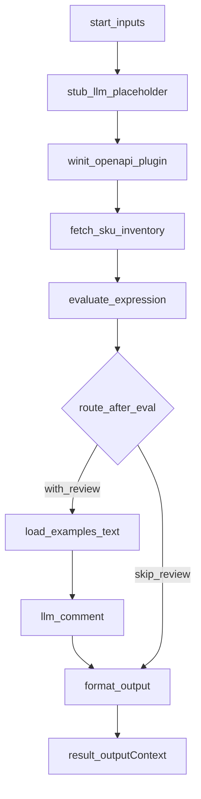

# 四则运算公式专家（`_template` 参考实现）

本目录是**可复制的新专家样板**：示范 **代码节点 + LLM 节点 + 合并输出** 的完整链路。新建专家时，将 **`arithmetic-formula` 整文件夹** 复制到 `experts/{领域}/{新专家id}/`，再全局替换 `id`、`name`、`description`、`EXPERT_ID` 与业务逻辑。

---

## 标准化清单（供所有专家对齐）

| 项 | 要求 |
|----|------|
| **manifest.json** | `id` / `name` / `description`（含 `Use when`）/ `capabilities` / `version`；`inputSchema` **仅**含业务字段（如本例 `expression`）；框架顶层 `query` / `customerIntent` / `inputContext` / `inputs` 由仓库统一约定，见 `docs/design-spec.md` §6；`outputSchema` 区分 `structured` 与 `analysis`。 |
| **design.md** | **必须含「调用说明」**（适用场景、最小入参、参数提示、1-2 个带参数示例）；再写输入输出表、工作流说明、节点与 `params` 字段对应关系；复杂流程可配 Mermaid。 |
| **nodes/** | 代码节点：Coze 单文件闭环、`main` + `return ret`。**每个 `workflow.json` 中的 `type: "llm"` 节点**须在 `nodes/` 下有同名声明文件（如 `llm-comment.ts` / `llm-analyze.ts`）：仅用注释列出与白名单一致的【输入】/【输出】，**不可**配置为 `file` 代码节点、勿写 `process.argv` 入口。 |
| **workflow.json**（可选） | 本地 `npm run dev:expert <id>` 时使用；**LLM 节点的 `inputs` 须白名单传入** `query` 及代码节点产出的键（如本例的 `result`）。 |
| **prompts/** | `main.md`：贴进 Coze 的主 Prompt；**领域短规则内嵌于 `main.md`**（`expert.md` 仅仓库备份、须与 main 同步）。**Few-shot** 放在 `examples.md`，Coze **必须通过「引用」**（知识库/文档/变量）挂载，勿写死依赖读盘路径。 |

---

## 调用说明

### 适用场景

- 需要对一个**四则运算算式**做求值，并生成“结果 + 风险提示/点评”的合并输出。
- 需要算式中引用**指定仓 + SKU 的可用库存**并与常数做四则运算时：推荐使用 **`SKU_QTY(wh=仓库编码, sku=商品编码)`**；库存由 **`fetch-sku-inventory`** 经 **Coze 代理 + 万邑通 queryProductInventoryList4Page**（[文档 id/58](https://developer.winit.com.cn/document/detail/id/58.html)，取 **`qtyAvailable` 可用库存**）或画布上前置插件写入该节点入参后，再产出 `skuResolutions` 供求值。**对外专家入参**不含 `skuUsableQty`、`warehouseCodes`。仍兼容无括号 **`SKU_QTY`**（可选传 **`merchandiseCode`** 与拉数结果对齐），**勿与括号式混用**。
- 不适用：表达式不是四则运算（如包含除上述占位符外的变量、函数、括号外文本噪声很重）且上游不做清洗时。

### 最小入参

- 调用边界上：`inputs.expression`（必填）即可；顶层 `query` / `customerIntent` 可为空字符串。本地 Runner 支持旧版扁平传参（顶层直接传 `expression`），会自动归一化。

### 参数提示

- `expression`：可含 **`SKU_QTY(wh=, sku=)`** 或（单独使用时）无括号 **`SKU_QTY`**；替换后的式子见 `result.structured.expressionNormalized`，多仓多 SKU 时见 `skuResolutions`。
- **`skuUsableQty` / `warehouseCodes`**：仅作为 **`fetch-sku-inventory` 节点**的入参（由插件或变量绑定），**不要**写入专家 manifest 或开始节点 `inputs`。
- 经代理拉 **queryProductInventoryList4Page（id/58）** 时：默认 **`inventoryType=Warehouse`**，无空格的商品串走 **`productCode`** 过滤，含空格则走 **`name`**（与算式里 `sku=` 一致）；可选 **`isActive` / `pageNo` / `pageSize`** 见 manifest。括号式从算式内取 `wh`/`sku`；无括号 `SKU_QTY` 时 fetch 仍通过**节点入参**接收仓码（非对外字段），求值侧可用 **`merchandiseCode`** 与 `skuResolutions` 匹配。
- `inputContext.chainId`：有链路编排时建议透传，便于日志与回溯。

### 本地环境变量（`SKU_QTY` + 代理工作流）

本地 **`workflow/run`** 调用代理时，HTTP 体 `parameters` 含 **`action` + `customerCode` + `customerName` + `username` + `data`**（其中 **`data`** 由 **`build-winit-inventory-data` → `fetch-sku-inventory`** 链路拼装，**不是**专家调用边界顶层字段；**`action`** 由代码/环境变量决定）。工作流 ID 用 `COZE_WINIT_OPENAPI_PROXY_WORKFLOW_ID`。在 **Coze** 上与本模板导出一致时，调用边界顶层传 **`customerCode` / `customerName` / `username` / `language`**（**不含**请求体 `data`，见 design-spec §6）；画布上插件的 **`data`** 来自 **`build-winit-inventory-data.winitRequestData`**，**`action`** 为导出字面量，见 **`nodes/winit-openapi-plugin.ts`**。

| 变量 | 说明 |
|------|------|
| COZE_API_TOKEN 或 COZE_WORKFLOW_PAT | 调用 `POST {COZE_API_BASE_URL}/v1/workflow/run` |
| COZE_WINIT_OPENAPI_PROXY_WORKFLOW_ID | 上述代理工作流 ID |
| COZE_WINIT_CUSTOMER_CODE / COZE_WINIT_CUSTOMER_NAME / COZE_WINIT_USERNAME | 与出库一致，传入代理工作流 |
| COZE_API_BASE_URL | 可选，默认 `https://api.coze.cn` |

未配置完整、缺少 wh/sku（或 merchandiseCode）、或插件注入的库存与算式冲突时，返回 `inventory_unconfigured`、`inventory_missing_params`、`inventory_ambiguous`、`inventory_placeholder_malformed` 等。

### Coze：插件 + 代码节点

`npm run export:coze` 在 **`fetch-sku-inventory` 之前**插入 **`build-winit-inventory-data`**（拼装 id/58 请求体字符串）与 **`cobra_winit_openapi_request`**（占位 **`nodes/winit-openapi-plugin.ts`**）。开始节点仅 **`customerCode` / `customerName` / `username` / `language`**（**不含**请求体 `data`）。插件入参 **`data`** ← **`winitRequestData`**；**`action`** 为**字面量**（`coze.config.yml` 可设 `openapiAction`）。**`fetch-sku-inventory.skuUsableQty`** 绑定到插件**响应**的 **`data`**；**`warehouseCodes`** 默认不写入 fetch 的导出 `node_inputs`。**不要**经 `inputs` 暴露 `skuUsableQty`/`warehouseCodes`。独立代理包对照见 [`docs/coze-reference/winit_openapi_call-draft.yaml`](../../../docs/coze-reference/winit_openapi_call-draft.yaml)；规约见 [`COZE-WORKFLOW.md`](../../../COZE-WORKFLOW.md) §3.1 / §7、[`docs/design-spec.md`](../../../docs/design-spec.md) §6。

### 示例调用（直接可用）

**示例 1：纯算式求值 + 点评**

```json
{
  "query": "计算并解释结果",
  "customerIntent": "确认账单金额计算是否正确",
  "inputContext": { "chainId": "demo-chain-001" },
  "inputs": { "expression": "12.5 * 4 + 3" }
}
```

**示例 2：链式编排（带上游摘要）**

```json
{
  "query": "基于上一步提取到的算式，给出结果并提示注意事项",
  "customerIntent": "",
  "inputContext": {
    "chainId": "demo-chain-002",
    "sourceExpertId": "some-upstream-expert",
    "previousOutput": { "extractedExpression": "(100-30)/7" }
  },
  "inputs": { "expression": "(100-30)/7" }
}
```

**示例 3：括号占位符（专家仅传 expression；`qtyAvailable` 由画布上插件 → `fetch-sku-inventory` 注入，不在此 JSON）**

```json
{
  "query": "按库存计算",
  "customerIntent": "",
  "inputs": {
    "expression": "SKU_QTY(wh=USKY5, sku=MY_SKU)*2+10"
  }
}
```

**示例 4：本地经 Coze 代理拉 id/58（括号内已含仓与 SKU；`startTime`/`endTime` 为可选，本节点默认不传）**

```json
{
  "inputs": {
    "expression": "100-SKU_QTY(wh=US0001, sku=YOUR_SKU)"
  }
}
```

## 1. 本专家输入

| 输入 | 类型 | 说明 |
|------|------|------|
| query | string | 框架顶层：上游 Agent 委托本专家完成的任务说明 |
| customerIntent | string | 框架顶层：当前为客户解决的业务问题摘要 |
| customerCode / customerName / username / language | string（可选） | 框架顶层（不经 `inputs`）；Coze 与插件身份字段拉线一致；本地 `workflow/run` 也可用环境变量。请求体 **`data`** 由内部节点拼装，**不在**调用边界顶层 |
| expression | string | 业务入参；可含 `SKU_QTY(wh=,sku=)` 或（单独）`SKU_QTY` |
| merchandiseCode | string（可选） | 无括号 `SKU_QTY` 时与 fetch 产出的 `skuResolutions` 按 sku 匹配 |
| inventoryType / isActive / pageNo / pageSize 等 | string / number（可选） | 见 manifest（id/58）；**非** `skuUsableQty`/`warehouseCodes` |

---

## 2. 本专家输出（经 format-output）

- **structured.computation**：代码节点求值结果（`valid`、`value`、`expressionNormalized`、`errorCode` 等）
- **structured.review**：LLM 点评的结构化字段（如 `highlights`、`caveats`、`confidence`）
- **analysis**：计算结论文案与模型点评的合并正文

---

## 3. 工作流

**逻辑**：`stub-llm-placeholder`（空 `analysisResult`）→（Coze 上）**`cobra_winit_openapi_request` 插件**→ **`fetch-sku-inventory`**（解析算式中的库存占位符，经 `workflow/run` 或**节点入参**中的插件字段产出 `skuResolutions`）→ **`evaluate-expression`**（仅用上游 `skuResolutions` 做替换并求值，**不**发起 OpenAPI）→ **Coze 选择器**：`with_review` 时走 `load-examples-text` → `llm-comment` → `format-output`；`skip_review` 时直达 `format-output`。Few-shot 由 `load-examples-text` 与 `prompts/examples.md` 同步。

**Coze 导出**：`coze.config.yml` 中配置 `branching`；导出器**不支持**与 `textNodes` 同时启用，故本模板用代码节点代替原 `examples-text`。



**本地 Runner**：配置 `OPENAI_API_KEY` 时 `llm-comment` 走真实 API；未配置时使用 Mock，仍可跑通链路（点评内容为占位）。

**说明**：`npm run dev:expert` 按 `workflow.json` **顺序执行全部节点**，不模拟 Coze 选择器；故本地仍会跑通 `load-examples-text` 与 `llm-comment`，与线上「`skip_review` 跳过 LLM」可能不一致。

---

## 4. 节点说明

| 节点 | 类型 | 输入 `params` | 输出 |
|------|------|----------------|------|
| `stub-llm-placeholder.ts` | 代码 | （无） | `analysisResult`（空对象，供跳过 LLM 分支） |
| `fetch-sku-inventory.ts` | 代码 | `expression` 及 **画布绑定** 的 `skuUsableQty`/`warehouseCodes` 等 + manifest 中的 `merchandiseCode`/`inventoryType`/`isActive`/分页（见 `workflow.json`）；接口 id/58 | `skuResolutions`, `inventoryFetchOk`, `inventoryFetchError`, `inventoryBranch` |
| `evaluate-expression.ts` | 代码 | `query`, `customerIntent`, `expression`, `inputContext?`, `merchandiseCode?`，及来自 fetch 的 `skuResolutions` / `inventoryFetchOk` / `inventoryFetchError` | `result`, `outputContext`, `branch` |
| `load-examples-text.ts` | 代码 | （无） | `examplesMd`（与 `prompts/examples.md` 同步） |
| `llm-comment` | LLM | `query`, `customerIntent`, `expression`, `result`, `inputContext?`, `examplesMd` | `analysisResult`；声明见 `nodes/llm-comment.ts` |
| `format-output.ts` | 代码 | `result`, `analysisResult`, `inputContext?` | `result`, `outputContext` |

**Runner 注入**：`scripts/llm-openai.ts` 支持占位符 `{{expression}}`、`{{computationResult}}`（`computationResult` 为 `result` 的 JSON 字符串）。

---

## 5. 扩展：自然语言 → expression（可选）

若要在 Coze 中增加**前置** LLM，将用户话术转为 `expression`，可另建 Prompt 文件并在该平台配置第二个 LLM 节点；本仓库的 `prompts/examples.md` 仍保留「话术 → expression」表格供参考。主链路中的 `main.md` 专用于**点评**，避免与代码节点职责混淆。
