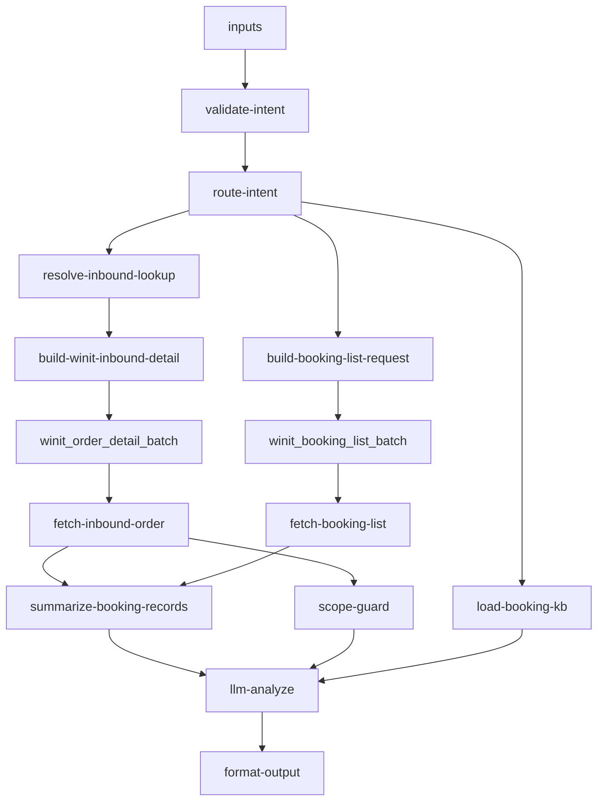

# inbound/inbound-appointment-manage 专家设计

预约送仓操作指引：说明如何预约送仓、查询/修改/取消预约、分批到仓、违规费查询与**预约 POD 下载**。客户需自行在万邑联平台完成预约操作，本专家**仅提供指引、不代客创建或取消预约单、不代客下载 PDF**。

> 业务参考：[`docs/experts/inbound/inbound-appointment-manage.md`](../../../docs/experts/inbound/inbound-appointment-manage.md)  
> 全链路 SOP：[`docs/inbound/flows/06-appointment-and-delivery.md`](../../../docs/inbound/flows/06-appointment-and-delivery.md)

---

## 设计定位

本专家是**直发产品预约送仓的操作 SOP 分发器 + 预约单/违规费只读解读器**：

1. **`routePath=kb_only`**：create/modify/cancel/split 类 intent，及**无单号的** `pod_guide`，纯 KB 输出步骤与规则
2. **`routePath=api_chain`**：query/penalty、**有单号的** `pod_guide` 拉取 `booking.list`，结合 KB 解读状态（含是否可下 POD）

**不是**预约写操作代理、**不是** Slot 实时查询器（OpenAPI 有 `queryAvailableWarehouseinPlan` 规格，本专家不调用；Slot 引导客户登录万邑联预约页）。

### 边界分工

| 问 | 不问 |
|----|------|
| 预约 SOP、改约/取消规则、违规费、分批到仓 | 剩余库容/客户额度（→ `inbound-capacity-availability`） |
| 预约单状态解读 | 入库单总状态（→ `inbound-order-status`） |
| 送仓方式与 PSC 选型 | 代客创建/修改预约（**禁止**） |
| 预约 POD **万邑联自助下载** SOP（不调 `exportPodPdf`） | 签收时间/包裹数/轨迹（→ `inbound-arrival-status`） |
| 快递免预约说明 | 快递卸货 POD（→ `inbound-arrival-status`） |
| 增值预约送仓规则与费用边界 | VASC 推荐、服务项配置、已提交增值单状态（→ `value-add/value-add-product-recommendation` / `value-add/value-add-service-config` / `value-add/value-add-order-status`） |

---

## 调用说明

### 适用场景

| intent | 典型问法 |
|--------|----------|
| `create_guide` | 怎么预约送仓、预约码在哪、LCL/FCL 怎么约 |
| `modify_guide` | 能改预约时间吗、怎么改 Slot |
| `cancel_guide` | 取消预约、取消扣费吗 |
| `split_shipment` | 分批到仓怎么处理、拆单 A/B/C |
| `query` | 预约单状态是什么、查预约记录 |
| `penalty` | 没预约被扣费、违规费申诉、增值预约费用 |
| `pod_guide` | 怎么下载预约 POD、签收证明 PDF、预约单 POD 在哪下 |

- **送仓规则**：散货/整柜**必须预约**；快递（逐件面单）**免预约**；快递托盘按散货须预约。
- **适用链路**：直发 OW01021/22/31/32；标准头程 OW01011 通常无需客户预约。
- **增值预约边界**：本专家里的“增值预约”仅指预约送仓付费预约，不等同于 value-add 域的 VASC 推荐、服务项/原子配置或已提交增值单状态查询。

### 最小入参

| intent | 必填 |
|--------|------|
| `create_guide` / `modify_guide` / `cancel_guide` / `split_shipment` / `pod_guide`（无单号） | 无（纯 KB）；可选 `deliveryWayHint` |
| `query` / `penalty` / `pod_guide`（有单号） | `inboundOrderNos` / `inboundOrderNo` / `bookingNo` 至少其一 |

### 参数提示

- **`intent`**：见上表；缺省时由 `validate-intent` 从 query 关键词推断
- **`deliveryWayHint`**：`LCL` / `FCL` / `Express`；缺省从 query 推断，用于 KB 章节过滤
- **`warehouseCode`**：可选，附加仓库上下文，不用于代客填预约单
- 不接受 `appointmentDate` 等作为必填入参——由客户在平台自行填写

### 示例调用

**示例 1：LCL 预约指引（纯 KB）**

```json
{
  "query": "说明 LCL 散货预约送仓的完整流程",
  "customerIntent": "客户第一次预约散货送仓",
  "inputs": {
    "intent": "create_guide",
    "deliveryWayHint": "LCL"
  }
}
```

**示例 2：修改预约时间**

```json
{
  "query": "如何修改已提交的预约到仓时间",
  "customerIntent": "客户想改约但不清楚是否收费",
  "inputs": {
    "intent": "modify_guide"
  }
}
```

**示例 3：违规费查询**

```json
{
  "query": "查询该入库单的预约违规费记录",
  "customerIntent": "系统扣了违规费要申诉",
  "inputs": {
    "intent": "penalty",
    "inboundOrderNos": ["WI20260601008"]
  }
}
```

**示例 4：分批到仓**

```json
{
  "query": "收到分批到仓邮件，要怎么确认",
  "customerIntent": "货物只到一部分",
  "inputs": {
    "intent": "split_shipment"
  }
}
```

**示例 5：下载预约 POD（纯 KB）**

```json
{
  "query": "预约送仓后怎么下载 POD 签收证明",
  "customerIntent": "需要 PDF 留存",
  "inputs": {
    "intent": "pod_guide"
  }
}
```

**示例 6：按 WI 查能否下载 POD（API + KB）**

```json
{
  "query": "这票货的预约 POD 可以下载了吗",
  "customerIntent": "状态是否已到仓",
  "inputs": {
    "intent": "pod_guide",
    "inboundOrderNos": ["WI20260601008"]
  }
}
```

---

## 0. 业务背景（KB 摘要）

> 对接规格：[`_kb/.../booking-overview.md`](../../../_kb/system-team/inbound-integration-solution/business/inbound/booking-overview.md)

**适用**：卖家直发 + 客户自验/海外验货的入库单，到海外仓前须预约送仓时段。

```
判断是否要预约 → 每包裹是否有独立快递面单？
  ├─ 是 → Express 免预约
  └─ 否 → LCL/FCL 必须预约（万邑联 → 预约单管理）

OpenAPI 对接链（客户写操作在平台完成）：
  unBookingOrder.list → queryAvailableTime → create → list → (cancel / exportPod)

创建预约 → 获取预约码 → 司机凭码送仓
到仓后若分批 → 3 日内确认 → 可能拆单 A/B/C → 重新预约
```

| 风险 | 后果 |
|------|------|
| 下单散货、实际快递 | 散装卸货费，不退 |
| 下单快递、实际散货 | 未预约违规费，不退 |
| 散货未预约 | 未预约违规费（按 CBM） |
| 超时取消/未到仓 | 按预约单收违约金 |

---

## 1. 输入设计

### 框架顶层

| 字段 | 类型 | 说明 |
|------|------|------|
| query | string | 任务说明 |
| customerIntent | string | 操作意图摘要 |
| inputContext | object | `chainId`、`previousOutput` |

### inputs 业务字段

| 字段 | 类型 | 必填 | 说明 |
|------|------|------|------|
| intent | string | 否 | `query` / `create_guide` / `modify_guide` / `cancel_guide` / `split_shipment` / `penalty` / `pod_guide` |
| inboundOrderNos | string[] | query/penalty/pod_guide(有单号) 时必填 | WI 单号 |
| inboundOrderNo | string | 同上（二选一） | 单个入库单号 |
| bookingNo | string | 否 | 已知预约单号 |
| deliveryWayHint | string | 否 | `LCL` / `FCL` / `Express` |
| warehouseCode | string | 否 | 仓库编码上下文 |

---

## 2. 数据拉取与兜底

> **接口依据**：`已确认` · `有规格待注册` · `不调用`

### OpenAPI 预约链（booking-overview）

| 序号 | OpenAPI Action | 本专家 | 说明 |
|------|----------------|--------|------|
| B.1 | `winit.wh.inbound.booking.unBookingOrder.list` | 不调用 | create_guide 说明待预约单来源 |
| B.2 | `winit.wh.inbound.booking.queryAvailableWarehouseinPlan` | 不调用 | Slot 引导万邑联预约页 |
| B.3 | `winit.wh.inbound.booking.create` | **不调用** | 写接口；客户平台操作 |
| B.4 | `winit.wh.inbound.booking.cancel` | **不调用** | 写接口；客户平台操作 |
| B.5 | `winit.wh.inbound.booking.list` | **query/penalty/pod_guide 读取** | （短名 `winit.wh.inbound.booking.list`） |
| B.6 | `wh.inboundSigned.exportPodPdf` | **Agent 不调用** | 响应为 base64 PDF，对话通道无法投递；`pod_guide` 仅万邑联自助下载 SOP |

| intent | 运行时 Action | 接口依据 | 说明 |
|--------|---------------|----------|------|
| KB 类 intent | — | — | 不调用 API |
| `query` / `penalty` / `pod_guide`（有单号） | `wh.inbound.booking.list` | **有规格·待注册** | 预约列表、状态码 WBO/SBO/RBO、违规费字段 |
| 辅助 | `winit.wh.inbound.getOrderDetail`（`isIncludePackage=N`） | **已确认** | `bookingNo`、`inboundBookingStatus`、`winitProductCode`；list 空时兜底 |

### 核心业务规则（对接文档）

- 多单合并：须**同一目的仓**；**FCL/LCL 不可混约**
- 卸货：LIVE（LCL/FCL）；DROP **仅 FCL**（美整柜多为 DROP）
- 时间：API 时间为**仓库当地时间**；取消宜提前 2 自然日
- FCL 必填：联系人、柜型、柜号、托盘数、封条号（有则填）

### 不调用（勿作运行时依赖）

| 能力 | 说明 |
|------|------|
| `booking.create` / `cancel` / `unBookingOrder.list` | 写接口或列表引导；客户平台操作 |
| `exportPodPdf` | 返回 base64；**Agent 不可转发文件**；客户万邑联自助下载 |
| `queryAvailableWarehouseinPlan` | 有 OpenAPI 规格；本专家不代理 Slot |
| `warehouse/capacity-signal` | 仓级负载，不对客 |

### 降级策略

| 场景 | 处理 |
|------|------|
| `booking.list` 失败或空 | 用 `getOrderDetail` 表头 `bookingNo`/`inboundBookingStatus` 兜底；仍无则 `requiresManualAction=true` |
| PSC=OW01011 | `scope-guard` → 转 `inbound-process-guide` |
| 客户问 Slot 能否约 | 引导万邑联预约页；额度问题转 capacity-availability |
| 问增值预约费率细节 | 加载 `premium-booking.md`，不承诺审批结果 |

---

## 3. 路由与 KB 拼接

### intent 别名（`validate-intent`）

| 上游写法 | 归一化 |
|----------|--------|
| `how_to_book` | `create_guide` |
| `how_to_change_time` / `how_to_modify` | `modify_guide` |
| `how_to_cancel` | `cancel_guide` |
| `status` | `query` |
| `penalty_dispute` | `penalty` |
| `download_pod` / `pod_download` | `pod_guide` |

### routePath（`route-intent`）

| intent | routePath | skipApi |
|--------|-----------|---------|
| create_guide / modify_guide / cancel_guide / split_shipment | `kb_only` | true |
| `pod_guide`（无 WI/bookingNo） | `kb_only` | true |
| query / penalty / `pod_guide`（有单号） | `api_chain` | false |

### KB 片段选择（`load-booking-kb`）

| intent | 加载片段 |
|--------|----------|
| `create_guide` | `booking-sop` 按 LCL/FCL/Express 章节过滤 |
| `modify_guide` | `booking-rules` §修改 + sop 通用 |
| `cancel_guide` | `booking-rules` §取消 + `penalty-rules` §未到仓 |
| `split_shipment` | `split-shipment` + sop 合并预约 |
| `penalty` | `penalty-rules` +（问增值时）`premium-booking` |
| `query` | `booking-api-reference` §状态码 + `booking-rules` + sop 摘要 |
| `create_guide` | `booking-sop` + `booking-api-reference` §链路/合并/FCL 必填 |
| `pod_guide` | `pod-download-guide` + `booking-api-reference` §POD/状态码 |

---

## 4. 工作流编排



### 节点顺序

1. `validate-intent` → `route-intent`（`skipApi` / `skipOrderDetail`）
2. **api_chain 并行**：
   - `resolve-inbound-lookup` → `build-winit-inbound-detail` → 插件 → `fetch-inbound-order`
   - `build-booking-list-request` → 插件 → `fetch-booking-list`
3. `summarize-booking-records`：合并 API 记录与表头兜底，输出 `bookingSummary`
4. `scope-guard`：PSC 守卫（OW01011 → 转 process-guide）
5. `load-booking-kb` → `llm-analyze` → `format-output`（合并 summary/scope 到 structured）

---

## 5. 节点说明

| 节点文件 | 输入 | 输出 |
|----------|------|------|
| `validate-intent.ts` | intent?, query, inboundOrderNos, bookingNo | validationOk, intent, deliveryWayHint |
| `route-intent.ts` | validationOk, intent, inboundOrderNos, bookingNo | routePath, skipApi, skipOrderDetail |
| `resolve-inbound-lookup.ts` | skipOrderDetail, inboundOrderNos | wiOrderNos, customerRefNos |
| `build-winit-inbound-detail.ts` | skipOrderDetail, wiOrderNos | orderDetailActions[] |
| `fetch-inbound-order.ts` | skipOrderDetail, plugin outputList | rawOrderData |
| `build-booking-list-request.ts` | skipApi, inboundOrderNos, bookingNo | bookingActions[] |
| `fetch-booking-list.ts` | skipApi, plugin outputList | bookingRecords[] |
| `summarize-booking-records.ts` | intent, bookingRecords, rawOrderData | bookingSummary, bookingRecords |
| `scope-guard.ts` | routePath, rawOrderData | scopeGuard（refer_process_guide 等） |
| `load-booking-kb.ts` | intent, deliveryWayHint, query, KB 五段 | kbContent, kbScope |
| `llm-analyze` | bookingSummary, scopeGuard, kbContent | analysisResult |
| `format-output.ts` | analysisResult, bookingSummary, scopeGuard | structured, outputContext.nextExpertId |

---

## 6. 输出设计

### structured 字段

| 字段 | 类型 | 说明 |
|------|------|------|
| intent | string | 本次处理的 intent |
| deliveryWayHint | string | LCL/FCL/Express |
| operationSteps | string[] | 操作步骤（KB 类场景） |
| bookingRecords | object[] | query/penalty：`bookingNo`, `bookingStatus`, `bookingStatusLabel`, `appointmentDate`, `penaltyFee` |
| penaltyFee | number \| null | 仅 `bookingSummary.hasPenaltyFeeField=true` 时填写 |
| penaltyReason | string | 违规触发原因（来自 API 字段） |
| dataQuality | string | `booking_api` / `order_header_fallback` / `missing` |
| scopeAction | string | `answer` / `refer_process_guide` |
| referExpertId | string | 转介专家 id |
| splitShipmentGuide | string[] | split_shipment 场景 |
| requiresManualAction | boolean | 由 summarize 或 LLM 置 true |

> 不输出 `bookingCode` 字段；在 `operationSteps` 中说明提交后系统显示预约码。

### analysis 原则

- 以「您需要在万邑联平台操作」开头
- `penalty`：不承诺减免；无 API 费用字段时不编造金额
- `split_shipment`：强调 3 日确认时限
- Slot/库容：引导预约页 + 转 capacity 专家

---

## 7. Prompt 知识片段

| 文件 | 说明 | Coze textNode |
|------|------|---------------|
| `prompts/booking-sop.md` | 预约规范：Express/LCL/FCL、合并预约、PSC 免预约 | ✅ |
| `prompts/booking-rules.md` | 修改/取消时限、增值预约摘要 | ✅ |
| `prompts/penalty-rules.md` | 违规费费率表、申诉路径 | ✅ |
| `prompts/split-shipment.md` | 分批到仓 3 日确认、A/B/C 拆单 | ✅ |
| `prompts/premium-booking.md` | 增值预约审核与费率 | ✅ |
| `prompts/booking-api-reference.md` | OpenAPI 对接链、状态码、FCL 必填、合并规则 | ✅ |
| `prompts/pod-download-guide.md` | 预约 POD 下载 SOP、RBO 前置条件 | ✅ |
| `prompts/booking-kb-index.md` | KB 溯源索引（维护用） | — |
| `prompts/main.md` | LLM 角色与禁止项 | LLM 模板 |

---

## 8. KB 溯源表

| 优先级 | `_kb` 文档 | 映射 |
|--------|-----------|------|
| 1 | `inbound-integration-solution/.../booking-overview.md` | booking-api-reference, booking-sop, booking-rules |
| 1 | `直发预约送仓（常见问题）.md` | booking-sop, booking-rules |
| 1 | `直发散货预约常见问题.md` | booking-sop, penalty-rules |
| 1 | `直发预约违规费常见问题.md` | penalty-rules |
| 1 | `一、背景说明.md` | split-shipment |
| 1 | `增值预约送仓常见问题.md` | premium-booking |
| 2 | `直发快递入仓常见问题.md` | booking-sop §Express |
| 2 | `直发整柜Drop卸货异常退费流程.md` | FCL 升级人工 |
| 2 | `直发整柜DROP通知提空柜后跑空.md` | FCL 司机电话强调 |
| 2 | `flows/06-appointment-and-delivery.md` | design §0 |

---

## 9. 对客约束

- **不代客**创建、修改或取消预约单
- 不向客户索取 `appointmentDate` 等以代为提交
- 不承诺违规费/增值预约费用减免
- 不引用飞书/内部 URL
- 不透露仓级 Slots（引导万邑联预约页）

### 转人工条件

- 已预约但 `booking.list` 无记录
- 违规费金额争议较大
- 分批到仓需特殊拆单
- 整柜 Drop 跑空/异常退费（KB 二级文档场景）

### 专家转介

| 场景 | 转介 |
|------|------|
| 客户 CBM/SKU 额度 | `inbound-capacity-availability` |
| 入库单状态 | `inbound-order-status` |
| 签收时间/包裹数/轨迹（非预约 POD 下载） | `inbound-arrival-status` |
| 改 PSC/送仓方式 | `inbound-order-manage` + booking-sop §回到草稿 |

---

## 10. 待确认事项

| 项 | 说明 |
|----|------|
| `winit.wh.inbound.booking.list` | Coze 代理 action 注册与字段实测（penaltyFee、状态码枚举） |
| `queryAvailableWarehouseinPlan` | 有 OpenAPI 规格；专家不调用，Slot 仍引导万邑联 |
| 多单合并 | 同一目的仓 + 同送仓方式；FCL/LCL 不可混约（booking-overview §4.1） |
| `inputContext.previousOutput.rawOrderData` 缓存复用 | 链式编排跳过重复 getOrderDetail |

### 本地验收（真实 API，无 Mock）

凭证在 `.env`（`COZE_WINIT_*`）；**测试 WI 通过 CLI 或 local fixture 传入，不写 .env**。

```bash
# 仅 KB 路径：
npm run smoke:inbound-appointment-manage -- --kb-only

# API 链（任选其一传单号）：
npm run smoke:inbound-appointment-manage -- --inboundOrderNos '["WI..."]'
npm run smoke:inbound-appointment-manage -- --fixture scripts/fixtures/inbound-appointment-manage.local.json
```

`inbound-appointment-manage.local.json` 由 `scripts/fixtures/inbound-appointment-manage.fixture.example.json` 复制，已 gitignore。

断言：`getOrderDetail` 须返回 ≥1 条；`bookingSummary.dataQuality` 不得为 `missing`；须能解析 `winitProductCode`。
