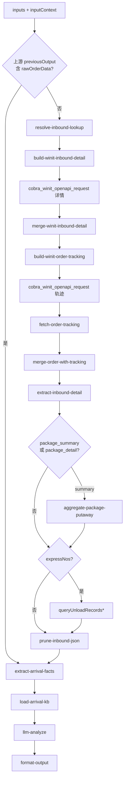

# inbound/inbound-arrival-status 专家设计

到仓状态查询：确认货物是否已到仓、当前轨迹位置、签收证明（POD）与 PEWC→EWC 转换情况。

---

## 调用说明

### 适用场景

- 客户持入库单号，询问「货什么时候到仓」、「仓库签收了没」、「已到了但还在 PEWC 没变 EWC」、「有没有签收证明（POD）」。
- **直发少包裹/签收数量争议**：「预约了 N 个包裹但只到了 M 个」、「直发卸货少包裹」（高频场景，见 KB `确认直发包裹是否到仓的处理流程`）。
- **不适用**：签收后上架进度（→ `inbound-putaway-status`）；催促上架（→ `inbound-putaway-expedite`）；头程运输中里程碑（→ `inbound-transit-tracking`）；数量差异判责（→ `inbound-exception-check`）。

### 最小入参

- `inputs.inboundOrderNos` 至少包含一个有效标识。

### 参数提示

- `includeTrajectory`：默认 `true`；轨迹来自 **`wh.tracking.queryOrderTracking`**（`getOrderDetail` 不含轨迹，见 [`docs/plan/inbound-tracking-api.md`](../../../docs/plan/inbound-tracking-api.md)）。
- `expressNos` / `expressNoFuzzy`：客户提供快递单号时，分别走 `queryUnloadRecords` / `queryUnloadRecordsFuzzy`。
- 若上游 `inbound-order-status` 专家已拉取数据，可通过 `inputContext.previousOutput` 透传 `rawOrderData`（含 `trackingList`）跳过二次 API（**可选优化**，缺失时自行拉取）。

### 示例调用

**示例 1：到仓状态确认**

```json
{
  "query": "确认货物是否已到仓，说明当前签收状态",
  "customerIntent": "客户问：我的货到仓库了吗？",
  "inputContext": { "chainId": "case-20260608-010" },
  "inputs": {
    "inboundOrderNos": ["WI20260601002"],
    "includeTrajectory": true
  }
}
```

**示例 2：POD 查询（链式编排，上游已拉数）**

```json
{
  "query": "确认是否有签收证明及签收数量",
  "customerIntent": "仓库说签收了，但我这边没有 POD",
  "inputContext": {
    "chainId": "case-20260608-011",
    "sourceExpertId": "inbound/inbound-order-status",
    "previousOutput": { "structured": { "orderNo": "WI20260601002", "status": "PEWC" } }
  },
  "inputs": {
    "inboundOrderNos": ["WI20260601002"],
    "focusPod": true
  }
}
```

---

## 1. 输入设计

### 框架顶层

| 字段 | 类型 | 说明 |
|------|------|------|
| query | string | 任务说明 |
| customerIntent | string | 业务问题摘要 |
| inputContext | object | `chainId`、`previousOutput`（上游数据透传） |

### inputs 业务字段

| 字段 | 类型 | 必填 | 说明 |
|------|------|------|------|
| inboundOrderNos | string[] | 是 | WI 单号或客户参考号 |
| includeTrajectory | boolean | 否 | 是否拉取轨迹列表，默认 true |
| focusPod | boolean | 否 | 是否专注 POD/签收证明字段，默认 false |
| checkPackageQty | boolean | 否 | 是否对比预约/预报包裹数与签收数（直发少包裹），默认 false |
| detailLevel | string | 否 | 默认 **`header`**（`isIncludePackage=N`）；`checkPackageQty=true` 时升为 **`package_summary`**（见 [`inbound-getOrderDetail-detail-strategy.md`](../../../docs/plan/inbound-getOrderDetail-detail-strategy.md)） |
| targetPackageNos | string[] | 否 | 客户提供箱号/包裹条码时，`package_detail` 过滤 |
| maxPackagesPerOrder | integer | 否 | 包裹剪枝上限，默认 50 |
| maxTrajectoryNodes | integer | 否 | 轨迹节点保留数，默认 20 |

---

## 2. 数据拉取与兜底

> **接口依据**：`已确认` · `端点待注册` · `无依据`（勿作运行时依赖）

> **id/39 约束（已确认）**：`isIncludePackage=N` 无 `packageList`；包裹到齐/少包裹须 `Y`，**无包裹分页 API** → 默认表头+轨迹，问包裹时用 `package_summary` / `extract` + `aggregate-package-putaway`。详见 [`docs/plan/inbound-getOrderDetail-detail-strategy.md`](../../../docs/plan/inbound-getOrderDetail-detail-strategy.md)。

| 场景 | Action | 接口依据 | detailLevel | 关键字段 |
|------|--------|----------|-------------|---------|
| 到仓阶段（默认） | `winit.wh.inbound.getOrderDetail` | **已确认** | **`header` / N** | `awhDate`, `status`, `totalPackageQty`, `bookingStatus` |
| 直发少包裹 / 到齐统计 | `winit.wh.inbound.getOrderDetail` | **已确认** | **`package_summary` / Y** | `aggregate-package-putaway` → `byStatus`, 预约 vs 实收 |
| 客户给箱号 | `winit.wh.inbound.getOrderDetail` | **已确认** | **`package_detail` / Y** | 剪枝后 `packageList[]` |
| 入库单轨迹 | `wh.tracking.queryOrderTracking` | **已确认** | — | `trackingList[]` |
| 快递卸货（精确/模糊） | `wh.tracking.queryUnloadRecords` / `queryUnloadRecordsFuzzy` | **已确认**（见 [`inbound-tracking-api.md`](../../../docs/plan/inbound-tracking-api.md)） | — | `expressNo`, `unloadDate` |
| 上游缓存 | `previousOutput.rawOrderData` | **已确认** | — | 可选跳过 API |

### 无依据接口 / 字段（勿作运行时依赖）

| 接口 / 字段 | 说明 |
|-------------|------|
| `getOrderDetail.trajectoryList` | **不在详情响应中**；轨迹须 `queryOrderTracking` |
| POD 附件 URL | 无单独接口规格；当前仅文字摘要，见 §9 |

**大单防护**：`totalPackageQty > 200` 且需 `package_detail` 但无 `targetPackageNos` → `requiresNarrowing=true`，对客说明需提供箱号/包裹条码。

PEWC→EWC 转换参考：货物到仓进入 PEWC，完成验货/验收后转 EWC。PEWC 停留时长因仓型/验货类型而异（海外验可达数个工作日），**不设固定 48h 告警阈值**；`needsAttention` 由 KB 参考时效 + `inspectionStatus` + 是否超典型等待期综合判定（代码节点确定性计算，非 LLM 臆断）。

---

## 3. JSON 剪枝

| 层级 | 策略 |
|------|------|
| **`extract-inbound-detail`** | `header` 删 `packageList`/`merchandiseList`；`package_summary` 删明细保留聚合输入 |
| **`aggregate-package-putaway`** | `package_summary` 路径：按 `package.status` / `unloadingTime` 统计，**不**把原始 `packageList` 送 LLM |
| `trackingList` | 保留最近 20 条；`focusPod=true` 时仅保留 POD 相关节点 |
| `packageList` | 仅 `package_detail` 保留；`maxPackagesPerOrder` 剪枝 |
| 大单 | `totalPackageQty > 200` + 无 narrowing → `requiresNarrowing=true` |

---

## 4. 工作流编排



### 节点顺序

1. 检查 `inputContext.previousOutput` 是否含可用 `rawOrderData`
2. **如缺失**：`resolve-inbound-lookup` → `build-winit-inbound-detail` → `cobra_winit_openapi_request` → `merge-winit-inbound-detail` → `prune-inbound-json`
3. `extract-arrival-facts`：确定性解析到仓时间、POD、PEWC/EWC 字段
4. `load-arrival-kb`：加载到仓状态规则（PEWC 等待原因、EWC 确认条件）
5. `llm-analyze`：生成 `arrivalPhase` 判断与客观说明
6. `format-output`

---

## 5. 节点说明

| 节点文件 | 输入 params | 输出 |
|----------|-------------|------|
| `resolve-inbound-lookup.ts` | `inboundOrderNos` | `wiOrderNos[]`, `customerRefNos[]` |
| `build-winit-inbound-detail.ts` | `wiOrderNos`, **`detailLevel`**, 剪枝参数 | `actions`（含 `isIncludePackage`） |
| `extract-inbound-detail.ts` | `rawOrderData`, `detailLevel`, `targetPackageNos?` | 剥离后的 `rawOrderData`, `_detailExtractMeta` |
| `aggregate-package-putaway.ts` | 剪枝前/后 `packageList` 或 extract 元数据 | `packagePutawaySummary` |
| `prune-inbound-json.ts` | `rawOrderData`, `maxTrajectoryNodes` | `prunedOrderData`, `_pruneMeta` |
| `extract-arrival-facts.ts` | `prunedOrderData`, **`packagePutawaySummary?`** | `arrivalPhase`, `awhDate`, `podFacts`, `needsAttention`, `packageQtyComparison?`, `requiresNarrowing?` |
| `load-arrival-kb.ts` | — | `pewcRules`, `ewcTransitionGuide`, `podGuide` |
| `llm-analyze`（LLM） | `arrivalFacts`, `customerIntent`, `pewcRules`, `podGuide` | `analysisResult` |
| `format-output.ts` | `analysisResult`, `inputContext?` | `result`, `outputContext` |

---

## 6. 输出设计

### structured 字段

| 字段 | 类型 | 说明 |
|------|------|------|
| orderNo | string | 入库单号 |
| arrivalPhase | string | `in_transit` / `arrived_pending` / `confirmed` / `unknown` |
| awhDate | string | 实际到仓时间（ISO） |
| estimatedArrival | string | 预计到仓时间（`expectedSendwarehouseTime`） |
| currentStatus | string | OMS 状态码 |
| needsAttention | boolean | 是否超出 KB 参考等待期且仍停留 PEWC（确定性规则）|
| packageQtyComparison | object | `{ expectedPackages, receivedPackages, discrepancy }`（`checkPackageQty=true` 时，来自表头或 `packagePutawaySummary`）|
| requiresNarrowing | boolean | 包裹过多且未提供箱号/条码时为 true |
| packagePutawaySummary | object | `aggregate-package-putaway` 输出（可选写入 structured） |
| podSummary | object | `{ podTime, podQty, podAvailable }` |
| bookingStatus | string | 预约单状态（辅助判断是否已排期到仓） |

### analysis 原则

- 客观描述货物所处到仓阶段，说明 PEWC 含义与转换条件
- POD 可用时摘要签收时间与数量，不输出索赔建议
- 不引用内部 URL；需人工确认时说明「可联系仓库运营核实」

### enrichedContext

写入 `inbound/inbound-arrival-status`：`{ arrivalPhase, awhDate, podSummary, needsAttention, packageQtyComparison? }`，供下游 `inbound-exception-check`、`inbound-putaway-status` 复用。

---

## 7. Prompt 知识片段

| 文件 | 说明 |
|------|------|
| `prompts/arrival-status-rules.md` | PEWC/EWC 状态含义、转换条件、各验货类型典型等待期 |
| `prompts/pod-guide.md` | POD 字段解读，签收证明含义，何时可用 |
| `prompts/direct-shipment-package-check.md` | 直发少包裹确认流程（来源：`确认直发包裹是否到仓的处理流程`）|
| `prompts/trajectory-nodes.md` | 入库轨迹节点中文对照（TS/PEWC/EWC 及中间节点） |

---

## 8. 对客约束

- 不做上架进度判断（→ `inbound-putaway-status`）
- 不输出索赔、理赔建议
- 升级人工条件：`needsAttention=true` 且无法从 KB 解释；`packageQtyComparison.discrepancy > 0` 时建议转 `inbound-exception-check`

---

## 9. 待确认事项

- `pickupDate` 与 `awhDate` 的精确语义区分（取货日 vs 到仓确认日），需产品确认是否同一字段
- POD 附件（扫描件 URL）是否在 `getOrderDetail` 响应中返回，或需单独接口；当前 design 仅处理文字摘要
