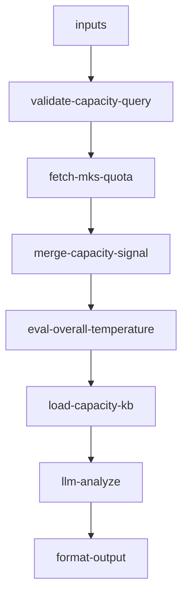

# inbound/inbound-capacity-availability 专家设计

客户 CBM/SKU 额度查询：基于 MKS 数据输出额度温度与能否承接建议。**不对客提供**仓级 Slots / 仓库负载等内部信号。

---

## 调用说明

### 适用场景

- 客户询问「还剩多少 CBM 额度」、「SKU 额度用了多少」、「能不能收这批货」、「是否需要换仓或拆批」。
- 客户问「还能约 Slots 吗」：仅给出**预约送仓平台指引**（→ `inbound-appointment-manage`），**不**输出仓级 Slots 数据。
- **不适用**：如何申请权限/额度（→ `inbound-permission-apply`）；具体入库单状态（→ `inbound-order-status`）；可用 PSC 列表（→ `inbound-psc-eligibility`）。

### 最小入参

- `inputs.warehouseCode` 必填。

### 参数提示

- `cargoProfile`：描述货物属性（CBM 体积、SKU 数量），用于与客户**额度**对比（非仓级库容）。
- 唯一外部数据源：MKS 客户 CBM/SKU 额度（**已确认**，见 §2）。

### 示例调用

**示例 1：额度查询**

```json
{
  "query": "查询该客户在 USLAX01 仓的 CBM 与 SKU 额度剩余",
  "customerIntent": "客户问：还有多少库容额度",
  "inputContext": { "chainId": "case-20260608-130" },
  "inputs": {
    "warehouseCode": "USLAX01"
  }
}
```

**示例 2：综合承接能力评估**

```json
{
  "query": "评估能否承接这批货，给出额度侧判断",
  "customerIntent": "打算发一批 50CBM、200 SKU 的货到 UKLOND01",
  "inputContext": { "chainId": "case-20260608-131" },
  "inputs": {
    "warehouseCode": "UKLOND01",
    "cargoProfile": {
      "cbmVolume": 50,
      "skuCount": 200,
      "deliveryWayType": "LCL"
    }
  }
}
```

---

## 1. 输入设计

### 框架顶层

| 字段 | 类型 | 说明 |
|------|------|------|
| query | string | 任务说明 |
| customerIntent | string | 业务问题摘要 |
| inputContext | object | `chainId`（链式编排用） |

### inputs 业务字段

| 字段 | 类型 | 必填 | 说明 |
|------|------|------|------|
| warehouseCode | string | 是 | 目标仓库 |
| checkType | string | 否 | `cbm` / `sku` / `overall`（默认）；`slots` 仅返回预约指引 |
| cargoProfile | object | 否 | `{ cbmVolume, skuCount, deliveryWayType }` |

---

## 2. 数据拉取与兜底

> **接口依据**：`已确认` 有端点或卖家中心同构实测 · `无依据` 勿作运行时依赖

| 数据源 | Action | 系统 | 接口依据 | 关键字段 |
|--------|--------|------|----------|---------|
| 客户 CBM/SKU 额度 | `winit.huaweiDas.invoke` → `OPC/Detail/InboundSkuLimitAggChart` | 万邑联 | **已确认** | `limitValue`, `limitValueRemain`, `actValueInv`, `limitItemName` |

### 无依据 / 不对客（本专家不接入）

| 能力 | 说明 |
|------|------|
| `warehouse/capacity-signal` | 仓级负载/Slots，**不对客透露**，已从 workflow 移除 |
| `queryInboundQuota` | 矩阵早期推断名，已弃用 |

**降级策略**：

| 场景 | 降级方式 |
|------|---------|
| MKS 额度调用失败 | `{ apiAvailable: false, message: "额度数据暂时无法实时获取" }` + KB 指引万邑联账户中心 |

---

## 3. 工作流编排



### 节点顺序

1. `validate-capacity-query` → `fetch-mks-quota`（MKS 额度）
2. `merge-capacity-signal`：组装额度上下文与 dataQuality
3. `eval-overall-temperature`：基于**客户额度**计算温度
4. `load-capacity-kb` + `llm-analyze` → `format-output`

---

## 4. 节点说明

| 节点文件 | 输入 params | 输出 |
|----------|-------------|------|
| `fetch-mks-quota.ts` | `warehouseCode`, `customerCode` | `quotaSnapshot`, `quotaFetchOk` |
| `merge-capacity-signal.ts` | `quotaSnapshot`, `cargoProfile?`, `checkType` | `mergedCapacity`, `dataQuality` |
| `eval-overall-temperature.ts` | `mergedCapacity` | `overallTemperature`, `capacityAdvice`, `quotaTemperature` |
| `llm-analyze`（LLM） | 上述 + KB | `analysisResult` |
| `format-output.ts` | `analysisResult`, `inputContext?` | `result`, `outputContext` |

---

## 5. 温度判断规则（仅客户 CBM 额度）

| 温度 | 条件 | 建议动作 |
|------|------|---------|
| `green` | remainingCbm > 50% | 正常入库 |
| `yellow` | remainingCbm 20%~50% | 尽快安排入库 |
| `orange` | remainingCbm < 20% | 拆批或申请扩容 |
| `red` | remainingCbm < 5% 或 cargoProfile 超出剩余额度 | 换仓或扩容后再发 |
| `unknown` | API 不可用或 checkType=slots | 见 KB / 预约指引 |

> `checkType=slots` 时不计算额度温度，仅输出预约送仓平台指引。

---

## 6. 输出设计

### structured 字段

| 字段 | 类型 | 说明 |
|------|------|------|
| warehouseCode | string | 查询仓库 |
| quotaSnapshot | object | `{ totalCbm, usedCbm, remainingCbm, totalSkuSlots, usedSkuSlots, apiAvailable }` |
| overallTemperature | string | green/yellow/orange/red/unknown |
| capacityAdvice | string[] | 建议动作 |
| dataQuality | string | `real` / `mock` |

### analysis 原则

- 只陈述**客户额度**与温度，不输出仓级 Slots/负载
- 不承诺仓库一定能接货
- API 不可用时引导万邑联账户中心或客服

---

## 7. Prompt 知识片段

| 文件 | 说明 |
|------|------|
| `prompts/kb-capacity.md` | 额度字段、温度定义、Slots 不对客说明 |

---

## 8. 对客约束

- 额度数据仅供参考，实际以平台系统为准
- **禁止**引用或透露 `warehouse/capacity-signal`、WMS 仓级库容、Slots 温度
- checkType=slots → 转预约送仓指引（`inbound-appointment-manage`）

---

## 9. 待确认事项

- 温度判断阈值（50%/20%/5%）为初始参考值，需与产品确认正式标准
