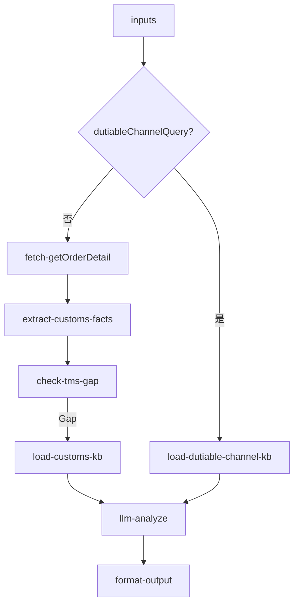

# inbound/inbound-customs-clearance 专家设计

清关进度确认：查询清关所处节点状态，说明延误原因，以及包税渠道的清关规则说明。

---

## 调用说明

### 适用场景

- 客户询问「清关进行到哪里了」、「清关为什么延误」、「包税渠道有没有清关轨迹」、「查验进度怎么查」。
- **不适用**：清关文件上传与进口商注册（→ `inbound-customs-doc-manage`）；头程运输里程碑（→ `inbound-transit-tracking`）；上架催促（→ `inbound-putaway-expedite`）。

### 最小入参

- `inputs.inboundOrderNos` 或 `inputs.containerNo`。

### 参数提示

- 清关节点数据属于 TMS 领域，当前为 **Gap**；OMS `getOrderDetail` 提供入库单整体状态作为部分兜底。
- 包税渠道（美森/普船等）无系统清关轨迹，由 KB 规则兜底说明。

### 示例调用

**示例 1：清关进度查询**

```json
{
  "query": "查询该入库单的清关状态与关键节点",
  "customerIntent": "客户问：清关进行到哪了，为什么这么久",
  "inputContext": { "chainId": "case-20260608-150" },
  "inputs": {
    "inboundOrderNos": ["WI20260601014"]
  }
}
```

**示例 2：包税渠道咨询**

```json
{
  "query": "说明包税渠道的清关轨迹规则",
  "customerIntent": "客户用包税渠道，问为什么没有清关轨迹",
  "inputContext": {},
  "inputs": {
    "inboundOrderNos": [],
    "dutiableChannelQuery": true
  }
}
```

---

## 1. 输入设计

### 框架顶层

| 字段 | 类型 | 说明 |
|------|------|------|
| query | string | 任务说明 |
| customerIntent | string | 业务问题摘要 |
| inputContext | object | `chainId`、`previousOutput` |

### inputs 业务字段

| 字段 | 类型 | 必填 | 说明 |
|------|------|------|------|
| inboundOrderNos | string[] | 条件必填 | WI 单号 |
| containerNo | string | 否 | 柜号（整柜清关查询补充）|
| dutiableChannelQuery | boolean | 否 | true 时走包税渠道规则兜底路径 |

---

## 2. 数据拉取与兜底

> **接口依据**：`已确认` · `无依据`（勿作运行时依赖）

| 数据源 | Action | 接口依据 | 说明 |
|--------|--------|----------|------|
| OMS 兜底 | `winit.wh.inbound.getOrderDetail` | **已确认** | `status`、`importerCode` 等表头 |
| OMS 轨迹（清关节点如有） | `wh.tracking.queryOrderTracking` | **已确认** | 清关相关 `trackingList` 节点；**勿用** `getOrderDetail.trajectoryList` |
| TMS 清关节点 | 内部 TOM API | **无依据** | 申报/审核/放行细粒度里程碑；无 action 规格 |
| 包税渠道 | KB 规则兜底 | — | 规则固定，非 API |

### 无依据接口 / 字段（勿作运行时依赖）

| 接口 / 字段 | 说明 |
|-------------|------|
| TMS 清关状态 API | 矩阵 `customs.status` 推断，**无 TOM 智运接口规格** |
| `getOrderDetail.trajectoryList` | **不在详情响应中**；清关节点应来自 `queryOrderTracking`（是否含清关节点待字段确认） |
| `customsTrajectoryNodes` 细粒度推断 | OMS 轨迹未验证含「已申报/已放行」等节点时，不得臆造 |

**降级策略**：
- OMS 字段展示当前入库单整体状态，说明清关在该状态下的含义
- TMS Gap 明确标注，给出「可联系客服获取具体清关节点」的升级路径
- `dutiableChannelQuery=true` 时直接输出 KB 规则说明

---

## 3. 工作流编排



### 节点顺序

1. `dutiableChannelQuery=true`：直接加载包税渠道 KB → LLM → 格式化
2. 正常路径：`getOrderDetail` → `extract-customs-facts` → 加载清关 KB（含 TMS Gap 说明）→ LLM → 格式化

---

## 4. 节点说明

| 节点文件 | 输入 params | 输出 |
|----------|-------------|------|
| `fetch-getOrderDetail.ts` | `inboundOrderNos` | `rawOrderData` |
| `extract-customs-facts.ts` | `rawOrderData` | `customsFacts`（`status`, `importerCode`, `containerNo`, `customsTrajectoryNodes[]`）|
| `check-tms-gap.ts` | — | `tmsAvailable: false`, `gapNote` |
| `load-customs-kb.ts` | `customsFacts` | `customsStagesGuide`, `delayReasonsGuide` |
| `load-dutiable-channel-kb.ts` | — | `dutiableChannelGuide` |
| `llm-analyze`（LLM）| 上述数据 + `customerIntent` | `analysisResult` |
| `format-output.ts` | `analysisResult`, `inputContext?` | `result`, `outputContext` |

---

## 5. 输出设计

### structured 字段

| 字段 | 类型 | 说明 |
|------|------|------|
| orderNo | string | 入库单号 |
| currentStatus | string | OMS 状态码 |
| customsTrajectoryNodes | object[] | OMS 层面清关相关轨迹节点 |
| importerCode | string | 进口商编码 |
| tmsDataAvailable | boolean | TMS 数据是否可用（当前 false）|
| isDutiableChannel | boolean | 是否包税渠道 |
| customsStatusSummary | string | 清关状态摘要（OMS 兜底描述）|

### analysis 原则

- 包税渠道：解释无清关轨迹属产品特性，非系统问题
- 正常路径：展示 OMS 可用字段，标注「TMS 清关细节当前不可查」，给出升级路径
- 延误说明：基于 KB 常见延误原因（查验/证件不全/节假日）给出参考，不猜测具体原因

---

## 6. Prompt 知识片段

| 文件 | 说明 |
|------|------|
| `prompts/customs-stages.md` | 清关阶段说明（申报/审核/查验/放行）及各阶段含义；清关异常类型区分：文件查验（不开箱）vs 实物查验（开箱）；每周四更新机制（仅适用于部分查验类型）|
| `prompts/customs-handling-logic.md` | 清关查询处理决策树（来源：`查询头程进口清关_查验进度的处理流程.md`）：<br>① 无异常 + 时效内 → 告知预计清关时间<br>② 无异常 + 超时效 → 升级关务核实<br>③ D02 异常已处理 → 检查是否有周四邮件更新<br>④ D02 异常新提交 + 未超影响天数 → 复制异常话术告知<br>⑤ D02 异常新提交 + 已超影响天数 → 升级关务<br>注：清关 SLA 时效仅作内部判断依据，不直接告知客户 |
| `prompts/delay-reasons.md` | 清关延误常见原因：查验（单证查验/实物查验）、证件缺失、节假日、特殊货型；对于 D02 类查验异常，AI 只能客观描述已知状态，不预测放行时间 |
| `prompts/dutiable-channel-rules.md` | 包税渠道（美森散货/普船散货）清关特性：无独立清关轨迹属产品特性；USWC 到港后 6 工作日内清关+送仓；不额外收取进口关税 |
| `prompts/tms-gap-notice.md` | TMS Gap 标准说明文案：TMS 清关节点当前不可查；可通过工单通道申请客服人工核实 |

---

## 7. 对客约束

- 不承诺清关放行时间
- TMS Gap 必须明确告知，不给无依据的节点信息
- 不引用 TMS/TOM 内部 URL
- 升级人工条件：货物清关超过预期 3 倍时效；查验通知需客户配合提供资料

---

## 8. 待确认事项

- TMS 清关节点 API：**无依据**（见 §2）；需 TMS 研发团队介入后更新
- OMS `queryOrderTracking.trackingList` 是否包含清关相关节点（「已申报」、「已放行」），需字段确认
