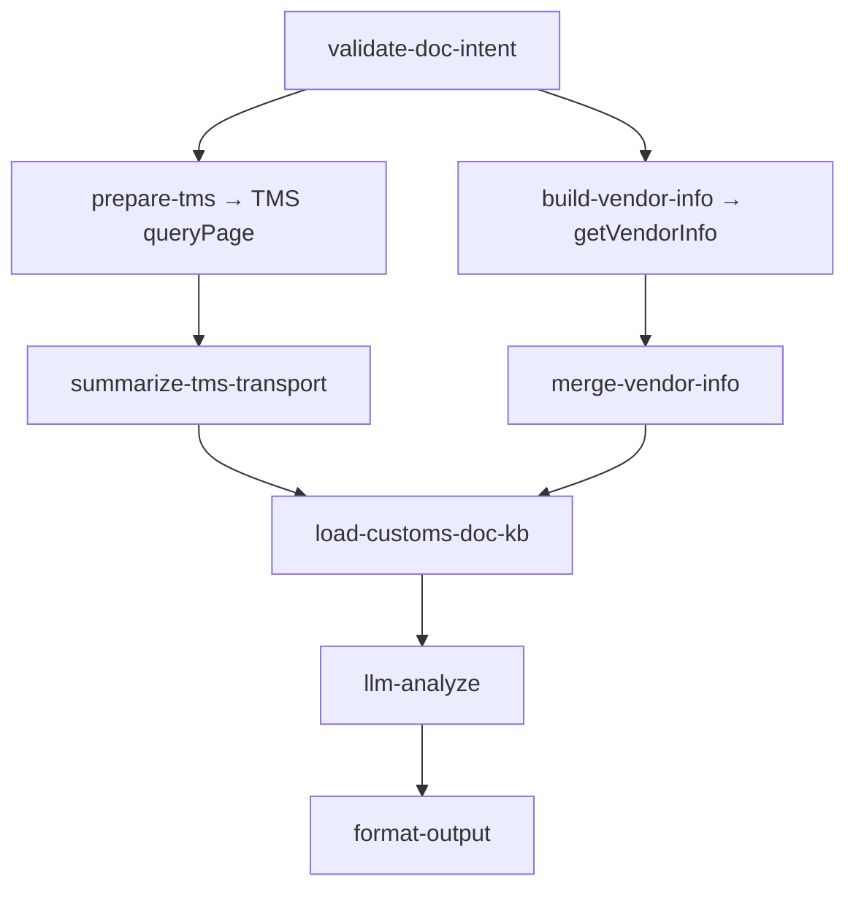

# inbound/inbound-customs-doc-manage 专家设计

清关资料与进口商管理：清关文件上传操作指引（英国/欧盟递延清关）、自有进口商注册与进出口商查询。

---

## 调用说明

### 适用场景

- 客户询问「清关需要提交什么资料」、「怎么上传清关文件」、「自有进口商怎么注册」、「英国/欧盟递延清关怎么申请」、「进口商审核结果是什么」。
- **不适用**：清关进度/延误（→ `inbound-customs-clearance`）；权限申请（→ `inbound-permission-apply`）。

### 最小入参

- `inputs.intent` 说明操作意图 + `inputs.country`（目的国）。

### 参数提示

- `intent`：`upload`（上传清关资料）/ `register_importer`（注册进口商）/ `query_importer`（查询进口商状态）/ `general`（泛咨询）。
- `country`：清关资料要求因目的国不同而差异显著（英国 vs 欧盟/比利时），务必提供。
- `importerCode`：`query_importer` 时可选；有则过滤匹配，无则返回该国全部 IOR 列表。

### 示例调用

**示例 1：清关文件上传**

```json
{
  "query": "说明英国入库的清关资料要求与上传步骤",
  "customerIntent": "货要发英国，问需要上传什么清关资料",
  "inputContext": { "chainId": "case-20260608-170" },
  "inputs": {
    "intent": "upload",
    "country": "UK",
    "inboundOrderNo": "WI20260601016"
  }
}
```

**示例 2：进口商注册**

```json
{
  "query": "说明自有进口商注册流程与所需材料",
  "customerIntent": "客户想用自有进口商，问怎么注册",
  "inputContext": { "chainId": "case-20260608-171" },
  "inputs": {
    "intent": "register_importer",
    "country": "UK"
  }
}
```

**示例 3：进口商查询**

```json
{
  "query": "查一下我在德国有哪些进口商",
  "customerIntent": "客户想确认已配置的进口商编码",
  "inputContext": { "chainId": "case-20260608-172" },
  "inputs": {
    "intent": "query_importer",
    "country": "DE",
    "importerCode": "IR0000000586"
  }
}
```

---

## 1. 输入设计

### 框架顶层

| 字段 | 类型 | 说明 |
|------|------|------|
| query | string | 任务说明 |
| customerIntent | string | 业务问题摘要 |
| inputContext | object | `chainId`、`previousOutput` |

### inputs 业务字段

| 字段 | 类型 | 必填 | 说明 |
|------|------|------|------|
| intent | string | 是 | `upload` / `register_importer` / `query_importer` / `general` |
| country | string | 是 | 目的国（UK / EU / DE / BE 等）|
| inboundOrderNo | string | 否 | 关联入库单号（可选，用于 TMS 待上传标志；不传入任何写接口）|
| transportOrderNo | string | 否 | 运输单号 TO（可选，优先用于 TMS queryPage）|
| importerCode | string | 否 | 进口商编码（query_importer 时可选，用于过滤 vendor）|

---

## 2. 数据拉取与兜底

> **接口依据**：`已确认` · `无依据`（勿作运行时依赖）

| intent | Action | 类型 | 接口依据 | 说明 |
|--------|--------|------|----------|------|
| `upload` | `tms.transportorder.queryPage` | 读 | **已确认** | 有 WI/TO 时查待上传标志；上传 SOP 纯 KB |
| `register_importer` | `winit.ums.getVendorInfo` | 读 | **已确认** | 展示已有 IOR；**注册写操作**仍须万邑联 |
| `query_importer` | `winit.ums.getVendorInfo` | 读 | **已确认** | 按 countryCode + IOR 查询 vendor 列表 |
| `general` | 同上 + TMS | 读 | **已确认** | 综合 KB + vendor 列表 |

### UMS：`winit.ums.getVendorInfo`

- 文档：[查询进/出口供应商](https://developer.winit.com.cn/document/detail/id/33.html)
- KB：`_kb/.../openapi/ums/getVendorInfo.md`
- 入参：`countryCode`（目的国，EU→DE、GB→UK）+ `vendorType=IOR`
- 出参：`vendorCode`、`vendorName`、`isWinit`（Y/N）
- **不含**审核状态；审核进度仍引导万邑联 → 进口商管理

**Coze 链路（进口商）**：`build-vendor-info-request` → `cobra_winit_openapi_request` → `fetch-vendor-info` → `merge-vendor-info`

### 无依据 / 已废弃

| 接口 | 说明 |
|------|------|
| UMS `registerImporter` / `queryImporter` | 矩阵旧名；查询已由 `getVendorInfo` 替代 |
| `wh.inbound.order.uploadCustomsDeclareDocs` | 写接口；本专家不调用 |

> 写接口**本专家均不调用**——客户须在万邑联平台自行操作。

---

## 3. 工作流编排



### 节点顺序

1. `validate-doc-intent`：校验 intent / country；`query_importer` 时 `importerCode` 可选
2. 并行数据拉取：
   - TMS：`prepare-tms-doc-lookup` → `build-tms-transport-query` → `fetch-tms-transport-order` → `summarize-tms-transport`（有 WI/TO 且 intent=upload）
   - UMS：`build-vendor-info-request` → `fetch-vendor-info` → `merge-vendor-info`（intent≠upload）
3. `load-customs-doc-kb`：按 intent 注入 KB 片段 + vendor 列表 + TMS 摘要
4. `llm-analyze`：生成步骤与材料清单
5. `format-output`

---

## 4. 节点说明

| 节点文件 | 输入 params | 输出 |
|----------|-------------|------|
| `validate-doc-intent.ts` | intent, country, inboundOrderNo, importerCode | validationOk, 规范化字段 |
| `prepare-tms-doc-lookup.ts` | inboundOrderNo, transportOrderNo | wiOrderNos, skipTms |
| `build-vendor-info-request.ts` | intent, country | umsActions, skipUmsApi |
| `fetch-vendor-info.ts` | umsActions | rawVendorData |
| `merge-vendor-info.ts` | rawVendorData, importerCode | vendorList, umsDataAvailable, vendorFacts |
| `load-customs-doc-kb.ts` | intent, country, vendorFacts, tmsTransportSummary | kbContent, uploadAction |
| `llm-analyze`（LLM）| kbContent + customerIntent | analysisResult |
| `format-output.ts` | analysisResult, vendorList, umsDataAvailable | structured, analysis |

---

## 5. 各目的国材料要求参考

### 英国（UK）

- 主要资料：商业发票（含产品描述/数量/价值/EORI）、装箱单、进口商资质文件
- 递延清关（DDP 包税）：需客户提前注册进口商；Winit 平台自有进口商需开通
- 参考 KB：`_kb/service-team/inbound-services-doc/` 英国清关系列

### 欧盟（EU/DE/BE 等）

- 比利时递延清关：需进口商 VAT 注册 + EORI；材料要求与英国略有差异
- 参考 KB：比利时/欧盟进口商注册系列

---

## 6. 输出设计

### structured 字段

| 字段 | 类型 | 说明 |
|------|------|------|
| intent | string | 操作意图 |
| country | string | 目的国 |
| documentChecklist | string[] | 清关资料清单 |
| operationSteps | string[] | 操作步骤 |
| vendorList | object[] | getVendorInfo 返回的 IOR 列表 |
| matchedVendor | object | 按 importerCode 匹配的单条（如有）|
| importerStatus | string | 审核状态（API 不提供，引导万邑联）|
| apiAction | string | `winit.ums.getVendorInfo`（有数据时）|
| umsDataAvailable | boolean | UMS 进口商 API 是否返回有效数据 |
| tmsDataAvailable | boolean | TMS 待上传标志是否可用 |

### analysis 原则

- 按 `country` 给出差异化材料要求，不混淆英国和欧盟规则
- upload：输出步骤指引，不代客上传文件；可引用 TMS 待上传标志
- register：说明注册须万邑联操作；可展示已有 vendor 供参考
- query：`umsDataAvailable=true` 时列举 vendor；审核状态引导万邑联

---

## 7. Prompt 知识片段

| 文件 | 说明 |
|------|------|
| `prompts/kb-upload-guide.md` | 清关资料上传 SOP |
| `prompts/kb-importer-register.md` | 自有进口商注册流程（材料/审核时限）|
| `prompts/kb-importer-query.md` | getVendorInfo 查询说明与平台进度指引 |
| `prompts/kb-general.md` | 通用清关资料 KB |
| `prompts/main.md` | LLM 主 prompt |

---

## 8. 对客约束

- **不代客上传**清关文件（写操作安全约束）
- **不代客注册**进口商（register 为写操作）
- 不引用飞书/内部 UMS 管理 URL
- 费用相关（如进口关税）标注「以清关实际账单为准，本专家不提供关税核算」
- 升级人工条件：进口商审核被拒需复核；特殊货型（超限/敏感品类）清关文件要求需人工确认

---

## 9. 待确认事项

- `wh.inbound.order.uploadCustomsDeclareDocs`：Coze action **未确认**
- `getVendorInfo` 对 UK/EU 等国家码映射（EU→DE 等）需联调验证
- 递延清关（延税清关）的具体触发条件与客户资质要求，需产品确认后补充进 KB
