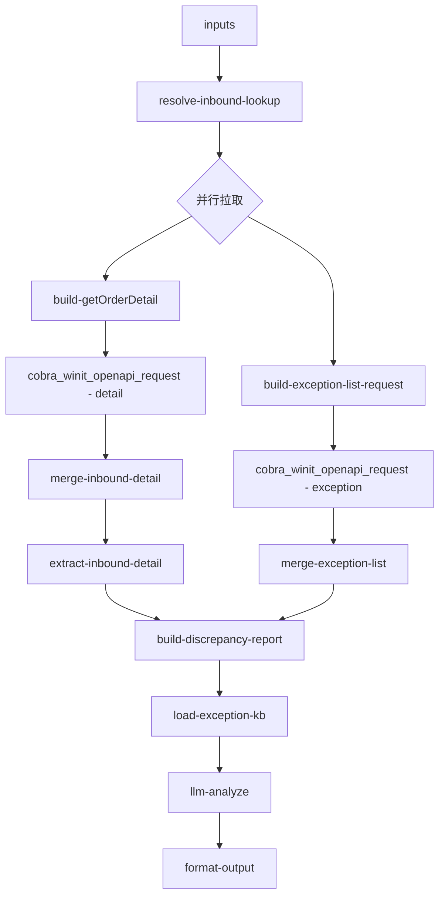

# inbound/inbound-exception-check 专家设计

入库异常核实：聚合预报/签收/验收/上架四层数量与状态差异，生成差异报告，识别需人工介入的情形。

---

## 调用说明

### 适用场景

- 客户反映「签收少件」、「上架数量和预报对不上」、「有没有异常单」、「包裹破损」、「签收争议」。
- 包含 `inbound-exception-check.query`（查异常单）与 `inbound-exception-check.qty-diff`（数量差异核实）两个子场景。
- **不适用**：纯进度查询（→ `inbound-putaway-status`）；抽验结果/费用（仍在本专家范围，通过异常单查询）；规则解释（→ `inbound-process-guide`）。
- **衔接**：`inbound-self-inspection` 专家发现抽验数据与自验数据差异超出容差时，可将上游数据写入 `inputContext.previousOutput`，由本专家聚合完整差异报告。
- **多轮兜底**：用户后续补充已提交增值单号时，本专家保留当前入库异常快照与上一轮连续性，只输出到 `value-add/value-add-order-status` 的 handoff，不在本专家内查询或推断增值单状态。

### 最小入参

- `inputs.inboundOrderNos` 至少一个单号，或 `inputs.queryAllExceptions=true`（拉取客户全部异常单）。

### 参数提示

- `exceptionDescription`：客户描述的问题关键词，有助于 LLM 定性异常类型。
- `dateRange`：批量查异常单时限制日期范围，避免返回过多数据。
- `vasOrderNo`：用户在后续轮次补充的已提交增值单号；也可从当前 `query/customerIntent` 中识别 V/VASC 单号。

### 示例调用

**示例 1：按单号查异常**

```json
{
  "query": "查询该入库单的异常记录并生成差异报告",
  "customerIntent": "客户反馈：上架数量比预报少了 5 件",
  "inputContext": { "chainId": "case-20260608-070" },
  "inputs": {
    "inboundOrderNos": ["WI20260601006"],
    "exceptionDescription": "上架少件"
  }
}
```

**示例 2：批量查询异常单**

```json
{
  "query": "查询近期所有入库异常记录",
  "customerIntent": "客户问：最近有没有入库异常",
  "inputContext": {},
  "inputs": {
    "queryAllExceptions": true,
    "dateRange": { "from": "2026-06-01", "to": "2026-06-08" }
  }
}
```

---

## 1. 输入设计

### 框架顶层

| 字段 | 类型 | 说明 |
|------|------|------|
| query | string | 任务说明 |
| customerIntent | string | 异常描述摘要 |
| inputContext | object | `chainId`；`previousOutput`（上游 inbound-self-inspection 数据） |

### inputs 业务字段

| 字段 | 类型 | 必填 | 说明 |
|------|------|------|------|
| inboundOrderNos | string[] | 条件必填 | WI 单号；与 `queryAllExceptions` 二选一 |
| queryAllExceptions | boolean | 条件必填 | true 时拉取客户全部近期异常单 |
| exceptionDescription | string | 否 | 客户描述的异常关键词 |
| vasOrderNo | string | 否 | 后续补充的已提交增值单号；只用于生成 `value-add-order-status` handoff |
| dateRange | object | 否 | `{ from: yyyy-MM-dd, to: yyyy-MM-dd }`，批量查时使用 |
| detailLevel | string | 否 | 默认 `sku_summary`；包裹/单品争议时升为 `package_detail` / `item_lookup`（见 [`inbound-getOrderDetail-detail-strategy.md`](../../../docs/plan/inbound-getOrderDetail-detail-strategy.md)） |
| targetMerchandiseCodes | string[] | 否 | SKU 级差异下钻 |
| targetPackageNos | string[] | 否 | 包裹级下钻 |
| targetItemSernos | string[] | 否 | 单品码级下钻 |

---

## 2. 数据拉取与兜底

> **接口依据**：`已确认` · `端点待注册` · `无依据`（勿作运行时依赖）

> **id/39 约束**：`isIncludePackage=N` 无 `merchandiseList`；SKU/包裹级差异须 `Y`，无包裹分页 API → 见 [`docs/plan/inbound-getOrderDetail-detail-strategy.md`](../../../docs/plan/inbound-getOrderDetail-detail-strategy.md)。

| 路径 | Action | 接口依据 | 请求 | 关键字段 |
|------|--------|----------|------|---------|
| 入库单详情 | `winit.wh.inbound.getOrderDetail` | **已确认** | 默认 `Y` + **`extract-inbound-detail`** | 表头汇总 + 根级 **`merchandiseList`** |
| 异常单列表 | `wh.inboundOrderException.list` / `wh.inboundOrder.queryExceptionList` | **已确认** | 有单号 → queryExceptionList；批量 → list | `type`/`exceptionName`, `errormsg`/`exceptionDesc`, 明细 `merchandiseSerno` |

### 头程 / 清关异常覆盖缺口

本专家运行时只使用对客可用的 OMS 入库详情与入库异常单接口。头程、清关、海关查验类异常可能登记在内部异常事件体系中，不一定同步到 `wh.inboundOrderException.list` / `wh.inboundOrder.queryExceptionList`。

当异常接口为空，但用户描述命中「头程 / 清关 / 海关 / 查验 / 送仓进口 / 到港 / 离港」等关键词，或订单事实显示仍处于头程阶段（例如 `status=TS`、`winitProductCode=OW01011*`、存在 `containerNo` / `logisticsPlanName`），本专家应输出：

- `coverageGap=true`
- `orderPhaseHint=first_leg_or_customs`
- `isPutawayComparable=false`
- `humanReviewReason` 说明当前对客入库异常接口未覆盖头程/清关异常明细，需人工通过内部系统核实

此时不得把 `actualQuantity=0` 解释为上架差异 100%，也不得把“入库异常接口为空”解释为“无异常”。

### 包裹数量差异与异常接口空结果

- `orderPackageQty` / `totalPackageQty` 表示预报包裹数，`actualOrderPackageQty` 表示实收包裹数。
- 用户明确询问箱数/包裹数，或订单处于 `EWC` / `SHD` / `SCP` 且两者不一致时，输出 `packageDiscrepancy` 并标记 `needsHumanReview=true`。
- `queryExceptionList` 成功但返回空数据时，输出 `exceptionLookupStatus=success_empty`；这只表示对客异常接口未返回异常明细，不得回答“订单无异常”。
- 包裹数量差异不能单独证明差异包裹处于待上架、丢失或已生成异常单状态，也不能在缺少异常类型时直接进入 value-add 推荐链。
- `actualOrderPackageQty` 缺失时，`receivedPackageQty`、`packageDiscrepancy`、`packageDiscrepancyRate` 必须为 `null`；字段缺失不等于实收 0 箱。

### 多轮快照与已提交增值单

- 当前异常接口结果是本次查询快照，不能覆盖或否定 `inputContext.previousOutput` 中的上一轮事实。
- `contextContinuity.currentLookupDoesNotOverridePrevious=true` 表示当前为空、失败或不完整的查询不能推翻上一轮上下文，需要继续核实。
- 用户补充 `vasOrderNo` 后，输出 `suggestedNextExpert=value-add/value-add-order-status`，并在 `valueAddHandoff` 中保留 `vasOrderNo`、关联入库单号和当前异常查询状态。
- 本专家不解释增值单主状态、原子进度、退回原因或完成结果；这些事实只能由 `value-add-order-status` 查询。

### 无依据接口 / 字段（勿作运行时依赖）

| 接口 / 字段 | 说明 |
|-------------|------|
| `queryInboundException` | API 矩阵旧名，已废弃 |
| `wh.inbound.inboundOrderException.list` | 错误 action 名（多一段 `.inbound.`），已废弃 |
| `oms.unusualEventOrder.queryEventList` | 内部员工异常事件接口；可用于人工核实，但**不得作为对客专家运行时依赖** |
| `samplingFee` | 当前从 `exceptionType` 文本推断，**无独立字段依据** |
| `queryValueAddedService` | 矩阵列名，本专家未接入 |

**四层数量聚合**（更新）：

| 层级 | 数据来源 | 字段 |
|------|---------|------|
| 预报量 | 根级 `merchandiseList` 或表头 | `quantity` / `totalMerchandiseQty` |
| 验收量 | `merchandiseList.inspectionQty` | 按 SKU 汇总 |
| 上架量 | **`merchandiseList.actualQuantity`** | 按 SKU 汇总（**须 isIncludePackage=Y**） |
| 签收/包裹 | `packageList`（仅 `package_detail` 路径，剪枝后） | `package.status`, `unloadingTime`, `shelvesTime` |
| 单品 | `itemList`（仅 `item_lookup`） | `itemSerno`, `status` |

**下钻策略**：

1. 默认 `sku_summary`：`Y` → extract 删 `packageList` → `build-discrepancy-report` 用 SKU 汇总
2. 存在 SKU 差异且客户提到箱号/包裹 → `detailLevel=package_detail` + `targetPackageNos`
3. 单品化管理争议 → `item_lookup` + `targetItemSernos`
4. `totalPackageQty > 200` 且无 narrowing 参数 → `requiresNarrowing=true`，不展开包裹

---

## 3. JSON 剪枝

| 层级 | 策略 |
|------|------|
| **`extract-inbound-detail`** | 同 inbound-putaway-status；`sku_summary` 路径丢弃 `packageList` |
| `packageList` | 仅 `package_detail` 保留；`maxPackagesPerOrder` / `maxMerchandisePerPackage` |
| `itemList` | 默认删；`item_lookup` 时仅保留命中 |
| 异常单列表 | pageSize=50；超出时 `hasMoreExceptions=true` |

---

## 4. 工作流编排



### 节点顺序

1. `resolve-inbound-lookup`：规范化单号
2. **并行**：`getOrderDetail` + 异常查询（有单号 → `queryExceptionList` 批处理；批量 → `inboundOrderException.list`）
3. `build-discrepancy-report`：生成四层数量差异结构，标注差异量与差异率，`needsHumanReview` 判断
4. `load-exception-kb`：加载异常类型说明（QTY_DIFF、DAMAGE、LABEL_MISSING 等）
5. `llm-analyze`：客观归纳差异事实与可能原因
6. `format-output`

---

## 5. 节点说明

| 节点文件 | 输入 params | 输出 |
|----------|-------------|------|
| `resolve-inbound-lookup.ts` | `inboundOrderNos`, `queryAllExceptions` | `wiOrderNos[]`, `useListMode` |
| `build-exception-list-request.ts` | `wiOrderNos`, `dateRange` | `exceptionRequestData` |
| `merge-exception-list.ts` | plugin 输出 | `exceptionRecords[]` |
| `build-discrepancy-report.ts` | `rawOrderData`（extract 后）, `exceptionRecords`, **`skuPutawaySummary?`** | `discrepancyReport`, `needsHumanReview`, `exceptionTypes[]` |
| `extract-inbound-detail.ts` | `rawOrderData`, `detailLevel`, 下钻参数 | 剥离后的 `rawOrderData`, `_detailExtractMeta` |
| `load-exception-kb.ts` | — | `exceptionTypeGuide`（类型 → 含义 + 处理路径） |
| `llm-analyze`（LLM） | `discrepancyReport`, `exceptionTypes`, `exceptionTypeGuide`, `customerIntent` | `analysisResult` |
| `format-output.ts` | `analysisResult`, `inputContext?` | `result`, `outputContext` |

---

## 6. 输出设计

### structured 字段

| 字段 | 类型 | 说明 |
|------|------|------|
| orderNo | string | 入库单号 |
| discrepancyReport | object | `{ forecastQty, receivedQty, putawayQty, discrepancy, discrepancyRate }` |
| exceptionRecords | object[] | 异常单记录摘要：`[{ exceptionType, exceptionQty, merchandiseCode, status }]` |
| exceptionTypes | string[] | 异常类型列表（QTY_DIFF / DAMAGE / LABEL_MISSING 等） |
| needsHumanReview | boolean | 是否需要人工介入 |
| requiresNarrowing | boolean | 包裹过多且未提供箱号/条码，无法展开包裹明细 |
| hasMoreExceptions | boolean | 异常单是否超过 pageSize 未全部返回 |
| totalExceptions | number | 异常单总数（含未展示部分）|
| suggestedNextExpert | string | 增值类异常指向 `value-add-exception-diagnosis`；已提交增值单后续查询指向 `value-add-order-status` |
| valueAddHandoff | object | 传给 value-add 推荐链或已提交增值单状态专家的结构化事实摘要 |
| humanReviewReason | string | 需人工介入的原因说明 |
| coverageGap | boolean | 当前对客接口是否存在头程/清关异常覆盖缺口 |
| coverageGapReason | string | 覆盖缺口原因 |
| orderPhaseHint | string | 订单阶段提示，如 `first_leg_or_customs` |
| isPutawayComparable | boolean | 是否适合用上架数量与预报数量做差异判断 |
| exceptionLookupStatus | string | 异常单查询状态：有记录、成功空结果、接口失败、解析失败、部分失败或跳过 |
| exceptionLookupMessage | string | 面向下游的异常单查询状态说明，不含原始客户数据 |
| contextContinuity | object | 上一轮上下文是否存在、当前快照是否可覆盖上一轮，以及后续增值单号摘要 |
| followUpVasOrderNo | string | 当前轮明确识别出的已提交增值单号 |
| needsFollowUp | boolean | 是否必须继续查询增值单状态或结合上一轮事实核实 |
| followUpReason | string | 继续处理的原因和边界说明 |

`discrepancyReport` 同时包含 `forecastPackageQty`、`receivedPackageQty`、`packageDiscrepancy`、`packageDiscrepancyRate`、`hasForecastPackageFact`、`hasReceivedPackageFact` 与 `hasPackageDiscrepancy`。缺少对应事实时数量和派生差异使用 `null`，不用 0 代替未知。

### analysis 原则

- 客观陈述各层数量与差异数值，不做责任判定
- 差异率 ≥ 5% 或绝对差 ≥ 10 件时标注 `needsHumanReview=true`（阈值待产品确认，见 `discrepancy-thresholds.md`）
- `coverageGap=true` / `isPutawayComparable=false` 时，不得把上架数为 0 写成 100% 入库差异；需说明当前对客接口无法覆盖头程/清关异常明细，需人工核实
- 异常单接口空结果与包裹数量差异必须分开表述；不得用前者否定后者
- 当前查询为空不能否定上一轮异常事实；用户补充已提交增值单后，应转 `value-add-order-status` 查询，不得推断“异常已解决”
- 异常类型需增值处理时（串仓/无主货/上架前特殊处理），在 `suggestedNextExpert` 指向 `value-add/value-add-exception-diagnosis`，并说明进入 value-add 推荐链判断可选处理路径
- 不引用内部 URL

### enrichedContext

写入 `inbound/inbound-exception-check`：`{ discrepancyReport, exceptionTypes, needsHumanReview, valueAddHandoff }`。

---

## 7. Prompt 知识片段

| 文件 | 说明 |
|------|------|
| `prompts/exception-type-guide.md` | 异常类型定义与处理路径（来源：service-team KB 多个异常文件）：<br>• QTY_DIFF（数量差异）：上架少包裹/少单品，分标准入库单与直发海外验两类处理<br>• DAMAGE（包裹破损）：拍照证明 + 提交核实工单<br>• LABEL_MISSING（条码异常）：进入 value-add 推荐链判断补贴包裹条码路径<br>• WRONG_WAREHOUSE（串仓异常）：进入 value-add 推荐链判断串仓调拨或非标路径<br>• EXTRA_ITEM（包裹内存在订单外商品）：进入 value-add 推荐链判断新单上架路径<br>• OWNERLESS_GOODS（入库无主货）：进入 value-add 推荐链判断无主货找回路径<br>• PRE_SHELVE_ACTION（上架前特殊处理）：进入 value-add 推荐链判断自提/销毁/拦截/拍照路径 |
| `prompts/discrepancy-thresholds.md` | 差异率容差标准（5%/10 件参考线）与升级条件；注意：差异核实结论需仓库确认，AI 不做责任判定 |

---

## 8. 对客约束

- 不判责（不说「是仓库的错」或「是客户的错」）
- 不承诺赔付结果
- 升级人工条件：`needsHumanReview=true`；DAMAGE 类型的包裹破损；差异量较大（由 LLM 判断是否明确超阈值）

---

## 9. 待确认事项

- ~~`wh.inbound.inboundOrderException.list`~~ → 已替换为 `wh.inboundOrderException.list` / `wh.inboundOrder.queryExceptionList`
- `actualOrderMerchandiseQty` 在 EWC 前后是否含义不同（签收量 vs 最终上架量）；需产品确认字段更新时机
- 抽验费用：见 §2「无依据字段」`samplingFee`
