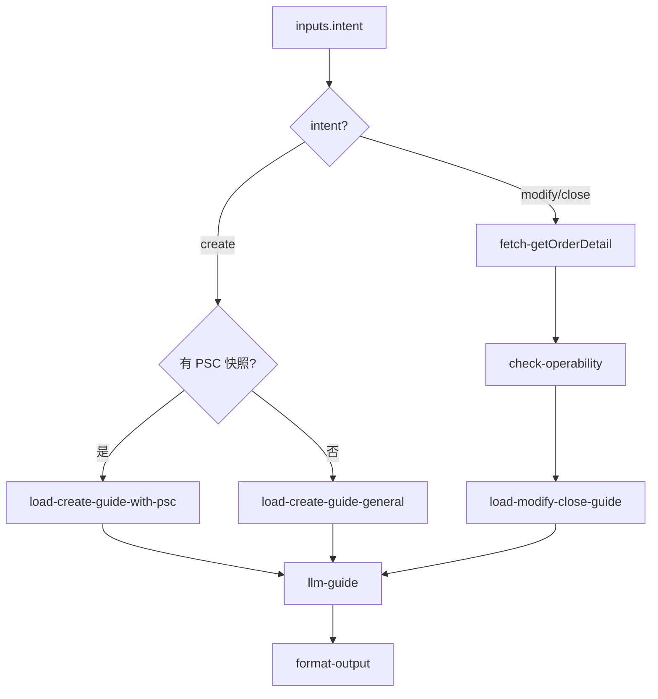

# inbound/inbound-order-manage 专家设计

入库单创建/修改/关闭操作指引：根据客户意图提供操作步骤、PSC 选型建议、可修改条件说明与关闭风险提示。

---

## 调用说明

### 适用场景

- 客户询问「怎么新建入库单」、「该选哪个产品（PSC）」、「我要修改目的仓」、「怎么关闭入库单」、「入库单能撤销吗」。
- 操作指引专家：输出步骤与条件，**不代客自动执行**写操作。
- **不适用**：单据当前状态（→ `inbound-order-status`）；入库规则解释（→ `inbound-process-guide`）。
- **衔接**：下单前 PSC 校验，由 planner 前置调用 `inbound-psc-eligibility` 并将 `enabledProducts` 写入 `inputContext.previousOutput`。

### 最小入参

- `inputs.intent`（create / modify / close）。

### 参数提示

- `intent=create`：`targetPsc` 可选，若不传则输出通用选 PSC 指引。
- `intent=modify`：需提供 `inboundOrderNo`，说明可修改范围（目的仓/SKU/数量）与前提条件。
- `intent=close`：需提供 `inboundOrderNo`，输出取消规则与风险提示。

### 示例调用

**示例 1：新建入库单指引**

```json
{
  "query": "指导客户新建海外仓入库单，含 PSC 选型",
  "customerIntent": "第一次新建入库单，不知道选哪个产品",
  "inputContext": {
    "chainId": "case-20260608-100",
    "sourceExpertId": "inbound/inbound-psc-eligibility",
    "previousOutput": {
      "structured": {
        "enabledProducts": ["OW01021"],
        "hasSelfInspection": true
      }
    }
  },
  "inputs": {
    "intent": "create",
    "warehouseCode": "USLAX01"
  }
}
```

**示例 2：关闭入库单**

```json
{
  "query": "说明该入库单是否可以关闭，以及操作步骤",
  "customerIntent": "计划取消，想关闭入库单",
  "inputContext": { "chainId": "case-20260608-101" },
  "inputs": {
    "intent": "close",
    "inboundOrderNo": "WI20260601011"
  }
}
```

---

## 1. 输入设计

### 框架顶层

| 字段 | 类型 | 说明 |
|------|------|------|
| query | string | 任务说明 |
| customerIntent | string | 操作意图描述 |
| inputContext | object | `chainId`；上游 PSC 快照（`previousOutput.structured.enabledProducts`）|

### inputs 业务字段

| 字段 | 类型 | 必填 | 说明 |
|------|------|------|------|
| intent | string | 是 | `create` / `modify` / `close` |
| inboundOrderNo | string | modify/close 必填 | 操作目标单号 |
| warehouseCode | string | 否 | 目的仓（create 选型参考） |
| targetPsc | string | 否 | 目标 PSC 编码（create 时指定） |

---

## 2. 数据拉取与兜底

> **接口依据**：`已确认` · `无依据`（勿作运行时依赖）

| intent | Action | 类型 | 接口依据 | 用途 |
|--------|--------|------|----------|------|
| `close` / `modify` | `winit.wh.inbound.getOrderDetail` | 读 | **已确认** | 读取当前状态，判断是否可操作 |
| `create` | — | 纯 KB | — | 加载创建 SOP，不调用写接口 |
| PSC 校验 | `inputContext.previousOutput.structured.enabledProducts` | 上下文 | **已确认** | 来自上游 `inbound-psc-eligibility` 快照 |

### 无依据接口（勿作运行时依赖）

| 接口 / 能力 | 说明 |
|-------------|------|
| `createInboundOrder` / `order.create` | 矩阵推断写接口；本专家**不调用** |
| `cancelInboundOrder` / `order.cancel` | 矩阵推断写接口；本专家**不调用** |
| `updateCrossDockingWaveInfo` / `updateInboundOrder` | 修改目的仓；**部分内部路径提及，Coze action 未确认** |

**取消规则**（来自 cancelInboundOrder.md，用于 close 指引文案）：
- `OD`（草稿）：客户可在平台自行取消
- `TS`（在途）：视物流安排，可能可取消，建议联系客服确认
- `PEWC`/`EWC`：通常不可在线取消，需联系仓库运营人工处理

---

## 3. 工作流编排



### 节点顺序

1. `intent=create`：
   - 检查 `inputContext.previousOutput` 中 PSC 快照
   - 加载创建指引（含 PSC 选型建议、必填字段说明与页面设置提示；不向客户暴露内部字段）
2. `intent=modify`/`close`：
   - `getOrderDetail` 读取当前状态
   - `check-operability`：确定性判断是否可操作（基于状态码）
   - 加载修改/取消规则 SOP
3. `llm-guide`：生成操作步骤与风险提示
4. `format-output`

---

## 4. 节点说明

| 节点文件 | 输入 params | 输出 |
|----------|-------------|------|
| `fetch-getOrderDetail.ts` | `inboundOrderNo` | `rawOrderData` |
| `check-operability.ts` | `rawOrderData`, `intent` | `isOperable`, `blockReason`, `currentStatus` |
| `load-create-guide.ts` | `enabledProducts?`, `warehouseCode?`, `targetPsc?` | `createSteps`, `pscGuide`, `requiredFields` |
| `load-modify-close-guide.ts` | `intent`, `currentStatus` | `allowedModifications`, `cancelRules`, `riskNotes` |
| `llm-guide`（LLM） | 上述 SOP + `customerIntent` | `analysisResult` |
| `format-output.ts` | `analysisResult`, `inputContext?` | `result`, `outputContext` |

---

## 5. 输出设计

### structured 字段

| 字段 | 类型 | 说明 |
|------|------|------|
| intent | string | 操作意图 |
| isOperable | boolean | 当前状态是否允许该操作（modify/close 场景）|
| blockReason | string | 不可操作的原因（如状态不符）|
| operationSteps | string[] | 操作步骤列表 |
| pscRecommendation | string | PSC 选型建议（create 场景）|
| requiredFields | object | 创建必填字段说明（create 场景）|
| riskNotes | string[] | 风险提示（close 场景尤其重要）|

### analysis 原则

- create：结合 PSC 快照推荐合适产品，指导客户按所选 PSC 与页面提示完成相关设置；不输出或解释内部字段名
- close：明确说明当前状态是否可取消，不可取消时说明原因与人工联系路径
- 不代客执行任何写操作；操作步骤描述为「您可以在万邑联平台操作」

---

## 6. Prompt 知识片段

| 文件 | 说明 |
|------|------|
| `prompts/create-order-guide.md` | 新建入库单步骤：PSC 选型 → 填写信息 → 提交确认；送仓方式与 PSC 的对应关系（散货/整柜/快递）；美森渠道已于 2025 年 12 月下线，推荐以星渠道 |
| `prompts/create-order-errors.md` | 常见下单报错及处理指引（来源：`新增海外仓入库单的常见问题.md`）：<br>• 逾期账单未处理 → 还款后自动恢复<br>• 商品信息不存在 → 检查 SKU 注册/发布状态和规格一致性<br>• 体积超限校验不通过 → 检查注册尺寸或验货尺寸<br>• B/C 包裹含大件/超大件 → 调整为 A/A+ 包裹<br>• 批次管理与非批次管理混单 → 拆分下单<br>• 带电商品无电池证书 → 上传电池资料审核<br>• 箱号在系统中已存在 → 须终止之前入库单才能重用箱号<br>• 没有直发下单入口 → 在个人中心-服务设置-偏好设置开通 |
| `prompts/psc-selection-rules.md` | PSC 选型决策（自验 vs 海外验 vs 标准，对应 OW01021/22/31/32）；自验直发须先完成验货才能创建预约单 |
| `prompts/modify-order-rules.md` | 箱单修改截止条件（Winit揽收 → 安排提货前；自发物流 → 安排收货前；直发海外验 → 已下单状态可修改；自验直发 → 验货开始前可改，验货中可减少商品）；目的仓修改需运营介入 |
| `prompts/cancel-order-rules.md` | 取消规则：OD 可在平台自行取消；TS 视物流安排；PEWC/EWC 联系仓库运营人工处理；直发类入库单部分到仓时客户可自行关闭（参见 `客户如何自行关闭部分到仓的直发类入库单.md`）|

---

## 7. 对客约束

- **不执行**任何写操作（create/cancel/update 均只输出指引）
- PSC 选型建议基于 `enabledProducts` 快照，不替代客户最终决策
- 关闭入库单风险提示：已发出货物无法召回，建议谨慎操作
- 升级人工条件：PEWC/EWC 状态需关闭（必须人工）；修改已在途订单的目的仓（需运营介入）
- 对客输出不得出现或解释 `orderMode`、`isAutoInspection` 等内部字段；如页面设置导致无法提交，收集页面提示或截图后再排查

---

## 8. 待确认事项

- `wh.inbound.order.updateCrossDockingWaveInfo`（修改目的仓/SKU）：API 调研提到「部分」覆盖，具体支持修改哪些字段需产品确认（见 INDEX.md `inbound-order-manage.modify-dest` 条目）
- `orderMode: SelfInspectionPlanSKU` 与 `inspectionWay: IFES` 的 QSI 创建逻辑需与研发确认字段名与必填要求
