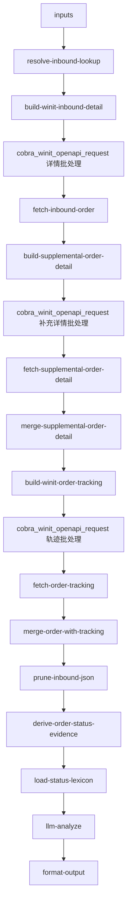

# inbound/inbound-order-status 专家设计

入库单状态查询与字段解读：根据入库单号拉取 OMS 基础详情、补充订单时间详情与专用轨迹，归纳当前状态、轨迹里程碑、订单级时间与系统报错含义。

---

## 调用说明

### 适用场景

- 客户持有**入库单号（WI 前缀）或客户自有参考号**，询问「单子现在什么状态」、「为什么显示 PEWC」。
- 需要对状态码、字段、**全流程轨迹**和订单级时间做客观解读，并确定性区分实际、预计、目标与当地时间（**不**输出操作建议；不承诺上架时间；不处理催促逻辑 → `inbound-putaway-expedite`）。
- **不适用**：快递卸货/POD 专项（→ `inbound-arrival-status`）；头程 TS 细粒度（→ `inbound-transit-tracking`）；系统报错码操作指引（→ `inbound-order-manage`）；VASC 推荐、服务项配置或已提交增值单状态（→ `value-add/value-add-product-recommendation` / `value-add/value-add-service-config` / `value-add/value-add-order-status`）。

### 最小入参

- `inputs.inboundOrderNos` 至少包含一个有效标识（WI 单号或客户参考号）；或仅有 `errorCode` 走纯 KB。

### 参数提示

- `inboundOrderNos`：支持混入 WI 单号与客户自有参考号；WI 前缀用 `orderNo` 查详情，否则用 `customerOrderNo`。
- `includeTracking`：默认 `true`；有单号时并行拉取 `wh.tracking.queryOrderTracking`。**`getOrderDetail` 不含轨迹**（见 [`docs/plan/inbound-tracking-api.md`](../../../docs/plan/inbound-tracking-api.md)）。
- `includeOrderTimeDetails`：默认 `true`；调用 `wh.inboundOrder.getOrderDetail` 补充预计送仓、预计到仓、预计/目标/实际上架及其他订单级时间。
- `includePackageDetails`：默认 `false`；状态解读无需包裹明细。
- `query` / `customerIntent` 属框架顶层，不写入 `inputs`。

### 示例调用

**示例 1：单号状态 + 轨迹**

```json
{
  "query": "请说明该入库单当前状态与轨迹里程碑",
  "customerIntent": "客户问：我的入库单现在什么状态",
  "inputContext": { "chainId": "case-20260608-001" },
  "inputs": {
    "inboundOrderNos": ["WI49616707"],
    "includeTracking": true
  }
}
```

**示例 2：报错码解读（纯 KB 路径）**

```json
{
  "query": "解释系统提示的错误码含义",
  "customerIntent": "系统提示 ERR_STOCK_MISMATCH，不知道什么意思",
  "inputContext": {},
  "inputs": {
    "inboundOrderNos": [],
    "errorCode": "ERR_STOCK_MISMATCH"
  }
}
```

---

## 1. 输入设计

### 框架顶层（调用边界，不在 manifest.inputSchema 内）

| 字段 | 类型 | 说明 |
|------|------|------|
| query | string | 委托本专家完成的任务说明，可为空 |
| customerIntent | string | 当前业务问题摘要，可为空 |
| inputContext | object | 可选；`chainId`、`sourceExpertId`、`previousOutput` |

### inputs 业务字段（与 manifest.json 一致）

| 字段 | 类型 | 必填 | 说明 |
|------|------|------|------|
| inboundOrderNos | string[] | 条件 | WI 单号或客户参考号；与 errorCode 二选一 |
| errorCode | string | 条件 | 无单号时纯 KB 解读 |
| includeTracking | boolean | 否 | 是否拉取 `queryOrderTracking`，默认 true |
| includeOrderTimeDetails | boolean | 否 | 是否拉取 `wh.inboundOrder.getOrderDetail` 的订单级时间，默认 true |
| detailLevel | string | 否 | 默认 **`header`** → `isIncludePackage=N`（见 [`inbound-getOrderDetail-detail-strategy.md`](../../../docs/plan/inbound-getOrderDetail-detail-strategy.md)） |
| includePackageDetails | boolean | 否 | 兼容旧参数；`true` 时等价 `detailLevel=package_detail`，默认 false |
| maxTrajectoryNodes | integer | 否 | `trackingList` 保留条数上限，默认 20 |

---

## 2. 数据拉取与兜底

> **接口依据**：`已确认` · `端点待注册` · `无依据`（勿作运行时依赖）

> **id/39 约束（已确认）**：`isIncludePackage=N` **不返回** `merchandiseList` / `packageList`；本专家默认 **`detailLevel=header` + N**，仅读表头与轨迹。详见 [`docs/plan/inbound-getOrderDetail-detail-strategy.md`](../../../docs/plan/inbound-getOrderDetail-detail-strategy.md)。

| 场景 | Action | 系统 | 接口依据 | 说明 |
|------|--------|------|----------|------|
| 主路径（详情） | `winit.wh.inbound.getOrderDetail` | OMS | **已确认** | **`isIncludePackage=N`**：`status`、`shelveCompletedDate`、`totalMerchandiseQty` 等表头 |
| 主路径（补充时间） | `wh.inboundOrder.getOrderDetail` | OMS | **文档 + 实测已确认** | 按 `orderNo` 返回 `orderKeyTimeNode`、`pickupInfo`、`directForecastInfo`；先校验 `customerCode`，再做字段白名单 |
| 主路径（轨迹） | `wh.tracking.queryOrderTracking` | OMS 轨迹 | **已确认** | **须单独调用**；按 `orderNo` 返回 `trackingList` |
| 多单/列表辅助 | `wh.inbound.getOrderList` | OMS | **已确认** | 仅需概览或批量时 |
| 报错码解读 | KB 优先 | — | — | `errorCode` 非空且无单号时跳过 API |

### 无依据接口 / 字段（勿作运行时依赖）

| 接口 / 字段 | 说明 |
|-------------|------|
| `getOrderDetail.trajectoryList` | **不在详情响应中**；轨迹里程碑一律来自 `queryOrderTracking` |
| 普通 Date 字段时区 | 接口文档未说明；输出固定标记 `timeZone=unknown`，不得自行解释为仓库当地时间 |
| `directForecastInfo` 子字段契约 | 文档只声明对象，子字段来自实际响应；当前白名单仅接收 `expectedSendWarehouseWay`、`expectedSendwarehouseTime`、`forecastWarehouseTime` |

> **重要**：勿再依赖 `getOrderDetail.trajectoryList`——该字段不在详情接口返回中。轨迹里程碑一律来自 `queryOrderTracking`。

**Coze 集成链路**：
1. `build-winit-inbound-detail` → `cobra_winit_openapi_request`（批处理）→ `fetch-inbound-order`
2. `build-supplemental-order-detail` → `cobra_winit_openapi_request`（批处理）→ `fetch-supplemental-order-detail` → `merge-supplemental-order-detail`
3. `build-winit-order-tracking` → `cobra_winit_openapi_request`（批处理）→ `fetch-order-tracking` → `merge-order-with-tracking`

本地 Runner 使用 `COZE_WINIT_OPENAPI_PROXY_WORKFLOW_ID` 代理上述 action。

---

## 3. JSON 剪枝

| 层级 | 策略 | 默认上限 |
|------|------|---------|
| `trackingList` | 保留最近 N 条（兼容旧字段 `trajectoryList`） | 20 |
| `packageList` / `merchandiseList` | 默认 **`detailLevel=header`** 时不请求或 extract 删除 | — |
| `includePackageDetails=true` | 升级为 `package_detail`；经剪枝后保留（无包裹分页 API） | 50 包裹 |

剪枝后附 `_pruneMeta`：`{ originalTrajectoryCount, retainedTrajectoryCount }`。

---

## 4. 工作流编排



### 节点顺序

1. `resolve-inbound-lookup`：规范化单号；`skipApi` / `includeTracking`
2. `build-winit-inbound-detail` → 插件批处理 → `fetch-inbound-order`
3. `build-supplemental-order-detail` → 插件批处理 → `fetch-supplemental-order-detail`；完成客户归属校验与白名单标准化
4. `merge-supplemental-order-detail`：按 `orderNo` 挂载 `supplementalOrderDetail`，不覆盖基础详情字段
5. `build-winit-order-tracking`：从详情 `orderNo` 生成 `queryOrderTracking` 动作
6. 插件批处理 → `fetch-order-tracking` → `merge-order-with-tracking`（写入 `list[].trackingList`）
7. `prune-inbound-json` → `derive-order-status-evidence`：将实际轨迹、实际/预计/目标/当地时间与异常未核实边界确定性分层
8. `load-status-lexicon` → `llm-analyze` → `format-output`；`format-output` 强制合并证据字段，避免 LLM 覆盖

---

## 5. 节点说明

| 节点文件 | 输入 params | 输出 |
|----------|-------------|------|
| `resolve-inbound-lookup.ts` | `inboundOrderNos`, `errorCode`, `includeTracking?` | `wiOrderNos[]`, `customerRefNos[]`, `skipApi`, `includeTracking` |
| `build-winit-inbound-detail.ts` | `wiOrderNos`, `customerRefNos`, `skipApi`, **`detailLevel`** | `actions`（含 `isIncludePackage`：header→N） |
| `fetch-inbound-order.ts` | 插件输出 / 本地代理 | `rawOrderData` |
| `build-supplemental-order-detail.ts` | `rawOrderData`, `includeOrderTimeDetails` | `supplementalActions`, `supplementalActionPlans` |
| `fetch-supplemental-order-detail.ts` | 插件输出 / 本地代理、`customerCode` | `supplementalByOrderNo`（已归属校验、白名单化） |
| `merge-supplemental-order-detail.ts` | `rawOrderData`, `supplementalByOrderNo` | `rawOrderData`（含 `supplementalOrderDetail`） |
| `build-winit-order-tracking.ts` | `rawOrderData`, `skipApi`, `includeTracking` | `trackingActions`, `trackingActionPlans` |
| `fetch-order-tracking.ts` | 轨迹插件输出 / 本地代理 | `trackingByOrderNo`, `_trackingFetchMeta` |
| `merge-order-with-tracking.ts` | `rawOrderData`, `trackingByOrderNo` | `rawOrderData`（含 `trackingList`） |
| `prune-inbound-json.ts` | `rawOrderData`, 剪枝参数 | `prunedOrderData`, `_pruneMeta` |
| `derive-order-status-evidence.ts` | `prunedOrderData` | `orderStatusEvidence`（实际轨迹、时间语义、异常核实边界） |
| `load-status-lexicon.ts` | `errorCode?` | `statusLexicon`, `fieldGuide`, `errorCodeKb` |
| `llm-analyze` | `prunedOrderData`, KB, `customerIntent` | `analysisResult` |
| `format-output.ts` | `analysisResult` | `result`, `outputContext` |

---

## 6. 输出设计

### structured 字段

| 字段 | 类型 | 说明 |
|------|------|------|
| orderNo | string | 入库单号 |
| status | string | 状态码（OD/TS/PEWC/EWC/SHD/Void 等） |
| statusLabel | string | 状态中文名 |
| winitProductCode | string | PSC 编码 |
| winitProductName | string | PSC 名称 |
| destWhCode | string | 目的仓编码 |
| trajectorySummary | object[] | 由 `trackingList` 归纳的里程碑（code/desc/time） |
| errorCodeExplanation | string | 报错码解释（有 errorCode 时填充） |
| isTruncated | boolean | 轨迹是否被剪枝截断（空列表 ≠ 截断） |
| latestActualMilestone | object/null | OMS 接口实际返回的最新轨迹，不等同于 TMS 到港证据 |
| arrivalPortVerified | boolean | 当前专家未接 TMS，固定为 false |
| warehouseArrivalVerified | boolean | 是否有实际到仓字段或已到仓状态证据 |
| expectedSendwarehouseTime | string/null | 系统预计送仓时间，不是实际到港证据 |
| forecastWarehouseTime | string/null | 系统预计到仓时间，与预计送仓时间不是同一语义 |
| actualWarehouseArrivalTime | string/null | 系统记录的实际到仓时间；优先于预计/目标时间 |
| targetWarehouseArrivalTime | string/null | 系统目标到仓时间，不是实际结果 |
| goalShelveDate | string/null | 系统预计上架日期，不是完成承诺 |
| estimatedShelveTime | string/null | 系统预计上架时间，不是完成承诺 |
| estimatedShelveTimeLocal | string/null | 当地预计上架时间，不是完成承诺 |
| actualShelveTime | string/null | 实际上架时间；优先于预计/目标上架时间 |
| orderTimes | object | `orderKeyTimeNode` 的全部白名单时间字段及空值 |
| pickupTimes | object | 提货日期、完成时间、期望时间窗与预约提前量 |
| timeEvidencePolicy | object | 每个时间字段的实际/预计/目标/当地语义 |
| timeZone | string | 当前固定为 `unknown`；文档未确认普通 Date 字段时区 |
| dataCoverage | object | 状态、轨迹、预计送仓、预计到仓、到仓、上架、异常的覆盖情况 |
| exceptionVerification | string | 当前专家不查异常接口，固定标记未核实 |
| canClaimNoException | boolean | 当前专家固定为 false |
| requiresManualTransitVerification | boolean | TS 头程且未到仓时，提示精确到港/异常需人工核实 |

### enrichedContext

向下游只写入确定性 `orderStatusEvidence`，不透传原始 `rawOrderData`。下游可读取状态、轨迹摘要、白名单时间、覆盖情况与证据边界；客户资料、申报、金额、地址、商品明细不会进入 handoff。本专家只提供入库单状态事实，不根据状态反推 VASC 或服务项。

---

## 7. Prompt 知识片段

| 文件 | 说明 |
|------|------|
| `prompts/status-lexicon.md` | 状态码词典 |
| `prompts/field-guide.md` | 详情字段 + `trackingList` 字段说明 |

---

## 8. 对客约束

- 不输出操作指引（→ `inbound-order-manage`）；不做催促（→ `inbound-putaway-expedite`）
- 不引用飞书、内部 TOM/云仓 URL
- `trackingList` 为空时如实说明「当前未查到轨迹节点」，不臆断 `isTruncated`
- 不把 `expectedSendwarehouseTime`、`targetWarehouseArrivalTime`、`goalShelveDate` 改写为实际到港、实际到仓或完成承诺
- 不合并 `expectedSendwarehouseTime`（预计送仓）与 `forecastWarehouseTime`（预计到仓）；两者均为空时保持未知
- 实际时间优先于预计/目标时间；预计/目标字段仍保留在结构化输出中，但不得覆盖实际事实
- 普通 Date 字段时区未确认；仅 `*Local` 字段可称为当地时间
- 本专家不调用异常接口；不得从 `isAbnormal=N`、空错误码或轨迹无报错推导「无异常」
- `status=TS` 且头程未到仓时，只报告 OMS 可见轨迹，并明确精确到港和头程异常需进一步核实
- `expectedSendwarehouseTime` 有值时只作为系统预计时间展示并注明非承诺；为空时明确本次未返回，即使目标到仓或目标上架日期有值也不得补位

---

## 9. 待确认事项

- `queryOrderTracking` 的 `orderNo` 是否必须 WI 前缀（文档示例为纯数字，实现统一传 WI 单号）
- 客户参考号查详情后解析出的 `orderNo` 与轨迹接口入参格式一致性
- `wh.inboundOrder.getOrderDetail` 文档称 `orderNo` 为纯数字，但实测 WI 单号可用，需接口方澄清正式契约
- `directForecastInfo` 子字段与普通 Date 字段时区未在文档展开，当前按实测字段白名单接收并明确标记未知时区
