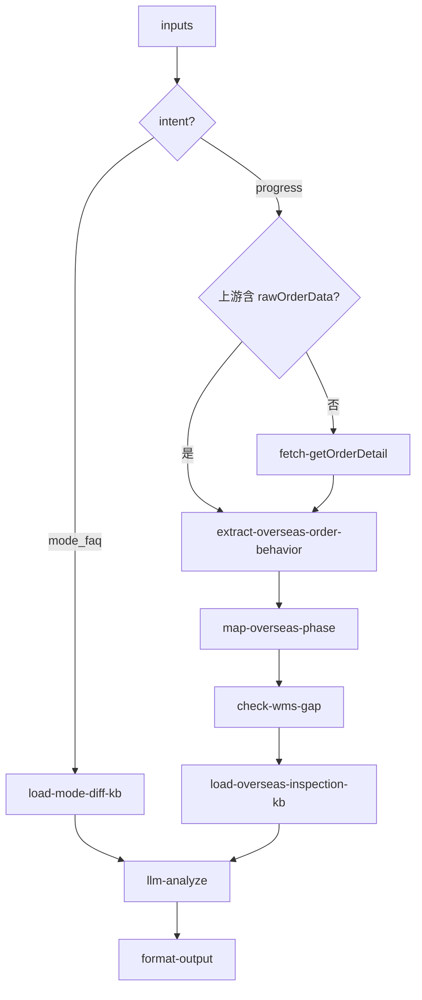

# inbound/inbound-overseas-inspection 专家设计

海外验状态解读：以**入库单状态与行为**为主路径，分析 OW01031/OW01032 链路下货物在 PEWC→EWC 阶段的进展、阻塞原因与预计节点。WMS 细粒度验货阶段为可选增强（当前 Gap）。

---

## 调用说明

### 适用场景

- 客户询问「海外验现在到哪一步了」、「为什么还在 PEWC 没变 EWC」、「有箱单和无箱单进度有什么区别」、「预报单的验货状态怎么看」。
- 适用链路：OW01031（海外验-有箱单）和 OW01032（海外验-预报/无箱单）。
- 适用时序：货物到仓（PEWC）至验货完成（EWC）阶段；验货由 Winit 全程执行，客户被动等待。
- **不适用**：自验数据/抽验（→ `inbound-self-inspection`）；上架进度（→ `inbound-putaway-status`）；纯到仓签收/POD（→ `inbound-arrival-status`）。

### 设计定位

本专家**不是**独立的 WMS 验货系统查询器，而是**入库单状态机在海外验链路上的解读器**：

1. 拉取 `getOrderDetail`，解析状态码、轨迹、验货相关字段
2. 结合 PSC（OW01031/OW01032）推断当前海外验阶段与下一步
3. WMS 开箱/点数等细粒度进度为 Gap，仅作补充说明

### 最小入参

- `inputs.inboundOrderNos` 至少一个 WI 单号（进度查询场景）。
- `inputs.intent=mode_faq` 时无需单号，走模式差异 FAQ。

### 参数提示

- `intent`：`progress`（默认，按单查进度）/ `mode_faq`（有箱单 vs 预报/无箱单差异说明）。
- WMS 细粒度阶段（开箱/点数/报告）当前为 **Gap**；`analysis` 基于 OMS 入库单状态与轨迹解读，并标注 WMS 细节不可用。

### 示例调用

**示例 1：海外验进度查询（主路径）**

```json
{
  "query": "解读该入库单海外验当前阶段与下一步",
  "customerIntent": "客户用 OW01031，问海外验进行到哪一步了",
  "inputContext": { "chainId": "case-20260608-160" },
  "inputs": {
    "intent": "progress",
    "inboundOrderNos": ["WI20260601015"]
  }
}
```

**示例 2：有箱单 vs 无箱单差异咨询（FAQ）**

```json
{
  "query": "解释有箱单与无箱单海外验的流程差异",
  "customerIntent": "客户问：我没有箱单，海外验的进度怎么看",
  "inputContext": {},
  "inputs": {
    "intent": "mode_faq",
    "modeTopic": "packing_list_vs_forecast"
  }
}
```

---

## 1. 输入设计

### 框架顶层

| 字段 | 类型 | 说明 |
|------|------|------|
| query | string | 任务说明 |
| customerIntent | string | 业务问题摘要 |
| inputContext | object | `chainId`、`previousOutput`（可选透传 `rawOrderData`）|

### inputs 业务字段

| 字段 | 类型 | 必填 | 说明 |
|------|------|------|------|
| intent | string | 否 | `progress`（默认）/ `mode_faq` |
| inboundOrderNos | string[] | progress 时必填 | WI 单号 |
| modeTopic | string | mode_faq 时必填 | `packing_list_vs_forecast` / `no_packing_list` |

---

## 2. 数据拉取与兜底

> **接口依据**：`已确认` · `无依据`（勿作运行时依赖）

| 数据源 | Action | 接口依据 | 关键字段（入库单行为/状态）|
|--------|--------|----------|---------------------------|
| OMS 主路径 | `winit.wh.inbound.getOrderDetail` | **已确认** | `status`, `winitProductCode`, `inspectionType`, `inspectionStatus`, `dicDate`, `awhDate`, `isAbnormal`, `bookingStatus`, 数量字段 |
| OMS 轨迹（辅助） | `wh.tracking.queryOrderTracking` | **已确认** | 验货相关 `trackingList` 节点 |
| WMS 验货阶段 | WMS 内部 API | **无依据** | 开箱/点数/报告等细粒度阶段 |

### 无依据接口 / 字段（勿作运行时依赖）

| 接口 / 字段 | 说明 |
|-------------|------|
| WMS 验货进度 API | 矩阵 `inbound-overseas-inspection.progress`，**无 WMS 接口规格** |
| `getOrderDetail.trajectoryList` | **不在详情响应中**；行为分析应使用 `queryOrderTracking` 合并后的 `trackingList` |
| `inspectionStatus=InProgress` | OMS 是否返回该枚举**待字段确认** |

### 入库单状态 → 海外验阶段映射（确定性）

| OMS 状态 + 字段组合 | `overseasInspectionPhase` | 含义 |
|---------------------|---------------------------|------|
| `status=TS` | `not_arrived` | 头程在途，海外验尚未开始 |
| `status=PEWC` + `inspectionStatus=Pending` | `awaiting_inspection` | 已到仓，待开始或排队验货 |
| `status=PEWC` + `inspectionStatus=InProgress`（若有）| `in_progress` | 验货进行中（OMS 粗粒度）|
| `status=EWC` 或 `dicDate` 非空 | `completed` | 海外验完成，入库确认 |
| `isAbnormal=true` | 附加 `blocked` 标记 | 存在异常单，可能阻塞验货进度 |

### 轨迹行为分析

`extract-overseas-order-behavior.ts` 从 **`trackingList`**（`queryOrderTracking` 合并结果，勿用 `getOrderDetail.trajectoryList`）提取：

- 最近一次 PEWC/EWC 节点及时间
- 是否存在验货相关中间节点（若有）
- 自到仓（`awhDate`）至当前的停留时长（工作日）

---

## 3. 工作流编排



### 节点顺序

1. `intent=mode_faq`：加载模式差异 KB → LLM → 输出
2. `intent=progress`：`getOrderDetail`（或复用上游缓存）→ **`extract-overseas-order-behavior`**（轨迹 + 状态 + 数量字段）→ **`map-overseas-phase`**（确定性阶段映射）→ 加载 KB（含 WMS Gap 说明）→ LLM 生成解读 → 格式化

---

## 4. 节点说明

| 节点文件 | 输入 params | 输出 |
|----------|-------------|------|
| `fetch-getOrderDetail.ts` | `inboundOrderNos` | `rawOrderData` |
| `extract-overseas-order-behavior.ts` | `rawOrderData` | `orderBehavior`（`status`, `trajectorySummary`, `daysSinceArrival`, `inspectionStatus`, `qtySnapshot`, `isAbnormal`）|
| `map-overseas-phase.ts` | `orderBehavior`, `winitProductCode` | `overseasInspectionPhase`, `inspectionMode`, `blockedReason?` |
| `check-wms-gap.ts` | — | `wmsAvailable: false`, `gapNote` |
| `load-overseas-inspection-kb.ts` | `overseasInspectionPhase`, `inspectionMode` | `phaseGuide`（各阶段典型等待原因、KB 时效参考）|
| `load-mode-diff-kb.ts` | `modeTopic` | `modeDiffGuide` |
| `llm-analyze`（LLM）| `orderBehavior`, `overseasInspectionPhase`, `phaseGuide`, `gapNote`, `customerIntent` | `analysisResult` |
| `format-output.ts` | `analysisResult`, `inputContext?` | `result`, `outputContext` |

---

## 5. 输出设计

### structured 字段

| 字段 | 类型 | 说明 |
|------|------|------|
| orderNo | string | 入库单号 |
| winitProductCode | string | PSC 编码（OW01031/OW01032）|
| inspectionMode | string | `with_packing_list`（OW01031）/ `forecast`（OW01032）|
| currentStatus | string | OMS 状态码 |
| overseasInspectionPhase | string | `not_arrived` / `awaiting_inspection` / `in_progress` / `completed` / `blocked` |
| dicDate | string | 验货完成时间（有则填）|
| awhDate | string | 到仓时间 |
| daysSinceArrival | number | 到仓后已过工作日数 |
| trajectorySummary | object[] | 验货相关轨迹节点摘要 |
| isAbnormal | boolean | 是否存在阻塞性异常 |
| wmsDataAvailable | boolean | WMS 细粒度数据是否可用（当前 false）|
| estimatedCompleteNote | string | 基于 KB + 当前阶段的预计说明（非承诺）|

### analysis 原则

- **以入库单状态与轨迹为主**：说明当前处于 PEWC/EWC 哪一阶段、到仓已多久、是否有异常阻塞
- 区分 OW01031（有箱单）与 OW01032（预报/无箱单）的流程差异与典型耗时
- WMS Gap 时明确标注「开箱/点数等细粒度进度暂无，以下为入库单系统可见状态」
- 不承诺验货完成时间

### enrichedContext

写入 `inbound/inbound-overseas-inspection`：`{ overseasInspectionPhase, inspectionMode, isAbnormal, daysSinceArrival }`，供 `inbound-putaway-status`、`inbound-exception-check` 复用。

---

## 6. Prompt 知识片段

| 文件 | 说明 |
|------|------|
| `prompts/overseas-order-status-map.md` | 入库单状态码 → 海外验阶段映射；PEWC 等待常见原因（排队/缺箱单/异常单）|
| `prompts/overseas-inspection-modes.md` | OW01031（有箱单）/ OW01032（预报）/ 无箱单差异 |
| `prompts/overseas-inspection-timeline.md` | 各阶段典型时效（到仓 → 验货完成 → EWC）|
| `prompts/no-packing-list-faq.md` | 无箱单/预报常见问题（参考 `无箱单有预报常见问答.md`）|
| `prompts/wms-gap-notice.md` | WMS Gap 标准说明文案 |

---

## 7. 对客约束

- 不承诺验货完成时间（Winit 全程执行，客户无法介入）
- WMS Gap 必须明确告知，不给无依据的开箱/点数阶段信息
- 升级人工条件：`daysSinceArrival` 超过 KB 参考时效 2 倍且 `overseasInspectionPhase` 仍为 `awaiting_inspection`/`in_progress`；`isAbnormal=true`

---

## 8. 待确认事项

- WMS 验货模块 API：**无依据**，见 §2
- `inspectionStatus=InProgress` 等 OMS 枚举待字段确认
- OMS `inspectionStatus` 是否在海外验链路稳定返回 `Pending`/`InProgress`/`Completed`，需研发确认
- OW01031 与 OW01032 在 `winitProductCode` 与 `inspectionType` 上的区分是否足够用于 `inspectionMode` 映射
