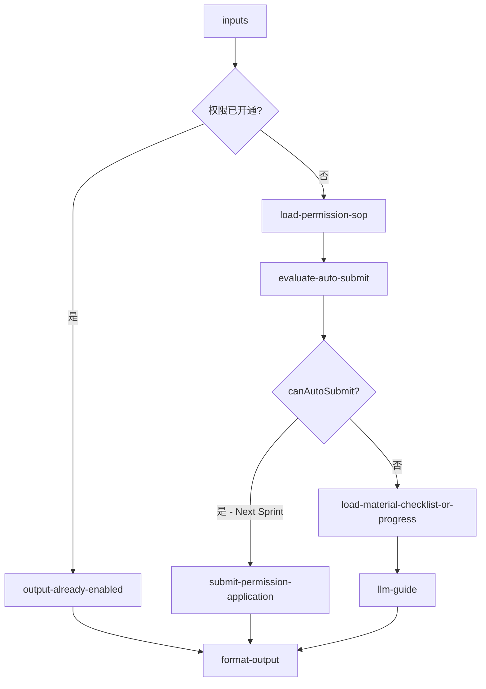

# inbound/inbound-permission-apply 专家设计

权限申请与代提：判断客户是否需申请自验/海外验/CBM 额度等权限；**若材料齐全且符合自动代提条件，则代客户提交申请**；否则输出材料清单与操作指引。

> **实现分期**：本专家保留在规划中。**当前 Sprint**：KB 指引 + 已开通判断（只读）。**下一 Sprint（Next）**：接入飞书 Bitable/审批 API 后实现自动代提。

---

## 调用说明

### 适用场景

- 客户询问「怎么申请自验权限」、「OW01031 海外验怎么开通」、「CBM 额度申请流程」、「帮我提交申请」、「审核到哪了」。
- **核心任务**：① 判断是否已开通 → ② 判断能否**自动代提** → ③ 能则提交，不能则给 SOP。
- **不适用**：当前开通了哪些 PSC（→ `inbound-psc-eligibility`）；还有多少 CBM/SKU 额度（→ `inbound-capacity-availability`）；入库规则说明（→ `inbound-process-guide`）。
- **衔接**：planner 应在本专家前调用 `inbound-psc-eligibility`，将 `enabledProducts` 写入 `inputContext.previousOutput`。

### 最小入参

- `inputs.permissionType` 说明申请意图。

### 参数提示

- `permissionType`：`self_inspection` / `overseas_inspection` / `cbm_quota` / `general`（**不含** `sku_registration`，属商品域，见 §8）。
- `autoSubmit`：默认 `true`；客户明确表示「只要指引不要代提」时设 `false`。
- `applicationPayload`：客户已提供的材料摘要（可选）；用于自动代提前的完整性校验。
- 若上游 PSC 快照显示权限已开通，直接输出「已开通，无需申请」。

### 示例调用

**示例 1：自动代提（Next Sprint）**

```json
{
  "query": "判断并代客户提交自验权限申请",
  "customerIntent": "客户想申请自验，材料已准备好",
  "inputContext": {
    "chainId": "case-20260608-120",
    "sourceExpertId": "inbound/inbound-psc-eligibility",
    "previousOutput": {
      "structured": {
        "enabledProducts": [],
        "hasSelfInspection": false
      }
    }
  },
  "inputs": {
    "permissionType": "self_inspection",
    "warehouseCode": "USLAX01",
    "autoSubmit": true,
    "applicationPayload": {
      "companyName": "示例公司",
      "contactEmail": "ops@example.com"
    }
  }
}
```

**示例 2：当前 Sprint — 仅指引**

```json
{
  "query": "告知申请自验权限的材料清单与操作步骤",
  "customerIntent": "客户想申请自验权限",
  "inputContext": {},
  "inputs": {
    "permissionType": "self_inspection",
    "warehouseCode": "USLAX01",
    "autoSubmit": false
  }
}
```

---

## 1. 输入设计

### 框架顶层

| 字段 | 类型 | 说明 |
|------|------|------|
| query | string | 任务说明 |
| customerIntent | string | 业务问题摘要 |
| inputContext | object | `chainId`；上游 PSC 快照（`previousOutput.structured`）|

### inputs 业务字段

| 字段 | 类型 | 必填 | 说明 |
|------|------|------|------|
| permissionType | string | 是 | `self_inspection` / `overseas_inspection` / `cbm_quota` / `general` |
| warehouseCode | string | 否 | 目标仓库 |
| autoSubmit | boolean | 否 | 是否尝试自动代提，默认 true（Next Sprint 生效）|
| applicationPayload | object | 否 | 客户已提供材料，用于代提前校验 |
| queryProgress | boolean | 否 | true 时聚焦审批进度查询 |

---

## 2. 数据拉取与兜底

> **接口依据**：`已确认` · `无依据`（勿作运行时依赖）

| 场景 | 系统 | 接口依据 | 说明 |
|------|------|----------|------|
| 当前权限快照 | `inputContext.previousOutput`（`inbound-psc-eligibility`） | **已确认** | 判断是否已开通 |
| 材料校验 + SOP | KB | — | 加载各 `permissionType` 材料清单与前提条件 |
| **自动代提** | 飞书多维表格 / 审批 API | **无依据** | 无 OpenAPI 规格；Next Sprint |
| 审批进度 | 飞书审批 API | **无依据** | 无 OpenAPI 规格；Next Sprint |

### 无依据接口（勿作运行时依赖）

| 接口 / 能力 | 说明 |
|-------------|------|
| 飞书多维表格写入 / 查询 | 流程在 Bitable，**无对外 API**；当前 Sprint 仅 SOP |
| 飞书审批实例查询 | action 名、字段映射均未确认 |

### 自动代提判定（Next Sprint，确定性）

`evaluate-auto-submit.ts` 输出 `canAutoSubmit`：

| 条件 | 结果 |
|------|------|
| `alreadyEnabled=true` | 不提交，输出已开通 |
| `autoSubmit=false` | 仅输出 SOP |
| 材料字段缺失（对照 `materialChecklist`）| `canAutoSubmit=false`，列出缺失项 |
| 材料齐全 + Bitable API 可用 | `canAutoSubmit=true` → 调用 `submit-permission-application` |
| Bitable API Gap | `canAutoSubmit=false`，`submitReason: "api_not_available"`，降级为 SOP 指引 |

> **与入库其他专家的差异**：权限申请是**允许 AI 代客写操作**的例外场景（经产品确认）；入库单/预约单/清关文件上传仍由客户自行操作。

---

## 3. 工作流编排



### 节点顺序

1. `check-enabled-from-context`：读 PSC 快照
2. `load-permission-sop`：按 `permissionType` 加载材料清单与前提
3. **`evaluate-auto-submit`**：校验 `applicationPayload` 完整性 → `canAutoSubmit`
4. **Next Sprint**：`submit-permission-application` 调用 Bitable/审批 API
5. 否则 / 当前 Sprint：`llm-guide` 输出材料清单与步骤
6. `format-output`

---

## 4. 节点说明

| 节点文件 | 输入 params | 输出 |
|----------|-------------|------|
| `check-enabled-from-context.ts` | `previousOutput`, `permissionType` | `alreadyEnabled`, `relevantPscCodes` |
| `load-permission-sop.ts` | `permissionType`, `warehouseCode` | `sopDoc`, `materialChecklist`, `pscTargetCodes` |
| `evaluate-auto-submit.ts` | `materialChecklist`, `applicationPayload?`, `autoSubmit` | `canAutoSubmit`, `missingFields[]`, `submitReason` |
| `submit-permission-application.ts` | `permissionType`, `applicationPayload`, `warehouseCode` | `applicationId?`, `submitStatus`（**delay to next sprint**）|
| `load-progress-guide.ts` | `applicationId?` | `progressGuide` |
| `llm-guide`（LLM） | `sopDoc`, `missingFields`, `canAutoSubmit`, `customerIntent` | `analysisResult` |
| `format-output.ts` | `analysisResult`, `inputContext?` | `result`, `outputContext` |

---

## 5. 输出设计

### structured 字段

| 字段 | 类型 | 说明 |
|------|------|------|
| permissionType | string | 申请类型 |
| alreadyEnabled | boolean | 是否已开通 |
| canAutoSubmit | boolean | 是否满足自动代提条件 |
| submitStatus | string | `submitted` / `not_submitted` / `already_enabled` / `api_not_available` |
| applicationId | string | 代提成功后返回（Next Sprint）|
| missingFields | string[] | 代提前缺失的材料字段 |
| targetPscCodes | string[] | 申请后将开通的 PSC 编码 |
| materialChecklist | string[] | 所需材料清单 |
| applySteps | string[] | 手动申请步骤（降级路径）|
| estimatedReviewTime | string | 审批预计时长（KB 参考）|

### analysis 原则

- 已开通：直接说明，不重复申请
- **代提成功**（Next Sprint）：说明「已为您提交 XX 权限申请，单号 XXX，预计 X 个工作日审核」
- **代提不可用/材料不全**：列出缺失项 + 手动申请步骤
- 不承诺审批通过

---

## 6. Prompt 知识片段

| 文件 | 说明 |
|------|------|
| `prompts/si-permission-apply.md` | 自验权限申请材料与前提（OW01021/OW01022）|
| `prompts/overseas-permission-apply.md` | 海外验权限申请材料（OW01031/OW01032）|
| `prompts/cbm-quota-apply.md` | CBM/SKU 额度扩容申请流程 |
| `prompts/auto-submit-checklist.md` | 各 permissionType 代提必填字段对照表 |
| `prompts/approval-progress-guide.md` | 审批进度查询方式 |

---

## 7. 对客约束

- 自动代提仅在客户授权且材料齐全时执行；敏感字段（营业执照等）需客户确认
- 不引用飞书内部直链
- 不承诺审批结果与时间
- 升级人工条件：特殊豁免申请；代提 API 失败；客户对代提内容有异议

---

## 8. 待确认事项

- **【delay to next sprint】** 飞书 Bitable/审批 API 接入规格（见 GAPS.md `permission.apply` / `permission.progress`）
- `cbm_quota` 是否与 PSC 权限走同一申请表单，需产品确认
- `sku_registration` 已移出本专家范围（属商品/SKU 域）；若客户咨询 SKU 注册，planner 路由至对应域专家或人工
