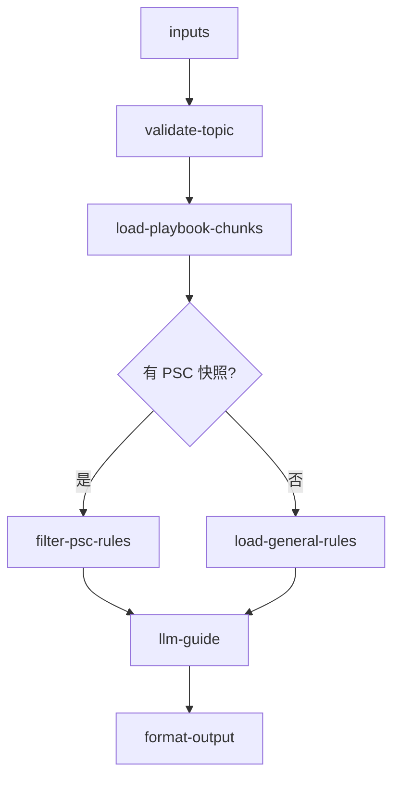

# inbound/inbound-process-guide 专家设计

入库流程与规则 FAQ：解答入库怎么操作、需要满足什么条件、有哪些规则限制与费用说明。KB/RAG 为主路径。

---

## 调用说明

### 适用场景

- 客户询问「入库流程怎么走」、「CBM 限制是多少」、「哪些货品不能入库」、「直发和标准头程有什么区别」、「入库费怎么算」。
- 也用于为 `inbound-order-manage`（下单前规则确认）、`inbound-permission-apply`（入库条件说明）提供规则背景。
- **不适用**：具体单据状态（→ `inbound-order-status`）；仓库地址（→ `inbound-warehouse-info`）；当前可用 PSC 列表（→ `inbound-psc-eligibility`）。

### 最小入参

- `inputs.topic` 描述咨询主题；可结合 `warehouseCode` / `pscCode` 精确匹配规则。

### 参数提示

- `topic`：建议使用业务关键词（如「自验流程」、「CBM 限制」、「禁限运品」、「头程入库费」）。优先使用 `intentType` 枚举分类辅助 KB 检索：`process`（流程步骤）/ `rule`（规则限制）/ `fee`（费用说明）/ `prohibition`（禁限运品）/ `psc_select`（产品选型）。
- `warehouseCode`：指定仓库时匹配该仓专属规则。
- 若上游 `inbound-psc-eligibility` 已提供 `enabledProducts`，可通过 `inputContext.previousOutput` 传入，本专家据此匹配差异化规则。

### 示例调用

**示例 1：流程咨询**

```json
{
  "query": "解释标准海外仓入库全流程",
  "customerIntent": "客户第一次使用 Winit，问入库怎么操作",
  "inputContext": { "chainId": "case-20260608-050" },
  "inputs": {
    "topic": "标准海外仓入库流程",
    "warehouseCode": "USLAX01"
  }
}
```

**示例 2：费用咨询（可选接 PSC 快照）**

```json
{
  "query": "说明该客户可用 PSC 的入库费用规则",
  "customerIntent": "客户问：用自验入库要收什么费",
  "inputContext": {
    "chainId": "case-20260608-051",
    "sourceExpertId": "inbound/inbound-psc-eligibility",
    "previousOutput": {
      "structured": {
        "enabledProducts": ["OW01021"]
      }
    }
  },
  "inputs": {
    "topic": "入库费用",
    "pscCode": "OW01021"
  }
}
```

---

## 1. 输入设计

### 框架顶层

| 字段 | 类型 | 说明 |
|------|------|------|
| query | string | 任务说明 |
| customerIntent | string | 客户咨询内容摘要 |
| inputContext | object | `chainId`；可选上游 PSC 快照 |

### inputs 业务字段

| 字段 | 类型 | 必填 | 说明 |
|------|------|------|------|
| topic | string | 是 | 咨询主题关键词 |
| warehouseCode | string | 否 | 仓库编码，用于匹配仓专属规则 |
| pscCode | string | 否 | PSC 编码，用于匹配产品差异化规则 |
| country | string | 否 | 目的国/地区 |

---

## 2. 数据拉取与兜底

> **接口依据**：本专家**无必须 API**，KB/RAG 为主；可选复用上游 PSC 快照（非本专家直调）。

| 来源 | 路径 | 内容 |
|------|------|------|
| 入库 Playbook | `docs/inbound/playbook.md` | 双轨模型、状态机、决策树 |
| 流程分册 | `docs/inbound/flows/01-07` | 各链路操作步骤 |
| PSC 维度 | `docs/inbound/appendix-psc-dimensions.md` | 产品选型对照 |
| 原始 KB | `_kb/product-team/winit/in-warehouse/` | 规则细则、费用说明 |
| **客服 KB（优先）** | `_kb/service-team/inbound-services-doc/新增海外仓入库单的常见问题.md` | 高频操作问题 FAQ，贴近客户实际场景 |
| 客服 KB | `_kb/service-team/inbound-services-doc/` 其他文件 | 各流程常见问题与客服处理脚本 |

**可选 API 增强**：若 `inputContext.previousOutput` 中无 PSC 快照，且 `pscCode` 为空，可由 planner 在本专家前调用 `inbound-psc-eligibility`，将 `enabledProducts` 传入 `previousOutput`，本专家据此过滤差异化规则；此为非阻塞可选路径。

---

## 3. 工作流编排



### 节点顺序

1. `validate-topic`：规范化 `topic`，识别意图类型（流程 / 规则 / 费用 / 禁运）
2. `load-playbook-chunks`：按 `topic` + `warehouseCode` + `country` 检索相关 KB 块
3. 有 PSC 快照时 `filter-psc-rules`：仅展示客户已开通 PSC 对应的规则
4. `llm-guide`：生成分步说明或规则摘要
5. `format-output`

---

## 4. 节点说明

| 节点文件 | 输入 params | 输出 |
|----------|-------------|------|
| `validate-topic.ts` | `topic`, `warehouseCode`, `pscCode` | `intentType`, `normalizedTopic` |
| `load-playbook-chunks.ts` | `normalizedTopic`, `warehouseCode`, `country` | `kbChunks`（Playbook + flows 段落） |
| `filter-psc-rules.ts` | `kbChunks`, `enabledProducts` | `filteredRules` |
| `load-general-rules.ts` | `kbChunks` | `generalRules` |
| `llm-guide`（LLM） | `rules`, `topic`, `customerIntent`, `pscCode?` | `analysisResult` |
| `format-output.ts` | `analysisResult`, `inputContext?` | `result`, `outputContext` |

---

## 5. 输出设计

### structured 字段

| 字段 | 类型 | 说明 |
|------|------|------|
| topicMatched | string | 匹配到的规则主题 |
| sopSteps | string[] | SOP 步骤列表（流程类）|
| matchedRules | object[] | 匹配的规则条目（规则类：`{ rule, condition, notes }`） |
| feeNotes | string | 费用说明摘要 |
| prohibitedItems | string[] | 禁限运品类别（禁运类）|
| pscContext | string | 当前 PSC 下差异化说明（有快照时） |
| prerequisites | string[] | 前置条件（流程/选型类） |
| expertRouting | string | 超出本专家范围时的路由提示 |

### analysis 原则

- 按 `topic` 类型组织回答，不堆砌无关规则
- 不引用飞书链接、TOM URL；外部入口描述为「通过万邑联平台操作」
- 费用说明标注为「参考口径，以实际账单为准」

---

## 6. Prompt 知识片段

| 文件 | 说明 |
|------|------|
| `prompts/kb-process.md` | 流程与选型：Playbook 双轨模型、产品 Taxonomy、决策树、各链路 SOP、状态机概览、SLA、混装转运、专家路由 |
| `prompts/kb-restrictions.md` | 规则与禁限运：下单报错、件型/包裹、申报价值、CBM、禁限运品、国别差异 |
| `prompts/kb-fees.md` | 费用冻结/扣费节点、逾期账单口径 |
| `prompts/main.md` | LLM 系统 Prompt：intentType 分派、状态机 vs 查单边界、structured 输出 |

> KB 内容与 `docs/inbound/playbook.md` 对齐；workflow YAML 内 text 节点须与上述 prompts 同步。

---

## 7. 对客约束

- 不输出单据状态（→ `inbound-order-status`）
- 费用相关回答标注「以实际账单为准」
- 禁运品咨询时仅提供类别说明，不做最终合规判断（→ 人工核实）
- 升级人工条件：客户问题涉及个案豁免、合规争议或 KB 无覆盖的特殊货型
- 不输出或解释 `orderMode`、`isAutoInspection` 等内部字段；涉及页面设置时仅引导客户按所选 PSC 与页面提示完成相关设置

---

## 8. 待确认事项

- 弱依赖 `customer/profile`（WF 群体标识、是否 Winit 头程）：当前设计可选，不阻塞主路径；若需区分 WF 群体差异化规则，由 planner 前置调用并传入 `previousOutput`
- KB 中费用规则可能因仓库/时间段不同而有差异，需确认 Playbook 费用说明的时效性维护机制
