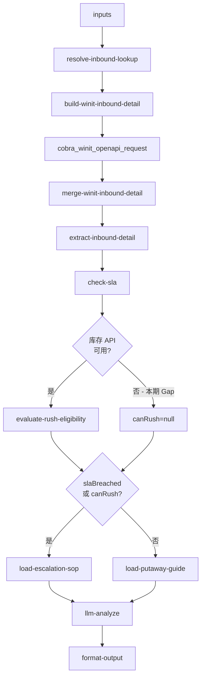

# inbound/inbound-putaway-expedite 专家设计

上架催促与加急判断：根据入库单类型与头程产品计算正确的上架 SLA，检测是否超时，判断能否加急，输出升级路径或催促建议。

---

## 调用说明

### 适用场景

- 客户主动催促「帮我催上架」、「已经超过 24 小时了还没上架」、「活动明天开始急用」。
- 需要判断 SLA 是否已违约，并给出可操作的升级路径。
- **不适用**：纯进度查询（→ `inbound-putaway-status`）；数量差异（→ `inbound-exception-check`）；仓库地址查询（→ `inbound-warehouse-info`）。

### 最小入参

- `inputs.inboundOrderNos` 至少一个 WI 单号。

### 参数提示

- `urgencyReason`：客户自述加急原因（如「促销活动」、「库存紧急」），用于 `analysis` 文案与工单说明；**不参与** `canRush` 判定（加急资格由库存确定性规则计算，见 §2）。
- `orderType`（标准/直发国内验/直发海外验）和 `headwayProduct`（头程产品类型）用于查 SLA 矩阵；未提供时从 `getOrderDetail` 响应中提取。
- `customerIntent` 中应包含「催」「急」等关键词时，本专家的路由优先级高于 `inbound-putaway-status`。

### 示例调用

**示例 1：超时催促**

```json
{
  "query": "检查是否已超上架 SLA，给出催促建议",
  "customerIntent": "入库单到仓超过 24 小时了还没上架",
  "inputContext": { "chainId": "case-20260608-030" },
  "inputs": {
    "inboundOrderNos": ["WI20260601004"],
    "urgencyReason": ""
  }
}
```

**示例 2：活动加急**

```json
{
  "query": "评估能否加急上架并给出操作路径",
  "customerIntent": "双十一明天开始，货必须今天上架",
  "inputContext": { "chainId": "case-20260608-031" },
  "inputs": {
    "inboundOrderNos": ["WI20260601005"],
    "urgencyReason": "促销活动次日开始，需紧急上架"
  }
}
```

---

## 1. 输入设计

### 框架顶层

| 字段 | 类型 | 说明 |
|------|------|------|
| query | string | 任务说明 |
| customerIntent | string | 客户催促描述 |
| inputContext | object | `chainId`、`previousOutput` |

### inputs 业务字段

| 字段 | 类型 | 必填 | 说明 |
|------|------|------|------|
| inboundOrderNos | string[] | 是 | WI 单号（支持批量） |
| urgencyReason | string | 否 | 加急理由，用于判断是否符合加急条件 |

---

## 2. 数据拉取与兜底

> **接口依据**：`已确认` · `无依据`（勿作运行时依赖）

### 主路径

| Action | 接口依据 | 说明 |
|--------|----------|------|
| `winit.wh.inbound.getOrderDetail` | **已确认** | SLA / 是否已上架：`detailLevel=header`，`isIncludePackage=N` |
| `winit.wh.inbound.getOrderDetail` | **已确认** | 加急 SKU 列表：`detailLevel=sku_summary`，`isIncludePackage=Y` → extract 删 `packageList` |
| `wh.inbound.getOrderList` | **已确认** | 批量筛查「EWC 且未上架」 |

### 加急资格判定（`canRush`）— 确定性规则

| 步骤 | 数据源 | 接口依据 | 说明 |
|------|--------|----------|------|
| 1. 提取 SKU 列表 | `getOrderDetail.merchandiseList`（须 Y + extract） | **已确认** | 取 `merchandiseCode` + `quantity` |
| 2. 查在库可用库存 | `queryProductInventoryList4Page`（id/58） | **无依据** | 矩阵/模板引用，**未在本 Sprint 接入** |
| 3. 判定缺货/濒临缺货 | `evaluate-rush-eligibility.ts` | — | 依赖步骤 2 |

### 无依据接口（勿作运行时依赖）

| 接口 / 能力 | 说明 |
|-------------|------|
| `queryProductInventoryList4Page` | 仅 id/58 模板引用，无 Coze action / 字段实测记录 |
| `warehouse/capacity-signal` | WMS 仓级拥堵，**无 OpenAPI 规格**；不作为 `canRush` 依据 |

**缺货/濒临缺货判定**（阈值待产品确认，初版建议）：

| 条件 | 判定 |
|------|------|
| `qtyAvailable <= 0` | 缺货 → 该 SKU 符合加急 |
| `qtyAvailable > 0` 且 `qtyAvailable < safetyThreshold` | 濒临缺货 → 符合加急（`safetyThreshold` 默认 10 件或按 SKU 安全库存配置）|
| 入库单内**任一** SKU 符合上述条件 | `canRush=true` |
| 全部 SKU 库存充足 | `canRush=false` |

**前置条件**（同时满足才输出 `canRush=true`）：

- `alreadyPutaway=false`（尚未完成上架）
- `status` 为 `EWC` 或已到仓且 SLA 计时中（`PEWC` 且验货已完成不计入加急）
- 至少一个 SKU 缺货或濒临缺货

> **实现分期**：库存查询依赖 `queryProductInventoryList4Page` + 入库单 SKU 明细字段。**当前 Sprint 若无法接入，标注 `delay to next sprint`**，本 Sprint 仅输出 SLA 超时判断与催促 SOP，`canRush` 固定为 `null`，`canRushReason: "inventory_check_not_available"`。

### 到仓时间取值规则

| 送仓方式 | 到仓时间取值 |
|---------|------------|
| 快递 | 快递单号妥投时间；无单号取实际卸货时间 |
| 散货 | 预约单的实际到仓时间 |
| 整柜 Live | 预约单的实际到仓时间 |
| 整柜 Drop | 预约单的预约卸货时间 |

### 上架 SLA 矩阵（工作日）

> 数据来源：`咨询入库单上架时间及催上架处理流程.md`，SLA 时效仅作内部判断依据，不直接告知客户。

**美国仓**

| 入库单类型 | 头程产品 | SLA（工作日）|
|---------|---------|------------|
| 标准海外仓 | 空运 / FedEx 快递 | 1 |
| 标准海外仓 | 美森 / 以星散货 | 2 |
| 标准海外仓 | 其他散货 / 整柜 | 3 |
| 标准海外仓 | UPS / 无快递单号 | 4 |
| 直发国内验 | 空卡（POD 备注空卡+11位航运单号）| 1 |
| 直发国内验 | DHL 快递 | 1 |
| 直发国内验 | 非 DHL 快递 / 无单号 / 海运整柜 / 海卡 / 空派 / 海派 | 4 |
| 直发海外验 | 空卡 | 2 |
| 直发海外验 | DHL 快递 | 2 |
| 直发海外验 | 非 DHL 快递 / 无单号 / 海运整柜 / 海卡 / 空派 / 海派 | 5 |

**非美国仓（英国、德国、澳大利亚、加拿大）**

| 入库单类型 | 头程产品 | SLA（工作日）|
|---------|---------|------------|
| 标准海外仓 | 空运 / 快递 | 1 |
| 标准海外仓 | 海运 / 铁路 | 3 |
| 直发国内验 | 空卡 | 1 |
| 直发国内验 | 快递 | 2 |
| 直发国内验 | 海运整柜 / 海卡 | 3 |
| 直发国内验 | 空派 / 海派 | 4 |
| 直发海外验 | 空卡 | 2 |
| 直发海外验 | 快递 | 3 |
| 直发海外验 | 海运整柜 / 海卡 | 4 |
| 直发海外验 | 空派 / 海派 | 5 |

### SLA 判断逻辑

| 条件 | 含义 |
|------|------|
| `dicDate`（到仓时间）距今超过对应 SLA 工作日数 | SLA 违约，可升级 |
| `status=PEWC` | 仍在验收阶段，上架 SLA 计时尚未开始 |
| `shelveCompletedDate` 非空 | 已上架完成，无需催促 |

> `check-sla.ts` 节点需要 `orderType`（标准/直发国内验/直发海外验）和 `headwayProduct`（头程产品）作为 SLA 查表的 key；这两个字段均来自 `getOrderDetail` 响应。

---

## 3. 工作流编排



### 节点顺序

1. `resolve-inbound-lookup`：规范化单号
2. `build-winit-inbound-detail`（**SLA 路径 `detailLevel=header` / N**；加急 SKU 路径 **`sku_summary` / Y**）→ 插件 → `merge`
3. **`extract-inbound-detail`**（加急路径：删 `packageList`，保留根级 `merchandiseList`）
4. `check-sla`：按「目的国 × 入库单类型 × 头程产品」查 SLA 矩阵
5. **`evaluate-rush-eligibility`**：从 **`merchandiseList`** 取 SKU → 查库存
5. 按 SLA / 加急资格分支加载 SOP
6. `llm-analyze`：生成催促建议（**不**推断 `canRush`）
7. `format-output`

---

## 4. 节点说明

| 节点文件 | 输入 params | 输出 |
|----------|-------------|------|
| `resolve-inbound-lookup.ts` | `inboundOrderNos` | `wiOrderNos[]` |
| `build-winit-inbound-detail.ts` | `wiOrderNos`, **`detailLevel`** | `actions`（SLA→N；canRush→Y） |
| `extract-inbound-detail.ts` | `rawOrderData`, `detailLevel=sku_summary` | 删 `packageList`，保留 `merchandiseList` |
| `merge-winit-inbound-detail.ts` | plugin 输出 | `rawOrderData` |
| `check-sla.ts` | `rawOrderData`（表头：`orderType`, `headwayProduct`, `dicDate`, `status`）| `slaBreached`, `slaWorkingDays`, `workingDaysElapsed`, `alreadyPutaway` |
| `evaluate-rush-eligibility.ts` | `rawOrderData`（`destWhCode`, **`merchandiseList`**）| `canRush`, `stockCheckSummary`, `canRushReason` |
| `fetch-sku-inventory.ts` | `destWhCode`, `skuList[]` | 复用模板 `queryProductInventoryList4Page` 链路（id/58）|
| `load-escalation-sop.ts` | `canRush`, `slaBreached` | `escalationGuide`（含工单提交路径；加急需附 SKU 缺货证据）|
| `load-putaway-guide.ts` | — | `putawayProgressGuide` |
| `llm-analyze`（LLM） | `slaFacts`, `escalationGuide`, `customerIntent`, `urgencyReason` | `analysisResult` |
| `format-output.ts` | `analysisResult`, `inputContext?` | `result`, `outputContext` |

---

## 5. 输出设计

### structured 字段

| 字段 | 类型 | 说明 |
|------|------|------|
| orderNo | string | 入库单号 |
| currentStatus | string | 当前状态码 |
| slaBreached | boolean | 是否已超出标准 SLA |
| slaWorkingDays | number | 标准 SLA 工作日数（依据入库单类型 + 头程产品）|
| workingDaysElapsed | number | 到仓后已过工作日数 |
| dicTime | string | 到仓时间（取值规则见 SLA 矩阵说明）|
| alreadyPutaway | boolean | 是否已完成上架 |
| escalationPath | string | 建议升级路径（工单/通知仓库/联系客服） |
| canRush | boolean \| null | 是否符合加急条件（**代码确定性计算**；库存 API 未接入时为 `null`）|
| canRushReason | string | `low_stock` / `out_of_stock` / `stock_sufficient` / `inventory_check_not_available` |
| stockCheckSummary | object[] | 各 SKU 可用库存摘要（`{ sku, qtyAvailable, isLowStock }`）|

### analysis 原则

- 明确说明当前标准 SLA 天数（依据入库单类型和头程产品），以及已过工作日数，不说"24小时"（SLA 最少 1 个工作日、最多 5 个工作日）
- **`canRush=true`**：说明「目的仓该 SKU 当前可用库存 X 件，已缺货/濒临缺货，可申请加急上架」，并给出工单路径
- **`canRush=false`**：说明「目的仓库存仍充足，暂不符合加急条件」，建议等待正常 SLA 或联系客服说明特殊情形
- **`canRush=null`**（本期 Gap）：说明「暂无法自动核实库存是否缺货，如需加急请通过工单说明 SKU 与活动节点」
- 已完成上架时：直接说明已上架，不做无效催促

### enrichedContext

不主动写入；由 planner 根据 `slaBreached` 决定是否继续升级。

---

## 6. Prompt 知识片段

| 文件 | 说明 |
|------|------|
| `prompts/putaway-sla.md` | SLA 矩阵：按「目的国 × 入库单类型 × 头程产品」的完整工作日标准；到仓时间取值规则（快递/散货/整柜 Live/Drop）；工作日不含节假日说明；来源：`咨询入库单上架时间及催上架处理流程.md` |
| `prompts/putaway-time-def.md` | 「目标海外仓上架时间」vs「预计海外仓上架时间」的定义与区别（前者固定按物流计划+全程SLA，后者随异常浮动） |
| `prompts/escalation-sop.md` | 催架工单提交步骤（万邑联平台路径）、升级条件（超 SLA 且加急原因明确时需说明 SKU 和包裹号）|
| `prompts/rush-conditions.md` | 加急上架条件：**目的仓 SKU 缺货或濒临缺货**（由库存 API 判定）；已到仓 + 提供 SKU 明细 + 包裹号；库存充足时不加急 |

---

## 7. 对客约束

- 不判责数量差异（→ `inbound-exception-check`）
- 不承诺具体上架完成时间
- 不引用 TOM 内部 URL；工单提交入口描述为「通过万邑联平台客服入口提交」
- 升级人工条件：`slaBreached=true` 且 `canRush=true` 时，建议通过工单通道升级；`canRush=false` 时不主动承诺加急

---

## 8. 待确认事项

- `dicDate`（验收完成时间）是否等同于上架 SLA 的计时起点，或需使用 `awhDate`（到仓时间），需产品确认
- **【delay to next sprint】** `evaluate-rush-eligibility` + `queryProductInventoryList4Page`：SKU 列表来自 **`getOrderDetail.merchandiseList`**（须 `isIncludePackage=Y`）；`safetyThreshold` 需产品定标
- **`isIncludePackage=Y` 大柜**：加急路径仍须拉 Y 取 SKU，但 extract 立即删 `packageList`（无分页 API）
- `warehouse/capacity-signal` 仓库拥堵信号：WMS Gap，不作为 `canRush` 判定依据（加急只看 SKU 库存，不看仓容）
