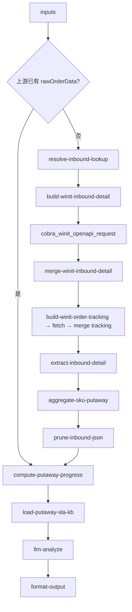

# inbound/inbound-putaway-status 专家设计

上架进度与数量核实：汇报入库单的上架完成情况、预计完成时间，以及实际上架数量与预报数量的对比摘要。

---

## 调用说明

### 适用场景

- 客户询问「上架了没」、「什么时候能完成」、「为什么只上了一部分」、「上架数量和我报的不一样」。
- 包含原 `inbound-putaway-status.qty-discrepancy` 场景（上架数量核实）。
- **不适用**：催促上架（→ `inbound-putaway-expedite`）；数量差异判责（→ `inbound-exception-check`）。

### 最小入参

- `inputs.inboundOrderNos` 至少一个入库单号。

### 参数提示

- 若上游 `inbound-order-status` 等专家已透传 `rawOrderData`，可跳过重复 API；**无缓存时本专家自行拉取**，不强制依赖 planner 调用顺序。
- `checkQtyDiscrepancy`：默认 `true`，触发 `compute-putaway-progress` 节点的数量对比分支。

### 示例调用

**示例 1：进度查询**

```json
{
  "query": "说明该入库单上架进度与预计完成时间",
  "customerIntent": "客户问：货上架了吗？还要多久？",
  "inputContext": { "chainId": "case-20260608-020" },
  "inputs": {
    "inboundOrderNos": ["WI20260601003"]
  }
}
```

**示例 2：数量核实（链式，上游 inbound-arrival-status 已到仓确认）**

```json
{
  "query": "核实上架数量与预报是否一致",
  "customerIntent": "上架数量比预报少了 10 件",
  "inputContext": {
    "chainId": "case-20260608-021",
    "sourceExpertId": "inbound/inbound-arrival-status",
    "previousOutput": { "structured": { "orderNo": "WI20260601003", "arrivalPhase": "confirmed" } }
  },
  "inputs": {
    "inboundOrderNos": ["WI20260601003"],
    "checkQtyDiscrepancy": true
  }
}
```

---

## 1. 输入设计

### 框架顶层

| 字段 | 类型 | 说明 |
|------|------|------|
| query | string | 任务说明 |
| customerIntent | string | 业务问题摘要 |
| inputContext | object | `chainId`、`previousOutput` |

### inputs 业务字段

| 字段 | 类型 | 必填 | 说明 |
|------|------|------|------|
| inboundOrderNos | string[] | 是 | WI 单号或客户参考号 |
| checkQtyDiscrepancy | boolean | 否 | 是否执行数量对比，默认 true |
| detailLevel | string | 否 | 见 [`inbound-getOrderDetail-detail-strategy.md`](../../../docs/plan/inbound-getOrderDetail-detail-strategy.md)；默认 `sku_summary` |
| targetMerchandiseCodes | string[] | 否 | `detailLevel=sku_filtered` 时只保留指定卖家 SKU |
| targetPackageNos | string[] | 否 | `package_detail` 时按包裹条码过滤 |
| targetItemSernos | string[] | 否 | `item_lookup` 时按单品码过滤 |
| maxPackagesPerOrder | integer | 否 | 包裹剪枝上限，默认 50 |
| maxMerchandisePerPackage | integer | 否 | 每包裹商品行上限，默认 20 |

---

## 2. 数据拉取与兜底

> **接口依据**：`已确认` · `无依据`（勿作运行时依赖）

> **id/39 约束（已确认）**：`isIncludePackage=N` **不返回** `merchandiseList`；SKU 级上架进度**必须** `isIncludePackage=Y`。无包裹分页 API，拉 `Y` 时会一次返回全量 `packageList`，须在 **`extract-inbound-detail`** 中立即丢弃包裹树（`sku_summary` 路径），**禁止**把原始 `packageList` 送 LLM。详见 [`docs/plan/inbound-getOrderDetail-detail-strategy.md`](../../../docs/plan/inbound-getOrderDetail-detail-strategy.md)。

| Action | 接口依据 | 请求 | 关键字段 |
|--------|----------|------|---------|
| `winit.wh.inbound.getOrderDetail` | **已确认** | 默认 `isIncludePackage=Y`（`detailLevel=sku_summary`） | 表头：`status`, `shelveCompletedDate`, `totalMerchandiseQty`, `totalPackageQty` |
| 同上 | **已确认** | extract 后保留根级 | **`merchandiseList[]`**：`merchandiseCode`, `quantity`, `inspectionQty`, **`actualQuantity`** |
| `wh.tracking.queryOrderTracking` | **已确认** | `orderNo` | `trackingCode=OWS` 等上架里程碑（辅助） |

### 无依据接口 / 字段（勿作运行时依赖）

| 接口 / 字段 | 说明 |
|-------------|------|
| `getOrderDetail.trajectoryList` | **不在详情响应中**；辅助轨迹须 `queryOrderTracking` |

### detailLevel 默认与数据源

| detailLevel | isIncludePackage | LLM 可见数据 |
|-------------|------------------|--------------|
| `header`（仅整单阶段，少用） | N | 表头 + 轨迹；**无 SKU 明细** |
| **`sku_summary`（默认）** | Y → extract **删 `packageList`** | `aggregate-sku-putaway` 聚合结果 + 异常 SKU 行 |
| `sku_filtered` | Y → extract 删 packageList | 仅 `targetMerchandiseCodes` 命中 SKU |
| `package_summary` / `package_detail` | Y | `aggregate-package-putaway` 或剪枝后 `packageList`（客户问箱/包裹时） |
| `item_lookup` | Y | 过滤后 `itemList`（`itemSerno` + `status`） |

上架进度推断逻辑（整单）：
- `shelveCompletedDate` 非空 → 上架完成
- `status == EWC` 且 `shelveCompletedDate` 为空 → 上架进行中
- `status == PEWC` → 尚未开始上架（验收中）
- **SKU 级**：根级 `merchandiseList`：`actualQuantity` vs `quantity`（箱套 × `standardPartsNum` 在聚合节点统一换算）
- SLA：见 `inbound-putaway-expedite` 矩阵及 `putaway-sla.md`

---

## 3. JSON 剪枝与 extract

| 阶段 | 策略 |
|------|------|
| **`extract-inbound-detail`** | `sku_summary`：**删除 `packageList`**，保留根级 `merchandiseList`；写 `_detailExtractMeta` |
| **`aggregate-sku-putaway`** | 根级 `merchandiseList` → `skuPutawaySummary`（LLM 主输入，非原始 JSON） |
| `trackingList` | 保留最近 20 条（queryOrderTracking） |
| `packageList` | 仅 `package_*` / `item_lookup` 保留；经 `maxPackagesPerOrder` / `maxMerchandisePerPackage` 剪枝（对齐出库 `prune-outbound-json`） |
| 大单 | `totalPackageQty > 200` 且需 `package_detail` → `requiresNarrowing=true`，要求客户提供箱号/包裹条码 |

---

## 4. 工作流编排



### 节点顺序

1. 检查 `inputContext.previousOutput` 缓存
2. 如无缓存：`resolve` → `build`（带 `isIncludePackage`）→ `plugin` → `merge` → 轨迹三联 → **`extract-inbound-detail`** → **`aggregate-sku-putaway`**
3. `load-putaway-sla-kb`：加载 SLA 矩阵
4. `compute-putaway-progress`：整单阶段 + **`skuPutawaySummary`** 数量对比
5. `llm-analyze`：输入 **`skuPutawaySummary`** + `putawayProgress`，**不**输入原始 `packageList`
6. `format-output`

---

## 5. 节点说明

| 节点文件 | 输入 params | 输出 |
|----------|-------------|------|
| `resolve-inbound-lookup.ts` | `inboundOrderNos` | `wiOrderNos[]` |
| `build-winit-inbound-detail.ts` | `wiOrderNos`, **`detailLevel`** | `actions`（含 `isIncludePackage`） |
| `extract-inbound-detail.ts` | `rawOrderData`, `detailLevel`, 过滤/剪枝参数 | `rawOrderData`（已剥离）, `_detailExtractMeta` |
| `aggregate-sku-putaway.ts` | 根级 `merchandiseList`, `targetMerchandiseCodes?` | `skuPutawaySummary` |
| `aggregate-package-putaway.ts` | 剪枝后 `packageList`（可选） | `packagePutawaySummary` |
| `prune-inbound-json.ts` | `rawOrderData`, 轨迹参数 | `prunedOrderData` |
| `compute-putaway-progress.ts` | `prunedOrderData`, **`skuPutawaySummary`**, `checkQtyDiscrepancy` | `putawayStage`, `qtyComparison`, … |
| `load-putaway-sla-kb.ts` | — | `slaTier`, `slaGuide` |
| `llm-analyze`（LLM） | `putawayProgress`, `qtyComparison`, `slaGuide`, `customerIntent` | `analysisResult` |
| `format-output.ts` | `analysisResult`, `inputContext?` | `result`, `outputContext` |

---

## 6. 输出设计

### structured 字段

| 字段 | 类型 | 说明 |
|------|------|------|
| orderNo | string | 入库单号 |
| putawayStage | string | `pending` / `in_progress` / `completed` |
| shelveCompletedDate | string | 上架完成时间（已完成时） |
| estimatedComplete | string | 预计完成时间（推断，仅供参考） |
| qtyComparison | object | 整单 + **SKU 汇总** `{ expected, putaway, discrepancy, anomalySkuCount? }` |
| skuPutawaySummary | object | 来自 `aggregate-sku-putaway`（可写入 `structured`） |
| requiresNarrowing | boolean | 包裹过多且未提供箱号/条码时为 true |
| workingDaysElapsed | number | 验收/到仓后已过工作日数（与 `inbound-putaway-expedite` 共享 SLA 矩阵）|
| slaBreached | boolean | 是否已超标准上架 SLA（仅判断，不催促）|

### analysis 原则

- 客观描述上架阶段，说明数量对比结果
- 数量有差异时说明「实际上架 N 件，预报 M 件，差异 X 件」，**不**判断责任（→ `inbound-exception-check`）
- `slaBreached=true` 时注明「已超过标准上架时效（具体天数见 SLA 矩阵）」，但不主动催促（→ `inbound-putaway-expedite`）

### enrichedContext

写入 `inbound/inbound-putaway-status`：`{ putawayStage, qtyComparison, slaBreached }`。

---

## 7. Prompt 知识片段

| 文件 | 说明 |
|------|------|
| `prompts/putaway-sla.md` | SLA 矩阵（与 `inbound-putaway-expedite` 共享）：按目的国 × 入库单类型 × 头程产品确定工作日数（1～5 日）；到仓时间取值规则（快递/散货/整柜 Live/Drop）|
| `prompts/qty-comparison-guide.md` | 数量字段含义对照（预报/签收/验收/上架）及差异说明 |

---

## 8. 对客约束

- 不发起催促动作（→ `inbound-putaway-expedite`）
- 不判定数量差异责任（→ `inbound-exception-check`）
- 升级人工条件：`qtyComparison.discrepancy` 超过 5% 或绝对值 ≥ 10 件时，建议「联系客服提交差异核实申请」

---

## 9. 待确认事项

- `dioDate` 与 `shelveCompletedDate` 先后关系
- 箱套产品 `standardPartsNum` 与 `actualQuantity` 换算规则（聚合节点默认按 id/39 注释处理）
- **`isIncludePackage=Y` 大柜全量响应** 的 Coze 插件超时上限（无分页 API 下的工程风险）
