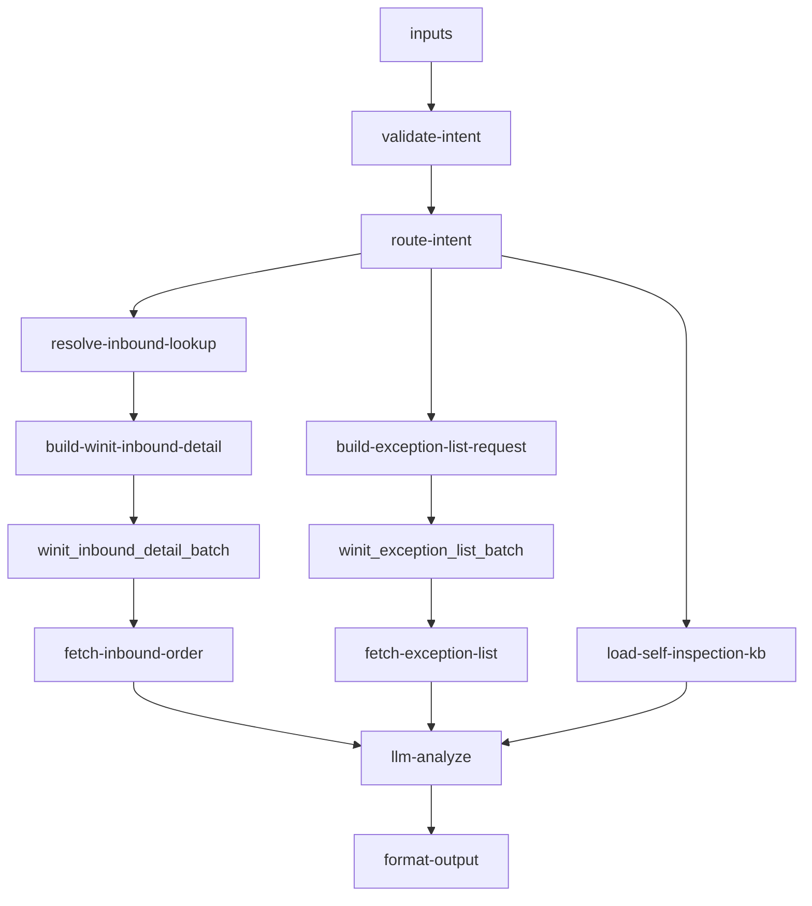

# inbound/inbound-self-inspection 专家设计

自验操作与进度：涵盖发货前自验提交/修改/重验操作指引，以及到仓后抽验结果/费用/免验条件查询。适用 OW01021（SI 经典自验）与 OW01022（QSI 快速自验）链路。

> 业务参考：[`docs/experts/inbound/inbound-self-inspection.md`](../../../docs/experts/inbound/inbound-self-inspection.md)  
> 全链路 SOP：[`docs/inbound/flows/02-direct-self-inspection.md`](../../../docs/inbound/flows/02-direct-self-inspection.md)

---

## 设计定位

本专家是**自验产品闭环的操作指引与状态解读器**，分两条路径：

1. **`routePath=kb_only`**（`intent=submit_guide`）：纯 KB 输出 PDA/API/Excel 提交步骤，**不拉 OMS**
2. **`routePath=oms_chain`**（`intent=status` / `progress`）：拉取 `getOrderDetail`（+ 可选异常单），结合 KB 生成状态解读或抽验摘要

**不是**验货系统独立查询器：PDA 扫描细粒度记录、验货系统读 API 当前为 Gap，以 OMS 字段 + KB 兜底。

### 与海外验的边界

| 维度 | 自验（本专家） | 海外验（`inbound-overseas-inspection`） |
|------|---------------|----------------------------------------|
| PSC | OW01021 / OW01022 | OW01031 / OW01032 |
| 验货执行方 | 客户发货前自行验货 | Winit 海外仓到仓后验货 |
| 到仓后 | 随机**抽验**（核对自验数据） | Winit **全程验货** |
| 客户操作 | 主动提交/修改验货数据 | 被动等待验货结果 |

---

## 调用说明

### 适用场景

| 时序 | 典型问法 | 推荐 intent / subTopic |
|------|----------|------------------------|
| **发货前**（`OD`→`TS`） | 自验怎么提交、PDA 怎么扫、API/Excel 哪种合适 | `submit_guide` / `submit_guide` |
| **发货前** | 验货填错了怎么改、能重验吗 | `status` / `modify_guide` |
| **发货前** | 我能用免验吗 | `status` / `exemption_check` |
| **发货前** | 自验提交了没、验货状态 | `status` |
| **到仓后**（`PEWC`→`EWC`） | 抽验结果、收了多少费、有没有差异 | `progress` / `sampling_result` |

- **不适用**：验货规则/PSC 选型（→ `inbound-process-guide`）；自验权限开通（→ `inbound-psc-eligibility` / `inbound-permission-apply`）；上架后数量差异判责（→ `inbound-exception-check`）；海外验进度（→ `inbound-overseas-inspection`）；验货完成后上架进度（→ `inbound-putaway-status`）。

### 最小入参

| intent | 必填 |
|--------|------|
| `submit_guide` | 无（纯 KB）；可选 `phase` / `subTopic` 聚焦 |
| `status` | `inboundOrderNos` 或 `inboundOrderNo` |
| `progress` | `inboundOrderNos` 或 `inboundOrderNo` |

### 参数提示

- **`intent`**：`submit_guide`（提交指引）/ `status`（验货状态与发货前操作）/ `progress`（抽验进度与结果）。缺省或无法识别时按关键词推断（见 §3 路由）。
- **`subTopic`**：`submit_guide` / `modify_guide` / `sampling_result` / `exemption_check`；缺省时由 `intent` 推导。
- **`phase`**：`pre_ship` / `post_arrival`；缺省时由 `route-intent` 或订单 `status` 推断。

### 示例调用

**示例 1：发货前自验提交指引（纯 KB，无需单号）**

```json
{
  "query": "提供自验数据提交方式与操作步骤",
  "customerIntent": "客户不知道怎么提交验货数据",
  "inputContext": { "chainId": "case-20260608-090" },
  "inputs": {
    "intent": "submit_guide",
    "subTopic": "submit_guide"
  }
}
```

**示例 2：验货状态 + 修改指引（OMS 链）**

```json
{
  "query": "该单验货是否完成，填错了如何修改",
  "customerIntent": "客户验货数据填错想重验",
  "inputContext": { "chainId": "case-20260608-092" },
  "inputs": {
    "intent": "status",
    "inboundOrderNos": ["WI20260601009"],
    "subTopic": "modify_guide"
  }
}
```

**示例 3：到仓后抽验结果查询**

```json
{
  "query": "查询该单抽验结果与费用明细",
  "customerIntent": "客户被抽验收了费，想了解详情",
  "inputContext": { "chainId": "case-20260608-091" },
  "inputs": {
    "intent": "progress",
    "inboundOrderNos": ["WI20260601010"],
    "subTopic": "sampling_result"
  }
}
```

---

## 0. 业务背景：自验全链路（KB 摘要）

```
[信息流]
 开通权限 → 注册 SKU → 创建入库单（OW01021/22）
  → 旧自验：上传箱单 → PDA/API/Excel 验货
  → 新自验：SKU+数量 → PDA 扫描 → 系统生成箱单
  → 确认发货（OD→TS）→ 轨迹 DR→OD→TS→PEWC→EWC→SHD

[实物流]
 客户发货 → 海外仓卸货（PEWC）→ 随机抽验 → 上架（SHD）
```

| 模式 | PSC | 要点 |
|------|-----|------|
| 经典自验 SI | OW01021* | 须先上传箱单，验货与箱单一一匹配 |
| 快速自验 QSI | OW01022* | 下单仅 SKU+数量；支持重验；无需预先完整箱单 |
| 提交方式 | 通用 | PDA App / API 对接 / Excel 模板 |
| 免验 | 部分 OW01021 | 白名单客户；`isAutoInspection=Y` 等条件 |

> 自验链路**无 `RE` 状态**；`TS` 由客户确认发货触发。详见 Flow 02。

---

## 1. 输入设计

### 框架顶层

| 字段 | 类型 | 说明 |
|------|------|------|
| query | string | 任务说明 |
| customerIntent | string | 业务问题摘要 |
| inputContext | object | `chainId`、`previousOutput` |

### inputs 业务字段

| 字段 | 类型 | 必填 | 说明 |
|------|------|------|------|
| intent | string | 否 | `submit_guide` / `status` / `progress`；缺省自动推断 |
| subTopic | string | 否 | `submit_guide` / `modify_guide` / `sampling_result` / `exemption_check` |
| inboundOrderNos | string[] | status/progress 时必填 | WI 单号或客户参考号 |
| inboundOrderNo | string | 同上（二选一） | 单个入库单号 |
| phase | string | 否 | `pre_ship` / `post_arrival` |

---

## 2. 数据拉取与兜底

> **接口依据**：`已确认` · `端点待注册` · `无依据`（勿作运行时依赖）

### 已确认 / 实现态

| 路径 | Action | 接口依据 | 调用条件 | 关键字段 |
|------|--------|----------|----------|---------|
| 入库单详情 | `winit.wh.inbound.getOrderDetail` | **已确认** | `routePath=oms_chain` | `status`, `winitProductCode`, `inspectionType`, `inspectionStatus`, `isSelfInspection`, `isAutoInspection` |
| 抽验异常单 | `wh.inboundOrder.queryExceptionList` | **已确认** | `fetchExceptions=true` | `exceptionName`, `exceptionDesc`, `merchandiseSerno` |

**详情分层**：自验场景默认 `isIncludePackage=N`（表头即可推断 phase/验货类型）；不需包裹/SKU 明细分页。

**单号解析**（`resolve-inbound-lookup`）：`WI` 前缀 → `orderNo`；其他 → `customerOrderNo`。

### 无依据接口（勿作运行时依赖）

| 接口 / 能力 | 说明 |
|-------------|------|
| 验货系统独立读 API（`inbound-self-inspection.status`） | PDA 扫描细粒度记录**无规格** |
| `wh.inbound.selfinspection.submit` | 写接口；本专家不调用，仅 SOP 引用 |
| `samplingFee` 独立字段 | 可能仅在 `exceptionReason` 文本中 |
| `getOrderDetail.trajectoryList` | **不在详情响应**；轨迹见 `queryOrderTracking`（本专家非主路径） |

### OMS 状态 → phase 映射

| OMS `status` + 上下文 | `normalizedPhase` | 对客侧重点 |
|----------------------|-----------------|------------|
| `OD` / `TS` | `pre_ship` | 提交/修改/免验指引 |
| `PEWC` | `post_arrival` | 抽验进行中或刚到仓 |
| `EWC` + `subTopic=sampling_result` | `post_arrival` | 查历史抽验结果 |
| `EWC` + 其他 subTopic | — | 引导 → `inbound-putaway-status` |
| 缺 `status` | 按 `subTopic` / `intent` 推断 | KB 兜底 |

### 降级策略

| 场景 | 降级方式 |
|------|---------|
| `submit_guide` | 始终可走 `kb_only`，不依赖 API |
| `getOrderDetail` 失败 / 空列表 | KB 通用指引 + 说明「暂无法读取该单验货状态，请核对单号或登录万邑联查看」 |
| `inboundOrderException` API 不可用 | 仅基于 `inspectionStatus` + 抽验规则 KB 说明机制，不编造费用金额 |
| 非自验 PSC（OW01031/32 等） | 引导 → `inbound-overseas-inspection` |

---

## 3. 路由与 KB 拼接

### intent 自动识别（`validate-intent`）

| 关键词（subTopic / query） | 推断 intent |
|---------------------------|-------------|
| 提交、怎么验、PDA、API、Excel | `submit_guide` |
| 抽验、费用、结果 | `progress` |
| 状态、进度 | `status` |
| 缺省 | `submit_guide` |

### routePath 决策（`route-intent`）

| intent | routePath | skipOms | fetchExceptions |
|--------|-----------|---------|-----------------|
| `submit_guide` | `kb_only` | true | false |
| `status` | `oms_chain` | false | false |
| `progress` | `oms_chain` | false | true（或 `subTopic=sampling_result`） |

### KB 片段选择（`load-self-inspection-kb`）

| 条件 | 拼接片段 | kbScope |
|------|----------|---------|
| submit / modify | `si-submit-guide` | `pre_ship:submit` |
| exemption_check | `exemption-conditions` + `si-submit-guide` | `pre_ship:exemption` |
| progress / post_arrival / sampling_result | `sampling-rules` + `si-submit-guide` | `post_arrival:sampling` |
| status | `si-submit-guide` + `exemption-conditions` | `status` |
| 其他 | 全部三段 | `full` |

> **SI/QSI 硬分流**（`load-self-inspection-kb`）：`routePath=oms_chain` 时按 `winitProductCode`（OW01021→SI / OW01022→QSI）或 `inspectionType` 选择 `si-submit-guide` 或 `qsi-guide`；`kb_only` 或无法识别产品时拼接两份提交指引。

---

## 4. 工作流编排



### 节点顺序

1. `validate-intent`：校验 intent、归一化单号；`status`/`progress` 缺单号则失败
2. `route-intent`：决定 `kb_only` vs `oms_chain`、是否拉异常单
3. `resolve-inbound-lookup` → `build-winit-inbound-detail` → 插件批处理 → `fetch-inbound-order`
4. `build-exception-list-request` → 插件批处理 → `fetch-exception-list`（过滤 OW01V1266-68 / 抽验关键字）
5. `load-self-inspection-kb`：按 intent/subTopic/phase 拼接 KB
6. `llm-analyze` → `format-output`

---

## 5. 节点说明

| 节点文件 | 输入 params | 输出 |
|----------|-------------|------|
| `validate-intent.ts` | `intent?`, `subTopic?`, `inboundOrderNos`, `phase?` | `validationOk`, `intent`, `inboundOrderNos` |
| `route-intent.ts` | `validationOk`, `intent`, `subTopic`, `phase?` | `routePath`, `skipOms`, `fetchExceptions`, `normalizedSubTopic`, `normalizedPhase` |
| `resolve-inbound-lookup.ts` | `skipOms`, `inboundOrderNos` | `wiOrderNos`, `customerRefNos` |
| `build-winit-inbound-detail.ts` | `skipOms`, `wiOrderNos`, `customerRefNos` | `actions[]`（`getOrderDetail`） |
| `fetch-inbound-order.ts` | `skipOms`, plugin `outputList` | `rawOrderData: { list, total }` |
| `build-exception-list-request.ts` | `skipOms`, `fetchExceptions`, `wiOrderNos` | `exceptionActions[]` |
| `fetch-exception-list.ts` | `skipExceptionApi`, plugin `outputList` | `samplingExceptions[]` |
| `load-self-inspection-kb.ts` | `intent`, `normalizedSubTopic`, `normalizedPhase`, `routePath`, `rawOrderData`, KB 四段文本 | `kbContent`, `kbScope`, `inspectionProduct`（SI/QSI/unknown） |
| `llm-analyze`（LLM） | 上述 + `customerIntent`, `rawOrderData`, `samplingExceptions` | `analysisResult` |
| `format-output.ts` | `analysisResult`, `inputContext?` | `structured`, `analysis`, `outputContext` |

---

## 6. 输出设计

### structured 字段

| 字段 | 类型 | 说明 |
|------|------|------|
| orderNo | string | 入库单号 |
| phase | string | `pre_ship` / `post_arrival` |
| routePath | string | `kb_only` / `oms_chain` |
| inspectionType | string | SI / QSI（来自 `winitProductCode` 或 `inspectionType`） |
| inspectionStatus | string | 当前验货状态（OMS 字段，若有） |
| exemptionEligible | boolean | 是否符合免验条件（pre_ship；基于 `isAutoInspection` 等） |
| submitGuideSteps | string[] | 提交步骤（pre_ship） |
| samplingResult | object | `{ samplingType, result, discrepancyQty, fee }`（post_arrival；fee 仅在有异常单依据时填） |
| actionRequired | string | 建议操作（修改/重验/联系客服/转其他专家） |

### analysis 原则

- **`kb_only`**：基于 `kbContent` 输出 PDA/API/Excel 步骤，不引用订单字段
- **`oms_chain` + pre_ship**：结合 `status`、`inspectionType` 说明当前能否修改/重验
- **`oms_chain` + post_arrival**：客观说明抽验类型、结果与费用，不承诺退费
- **PSC 不匹配**：礼貌引导至正确专家
- 写 action `selfinspection.submit` 仅作 SOP 入口说明，**不代客提交**

---

## 7. Prompt 知识片段

| 文件 | 说明 | Coze textNode |
|------|------|---------------|
| `prompts/si-submit-guide.md` | SI/QSI 提交方式总览：PDA/API/Excel、修改与重验 | ✅ `kb-submit-guide` |
| `prompts/qsi-guide.md` | QSI 专项：SelfInspectionPlanSKU、重验、与 SI 差异 | ✅ `kb-qsi-guide` |
| `prompts/exemption-conditions.md` | 免验条件：`isAutoInspection=Y`、审批升级 | ✅ `kb-exemption-conditions` |
| `prompts/sampling-rules.md` | 抽验类型 OW01V1266-68、费用、权限回收 | ✅ `kb-sampling-rules` |
| `prompts/si-kb-index.md` | 六篇自验 KB 索引（维护用，不对客） | — |
| `prompts/main.md` | LLM 角色、禁止项、`routePath` 特殊规则 | LLM 模板 |

---

## 8. KB 溯源表

| 优先级 | 文档 | 映射 prompt |
|--------|------|-------------|
| 1 | `自验货方式常见问题.md` | si-submit-guide |
| 1 | `自验货的常见问题（旧自验）.md` | si-submit-guide |
| 1 | `（新版）客户自验常见问题（...）.md` | qsi-guide |
| 1 | `快速自验常见问题.md` | qsi-guide |
| 1 | `免自验常见问题.md` | exemption-conditions |
| 1 | `自验货第三方包裹条码验货.md` | si-submit-guide（扩展） |
| 2 | `inbound-rules.md` | sampling-rules |
| 2 | `flows/02-direct-self-inspection.md` | design §0 |

---

## 9. 对客约束

- 不代客提交验货数据（写操作安全约束）
- 不承诺抽验费退款、免验审批结果
- 不引用飞书/TOM 内部 URL；PDA App 下载仅用客户可理解的「扫描枪 App 更新至最新版」表述
- 只引用 JSON 中出现的 OMS 字段，不编造 `samplingFee` 数值

### 转人工 / 升级条件

- 抽验结果有争议且异常单无明确费用字段
- 免验申请需特殊审批
- 验货数据修改超过允许时间窗（旧自验 SI）
- 多次抽验不合格触发的权限回收预警需人工确认

### 专家转介

| 场景 | 转介 |
|------|------|
| 验货已完成、问上架 | `inbound-putaway-status` |
| 上架后数量差异 | `inbound-exception-check` |
| 海外验进度 | `inbound-overseas-inspection` |
| PSC/流程选型 | `inbound-process-guide` |
| 自验权限开通 | `inbound-psc-eligibility` / `inbound-permission-apply` |

---

## 10. 待确认事项

| 项 | 说明 |
|----|------|
| ~~`wh.inbound.inboundOrderException.list`~~ | 已替换为 `wh.inboundOrder.queryExceptionList` |
| 验货系统读 API | `inbound-self-inspection.status` 无 OpenAPI 规格；当前用 `getOrderDetail.inspectionStatus` |
| `inspectionStatus` 枚举 | OMS 是否返回 `Pending` / `InProgress` / `Completed` 等待产品确认 |
| `samplingFee` | 独立字段是否存在；否则仅从 `exceptionReason` 解析 |
| `inspectionType` 枚举细化 | 除 PSC 前缀外，验货系统枚举是否与 SI/QSI 一一对应待确认 |
