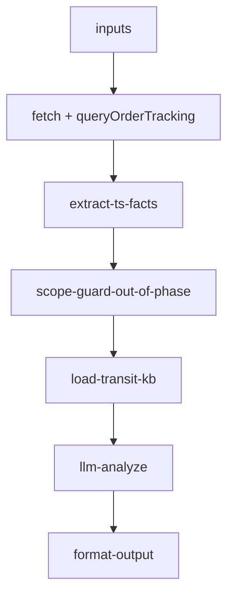

# inbound/inbound-transit-tracking 专家设计

TS 阶段在途状态解读：**本期不交付**。客户诉求中的头程细粒度（离港/到港/航班船名）依赖 TMS 智运，不在 6 月 inbound 批次范围内。

> **本期结论**：专家 workflow 保留为设计/代码骨架；**不上线、不对客启用**。同类问题临时由 `inbound-order-status`（OMS 轨迹 + 状态）与 `inbound-arrival-status`（到仓前）承接，或升级人工。

---

## 调用说明

### 适用场景（产品定义，后续迭代）

- 客户询问「货什么时候离港」、「到港了没」、「现在在哪（TS 阶段）」、「预计什么时候送到仓库」。
- 适用范围：入库单状态为 `TS`（头程运输中）。

### 本期不启用

| 诉求 | 本期处理 |
|------|----------|
| 离港 / 到港 / 航班·船名 | **不在本期**；不调用 TMS，不对客编造 |
| TS 粗粒度 + 预计到仓 | 可转 `inbound-order-status` + `queryOrderTracking` |
| 已到仓 / 签收 | → `inbound-arrival-status` |
| 清关合规 | → `inbound-customs-clearance` |

### 最小入参（后续迭代）

- `inputs.inboundOrderNos` 至少一个 WI 单号。

---

## 1. 输入设计（后续迭代）

### inputs 业务字段

| 字段 | 类型 | 必填 | 说明 |
|------|------|------|------|
| inboundOrderNos | string[] | 是 | WI 单号 |
| queryFocus | string | 否 | **`delivery_warehouse` / `overall` 为本期 OMS 可支撑方向**；`departure` / `arrival_port` 依赖 TMS，**不在本期** |

---

## 2. 数据拉取与范围

> **接口依据**：`已确认` · `不在本期`（后续迭代再接入）

### 本期可复用的 OMS 能力（由其他专家承接，本专家不单独上线）

| 数据源 | Action | 接口依据 | 说明 |
|--------|--------|----------|------|
| OMS 详情 | `winit.wh.inbound.getOrderDetail` | **已确认** | `expectedSendwarehouseTime`、`status` |
| OMS 轨迹 | `wh.tracking.queryOrderTracking` | **已确认** | `trackingList` 中 TS / 到仓前节点 |

### 不在本期（后续迭代）

| 能力 | 说明 |
|------|------|
| **TMS 智运 / 头程物流单** | 离港/到港/航班/船名/中转港；无本期 action 规格，**不预留运行时调用** |
| `departureTime` / `arrivalPortTime` | 结构化输出字段；本期 expert **不启用**，值为 null |
| `queryFocus=departure` / `arrival_port` | 对客说明「头程细粒度查询后续版本支持」，引导 `inbound-order-status` 或人工 |

### 字段注意

| 字段 | 说明 |
|------|------|
| `getOrderDetail.trajectoryList` | **不在详情响应中**；轨迹须 `queryOrderTracking` |

---

## 3. 工作流编排（代码骨架，本期不部署）

### 节点说明（实现态）

| 节点 | 本期行为 |
|------|----------|
| `extract-ts-facts.ts` | 从 OMS `trackingList` 提取 TS 事实（骨架保留） |
| `check-tms-gap.ts` | 固定返回 `phaseScope: out_of_phase`；**不**假装 TMS Gap 可联调 |
| `load-transit-kb.ts` | KB 仅含 OMS 可述范围 + 「头程细粒度不在本期」话术 |
| `llm-analyze` | 若误触发：说明不在本期，转 order-status / 人工 |

---

## 4. 输出设计（后续迭代目标）

### structured 字段

| 字段 | 本期 | 说明 |
|------|------|------|
| orderNo | — | 入库单号 |
| currentStatus | OMS | 状态码 |
| expectedSendwarehouseTime | OMS | 预计送仓 |
| tsTrajectoryNodes | OMS | TS 相关轨迹节点 |
| departureTime | **null** | TMS，不在本期 |
| arrivalPortTime | **null** | TMS，不在本期 |
| phaseScope | `out_of_phase` | 标识本期未交付 |

### analysis 原则（若误触发）

- 明确：**头程在途追踪专家本期未上线**
- 可转述 OMS 已有字段时，注明数据来源为 order-status 链路
- **禁止**编造离港/到港日期；**禁止**引用 TMS/TOM 内部系统

---

## 5. Prompt 知识片段

| 文件 | 说明 |
|------|------|
| `prompts/kb-transit-milestones.md` | 头程阶段概念 + 本期范围说明 |
| `prompts/tms-gap-notice.md` | 更名为「不在本期」对客话术（非 Gap 联调） |
| `prompts/main.md` | LLM 禁止输出 TMS 细粒度 |

---

## 6. 对客约束

- 本期：路由到其他专家或人工，不以此 expert id 响应
- 后续：不承诺具体到仓时间；TMS 接入前不得输出离港/到港实数

---

## 7. 待确认事项（后续迭代）

- TMS 智运 OpenAPI / 内部网关规格（与研发共定 action）
- OMS `trackingList` TS 节点是否含「已离港/已到港」文案，或仅 TS 整体描述
- 是否与 `inbound-customs-clearance` 合并编排头程+清关视图
