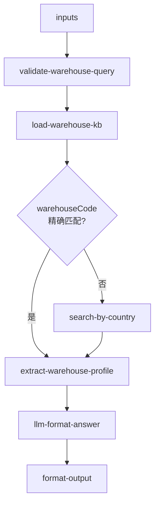

# inbound/inbound-warehouse-info 专家设计

仓库基础信息查询：根据仓库编码或国家/地区检索仓库地址、联系人、营业时间、仓型与截单规则。纯 KB/RAG 路径，无实时 API 依赖。

---

## 调用说明

### 适用场景

- 客户询问「XX 仓的地址是什么」、「联系人是谁」、「几点截单」、「这个仓是什么类型」、「能存 DG/纯电/食品吗」、「可以自提吗」。
- 也用于链式编排中，为 `inbound-appointment-manage`、`inbound-arrival-status` 等专家补充仓库基础资料。
- **不适用**：某单是否到仓或上架（→ `inbound-arrival-status` / `inbound-putaway-status`）；库容/Slots 剩余（→ `inbound-capacity-availability`）。

### 最小入参

- `inputs.warehouseCode` 或 `inputs.country` 至少提供其一。

### 参数提示

- `warehouseCode`：Winit 仓库编码（如 `USLAX01`、`UKLON01`）；优先于 `country` 精确匹配。
- `topic`：聚焦查询主题；不传则返回仓库全量资料摘要。

### 示例调用

**示例 1：按仓库编码查询**

```json
{
  "query": "提供该仓库的地址、联系人与营业时间",
  "customerIntent": "客户问：USLAX01 仓的地址和送货要求",
  "inputContext": { "chainId": "case-20260608-040" },
  "inputs": {
    "warehouseCode": "USLAX01",
    "topic": "all"
  }
}
```

**示例 2：按国家查询可用仓库**

```json
{
  "query": "列出英国可用海外仓及基本信息",
  "customerIntent": "客户问：英国有哪些仓库",
  "inputContext": {},
  "inputs": {
    "country": "UK"
  }
}
```

---

## 1. 输入设计

### 框架顶层

| 字段 | 类型 | 说明 |
|------|------|------|
| query | string | 任务说明 |
| customerIntent | string | 业务问题摘要 |
| inputContext | object | 可选 |

### inputs 业务字段

| 字段 | 类型 | 必填 | 说明 |
|------|------|------|------|
| warehouseCode | string | 条件必填 | Winit 仓库编码；与 country 二选一 |
| country | string | 条件必填 | 国家/地区（UK / US / DE 等）；未知仓码时使用 |
| topic | string | 否 | 聚焦主题：`address` / `contact` / `hours` / `cutoff` / `type` / `capabilities` / `rules` / `all`（默认 `all`） |

---

## 2. 数据拉取与兜底

> **接口依据**：本专家**无外部 API**，全部 KB/RAG；不涉及接口调用。

| 来源 | 路径 | 内容 |
|------|------|------|
| 仓库基础资料 | `_kb/service-team/inbound-services-doc/海外仓的头程直发收货地址.md` | 地址、联系人、面单规范、直发 FAQ |
| 存储产品规则 | `_kb/product-team/winit/in-warehouse/storage-product-details.md` | 仓型定位、可接商品类型矩阵、存放分区 |
| Playbook SLA 速查 | `docs/inbound/playbook.md` | 截单/时效上下文 |

RAG 策略：先按 `warehouseCode` 精确匹配，命中则返回；未命中则按 `country` 模糊检索，返回该国全部仓库概要。

---

## 3. 工作流编排



### 节点顺序

1. `validate-warehouse-query`：检查 `warehouseCode` 或 `country` 至少一个有效
2. `load-warehouse-kb`：从 KB 加载仓库资料语料块（RAG chunk 或静态映射表）
3. `extract-warehouse-profile`：结构化提取目标仓库的地址/联系人/营业时间/截单/仓型
4. `llm-format-answer`：将提取结果格式化为自然语言摘要
5. `format-output`

---

## 4. 节点说明

| 节点文件 | 输入 params | 输出 |
|----------|-------------|------|
| `validate-warehouse-query.ts` | `warehouseCode`, `country` | `queryType`（exact / country_search）, `validationOk` |
| `load-warehouse-kb.ts` | `warehouseCode`, `country`, `topic` | `kbChunks`（相关 KB 文本块） |
| `extract-warehouse-profile.ts` | `kbChunks`, `warehouseCode` | `warehouseProfile`（结构化仓库资料） |
| `llm-format-answer`（LLM） | `warehouseProfile`, `topic`, `customerIntent` | `analysisResult` |
| `format-output.ts` | `analysisResult`, `inputContext?` | `result`, `outputContext` |

---

## 5. 输出设计

### structured 字段

| 字段 | 类型 | 说明 |
|------|------|------|
| warehouseCode | string | 仓库编码 |
| warehouseName | string | 仓库名称 |
| country | string | 所在国家 |
| address | string | 完整地址 |
| contactPerson | string | 联系人姓名 |
| contactPhone | string | 联系电话 |
| businessHours | string | 营业时间 |
| cutoffTime | string | 截单/截仓时间 |
| warehouseType | string | 仓型（海外仓/中转仓/直发仓等） |
| warehousePosition | string | 仓库定位（大件/中小件/小件/综合仓） |
| operationMode | string | 作业模式（AUTO / MANUAL） |
| supportedProducts | string | 可接商品类型摘要 |
| addressExpress | string | 快递面单地址（与海空运区分时） |
| capabilities | object | 结构化可接商品（纯电/DG/化工/特殊化工/食品） |
| specialNotes | string[] | 特殊注意事项（如自提限制、送货要求） |

### analysis 原则

- 按客户 `topic` 聚焦展示，不堆砌无关信息
- 不引用飞书、TOM 内部链接
- 若 KB 无该仓数据，明确说明「暂无该仓库资料，建议联系客服」

---

## 6. Prompt 知识片段

| 文件 | 说明 |
|------|------|
| `prompts/warehouse-index.md` | 仓库编码 → 名称/国家映射表 |
| `prompts/warehouse-profiles.md` | 各仓地址、联系人、营业时间、截单规则 |
| `prompts/warehouse-special-rules.md` | 特殊操作规范（预约要求、货型限制、自提规则） |

---

## 7. 对客约束

- 不输出库容/Slots 实时信息（→ `inbound-capacity-availability`）
- 不深入仓租计费、组织库存、库内箱转单等存储增值服务（→ `inbound-process-guide` 或增值专家）
- 不引用飞书链接；联系方式仅引用 KB 中维护的公开信息
- 升级人工条件：KB 无该仓资料，或客户问题超出仓库基础信息范畴（如 VIP 仓特殊安排）

---

## 8. 待确认事项

- 本专家 KB 同步机制：仓库资料更新频率及维护路径（建议建立定期 KB 更新流程）
- 仓库编码规范化：`USLAX01` 与 `US_LAX_01` 等格式差异需在 `validate-warehouse-query` 中统一处理
- **主要数据文件应直接指向**：`_kb/service-team/inbound-services-doc/海外仓的头程直发收货地址.md` — 这是仓库地址/联系信息的主要来源；不应完全依赖 RAG 命中，建议将其拆解为结构化映射表维护在 `prompts/warehouse-profiles.md` 中
