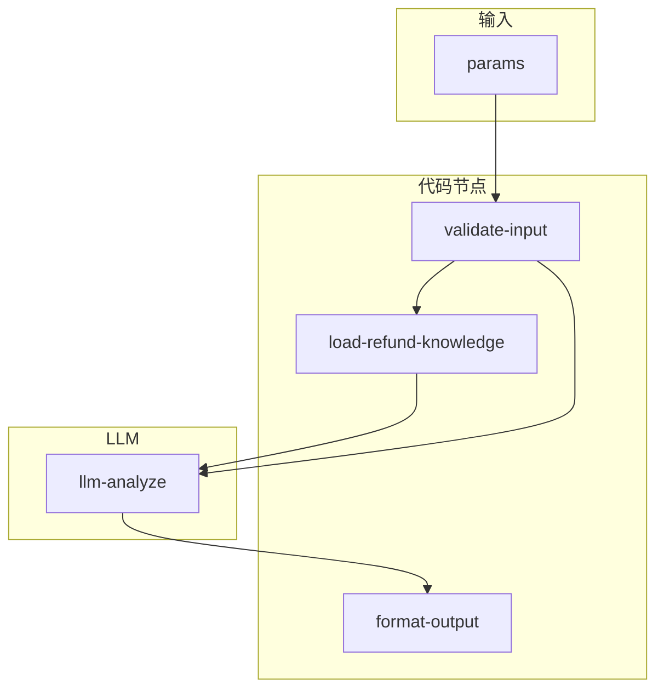

# refund-standard 专家设计

根据多维度场景匹配**适用赔付条款**，解读赔偿规则与理算逻辑。维护者以 **[飞书表格 WINIT 赔付标准](https://winitlink.feishu.cn/sheets/C8bFs4wmshxCL4tghRncen0EnGh)**（工作表 **IZ3Mfo**：WINIT SLA + 组合产品尾程；**2jwxRS**：标准尾程指定产品）为权威来源同步入库；**对客 `analysis` 不得引用该链接或「以飞书为准」**，须用合同/价卡/内置条款摘要表述。不替代法务结论；**代客索赔单进度与材料流程**由 [substitute-claim](../substitute-claim/) 专家承接。

**结构化输出**含 `policyBranch`：`winit_ops_sla` | `carrier_designated` | `carrier_winit_combo`，对应三张政策来源，避免混用条款。

## 调用说明

### 适用场景

- 需要回答“**适用哪条赔付标准**、赔付上限/窗口/免责、理算口径怎么理解”这类问题。
- 需要把上游（如 `delivery-status`、`delivered-not-received`）给出的事实（目的国/产品/事件类型/轨迹摘要等）映射到条款维度时。
- **不适用**：代客索赔入口、材料提交、进度查询——请转 `substitute-claim`。

### 具体订单场景门禁

当请求绑定具体运单/出库单并要求匹配“妥投未收到”条款时，代码必须读取结构化扫描事实。明确无 Dscan 时输出 `scenarioApplicability=inapplicable`、清空 `matchedRuleIds`，并转 `tracking-inquiry`；不得输出 DNR 申请窗口。通用政策咨询保持 `not_checked`，不受订单门禁影响。

### 最小入参（推荐组合）

- 二选一即可跑通：`customerIntent` 或 `scenario`
- 且建议同时提供 `enrichedContext`（至少含目的国/产品/事件类型线索之一）以提高匹配准确度

### Coze 工作流包

本地维护 `workflow.json` + `nodes/` + `prompts/`；导入 Coze 时执行 `npm run export:coze -- experts/last-mile/refund-standard`，产物在专家目录下 `workflow/MANIFEST.yml` 与 `workflow/workflow/refund_standard-draft.yaml`。映射与约束见仓库根目录 [COZE-WORKFLOW.md](../../COZE-WORKFLOW.md)，专家侧配置见 [coze.config.yml](./coze.config.yml)。

### 参数提示

- `country` / `destinationCountry` / `destinationRegion`：用于“指定产品”国家分片；三者择一即可（优先用 ISO2，如 `US`/`DE`/`UK`）。
- `enrichedContext` 越完整（产品线、目的国、serviceLevel、事件类型、轨迹摘要/妥投信息、货值线索），`confidence` 越高；缺关键维度时应在输出里体现为 `dimensionsConsidered.missing`。

### 示例调用（直接可用）

**示例 1：仅意图 + 目的国（快速匹配条款分支）**

```json
{
  "query": "匹配适用赔付条款并说明理算要点与免责",
  "scenario": "delivered_not_received",
  "customerIntent": "客户说妥投未收到，想确认是否可赔、怎么赔",
  "country": "US",
  "enrichedContext": {
    "destinationCountry": "US",
    "trajectorySummary": "显示已妥投 Delivered，但客户反馈未收到",
    "incidentType": "DNR"
  },
  "inputContext": { "chainId": "case-20260402-201" }
}
```

**示例 2：链式编排（从 delivery-status 透传事实）**

```json
{
  "query": "基于上游轨迹与订单摘要，匹配适用赔付条款并列出缺失维度",
  "customerIntent": "",
  "outboundOrderNos": ["OB202603280001"],
  "enrichedContext": {
    "destinationCountry": "DE",
    "serviceLevel": "standard",
    "orderDetails": [{ "orderNo": "OB202603280001", "destinationCountry": "DE" }],
    "trajectorySummary": "疑似延误/滞留，未妥投"
  },
  "inputContext": {
    "chainId": "case-20260402-202",
    "sourceExpertId": "delivery-status",
    "previousOutput": { "note": "facts merged upstream" }
  }
}
```

## 1. 输入设计

| 输入 | 类型 | 说明 |
|------|------|------|
| `scenario` | string | 场景描述或内部场景码 |
| `customerIntent` | string | 客户意图或原始问句 |
| `trackingIds` | string[] | 运单号（可选） |
| `outboundOrderNos` | string[] | 出库单号（可选，衔接 delivery-status 等） |
| `enrichedContext` | object | 上游合并上下文：产品/线路、目的国、`serviceLevel`、货值线索、轨迹摘要、`incidentType` 线索等 |
| `inputContext` | object | 链式：`sourceExpertId`、`previousOutput`、`chainId` |

**约束**：至少提供 `scenario`、`customerIntent`、`enrichedContext`（非空对象）、`trackingIds` 或 `outboundOrderNos` 之一（由 `validate-input` 校验）。

### 1.1 enrichedContext 建议字段（供上游合并）

| 字段 | 说明 |
|------|------|
| `productFamily` / `actualProductInfoList` 摘要 | 产品线识别 |
| `destinationCountry` / `destinationRegion` | 目的国/大区 |
| `serviceLevel` | 服务级别 |
| `declaredValue` / 费用字段 | 货值或申报线索 |
| `trajectorySummary` / 节点摘要 | 延误、妥投、异常类型推断 |
| `orderDetails` | 出库单精简片段 |

可与 [delivery-status](../delivery-status/design.md) 的 enrichedContext 对齐扩展，无需本专家内再调 API 即可完成 v1。

**专业性增强（已实现摘要）**：[prompts/expert.md](prompts/expert.md) 含 **术语表**、**易混淆路由**与后续可选 **RAG/版本化** 方向；Prompt 要求 `analysis` **六段式**输出以降低漏项。完整指定产品矩阵由运营同步至 `expert.md` 与 `load-refund-knowledge.ts`（维护者以飞书逐行核对）。

### 国家分片

- 入参：`country` / `destinationCountry` / `destinationRegion`，或 `enrichedContext` 中的 `destinationCountry` 等。
- [validate-input](nodes/validate-input.ts) 输出 `countryResolved`、`countrySource`；[load-refund-knowledge](nodes/load-refund-knowledge.ts) 据此生成 **`designatedCountryShard`**（内置 **DC、BE、DE、UK、US、CA**），并对 **组合产品表** 按国过滤写入 `clauseMatrix` 的 C 段。
- `countryShardMode`：`hit` | `index`（未解析国家）| `unsupported`（国家未建内置分片；输出中建议补全维度、`escalate_human` 或客服核对价卡，**勿**引导客户查阅内部表）。

## 2. 输出设计

- **structured**：`policyBranch`、`matchedRuleIds`、`scenarioSummary`、`dimensionsConsidered`（含 `missing`）、`confidence`、`suggestedNextStep`
- **analysis**：条款摘要、理算说明、缺失信息与**免责**（以合同及公示政策为准）

## 3. 工作流编排

```text
用户 / 上游参数
       │
       ▼
validate-input ──valid:false──► 返回 error，中断或引导补全
       │
       │ valid:true
       ▼
load-refund-knowledge ──► refundLexicon, clauseMatrix, calculationGuide
       │
       ▼
llm-analyze（prompts/main.md，注入上列变量与校验后的入参）
       │
       ▼
format-output ──► result, outputContext
```



## 4. 与其他专家分工

| 专家 | 职责 |
|------|------|
| **refund-standard**（本专家） | 哪条赔付条款适用、维度是否齐全、理算逻辑**文字**说明 |
| **substitute-claim** | 代客索赔申请、进度、时效、到款、材料清单 |
| **product-info** | 价卡与产品介绍；条款中的产品维度可与之对照 |

## 5. 节点说明（nodes/）

见 [nodes/README.md](nodes/README.md)。

**知识维护**：`prompts/expert.md` 与 `nodes/load-refund-knowledge.ts` 内嵌常量须**同步更新**。
