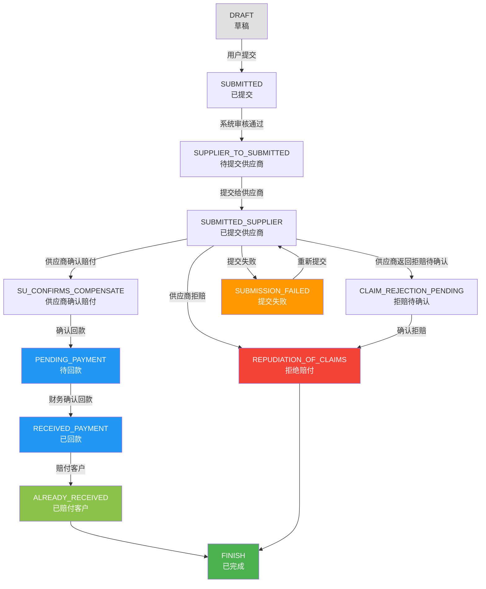

# substitute-claim（代客索赔）专家设计

标准出库单场景下，**代客向尾程供应商**索赔的申请、进度、时效及流程性赔付状态查询。**万邑通标准索赔**（《WINIT 赔付标准》）由 **refund-standard** 解读与分流，本专家不承担标准赔条款与理算口径。

## 调用说明

### 适用场景

- 咨询**代客索赔**申请、进度、时效、材料或流程性赔付状态。
- 不适用：纯物流轨迹查询且无索赔语境时，可优先走轨迹/妥投类专家；**标准索赔**条款与窗口请走 **refund-standard**。

### 最小入参

- `trackingIds`、`outboundOrderNos`、`claimIds` 三者**至少其一**非空更易定位；全空则依赖顶层 `query` 描述（实现可能受限）。

### 参数提示

- 有代客索赔单号时优先传 `claimIds`；仅有订单/轨迹时传对应数组即可。
- 不要把 `customerIntent` 写进 `inputs`，应放在**调用 JSON 顶层**。
- 链式场景建议透传 `inputContext.chainId`。

### 示例调用

```json
{
  "query": "这笔代客索赔赔到哪一步了",
  "customerIntent": "客户催赔进度",
  "inputContext": { "chainId": "substitute-claim-001", "sourceExpertId": "", "previousOutput": "" },
  "inputs": {
    "claimIds": ["CLM20250401001"],
    "trackingIds": [],
    "outboundOrderNos": []
  }
}
```

```json
{
  "query": "",
  "customerIntent": "",
  "inputContext": {},
  "inputs": {
    "trackingIds": ["1Z999AA10123456784"],
    "outboundOrderNos": ["OB20250401001"],
    "claimIds": []
  }
}
```

## 1. 输入设计

### 1.1 框架顶层（调用边界，不在 manifest.inputSchema 内）

| 字段 | 类型 | 说明 |
|------|------|------|
| query | string | 委托任务说明，可为空 |
| customerIntent | string | 业务摘要，可为空 |
| inputContext | object | 可选；链式上下文 |

### 1.2 inputs 内业务字段（与 manifest.json 一致）

| 字段 | 类型 | 说明 |
|------|------|------|
| trackingIds | string[] | 轨迹单号 |
| outboundOrderNos | string[] | 出库单号 |
| claimIds | string[] | 代客索赔单号 |

## 2. 输出设计

- **structured**（由 `format-output` 与 LLM 合并，以事实节点为准覆盖）：
  - `queryKeys`：`trackingIds`、`outboundOrderNos`、`claimIds`
  - `records`：列表行（含 `compensateStatus` / **`compensateType` 枚举码透传**；可选 **`compensateStatusLabel` / `compensateTypeLabel`**（与 §6、KB §5.1 映射）；`applyTime` 等宽容映射字段、`rawRecord`）
  - `statusSummary`：`listStatus`、`apiCode`/`apiMsg`、`notes`、`statusPassthrough: true`（暂无强映射）
  - `nextAction`：建议动作
  - `missingFacts`：缺字段或环境不足时的提示
- **analysis**：代客索赔进度、时效说明、建议动作（避免与 refund-standard 条款口径冲突）

## 3. 知识库（KB）

- **代客索赔条款与渠道时效**：见 [prompts/kb.md](prompts/kb.md)（摘录自内部运营配置表「指定产品」「组合产品」分区；**其它说明** 全文整理于 KB §2）。  
- **维护**：运营配置变更后同步修订 `kb.md` 并 bump `knowledgeVersion`；对客话术勿引用内部多维表或 Wiki URL。

## 4. 工作流编排

与 `workflow.json` / `coze.config.yml` 一致（对齐 `pod-request` 的插件 + fetch 模式）：

1. **validate-input**：校验与分流 `branch`（`query` | `guidance` | `skip`）；归一单号；写入 `enrichedContext.analysisClock`。
2. **build-compensate-list-data**：`branch === query` 时拼装 `afs.customer.compensate.pageList` 请求 JSON 字符串 → `winitRequestData`。
3. **winit_openapi_plugin**（Coze）：`openapiAction: afs.customer.compensate.pageList`，`data` ← `winitRequestData`。
4. **fetch-compensate-list**：消费插件 `data` 或本地 Coze `workflow/run` 代理；宽容解析列表 → `compensateListFacts`（含 `branch`、`queryKeys`）。`guidance` 分支使用 `skipped_guidance`，不把流程咨询误报为缺少单号。
5. **llm-analyze**：读 `prompts/main.md`，注入 `{{branch}}`、`{{kbMd}}`、`{{compensateListFacts}}` 等；流程/材料咨询不得索要进度查询单号。
6. **format-output**：合并事实与 LLM → `result`、`outputContext.expertId: substitute-claim`；对 `guidance` 分支中“索要单号”或“代客索赔走申请标准索赔”的矛盾输出执行确定性降级。

### 本地验证

- **推荐（含 Mock 插件 JSON，避免 Windows 命令行剥引号）**：`npm run smoke:substitute-claim`
- **CLI**：`npm run dev:expert -- substitute-claim -- --claimIds '["CLM001"]'`（专家入参须在第一个 `--` 之后；`winitOpenapiData` 建议用脚本或 `inputs` 注入 JSON，勿依赖 PowerShell 裸传长 JSON）

## 5. 节点说明

| 节点 | 文件 | 说明 |
|------|------|------|
| validate-input | `nodes/validate-input.ts` | 入参校验、`branch`、单号归一 |
| build-compensate-list-data | `nodes/build-compensate-list-data.ts` | 组装 OpenAPI `data` JSON 字符串 |
| winit_openapi_plugin | `nodes/winit-openapi-plugin.ts` | 占位说明（Coze 插件，非代码节点） |
| fetch-compensate-list | `nodes/fetch-compensate-list.ts` | 解析响应 → `compensateListFacts` |
| llm-analyze | `nodes/llm-analyze.ts` | LLM 声明；Prompt 见 `prompts/main.md` |
| format-output | `nodes/format-output.ts` | 合并输出与 `outputContext` |

## 6. 枚举值

以下与 OpenAPI **`afs.customer.compensate.pageList`** 列表行字段一致（DS）；实现上保留 **`compensateStatus` / `compensateType` 码值透传**，并在事实节点中附带 **可选中文标签**（见 `fetch-compensate-list.ts` 映射；未知码不臆造含义）。

### 6.1 compensateStatus（代客索赔状态）

| 值 | 含义 |
|------|------|
| DRAFT | 草稿 |
| SUBMITTED | 已提交 |
| SUPPLIER_TO_SUBMITTED | 待提交供应商 |
| SUBMITTED_SUPPLIER | 已提交供应商 |
| SU_CONFIRMS_COMPENSATE | 供应商确认赔付 |
| CLAIM_REJECTION_PENDING | 拒赔待确认 |
| PENDING_PAYMENT | 待回款 |
| RECEIVED_PAYMENT | 已回款 |
| REPUDIATION_OF_CLAIMS | 拒绝赔付 |
| ALREADY_RECEIVED | 已赔付客户 |
| FINISH | 已完成 |
| SUBMISSION_FAILED | 提交失败 |

### 6.2 compensateType（代客索赔类型）

| 值 | 含义 |
|------|------|
| LS | 丢失 |
| BK | 破损 |
| PLS | 部分妥投 |
| NR | 妥投未收到 |
| SCM | 供应商多收费用 |

### 6.3 compensateStatus 状态流转图



## 流转路径说明

### 主流程（成功赔付）
```
DRAFT → SUBMITTED → SUPPLIER_TO_SUBMITTED → SUBMITTED_SUPPLIER → SU_CONFIRMS_COMPENSATE → PENDING_PAYMENT → RECEIVED_PAYMENT → ALREADY_RECEIVED → FINISH
```

### 拒赔路径
```
SUBMITTED_SUPPLIER → REPUDIATION_OF_CLAIMS → FINISH
```

### 拒赔待确认路径（Hermes/Ontrac 等特定供应商）
```
SUBMITTED_SUPPLIER → CLAIM_REJECTION_PENDING → REPUDIATION_OF_CLAIMS → FINISH
```

### 提交失败路径（可重试）
```
SUBMITTED_SUPPLIER → SUBMISSION_FAILED → SUBMITTED_SUPPLIER（重新提交）
