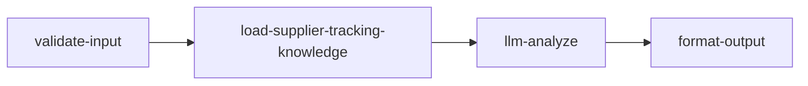

# supplier-tracking 专家设计

在能识别**承运商 / 尾程产品**的前提下，向客户返回**经 SOP（飞书表）核验的官方物流查询网址**与**自助查轨迹步骤**（来自内置 KB）。**不在本专家工作流内**对承运商官网发起 HTTP 抓取或解析 HTML 轨迹正文。

与 **`delivery-status`** 分工：**delivery-status** 以万邑通 OpenAPI id/56 等**平台聚合轨迹**为主并做业务解读；**supplier-tracking** 负责「**去哪查**」——在 KB 覆盖范围内给出正确入口与多跳说明。**轨迹正文**（事件时间线）以 **`delivery-status`** 与**系统侧轨迹拉取能力**（见下）为准，本专家不替代。

---

## 术语说明

本专家语境下「查轨迹 / 物流查询」指**在承运商官网自助查包裹运输状态**，对应飞书 SOP「尾程各供应商的物流查询网址」。

| 术语 | Winit 含义 | 对应专家 |
|------|-----------|---------|
| **物流查询 / 轨迹查询** | 查包裹当前位置与运输状态；承运商官网自助 track | `delivery-status`（解读）+ **`supplier-tracking`**（网址指引） |
| **尾程查件** | 出库后向物流商正式发起的包裹调查（TailTrace，OT/PT/NR…），有查件单号（TA…）、状态机与 SLA | `tracking-inquiry` |

两者是不同业务流程：本专家仅输出「去哪查」的物流查询 URL，**不涉及查件单申请与进度**。

> **内部权威 SOP（维护者）**：[（海外仓）尾程各供应商的物流查询网址](https://winitlink.feishu.cn/wiki/wikcnlRkIVeYTuFSCxLFfP1EJ6d)  
> **仓库 Markdown 副本**：[docs/experts/last-mile/supplier-tracking/carrier-portals.md](../../../docs/experts/last-mile/supplier-tracking/carrier-portals.md)（配图目录 `docs/experts/last-mile/supplier-tracking/carrier-portals/`；与飞书表内容对齐维护）。  
> 该文档提供 **URL 清单、组合渠道顺序、DHL 国际转目的国等特殊流程**；实现上用于 **LLM 匹配 KB 行与组话**，并与 `prompts/kb.md` 保持同步。

---

## 调用说明

### 适用场景

- 需要告诉客户**对应尾程产品/国家在承运商官网的轨迹查询入口**（单条或多条 URL、组合渠道顺序）。
- 平台轨迹（`delivery-status`）已存在，但客服仍需**口头对齐「客户应去哪个官网、按什么顺序查」**。
- **DHL 国际件、AU Mix 等**多跳场景：按 KB 输出分步链接与说明（不声称已代客户完成官网查询）。

### 不适用 / 建议路由

- 需要**万邑通轨迹解读、延误规则、扫描事实推断** → **`delivery-status`**。
- 索要承运商**客服电话**、自提点 → **`carrier-contact`**。
- **尾程查件申请、查件单进度查询、代客调查**（TailTrace）→ **`tracking-inquiry`**。
- 无**跟踪号**且无法从上下文获得时：应 `need_info`，勿编造已查轨迹。

### 最小入参

- 匹配 KB 行：建议提供 **`country`** + **`lastMileProductName`**（或 **`carrierCode`** / **`region`**）；若缺省可依赖 **`enrichedContext`**（推荐前置 **`delivery-status`**）推断。
- **`trackingIds`**：用于对客话术中带单号引导自助查询；非强制匹配 KB 行，但建议提供。

### 参数提示

- `lastMileProductName` 与内部主数据 / SOP「供应商/承运商」列应对齐或可映射；表中**空国家单元格**表示继承上一行国家，由 LLM 按 KB 表结构理解。
- `query`、`customerIntent` 在**调用 JSON 顶层**，勿写入 `inputs`。

### 示例调用

```json
{
  "query": "告诉客户去哪查 Amazon 物流",
  "customerIntent": "需要官网入口",
  "inputContext": { "chainId": "st-001", "sourceExpertId": "delivery-status", "previousOutput": "" },
  "inputs": {
    "country": "US",
    "lastMileProductName": "Amazon Logistics - Shipping with Amazon",
    "trackingIds": ["TBA1234567890"]
  }
}
```

```json
{
  "query": "",
  "customerIntent": "",
  "inputContext": {},
  "inputs": {
    "country": "DE",
    "lastMileProductName": "DE DHL",
    "trackingIds": ["00340434123456789012"]
  }
}
```

---

## 1. 输入设计

### 1.1 框架顶层（不在 manifest.inputSchema 内）

| 字段 | 类型 | 说明 |
|------|------|------|
| query | string | 委托说明，可为空 |
| customerIntent | string | 业务摘要，可为空 |
| inputContext | object | 可选；`chainId`、`sourceExpertId`、`previousOutput` |

### 1.2 inputs 内业务字段

| 字段 | 类型 | 说明 |
|------|------|------|
| trackingIds | string[] | 跟踪号；用于话术中带号引导客户自助查询 |
| country | string | 国家/地区，用于匹配 KB 行 |
| lastMileProductName | string | 尾程产品名，用于匹配 KB 行 |
| carrierCode | string | 可选；辅助匹配 |
| region | string | 可选；区域描述 |
| enrichedContext | object | 可选；上游 `delivery-status` 等注入的承运商线索 |

---

## 2. 输出设计（链接模式）

- **structured.fetchStatus**：恒为 **`fallback_links`**（由 `format-output` 规范化，与 LLM 约定一致）。
- **structured.events**：恒为 **`[]`**；不在本专家产出承运商事件时间线。
- **structured.trackingPortalUrls** / **selfServiceSteps**：须严格来自 **kbMd** 已出现的 URL 与步骤；**禁止**臆造域名。
- **structured.branch**：`has_portals` | `need_info` | `ambiguous` | `need_human`。
- **suggestedNextExperts**：需要轨迹解读时建议 **`delivery-status`**；需要电话时建议 **`carrier-contact`**。
- **analysis**：对客完整说明（链接 + 步骤 + 单号提示等）。

---

## 3. 知识范围（KB）

### 3.1 主表：国家 × 供应商/承运商 × 物流网址

飞书大表覆盖 AU / BE / DE / UK / US / CA 等多国产品及 URL；**UK P2P** 为「无」——须如实说明无独立官网 URL，不得虚构链接。

### 3.2 特殊流程（话术与步骤）

- **DHL International Paket**：目的国站点与单号可能与德国段不同；按 KB 分步说明。
- **Shipping with Amazon**：`track.amazon.com` 与万邑通轨迹平台差异等，按 KB「多源对照」节表述。

---

## 4. 轨迹数据边界（系统侧，非本专家）

承运商官网 **HTML/反爬/登录** 不适合在 Coze 代码节点内做「爬虫式」拉取；若需**触发轨迹爬取、异步任务、结果回写或与万邑通对齐**，由**系统 API / 编排服务**另案实现（契约、队列、账号与合规由平台侧定义）。本专家 **workflow.json** 不包含该类节点；编排可在调用本专家**之前或之后**串联 `delivery-status` 或系统接口。

---

## 5. 工作流编排（当前实现）



1. **validate-input**：最小事实校验；注入 `analysisClock`（UTC）。
2. **load-supplier-tracking-knowledge**：产出 `kbMd`。
3. **llm-analyze**：KB + 入参组话；输出 `analysisResult`（约定 `fetchStatus: fallback_links`、`events: []`）。
4. **format-output**：归一化 `result` / `outputContext`；强制 `fetchStatus` 与空 `events`。

工作流定义见 [workflow.json](workflow.json)。

---

## 6. 与其它专家的分工

| 专家 | 职责 |
|------|------|
| **supplier-tracking**（本专家） | **KB 官方物流查询网址与自助查轨迹步骤**；不抓取官网轨迹正文 |
| **delivery-status** | 万邑通聚合轨迹、id/56、业务规则与延误解读 |
| **tracking-inquiry** | 尾程查件申请进度查询、代客发起查件（TailTrace） |
| **carrier-contact** | 电话、邮箱、自提点 |

---

## 7. 待确认事项（可选）

1. **编排**：是否在「官网轨迹查询」场景固定前置 `delivery-status` 以带全 `enrichedContext`。
2. **产品名称归一化**：与 SOP 表、价卡、主数据映射表归属。
3. **系统侧轨迹 API**：与 `supplier-tracking` 并行时的 SLA 与对客话术边界（由平台产品定义）。
