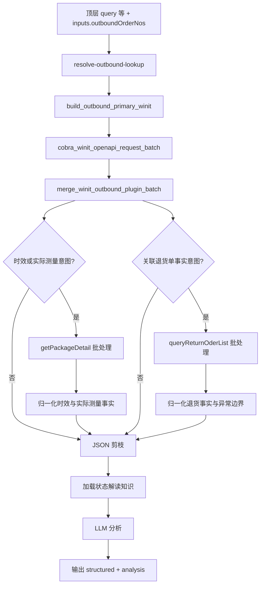

# outbound-order-status 专家设计

出库单状态解读，含暂存、增值等场景分解、各种不同状态的解读。

## 调用说明

### 适用场景

- 已持有**出库单号（WO）**，或客户提供**跟踪号 / 卖家订单号**（格式可能与跟踪号混淆），需要根据订单 JSON **归纳当前状态与字段含义**（不写操作建议、不承诺面单获取）。
- 专家入口会将 `outboundOrderNos` 规范化后先走万邑通列表接口 id/54：`WO...` 用 `outboundOrderNum`，非 WO 先 `trackingNo` 再 `sellerOrderNo`。命中订单后，若客户询问渠道商/派送商/承运商，或列表结果缺少承运商，则调用 id/55 补充详情。
- 当客户明确询问发货/出库时效，或包裹实际尺寸、重量、体积时，使用 id/54 已返回的主单与子单号调用 `wh.outbound.getPackageDetail`。普通状态查询不增加该接口调用。
- 当客户明确询问派送失败退回、出库单关联的退货单、退回到仓或完成状态时，调用 `rma.returnGoodsOrder.queryReturnOderList`。直接提供 WO 时不依赖 id/54 命中；跟踪号或卖家订单号则先由 id/54 解析 WO。泛化退货政策或创建流程不触发该接口。

### 最小入参

- `inputs.outboundOrderNos` 至少包含一个有效标识（WO、跟踪号或卖家订单号）；剪枝相关字段可省略（使用 manifest 默认值）。

### 参数提示

- `maxPackagesPerOrder`、`maxMerchandisePerPackage`、`includeItemList`：控制进入 LLM 的 JSON 体积；包裹/商品很多时应适当收紧。
- `query`、`customerIntent` 属于**调用 JSON 顶层**，勿写入 `inputs`，也不写入 `manifest.inputSchema.properties`。
- 多专家编排时建议在 `inputContext` 中透传 `chainId`。

### 示例调用

```json
{
  "query": "根据数据说明这些出库单当前状态与主要字段",
  "customerIntent": "客户想知道出库是否已发出、为何暂存",
  "inputContext": {
    "chainId": "chain-demo-001",
    "sourceExpertId": "",
    "previousOutput": ""
  },
  "inputs": {
    "outboundOrderNos": ["OB20250401001"],
    "maxPackagesPerOrder": 10,
    "maxMerchandisePerPackage": 20,
    "includeItemList": false
  }
}
```

```json
{
  "query": "",
  "customerIntent": "",
  "inputContext": {},
  "inputs": {
    "outboundOrderNos": ["OB001", "OB002"]
  }
}
```

## 1. 输入设计

### 1.1 框架顶层（调用边界，不在 manifest.inputSchema 内）

| 字段 | 类型 | 说明 |
|------|------|------|
| query | string | 委托本专家完成的任务说明，可为空 |
| customerIntent | string | 当前业务问题摘要，可为空 |
| inputContext | object | 可选；链式上下文：`sourceExpertId`、`previousOutput`、`chainId` |

### 1.2 inputs 内业务字段（与 manifest.json 一致）

| 字段 | 类型 | 说明 |
|------|------|------|
| outboundOrderNos | string[] | 出库主单号 `WO`+数字（可带子单尾缀字母）、或跟踪号、或卖家订单号；`resolve-outbound-lookup` 仅做规范化/去重；非 `WO…` 时由 **`build-outbound-primary-winit`** 编排 id/54 先 **trackingNo** 再 **sellerOrderNo** 取数并合并为列表项 |
| maxPackagesPerOrder | integer | 剪枝：每单保留包裹数上限，默认 10 |
| maxMerchandisePerPackage | integer | 剪枝：每包裹商品行上限，默认 20 |
| includeItemList | boolean | 是否保留 itemList，默认 false |

## 2. 输出设计

- **structured**：出库单号、状态码、子单状态、跟踪号、是否截断，以及确定性 `carriers`、`outboundTimings`、`packageMeasurements`、`returnOrders` 和 `returnLookup`。测量事实按子单保留实际总重量/体积及逐箱长宽高、重量、体积；退货查询严格区分成功、空数据、业务失败和分页不完整。
- **analysis**：基于 `prunedOrderData` 的客观说明（状态码/状态名、关键字段与业务含义对照）；**不含**查件/自提/增值等操作指引，**不**承诺可获取面单

## 3. API 选型与调用策略

### 3.1 列表定位接口（id/54）

| 维度 | 统一接口（id/54） |
|------|--------------------|
| **接口** | `queryOutboundOrderList` |
| **入参** | `outboundOrderNum` / `trackingNo` / `sellerOrderNo`（按标识类型择一）+ 日期范围 + 分页 |
| **返回粒度** | 列表，每单含 `packageList`；用于状态归纳字段已足够 |
| **适用场景** | 单号 / 多号统一处理；避免 list 命中后再 detail 重查 |

### 3.2 承运商详情接口（id/55）

- action：`queryOutboundOrder`
- data：`{ "outboundOrderNum": "WO..." }`
- 提取字段：`carrier`、`carrierServiceCode`、`carrierServiceName`、`carrierHasChange`、`trackingNum`
- `deliveryWayName` / `winitProductName` 仅代表产品，不作为实际承运商。

### 3.3 调用策略（实现）

- **Coze 画布**：id/54 定位链路 → `build-carrier-detail-winit` → id/55 批处理插件 → `merge-carrier-detail` → 剪枝与 LLM。id/55 无数据或失败时保留 id/54 结果，不阻断专家。
- **纯插件多页/逐单无 HTTP**：需画布循环/批处理，见 `docs/coze-reference/LOOP_AND_BATCH_SAMPLES.md`。
- **动作编排**：每个 token 生成 1~2 个 id/54 查询动作：`WO...`→`outboundOrderNum`；非 WO→`trackingNo` 优先、`sellerOrderNo` 兜底。
- **结果合并**：按 token 选择最高优先级命中（`outboundOrderNum > trackingNo > sellerOrderNo`），去重后形成 `rawOrderData.list`。
- **运维**：列表路径依赖下单日期窗口，建议生产配置 `COZE_WINIT_LIST_DATE_START` / `END`。

### 3.4 子单详情接口（时效或实际测量意图）

- action：`wh.outbound.getPackageDetail`
- data：`{ "shippingNo": "WO...A", "orderNo": "WO...", "containerSerno": "" }`
- `shippingNo` 来自 id/54 的 `packageList[].packageNum`；跟踪号输入必须由 `packageList[].trackingNos` 精确匹配对应子单，不能默认取第一个。
- 实测 Seller 页面“应出库时间”对应 `estimateOutWhTime`，因此代码生成 `expectedOutboundTime` 时优先 system，缺失才回退 `estimateOutWhTimeLocal`（warehouse_local）；两种原始值都保留且不自行换算。`outWhTime` 非空时优先说明实际已出库。
- `code=0` 但空 `data` 记为 `no_data`，非零业务码记为 `service_error`；两者均不得生成日期。
- 只保留主/子单映射、跟踪号、状态、订单时间、应/实际出库时间、仓库、精简 SLA 和业务状态；丢弃面单 URL、商品库存明细、内部 ID 和完整容器列表。
- 实际测量只读取 `actualWeight`、`actualVolume` 和 `actualContainerList[]`，分别映射为 kg、m³ 与逐箱 cm/kg/m³ 字段。不得用 `estimateWeight`、`estimateVolume`、`estimateContainerList` 或普通 `containerList` 回填实际值。
- 多箱场景保留 `actualContainers[]` 每箱事实，不合成一个不存在的整体长宽高；顶层 `actualWeightKg` / `actualVolumeM3` 仅表示子单汇总。

### 3.5 关联退货单接口（退货事实意图）

- action：`rma.returnGoodsOrder.queryReturnOderList`
- data：`{ "outboundOrderNo": "WO...", "pageParams": { "pageNo": 1, "pageSize": 50 } }`
- 实测该接口可不传日期范围；生产返回 `retrunReason=DF` 表示派送失败，`status=OC` 表示已完成。兼容文档中的 `CP=已完成`、`RE/RC=仓库已收货`，但未知编码不得推断。
- 同一 WO 可能关联多个退货单，全部保留；仅接受响应中 `outboundOrderNo` 精确匹配的记录。
- `code=0` 且无精确记录记为 `no_data`；非零业务码或缺失输出记为 `service_error`；分页 `totalCount > list.length` 记为 `partial`。三者不得混淆。

## 4. JSON 剪枝设计

### 4.1 膨胀来源

根据 API 返回结构，体积主要来自：

- `packageList[]`：包裹数量多
- `packageList[].merchandiseList[]`：每个包裹内商品多
- `packageList[].merchandiseList[].itemList[]`：单品条码列表
- `packageList[].merchandiseList[].batchList[]`：批次列表

### 4.2 剪枝策略

| 层级 | 策略 | 保留/截断规则 |
|------|------|----------------|
| **packageList** | 数量截断 | 保留前 N 个（如 10），其余用 `_truncated: true, _remainingCount: n` 占位 |
| **merchandiseList** | 数量截断 | 每包裹保留前 M 个商品（如 20），其余截断并记录 `_remainingCount` |
| **itemList** | 可选省略 | 状态解读场景通常不需要单品条码，可整段省略或仅保留前几条 |
| **batchList** | 可选省略 | 非状态解读核心，可省略 |

### 4.3 剪枝配置参数

建议在节点或配置中定义：

- `maxPackagesPerOrder`: 每单最多保留包裹数（默认 10）
- `maxMerchandisePerPackage`: 每包裹最多保留商品数（默认 20）
- `includeItemList`: 是否保留 itemList（默认 false，状态解读场景）
- `maxTotalChars`: 可选，整体 JSON 字符上限，超限时二次截断

### 4.4 剪枝后元信息

剪枝后的 JSON 应附带元信息，供 Agent 理解上下文：

```json
{
  "_pruneMeta": {
    "originalPackageCount": 25,
    "retainedPackageCount": 10,
    "truncatedPackages": [{"packageNum": "WO001A", "retainedMerchandise": 20, "originalMerchandise": 50}]
  }
}
```

## 5. 工作流编排



### 5.1 节点顺序

1. **resolve-outbound-lookup**：规范化与去重查询标识（不调用 OpenAPI）
2. **build-outbound-primary-winit**：按 token 类型生成 id/54 批处理动作
3. **merge-winit-outbound-plugin-batch**：合并插件结果并直接产出 `rawOrderData`
4. **build/merge-outbound-timing-detail**：时效或实际测量意图按子单调用并归一化 `getPackageDetail`
5. **build/merge-outbound-return-detail**：退货事实意图按 WO 调用并归一化 `queryReturnOderList`
6. **build/merge-carrier-detail**：按需用 id/55 补实际承运商
7. **prune-outbound-json**：对返回 JSON 执行剪枝
8. **load-status-knowledge**：从 `prompts/` 加载状态词典与场景解读，注入 Prompt
9. **analyze-and-summarize**：LLM 生成 structured + analysis，format 节点确定性覆盖时效、实际测量与退货事实

## 6. 节点说明

| 节点文件 | 输入变量 (params.xxx) | 输出 |
|----------|------------------------|------|
| resolve-outbound-lookup.ts | outboundOrderNos | outboundOrderNos, lookupMeta |
| build-outbound-primary-winit.ts | outboundOrderNos | actions, actionPlans, winitPluginBatchActionsCount |
| merge-winit-outbound-plugin-batch.ts | outboundOrderNos, actionPlans, winitPluginOutputList, winitPluginBatchActionsCount | rawOrderData |
| build-outbound-timing-detail.ts | rawOrderData, outboundOrderNos, query, customerIntent | actions, actionPlans, timingIntentMatched, measurementIntentMatched, requiresNarrowing |
| merge-outbound-timing-detail.ts | actionPlans, winitPluginOutputList, requiresNarrowing | outboundTimingFacts, packageMeasurementFacts, requiresNarrowing, 计数 |
| build-outbound-return-detail.ts | rawOrderData, outboundOrderNos, query, customerIntent | actions, actionPlans, returnLookupMeta |
| merge-outbound-return-detail.ts | actionPlans, winitPluginOutputList, returnLookupMeta | returnOrderFacts, returnLookupResults, returnLookupMeta, 计数 |
| prune-outbound-json.ts | rawOrderData, maxPackagesPerOrder?, maxMerchandisePerPackage?, includeItemList? | prunedOrderData, _pruneMeta |
| load-status-knowledge.ts | - | statusLexicon, statusScenarios, jsonFieldGuide |
| analyze-and-summarize | LLM 节点，非代码 | prunedOrderData, customerIntent, 知识片段 -> structured, analysis |
| format-output.ts | analysisResult, carrierFacts, outboundTimingFacts, packageMeasurementFacts, prunedOrderData, inputContext? | result, outputContext, enrichedContext（含订单产品、时效与实际测量事实） |

### 6.1 Prompt 知识片段（供 Agent 解读状态）

| 文件 | 说明 |
|------|------|
| [prompts/outbound-status-lexicon.md](prompts/outbound-status-lexicon.md) | 状态词典：状态码→状态名、万邑联页面、流转图 |
| [prompts/outbound-status-scenarios.md](prompts/outbound-status-scenarios.md) | 场景与数据含义对照：暂存、增值、异常等（非话术、非建议动作） |
| [prompts/outbound-json-field-guide.md](prompts/outbound-json-field-guide.md) | JSON 字段解读：顶层/子单字段说明 |

## 7. 待确认事项

1. **剪枝阈值**：`maxPackagesPerOrder`、`maxMerchandisePerPackage` 的推荐默认值需结合 Token 预算确定
2. **`list` 策略**：若业务确认万邑通支持 `outboundOrderNum` 多值逗号分隔，可在运维上采用 `COZE_WINIT_MULTI_FETCH_STRATEGY=list` 降低多单场景下的 OpenAPI 次数；否则保持默认 `detail`
