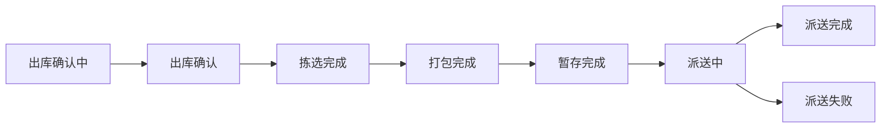

# 出库单状态词典

供 Agent 从返回 JSON 中解读出库单状态。状态码来源：[出库单订单状态列表](https://developer.winit.com.cn/document/detail/id/275.html)。

## 状态码对照表

| 状态码 | 状态名 | 万邑联页面 | 解读要点 |
|--------|--------|------------|----------|
| DR | 草稿 | 草稿 | 表示草稿，尚未提交 |
| CFI | 出库确认中 | 已下单 | 仓库确认中 |
| CF | 出库确认 | 已下单 | 确认完成，待拣货 |
| PKC | 拣选完成 | 仓库处理中 | 拣货完成，待打包 |
| PAC | 打包完成 | 仓库处理中 | 打包完成，可能进入暂存 |
| TSC | 暂存完成 | 仓库处理中 | 暂存场景：可能待增值信息或自提等 |
| OBC | 出库完成 | 出库完成 | 自提类交接完成 |
| DLI | 派送中 | 出库完成 | 已交尾程；跟踪号见 JSON 字段 |
| HPO | 移交邮局 | 出库完成 | 非跟踪渠道，已交邮局 |
| DLC | 派送完成 | 派送完成 | 妥投完成 |
| DLF | 派送失败 | 派送失败 | 派送失败 |
| DSC | 销毁完成 | 出库完成 | 销毁完成 |
| EX | 异常 | 异常 | 可能含部分子单异常 |
| VOI | 作废中 | - | 截单/作废处理中 |
| VO | 已作废 | 已作废 | 作废完成 |

## 出库单类型与状态流转

### 标准出库（派送跟踪服务）

### 标准出库（非派送跟踪服务）

### 自提出库

### 销毁出库

### 平台面单（3PL / OSF822）

当剪枝结果为 **`isPlatformWaybill: true`**（产品码 OSF822* 或下单产品名含 3PL）时：**数据含义上**，尾程轨迹通常不在万邑通侧同步；若 JSON 含 **trackingNum / trackingNos**，仅作字段归纳。**职责边界**：不向客户承诺可获取/下载面单或任何线下操作路径。

## JSON 中的状态字段

- **出库单层级**：`status`（状态码）、`statusName`（状态中文名）
- **子单/包裹层级**：`packageList[].status`，可能与出库单 `status` 不一致（一单多包裹时）
- **作废相关**：`reasonForVoid`（作废原因）、`isOperateByWinit`（是否由万邑通作废）
