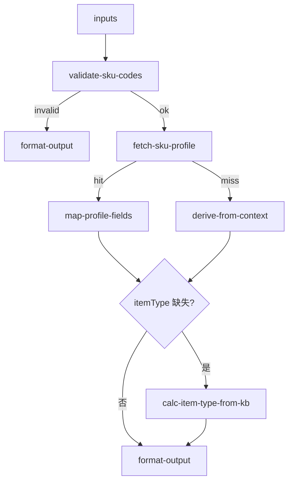

# sku/profile 专家设计

共享事实专家：给定商品编码 `skuCode`（可选仓/进口国），返回档案属性、`supervisorMode` / `itemPackaging` / 箱套 `type`、发布态、**禁限标记/原因/来源**与适用规则摘要。字段名对齐 OpenAPI。首期以 API + 规则计算为主，**无或轻量 LLM**。不依赖 MMS 知识图谱。

---

## 调用说明

### 适用场景

- 上游专家需要商品 **尺重、特殊属性、`supervisorMode`、发布态、入出库禁止及来源** 等结构化事实。
- 典型消费方：`inbound-exception-check`、`inbound-process-guide`、`value-add-product-recommendation`、`inbound-capacity-availability`、**`registration-guide`（限直发/禁止入出库/退回事实）**、`compliance-check`（P2）。
- **不适用**：教客户注册/解禁操作（→ `sku/registration-guide`）；查验单进度（→ `sku/inspection-status` P2）；在库数量（→ `storage/inventory-query`）；禁限运长文合规判定（→ `sku/compliance-check` P2）。

### 最小入参

- `inputs.skuCodes`（至少 1 个；若上游仅有 `productCode`，归一为 `skuCode`）
- 顶层公共字段 `customerCode`（租户标识；由 start 直接连入 `derive-from-context` 的 scope，不属于 `inputs`）

### 参数提示

- `skuCodes`：支持 1～20 个；超过上限分批由 planner 拆分。
- `warehouseCode` / `importCountryCode`：可选，用于过滤进口国维度属性与适用规则；**有进口国时建议传入**。
- `fetchProfile`：可选切片，默认 `facts_core`；见 [sku-data-fetch-strategy.md](../../docs/plan/sku-data-fetch-strategy.md)。
- 若上游已在 `inputContext.previousOutput` 或 `enrichedContext` 中带部分 merchandise 字段，本专家可合并并标注 `dataSource: derived`。

### 示例调用

**示例 1：单 SKU 档案查询（异常核实前置）**

```json
{
  "query": "查询 SKU001 的特殊属性与件型，供入库异常核实使用",
  "customerIntent": "核实该 SKU 是否带电、件型是否为大件",
  "customerCode": "CUST12345",
  "inputContext": {
    "chainId": "case-20260709-001",
    "sourceExpertId": "inbound/inbound-exception-check"
  },
  "inputs": {
    "skuCodes": ["SKU001"],
    "importCountryCode": "US"
  }
}
```

**示例 2：批量 SKU + 降级派生**

```json
{
  "query": "批量获取入库单内 SKU 的发布态与特殊属性",
  "customerIntent": "判断多个 SKU 是否可参与增值推荐",
  "customerCode": "CUST12345",
  "inputContext": {
    "chainId": "case-20260709-002",
    "sourceExpertId": "value-add/value-add-product-recommendation",
    "previousOutput": {
      "structured": {
        "merchandiseList": [
          { "skuCode": "SKU-A", "weight": 0.5, "hasBattery": true }
        ]
      }
    }
  },
  "inputs": {
    "skuCodes": ["SKU-A", "SKU-B"]
  }
}
```

---

## 1. 输入设计

### 框架顶层

| 字段 | 类型 | 说明 |
|------|------|------|
| query | string | 任务说明 |
| customerIntent | string | 调用方意图摘要 |
| customerCode | string | 顶层公共客户编码；start 直连 `derive-from-context.customerCode`，用于租户 scope 隔离 |
| inputContext | object | `chainId`；可选 `sourceExpertId`、`previousOutput` |

### inputs 业务字段

| 字段 | 类型 | 必填 | 说明 |
|------|------|------|------|
| skuCodes | string[] | 是 | SKU 编码列表 |
| warehouseCode | string | 否 | 仓库编码 |
| importCountryCode | string | 否 | 进口国/地区（建议传入，用于申报/属性按国别解析） |
| fetchProfile | string | 否 | `facts_core`（默认）/ `audit_status` / `barcode_third` / `facts_compliance` / `minimal`；见 fetch 策略 |

---

| 来源 | 路径 / Action | 内容 |
|------|---------------|------|
| MMS 商品查询（主） | **`winit.item.page.list`** | 档案、申报、动态属性；响应在 `prune-and-map-item` 剪枝 |
| MMS 商品查询（遗留） | `winit.mms.item.list` | 代理未注册 page.list 时降级 |
| 订单派生（降级） | OMS `getOrderDetail.merchandiseList` | `previousOutput` 或 enriched 中的 merchandise |
| 货型标准 | `_kb/product-team/winit/common/products/cargo-type-standard-internal-winit.md` | 尺重 → `itemType` 计算 |
| 特殊属性 | `_kb/system-guide/data/商品/海外仓商品/海外仓特殊属性商品定义.md` | 属性枚举与规则摘要 |

**降级策略**：

1. API 成功 → `dataSource: api`
2. API 失败但有订单 merchandise → 映射已知字段，`dataSource: derived`，`missingFacts` 列出缺口
3. 仅 KB 可推断（如件型）→ `dataSource: kb`
4. 完全无数据 → 仅保留 `{ skuCode, dataSource: "missing", confidence: "low", scope }` 标识元数据行；API 成功返回空结果时 `missingFacts` 写 `sku_not_found`；插件响应 `code != 0`、响应 `data` 无效或 local proxy 异常时，`fetchMeta.error/source/strategy` 必须明确失败，`derive-from-context` 改写 `profile_fetch_error` 与 `api_unavailable`，不得写 `sku_not_found`，也不得生成业务占位事实

`enrichedContext.*.skus` 中已经符合 `ProfileRow` 契约且作用域安全的行直接复用，保留 nested `specialFlags`、`managementMode`、批次事实和 `fieldProvenance`；只有普通 `merchandiseList` 才进入派生映射。

复用作用域规则：

- `scope.customerCode`：值来自 start 顶层公共 `customerCode`，不从 `inputs.customerCode` 读取。双向隔离时只允许同租户、源 `ALL`，或当前与来源双方均显式 `null`；当前无客户时不得复用特定租户行，任一来源属性缺失时记录 `scope_unknown`。
- `scope.importCountryCode`：双向隔离。只允许精确国别、源 `ALL`，或当前与来源双方均为无国别；当前未指定进口国时不得复用具体国家行，任一来源属性缺失时记录 `scope_unknown`。
- 未指定进口国时只读取 `ALL` 或显式无国别的 attributes/declarations，不回退具体国家首条。若原始 API 行含具体国家记录，结果 scope 不写 `importCountryCode`，禁止后续任意国家把它当 global 复用。
- API、merchandise 派生和 `missing` 新行都保存当前 customer scope；有明确/可信进口国作用域时才保存 `importCountryCode`，供后续链路复用校验。
- 复用 enriched 容器时读取其 `missingFacts`，仅按事实字符串末尾 SKU 精确关联传播；其他 SKU 的缺口不得串入。

事实字段采用三态：`true` / `false` 表示已有明确证据，`null` 表示缺失或未知。不得把缺字段折叠成 `false`。`fieldProvenance` 使用扁平字段路径记录 `api` / `derived` / `unknown`；所有输出 `isUrgent` 的切片必须同时输出 `fieldProvenance.isUrgent`，`facts_compliance.dg` 必须输出 `fieldProvenance.dg`。节点内部 `_missingFacts` 在 `derive-from-context` 汇总进顶层 `missingFacts` 后删除，不进入最终 SKU 行。

指定 `importCountryCode` 时，`attributes` / `declarations` 只按“精确国别 → `ALL` → 无国别”选择；未指定时只按“`ALL` → 无国别”选择。均禁止回退其他国家首条数据。

---

## 3. 工作流编排



### 节点顺序

1. `validate-sku-codes`：非空、去重、数量上限
1. `validate-sku-codes`：非空、去重、上限 20；`productCode` → `skuCode`
2. `resolve-fetch-plan`（设计新增）：按 `fetchProfile` 构建 `winit.item.page.list` 请求（批量 `skuCodes`，禁止 per-sku 循环）
3. `fetch-sku-profile`：调用 **`winit.item.page.list`**（遗留降级 `winit.mms.item.list`）
4. `prune-and-map-item`（设计新增）：响应剪枝 + 嵌套字段映射；**禁止**原始 `list[]` 进 LLM
5. `derive-from-context`：合并 `previousOutput.merchandiseList` 等派生字段
6. `calc-item-type-from-kb`：按货型标准补算 `itemType`
7. `format-output`：组装 `structured` + 简短 `analysis`（可选）

> 剪枝与 API 选型 SoT：[docs/plan/sku-data-fetch-strategy.md](../../docs/plan/sku-data-fetch-strategy.md)

---

## 4. 节点说明

| 节点文件 | 输入 params | 输出 |
|----------|-------------|------|
| `validate-sku-codes.ts` | `skuCodes`, `fetchProfile?` | `normalizedSkuCodes`, `validationError?` |
| `resolve-fetch-plan.ts` | `normalizedSkuCodes`, `fetchProfile`, `importCountryCode?` | `pageListRequest`, `fetchMeta` |
| `fetch-sku-profile.ts` | `pageListRequest` | `rawItems[]`, `fetchMeta` |
| `prune-and-map-item.ts` | `rawItems[]`, `fetchProfile`, `importCountryCode?` | `apiProfiles[]` |
| `derive-from-context.ts` | `apiProfiles`, `fetchMeta`, `inputContext`, `customerCode?`, `importCountryCode?` | `mergedProfiles[]`、`missingFacts[]`；区分 API 失败与真实查无 |
| `calc-item-type-from-kb.ts` | `mergedProfiles` | `skus[]`（含 `itemType`） |
| `format-output.ts` | `skus[]`, `missingFacts`, `inputContext?` | `result`, `outputContext` |

---

## 5. 输出设计

### structured 字段

| 字段 | 类型 | 说明 |
|------|------|------|
| skus | object[] | 商品档案列表 |
| skus[].skuCode | string | 商品编码（OpenAPI `skuCode`；同义 `productCode`） |
| skus[].code | string \| null | 商品条码 M 码（OpenAPI `code`） |
| skus[].specification | string \| null | 商品规格 |
| skus[].supervisorMode | string \| null | `SI` / `SKU`；缺失时为 `null` |
| skus[].type | string \| null | 箱套：`BOX` / `SUITE`；普通商品 `null`（list 未必直出） |
| skus[].itemPackaging | string \| null | `LOGISTICS` / `SALES` / `NUDE_CARGO` |
| skus[].isActive | string \| null | `Y` / `N` |
| skus[].publishStatus | string \| null | published / draft / auditing / returned / inactive；缺失或未知枚举为 `null` |
| skus[].prohibitInbound | boolean \| null | 禁入聚合三态：任一可信来源为 `true` → `true`；两来源均明确 `false` → `false`；其余 → `null` |
| skus[].prohibitOutbound | boolean \| null | 当前 `winit.item.page.list` SoT 未确认来源，API 行固定 `null` 并写入 `missingFacts`；不得猜测同名字段。derived 行可保留上游明确提供的三态事实 |
| skus[].prohibitReason | string \| null | 禁止原因摘要 |
| skus[].prohibitSource | string | rule / manual / unknown；无字段时 `unknown` |
| skus[].prohibitInboundReason | string \| null | 禁止入库原因摘要 `[待确认]` |
| skus[].directShipmentRestriction | string \| null | unlimited / seller_direct |
| skus[].restrictionReason | string \| null | 限直发原因 |
| skus[].rejectReason | string \| null | 审核退回原因（page.list `declarations.returnReason`，受 status 规则约束） |
| skus[].standardScript | string \| null | 退回对客话术（同上；下游 LLM 可截断） |
| skus[].estimateAuditDate | string \| null | 应维护完成时间（`attributes.estimateAuditDate`） |
| skus[].isUrgent | boolean \| null | 是否已加急 |
| skus[].itemType | string \| null | small / medium / large / oversized（**KB 计算**，非 API）；长、宽、高、重量任一缺失或非正数时为 `null` |
| skus[].registeredDimensions | object \| null | 自 `registerLength/Width/Height/Weight` 映射 |
| skus[].verifiedDimensions | object \| null | 核实尺重 |
| skus[].specialFlags | object | isBattery, isWithLiquid, isWithPowder, isWithMagnetism, isFood, isDangerous, isFragile；各值均为 `boolean \| null` |
| skus[].managementMode | object | supervisorMode (`string \| null`)、isBatchManager (`boolean \| null`)、batchManagerType (`string \| null`)、hasExpiry (`boolean \| null`) |
| skus[].fieldProvenance | object | 扁平字段路径 → `api` / `derived` / `unknown`；六种受支持 fetchProfile 切片都保留自身三态布尔及发布状态字段的 provenance，包含输出的 `isUrgent`，`facts_compliance` 另含 `dg` |
| skus[].scope | object | `{ customerCode: string \| null, importCountryCode?: string \| null }`；缺少进口国属性表示 scope 未知，显式 `null` 才表示无国别；用于 enriched 复用隔离，不是业务事实 |
| skus[].applicableRules | string[] | 适用规则摘要 |
| skus[].handlingRequirements | string[] | 作业要求 |
| skus[].dataSource | string | api / derived / kb / missing；`missing` 行只含标识元数据，不含业务事实 |
| skus[].confidence | string | high / medium / low |
| missingFacts | string[] | 未能确认的事实；API 成功查无用 `sku_not_found:SKU-B`，调用错误用 `profile_fetch_error:SKU-B`，API 不可用用 `api_unavailable:SKU-B` |
| fetchMeta | object | API 调用元数据 |

### outputContext / enrichedContext

- 开启 `x_recaller_propagate_previous_enriched_context: true`（manifest 根级）
- 写入域索引键 **`sku/profile`**，值为 `{ skus, missingFacts, fetchMeta }` 子集，供下游 merge

### analysis 原则

- 共享专家：**简短事实摘要**，不对客长文 SOP
- 列出 `missingFacts` 时说明建议补参或改调 `registration-guide`
- 不引用飞书链接、内部 API 文档名

### 示例 structured 输出

```json
{
  "skus": [
    {
      "skuCode": "SKU001",
      "code": "M123456",
      "specification": null,
      "supervisorMode": "SI",
      "type": null,
      "itemPackaging": "LOGISTICS",
      "isActive": "Y",
      "publishStatus": "published",
      "prohibitInbound": false,
      "prohibitOutbound": null,
      "prohibitReason": null,
      "prohibitSource": "unknown",
      "prohibitInboundReason": null,
      "directShipmentRestriction": "seller_direct",
      "restrictionReason": "品牌在海关知识产权系统有备案，限制为自发货入仓",
      "rejectReason": null,
      "itemType": "small",
      "registeredDimensions": { "length": 10, "width": 8, "height": 5, "weight": 0.5, "unit": "kg" },
      "verifiedDimensions": null,
      "specialFlags": { "isBattery": true, "isWithLiquid": false, "isWithPowder": false, "isWithMagnetism": false, "isFood": false, "isDangerous": false, "isFragile": false },
      "managementMode": { "supervisorMode": "SI", "isBatchManager": false, "batchManagerType": null, "hasExpiry": false },
      "fieldProvenance": {
        "publishStatus": "api",
        "prohibitInbound": "api",
        "prohibitOutbound": "unknown",
        "specialFlags.isBattery": "api",
        "managementMode.isBatchManager": "api",
        "managementMode.batchManagerType": "unknown",
        "managementMode.hasExpiry": "api"
      },
      "applicableRules": ["带电品需填报电池信息"],
      "handlingRequirements": [],
      "dataSource": "api",
      "confidence": "high"
    }
  ],
  "missingFacts": [
    "box_suite_type_unknown:SKU001",
    "prohibit_source_unknown:SKU001",
    "prohibit_outbound_unknown:SKU001",
    "management_mode_unknown:batchManagerType:SKU001"
  ],
  "fetchMeta": { "requested": 1, "found": 1, "source": "winit.item.page.list", "fetchProfile": "facts_core", "pruned": true }
}
```

---

## 6. 对客约束

- 本专家默认由上游调用；若直连对客，仅输出事实，不教注册/解禁步骤
- 不输出在库数量、额度信息、**不合规禁售库存数量**（→ `storage`）
- 不输出查验单进度（→ `inspection-status`）
- 禁限运最终判定不在本专家（→ `compliance-check` 或人工）
- `prohibitSource=manual` 时由调用方/`registration-guide` 决定升级人工，本专家只吐事实
- **不使用 `itemCode`**；商品编码统一 `skuCode`（注册侧 `productCode` 同义）

---

## 7. 待确认事项

- MMS `winit.mms.item.list` 与契约字段逐项核对（实现期对照 `03-查询商品.md`）
- 箱套 `type` 是否需另调 `winit.item.box.save` 相关查询
- 批量查询限流与缓存策略
- `prohibitOutbound` / `prohibitSource` / `directShipmentRestriction` / `restrictionReason` / `rejectReason` / `prohibitInboundReason` 字段映射（见 [sku-api-matrix.md](../../docs/plan/sku-api-matrix.md)）
