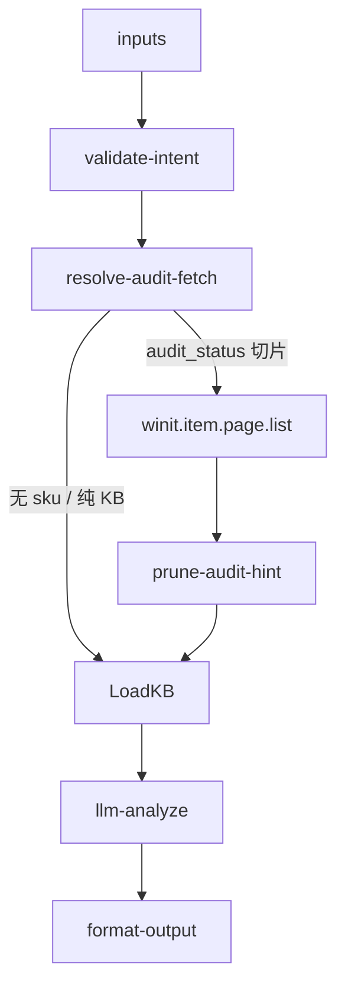

# sku/registration-guide 专家设计

对客专家：海外仓商品注册、审核、退回重提、修改/失效操作引导，以及「商品不存在」「未发布无法下入库单」等报错解释。KB + LLM 为主路径；可选只读审核 API 增强。

---

## 调用说明

### 适用场景

- 客户询问如何注册/批量注册 SKU、审核进度、**加急**、退回如何修改、商品修改/失效。
- **新品能否发货/入库**（有商品链接、无 SKU）。
- **限直发原因与解法**、**特殊属性解除**（带电/液体等）。
- **禁限解禁浅层**（`guide_unban`）：引用 profile 禁止标记与来源；系统规则类补资料 SOP；人工来源优先升级。
- 下入库单报错「商品信息不存在」「未发布」「禁止入库」需操作指引。
- 承接 planner 自 `inbound-permission-apply` 迁出的 **`sku_registration`** 意图。
- **不适用**：SKU 属性事实批量查询（→ `sku/profile`）；查验进度（→ `sku/inspection-status` P2）；账户 CBM/SKU 额度（→ `inbound/inbound-capacity-availability`）；权限/偏好开通（→ `inbound/inbound-permission-apply`）；入出库打包方式（旅程域空缺；包装类型事实 → `profile`）。

### 最小入参

- `inputs.topic` 或 `inputs.intentType` 描述咨询主题

### 参数提示

- `intentType` 建议枚举：`expedite` / `carriability` / `register` / `audit_status` / `resubmit` / `modify` / `inactive` / `blocked_inbound` / `direct_shipment` / `attribute_change` / `unban` / `general`
- `productLink`：新品承运场景（`carriability`）建议提供
- `skuCode`：有则查审核状态、匹配退回 FAQ；无则走通用注册指引
- `importCountryCode`：多进口国场景必填
- `customerCode`：框架顶层租户字段；复用上游 Profile 或调用只读 API 时必须透传
- 若 planner 已前置 `sku/profile`，可通过 `inputContext.previousOutput.structured.skus` 读取发布态与禁限来源；仅安全契约满足时避免重复拉数
- `prohibitSource=manual` 时优先 `need_human`，勿假装可自助解禁
### 示例调用

**示例 1：如何注册**

```json
{
  "query": "引导客户完成海外仓商品注册",
  "customerIntent": "客户问怎么注册新的海外仓 SKU",
  "inputContext": { "chainId": "case-20260709-010" },
  "inputs": {
    "topic": "如何新增商品注册",
    "intentType": "register"
  }
}
```

**示例 2：商品不存在无法下入库单（带 SKU）**

```json
{
  "query": "解释下入库单报错商品信息不存在并给出处理步骤",
  "customerIntent": "客户下单提示商品信息不存在，SKU 为 ABC-001",
  "inputContext": {
    "chainId": "case-20260709-011",
    "sourceExpertId": "inbound/inbound-order-manage"
  },
  "inputs": {
    "topic": "商品信息不存在",
    "intentType": "blocked_inbound",
    "skuCode": "ABC-001",
    "importCountryCode": "DE"
  }
}
```

**示例 3：审核退回重提**

```json
{
  "query": "商品审核被退回，指导客户修改后重新提交",
  "customerIntent": "客户说 SKU 审核退回了，不知道怎么改",
  "inputContext": { "chainId": "case-20260709-012" },
  "inputs": {
    "topic": "审核退回修改",
    "intentType": "resubmit",
    "skuCode": "XYZ-999",
    "importCountryCode": "UK"
  }
}
```

**示例 4：注册加急**

```json
{
  "query": "客户要求 SKU 注册加急",
  "customerIntent": "客户问审核要多久，能否加急",
  "inputContext": { "chainId": "case-20260710-020" },
  "inputs": {
    "topic": "SKU 注册加急",
    "intentType": "expedite",
    "skuCode": "GD11003608W01"
  }
}
```

---

## 1. 输入设计

### 框架顶层

| 字段 | 类型 | 说明 |
|------|------|------|
| query | string | 任务说明 |
| customerIntent | string | 客户咨询原文摘要 |
| customerCode | string | 客户编码；租户 scope，复用 Profile 与只读 API 时必须传递 |
| inputContext | object | `chainId`；可选 `sourceExpertId`、`previousOutput`（含 `sku/profile` 快照） |

### inputs 业务字段

| 字段 | 类型 | 必填 | 说明 |
|------|------|------|------|
| topic | string | 是* | 咨询主题关键词（与 intentType 二选一必填） |
| intentType | string | 是* | expedite / carriability / register / audit_status / resubmit / modify / inactive / blocked_inbound / direct_shipment / attribute_change / unban / general |
| skuCode | string | 否 | SKU 编码 |
| importCountryCode | string | 否 | 进口国 |
| productLink | string | 否 | 商品链接（承运咨询） |

---

## 2. 数据拉取与兜底

| 来源 | 路径 | 内容 |
|------|------|------|
| **LLM Wiki（主）** | `docs/sku/flows/01`–`07` | 加急、承运、退回、直发、禁入/禁售、属性解除、证书 |
| 系统路径 | `docs/sku/appendix/system-paths.md` | 万邑联/TOM 查询路径 |
| 注册 FAQ | `_kb/system-guide/.../如何新增商品注册.md` | 补充 |
| 审核状态 API（可选） | **`winit.item.page.list`** + `fetchProfile=audit_status` | `estimateAuditDate`、`returnReason`、`standardScript`、发布态 |
| 维护任务列表（补充） | `mms.itemmttask.queryItemMtEntitys` | 仅当无 sku 或 page.list 缺字段；**无**应维护完成时间 |
| 上游 profile | `inputContext.previousOutput` from `sku/profile` | 限直发/禁止入出库事实与 `prohibitSource` |

**首期策略**：**不代客调用** `registerProduct` 写入；KB + LLM 引导 + **按意图**只读拉数（见 [sku-data-fetch-strategy.md](../../docs/plan/sku-data-fetch-strategy.md)）。

**API 选型**：有 `skuCode` 的加急/退回/审核态 → **page.list 审核切片**；纯 KB 引导（register/carriability）→ 不打 API；`blocked_inbound` / `unban` → profile `facts_core` 或复用上游快照。

**降级**：无 API 时指引「万邑联 → 商品 → 商品维护信息」自助查看；`missingInfo` 列出仍缺字段。

### Profile 复用与审核事实安全契约

- 仅复用精确 SKU、`dataSource=api`、客户 scope 匹配且包含至少一个明确审核/发布事实的行；`derived` / `kb` / `missing` 与只有 `skuCode` 的空壳行均不复用。
- 当前请求指定进口国时，来源 scope 只接受精确进口国或 `ALL`；显式 `null` 仅表示无国别事实，不代表所有国家。当前请求未指定进口国时，只接受来源显式 `null` 或 `ALL`。
- `scope_mismatch` / `scope_unknown` 行不得进入 LLM；`resolve-audit-fetch` 输出清洗后的安全 `profileSnapshot`，`fetch-audit-status` 再次执行同一安全门。
- 插件明确报错时输出 `auditFactStatus=error` 并转安全人工；没有匹配事实或命中空壳行时输出 `auditFactStatus=not_found`，两者不得混淆。

---

## 3. 工作流编排



### 节点顺序

1. `validate-intent`：规范化 `topic` / `intentType`；缺关键信息标 `need_info` 候选
2. `resolve-audit-fetch`：按 intent 决定是否拉 API 及 `fetchProfile`（见 fetch 策略）
3. `fetch-audit-status`：调用 **`winit.item.page.list`**（`audit_status` 切片），映射为 `auditStatusHint` / `rejectReason`（非原始 JSON）
4. `load-sku-kb`：按 intent 检索 KB 切片
5. `llm-analyze`：仅收 `kbChunks` + `auditStatusHint` + 剪枝后 `profileSnapshot`
6. `format-output`：映射 `structured.branch` 与 `sopSteps`

---

## 4. 节点说明

| 节点文件 | 输入 params | 输出 |
|----------|-------------|------|
| `validate-intent.ts` | `topic`, `intentType`, `skuCode` | `normalizedIntent`, `needsSkuCode` |
| `load-sku-kb.ts` | `normalizedIntent`, `importCountryCode?` | `kbChunks[]` |
| `resolve-audit-fetch.ts` | `normalizedIntent`, `skuCode`, `customerCode`, `importCountryCode?`, `profileSnapshot?` | `shouldFetch`, `fetchProfile`, 清洗后的 `profileSnapshot` |
| `fetch-audit-status.ts` | `skuCode`, `customerCode`, `importCountryCode`, `fetchProfile`, `profileSnapshot?` | `auditStatusHint`, `auditFactStatus`, `rejectReason?`, `estimateAuditDate?` |
| `llm-analyze`（LLM） | `kbChunks`, `customerIntent`, `auditStatusHint?`, `profileSnapshot?` | `analysisResult` |
| `format-output.ts` | `analysisResult`, `inputContext?` | `result`, `outputContext` |

---

## 5. 输出设计

### structured 字段

| 字段 | 类型 | 说明 |
|------|------|------|
| branch | string | 见下表 |
| topicMatched | string | 匹配的 KB 主题 |
| sopSteps | string[] | 对客操作步骤 |
| auditStatusHint | string | 审核状态/应维护完成时间（若已拉 API） |
| expediteEligible | boolean | 是否展示加急入口（产品能力） |
| rejectReason | string | 退回原因摘要（若有） |
| prerequisites | string[] | 前置条件 |
| missingInfo | string[] | 仍缺信息（如 skuCode、importCountryCode） |
| expertRouting | string | 需转其他专家时的说明 |
| confidence | string | high / medium / low（见 [sku-plan.md §七](../../docs/plan/sku-plan.md)） |

### 分支定义

| branch | 含义 |
|--------|------|
| `guide_expedite` | 注册加急；引用应维护完成时间 |
| `guide_carriability` | 新品能否发/入（浅层：清单+任务单+引导注册） |
| `need_info` | 信息不足 |
| `guide_register` | 新增/批量注册指引 |
| `guide_resubmit` | 审核退回后的修改重提 |
| `guide_direct_shipment` | 限直发原因与两种解法 |
| `guide_attribute_change` | 取消特殊属性勾选 |
| `guide_unban` | 禁入/禁出解禁浅层 SOP（系统规则类）；人工来源见 `need_human` |
| `blocked_unpublished` | 未发布或禁止入库导致无法下单 |
| `handoff_compliance` | 需合规专席（P2 `compliance-check`） |
| `handoff_inspection` | 需查验单解释（P2 `inspection-status`） |
| `need_human` | KB 无覆盖、个案争议、或 `prohibitSource=manual` |

### analysis 原则

- 分步骤、可执行；界面描述为「万邑联 → 商品 → …」
- 不引用飞书链接、内部表名、API action 名
- 费用/额度类问题路由至 `inbound-capacity-availability`
- 合规长文不在本专家做最终判定
- 建议输出 `confidence`；人工禁止、查验争议、深判无规则按 [sku-plan.md §七](../../docs/plan/sku-plan.md) 升级
### 示例 structured 输出

```json
{
  "branch": "blocked_unpublished",
  "topicMatched": "商品信息不存在",
  "sopSteps": [
    "登录万邑联，进入「商品」→「商品维护信息」",
    "搜索 SKU ABC-001，确认是否已注册且审核通过",
    "确认进口国与下入库单目的国一致",
    "若状态为草稿或审核中，请等待审核通过后再下入库单"
  ],
  "auditStatusHint": null,
  "prerequisites": ["SKU 已注册", "审核已通过", "商品已发布"],
  "missingInfo": [],
  "expertRouting": null
}
```

---

## 6. Prompt 知识片段（实现期）

| 文件 | 说明 |
|------|------|
| `prompts/kb-expedite.md` | 加急话术、应维护完成时间（flows/02） |
| `prompts/kb-carriability.md` | 新品承运（flows/01） |
| `prompts/kb-register.md` | 注册/批量导入 |
| `prompts/kb-audit-resubmit.md` | 审核、退回（flows/03） |
| `prompts/kb-direct-shipment.md` | 限直发（flows/04） |
| `prompts/kb-attribute-change.md` | 属性解除（flows/06） |
| `prompts/kb-inbound-blocked.md` | 禁止入库/未发布（flows/05） |
| `prompts/kb-unban.md` | 解禁浅层（flows/05 + profile 来源） |
| `prompts/main.md` | 分支枚举、handoff / escalate 规则 |

---

## 7. 对客约束

- **不代客提交** `registerProduct` 或解禁写入；仅指引客户自助或联系商务
- 不输出在库数量、CBM 额度
- `handoff_compliance` 时明确「需进一步合规确认」，P2 前转人工
- `handoff_inspection` 时明确「需查验单进度/结论」，P2 前转人工或自助路径
- 升级人工：`prohibitSource=manual`、敏感品解禁、查验争议、系统疑似 Bug、客户要求代操作

---

## 8. 待确认事项

- `sku_registration` 从 `inbound-permission-apply` 迁出后的 planner 路由关键词表
- 审核 API 是否纳入 P1 实现或仅 P1.1 增强 → **P1.1**：`page.list` `audit_status` 切片（见 [sku-data-fetch-strategy.md](../../docs/plan/sku-data-fetch-strategy.md)）
- 与 `sku/profile` 的前置调用策略（blocked_inbound / unban 是否强制先 profile）
- 解禁写 API 是否存在及权限边界（见 [sku-api-matrix.md](../../docs/plan/sku-api-matrix.md)）
