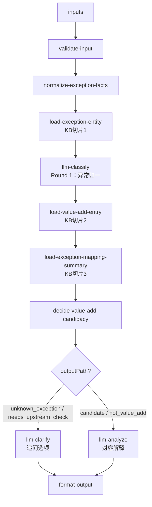

# value-add/value-add-exception-diagnosis 专家设计

入库异常增值诊断：作为**异常入口分流器**，基于异常编码、异常名称、对象层级、上游 `valueAddHandoff` 和客户描述，归一异常事实，判断是否进入 value-add 推荐链，并输出给 VASC 推荐专家的 handoff。

---

## 调用说明

### 适用场景

- 用户问某个入库异常编码/名称是什么、异常发生在哪个流程阶段、是否可能进入增值处理。
- 上游 `inbound/inbound-exception-check` 已识别异常事实，并通过 `valueAddHandoff` 传入。
- 不适用：VASC 推荐（→ `value-add-product-recommendation`）；服务项/原子配置（→ `value-add-service-config`）；已提交增值单状态（→ `value-add-order-status`）；入库差异责任核实（→ `inbound-exception-check`）。

### 最小入参

- `inputs.exceptionCode`、`inputs.exceptionName`、`inputs.customerDescription`、`inputs.valueAddHandoff` 至少提供一个。

### 参数提示

- `valueAddHandoff` 来自 `inbound-exception-check` 时优先使用，视为上游已核实事实。
- `exceptionCode` 可单独调用；未命中知识切片时只输出 `outputPath=unknown_exception` 和缺失项。
- 本专家不推荐 VASC，不判断责任，不承诺赔付；只回答“是否具备进入推荐链的证据”。
- 不从 OpenAPI 字段或异常状态反推 VASC 适用性。

### 示例调用

```json
{
  "query": "判断该异常是否进入增值推荐链",
  "customerIntent": "客户问 B01E1615 怎么处理",
  "customerCode": "C10001",
  "customerName": "",
  "username": "agent01",
  "language": "zh_CN",
  "inputContext": { "chainId": "case-20260624-001" },
  "inputs": {
    "exceptionCode": "B01E1615",
    "customerDescription": "包裹条码批量异常，客户想继续上架"
  }
}
```

```json
{
  "query": "消费入库异常专家的增值 handoff",
  "customerIntent": "入库异常核实后判断是否进入增值推荐链",
  "customerCode": "C10001",
  "customerName": "",
  "username": "agent01",
  "language": "zh_CN",
  "inputContext": { "chainId": "case-20260624-002", "sourceExpertId": "inbound-exception-check" },
  "inputs": {
    "valueAddHandoff": {
      "exceptionCode": "B01E1315",
      "exceptionName": "商品条码异常(需客户处理)",
      "exceptionObject": "商品",
      "objectLevel": "product",
      "exceptionCategory": "barcode_product",
      "inboundOrderNo": "WI49616707",
      "eventNo": "EVT202606240001",
      "customerActionHint": "客户希望原单继续上架",
      "evidenceSummary": {
        "source": "inbound-exception-check",
        "verified": true
      }
    }
  }
}
```

---

## 1. 输入设计

### 框架顶层（不写入 inputSchema）

| 字段 | 类型 | 说明 |
|---|---|---|
| `query` | string | 任务说明 |
| `customerIntent` | string | 业务问题摘要 |
| `customerCode` / `customerName` / `username` / `language` | string | 框架身份字段；不进入 `inputs` |
| `inputContext` | object | `chainId`；可选 `sourceExpertId`、`previousOutput` |

### inputs 业务字段

| 字段 | 类型 | 必填 | 说明 |
|---|---|---|---|
| `exceptionCode` | string | 条件 | 异常编码，如 `B01E1615`。 |
| `exceptionName` | string | 条件 | 异常名称。 |
| `exceptionDescription` | string | 否 | 异常定义或系统描述。 |
| `customerDescription` | string | 条件 | 用户原始描述。 |
| `exceptionObject` | string | 否 | 异常对象原始值，如包裹、商品、入库单。 |
| `objectLevel` | string | 否 | `order`/`package`/`product`/`item`/`pallet`/`unknown`。 |
| `exceptionNode` | string | 否 | 异常发生节点，如入库、卸货、验货、上架、库内。 |
| `inboundOrderNo` | string | 否 | 入库单号，只作上下文。 |
| `eventNo` | string | 否 | 异常单号，只作上下文。 |
| `customerActionHint` | string | 否 | 用户处理意图线索，传给下游推荐专家。 |
| `evidenceSummary` | object | 否 | 上游数量、条码、图片、状态等摘要。 |
| `valueAddHandoff` | object | 条件 | `inbound-exception-check` 输出的增值 handoff，优先级最高。 |

---

## 2. 知识架构（KB 切片 + LLM Prompt）

参照 `value-add-product-recommendation` 的切片模式，本专家不配置运行时向量检索，也不让 LLM 读取 `docs/value-add/` 全量材料。知识按**诊断用途**拆为 3 个 KB 切片 + 3 个 LLM Prompt：

| 分类 | 文件 | 用途 | 消费节点 |
|---|---|---|---|
| 异常实体层 | `prompts/kb-exception-entity.md` | 高频异常编码、名称、对象层级、阻断阶段、是否客户处理 | `normalize-exception-facts` / `llm-classify` |
| 增值入口层 | `prompts/kb-value-add-entry.md` | 什么异常可进入增值推荐链、什么异常必须先回到入库核实或人工 | `decide-value-add-candidacy` |
| 映射线索层 | `prompts/kb-exception-mapping-summary.md` | 是否存在异常到 VASC 关系的摘要证据；只作“可进入推荐链”证据 | `decide-value-add-candidacy` |
| Round 1 Prompt | `prompts/classify.md` | `llm-classify` 异常归一任务：补齐类别、对象层级、阻断阶段 | `llm-classify` |
| Round 1 副线 Prompt | `prompts/clarify.md` | 异常未知、描述模糊或 blocking 缺失时生成追问选项 | `llm-clarify` |
| 主 Prompt | `prompts/main.md` | `llm-analyze` 对客解释：说明归一结果、是否进入推荐链和缺失项 | `llm-analyze` |

---

## 3. 工作流（异常入口分流链）



### 节点说明

| 节点 | 类型 | 说明 |
|---|---|---|
| `validate-input` | 代码 | 校验异常编码、名称、描述或 `valueAddHandoff` 至少一项存在。 |
| `normalize-exception-facts` | 代码 | 合并 `valueAddHandoff`、直接入参、兼容 `inputContext.previousOutput.valueAddHandoff`，输出统一异常事实。 |
| `load-exception-entity` | 代码/textNode | 加载 `kb-exception-entity.md`，按异常编码或名称裁剪候选实体。 |
| `llm-classify` | **LLM Round 1** | 只做异常归一：输出 `exceptionCategory`、`objectLevel`、`blockedStage`、`requiresCustomerAction`。 |
| `load-value-add-entry` | 代码/textNode | 加载 `kb-value-add-entry.md`，提供进入推荐链的入口规则。 |
| `load-exception-mapping-summary` | 代码/textNode | 加载 `kb-exception-mapping-summary.md`，提供是否存在异常到 VASC 关系的证据。 |
| `decide-value-add-candidacy` | 代码 | 根据 Round 1 结果、入口规则、映射线索确定 `outputPath`、`isValueAddCandidate`、`missingEvidence`、`handoffFacts`。 |
| `llm-clarify` | **LLM Round 1 副线** | 当 `outputPath=unknown_exception`、`needs_upstream_check` 或存在 `blockingMissing` 时，生成异常事实追问选项；不推荐 VASC。 |
| `llm-analyze` | **LLM** | 只把已确定事实转成对客解释，不新增候选 VASC。 |
| `format-output` | 代码 | 按四字段规范组装输出，填充 `outputContext` 和 `enrichedContext`。 |

---

## 4. 输出设计

`format-output` 根级必须返回 `structured`、`analysis`、`outputContext`、`enrichedContext` 四字段。

### structured

| 字段 | 类型 | 说明 |
|---|---|---|
| `outputPath` | string | `candidate`/`not_value_add`/`unknown_exception`/`needs_upstream_check`。 |
| `normalizedException` | object | `code`、`name`、`definition`、`source`。 |
| `exceptionCategory` | string | 异常类别，如 `barcode_package`、`barcode_product`、`quantity_discrepancy`、`order_status`、`batch_attribute`、`wrong_item_mispack`。 |
| `exceptionObject` | string | 异常对象原始值。 |
| `objectLevel` | string | `order`/`package`/`product`/`item`/`pallet`/`unknown`。 |
| `blockedStage` | string | `unload`/`inspection`/`putaway`/`storage`/`outbound`/`unknown`。 |
| `requiresCustomerAction` | boolean | 是否需要客户动作。 |
| `isValueAddCandidate` | boolean | 是否具备进入增值推荐链的证据。 |
| `candidateEvidence` | array | 支持进入或不进入推荐链的证据对象。 |
| `missingEvidence` | object | 结构化缺失项，分 `blockingMissing` 与 `informationalMissing`。 |
| `handoffFacts` | object/null | 给 `value-add-product-recommendation` 的精简事实；仅候选路径填充。 |

#### missingEvidence 结构

```json
{
  "blockingMissing": [
    {
      "dimension": "exceptionCode",
      "reason": "无法稳定命中异常实体",
      "source": "ask_customer",
      "blocksPath": "isValueAddCandidate"
    }
  ],
  "informationalMissing": [
    {
      "dimension": "customerActionHint",
      "reason": "下游推荐会更准",
      "source": "ask_customer"
    }
  ]
}
```

#### handoffFacts 结构

```json
{
  "exceptionCode": "B01E1615",
  "exceptionName": "包裹条码批量异常（需客户处理）",
  "exceptionCategory": "barcode_package",
  "objectLevel": "package",
  "blockedStage": "putaway",
  "exceptionNode": "上架",
  "customerActionHint": "继续上架",
  "evidenceSummary": {
    "source": "value-add-exception-diagnosis",
    "isValueAddCandidate": true
  }
}
```

### analysis 约束

- 先说明识别到的异常类别、对象层级和阻断阶段，再说明是否进入推荐链。
- 不推荐 VASC 编码或服务名称；只提示可继续由推荐专家给候选。
- 不判责，不承诺赔付，不引用飞书、内部表或内部系统 URL。
- 未命中异常编码时，说明需要补充异常编码、异常单号或异常描述。

### outputContext

| 字段 | 说明 |
|---|---|
| `expertId` | 固定为 `value-add-exception-diagnosis`。 |
| `resultSummary` | 200 字以内摘要，概括异常归一结果、输出路径和是否进入增值推荐链。 |
| `chainId` | 透传 `inputContext.chainId`，缺失时为空字符串。 |

`outputContext` 是框架字段，不写入 `manifest.outputSchema`。

### enrichedContext

```json
{
  "valueAddExceptionFacts": {
    "exceptionCode": "B01E1615",
    "exceptionCategory": "barcode_package",
    "objectLevel": "package",
    "blockedStage": "putaway",
    "isValueAddCandidate": true,
    "outputPath": "candidate"
  }
}
```

---

## 5. 转人工 / 降级条件

- 异常编码和名称都无法命中，客户描述也不足以归一异常类型。
- 数量差异类异常且缺少入库差异核实结果；应回到 `inbound-exception-check`。
- 上游 handoff 与用户入参冲突（例如异常编码和对象层级明显不一致）。
- 客户要求责任判定、赔付、费用减免或仓库内部操作承诺。

---

## 6. 待确认事项

- `inbound-exception-check.valueAddHandoff` 的最终字段名需实现期复核，当前设计按 `exceptionCode`、`exceptionName`、`exceptionCategory`、`exceptionObject`、`objectLevel`、`inboundOrderNo`、`eventNo`、`customerActionHint`、`evidenceSummary` 兼容。
- `kb-exception-entity.md` 当前已抽取 35 个真实异常编码；仍是运行时裁剪切片，不等于全量异常体系。
- `kb-exception-mapping-summary.md` 当前只保留异常级关系数量和证据状态；映射线索只证明“可能进入推荐链”，不能替代 `value-add-product-recommendation` 的意图导航和约束过滤。
