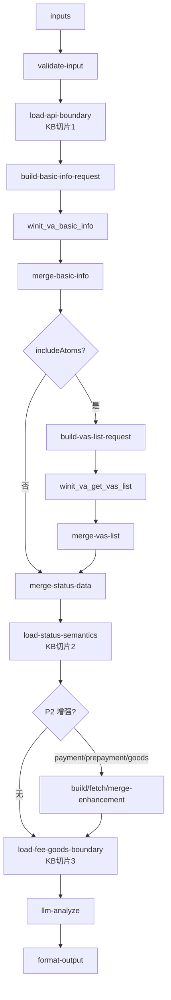

# value-add/value-add-order-status 专家设计

增值单状态查询：作为**已提交增值单事实查询器**，通过万邑通 OpenAPI 查询增值单主状态、原子执行进度、退回/部分完成原因，并可选查询事后费用和子货物明细。

---

## 调用说明

### 适用场景

- 客户提供增值单号，询问处理进度、原子状态、退回原因、部分完成原因。
- 客户询问已提交增值单的实际费用，或已有增值单对应的预估费用记录。
- 客户只有业务单号，需要辅助定位已提交增值单；若不唯一则追问增值单号。
- 不适用：未下单前费用预估；推荐 VASC（→ `value-add-product-recommendation`）；事前服务项配置（→ `value-add-service-config`）。

### 最小入参

- `inputs.vasOrderNo` 或 `inputs.businessNo` 至少一个。优先使用 `vasOrderNo`。

### 参数提示

- `vasOrderNo` 是对外业务字段；内部请求 `data.orderNo` 由 `build-*request` 节点映射。
- 只有 `businessNo` 时可能定位到多张增值单；不唯一时输出追问，不合并多单事实。
- `includeAtoms` 默认 true，P0 主路径为 `basicInfo` + `getVasList`。
- `includePayment`、`includePrepayment`、`includeGoods` 是 P2 增强分支，失败不影响主状态输出。
- 专家调用 JSON 顶层不要传 `data` 或 `action`；OpenAPI 请求体由内部节点拼装。

### 示例调用

```json
{
  "query": "查询增值单状态和原子进度",
  "customerIntent": "客户问 V106075100 处理到哪一步了",
  "customerCode": "C10001",
  "customerName": "",
  "username": "agent01",
  "language": "zh_CN",
  "inputContext": { "chainId": "case-20260624-007" },
  "inputs": {
    "vasOrderNo": "V106075100",
    "includeAtoms": true
  }
}
```

```json
{
  "query": "查询增值单实际费用",
  "customerIntent": "客户问这张增值单扣费多少",
  "customerCode": "C10001",
  "customerName": "",
  "username": "agent01",
  "language": "zh_CN",
  "inputContext": { "chainId": "case-20260624-008" },
  "inputs": {
    "vasOrderNo": "V106075100",
    "includeAtoms": true,
    "includePayment": true
  }
}
```

```json
{
  "query": "按业务单号查询关联增值单",
  "customerIntent": "客户只提供了入库单号，想查增值处理进度",
  "customerCode": "C10001",
  "customerName": "",
  "username": "agent01",
  "language": "zh_CN",
  "inputContext": { "chainId": "case-20260624-009" },
  "inputs": {
    "businessNo": "WI49616707",
    "includeAtoms": true
  }
}
```

---

## 1. 输入设计

### 框架顶层（不写入 inputSchema）

| 字段 | 类型 | 说明 |
|---|---|---|
| `query` | string | 任务说明 |
| `customerIntent` | string | 业务问题摘要 |
| `customerCode` / `customerName` / `username` / `language` | string | 框架身份字段；用于 OpenAPI 插件身份上下文，不进入 `inputs` |
| `inputContext` | object | `chainId`；可选 `sourceExpertId`、`previousOutput` |

### inputs 业务字段

| 字段 | 类型 | 必填 | 说明 |
|---|---|---|---|
| `vasOrderNo` | string | 条件 | 增值单号，通常为 V 前缀；优先使用。 |
| `businessNo` | string | 条件 | 业务单号，用于辅助定位。 |
| `orderEntry` | string | 否 | 增值单下单入口，接口需要时传入。 |
| `includeAtoms` | boolean | 否 | 是否查询原子列表，默认 true。 |
| `includePayment` | boolean | 否 | 是否查询事后实际费用，默认 false。 |
| `includePrepayment` | boolean | 否 | 是否查询已有增值单预估费用记录，默认 false。 |
| `includeGoods` | boolean | 否 | 是否查询子货物明细，默认 false。 |
| `parentGoodsId` | number | 否 | 查询子货物时的父货物 ID。 |

---

## 2. 数据拉取与兜底

本专家是 API 型 expert。接口事实来自专家主工作流内嵌 Coze 万邑通 OpenAPI 插件；`data` / `action` 不出现在专家调用边界。

| 场景 | Action | 优先级 | 说明 |
|---|---|---|---|
| 基本信息 | `wh.va.order.basicInfo` | P0 | 增值单主状态、业务单、VASC、时间和原子概览。 |
| 原子进度 | `wh.va.order.getVasList` | P0 | 原子状态、完成数量、退回/部分完成原因、已提交属性/附件事实。 |
| 实际费用 | `wh.va.order.getPaymentList` | P2 | 事后实际费用；失败不影响主状态。 |
| 已有订单预估费用 | `wh.va.order.getPrepaymentList` | P2 | 依赖 `orderNo`；不是未下单前报价。 |
| 子货物明细 | `wh.va.order.getSubGoods` | P2 | 子货物、商品、条码、批次、附件；不作为 VASC 适用性依据。 |

### OpenAPI 接入模式

| 项 | 决策 |
|---|---|
| 插件模式 | 后续 `coze.config.yml` 使用 `winitOpenapiPlugins`，为 P0 和 P2 接口分别配置显式插件节点 |
| 请求体来源 | `build-*request` 输出 `winitRequestData`；专家调用边界不接收 `data` / `action` |
| 字段映射 | `inputs.vasOrderNo` 映射为 API `data.orderNo` |
| 主路径 | 先执行 `basicInfo`，`includeAtoms=true` 时继续执行 `getVasList` |
| businessNo | 仅通过 `getVasList.data.businessNo` 辅助定位候选增值单；唯一定位后解析 `orderNo` 再查 `basicInfo`，不唯一时追问 `vasOrderNo` |

---

## 3. 知识架构（API 边界切片 + LLM Prompt）

参照 `value-add-product-recommendation` 的切片模式，本专家把 LLM 可见知识拆为 3 个 API 解释切片 + 1 个主 Prompt。知识切片只解释接口边界和状态/费用语义，不替代接口事实。

| 分类 | 文件 | 用途 | 消费节点 |
|---|---|---|---|
| API 主路径层 | `prompts/kb-api-boundary.md` | `basicInfo` / `getVasList` 字段边界、`vasOrderNo -> orderNo` 映射、businessNo 分支 | `load-api-boundary` |
| 状态语义层 | `prompts/kb-status-semantics.md` | 主状态、原子状态、退回/部分完成、nextAction 解释规则 | `merge-status-data` / `llm-analyze` |
| 费用与货物边界层 | `prompts/kb-fee-goods-boundary.md` | 实际费用、已有预估费用、子货物明细边界 | P2 增强分支 / `llm-analyze` |
| 主 Prompt | `prompts/main.md` | `llm-analyze` 只解释已查询事实、风险标记和下一步 | `llm-analyze` |

---

## 4. 分支语义

| 分支 | 触发 | 规则 |
|---|---|---|
| `status_main` | 有 `vasOrderNo` 或可唯一定位的 `businessNo` | 必须执行 `basicInfo`；`includeAtoms` 默认 true 时继续执行 `getVasList` |
| `clarify_vas_order_no` | 只有 `businessNo` 且无法唯一定位或定位到多张候选 | 不合并状态事实，要求用户补增值单号 |
| `payment_enhancement` | `includePayment=true` | 触发 `getPaymentList`，失败不影响主状态 |
| `prepayment_enhancement` | `includePrepayment=true` | 触发 `getPrepaymentList`，只解释已有增值单费用记录 |
| `goods_enhancement` | `includeGoods=true` 且 `parentGoodsId` 等字段齐全 | 触发 `getSubGoods`；缺字段时写入 `missingEvidence` |

---

## 5. 工作流（API 事实查询链）



### 节点说明

| 节点 | 类型 | 说明 |
|---|---|---|
| `validate-input` | 代码 | 校验 `vasOrderNo` / `businessNo`，处理追问分支。 |
| `load-api-boundary` | 代码/textNode | 加载 API 主路径边界，供 build/merge 节点裁剪。 |
| `build-basic-info-request` | 代码 | 把 `vasOrderNo` 映射为 `data.orderNo`，输出 `winitRequestData`。 |
| `winit_va_basic_info` | 插件 | OpenAPI action `wh.va.order.basicInfo`。 |
| `merge-basic-info` | 代码 | 合并主单事实，识别 `resolvedVasOrderNo` 和 businessNo 候选。 |
| `build-vas-list-request` | 代码 | 组装 `wh.va.order.getVasList` 请求。 |
| `winit_va_get_vas_list` | 插件 | OpenAPI action `wh.va.order.getVasList`。 |
| `merge-vas-list` | 代码 | 合并原子进度、退回/部分完成原因、已提交属性/附件事实。 |
| `merge-status-data` | 代码 | 输出 `statusFacts`、`riskFlags`、`nextAction`、`missingEvidence`。 |
| `load-status-semantics` | 代码/textNode | 加载状态语义切片。 |
| P2 增强节点 | 代码 + 插件 | 按开关查询费用或货物，失败写入 `optionalFetchFailures`。 |
| `load-fee-goods-boundary` | 代码/textNode | 加载费用和货物解释边界。 |
| `llm-analyze` | **LLM** | 只解释接口事实、风险标记和下一步，不反推推荐或配置。 |
| `format-output` | 代码 | 按四字段规范组装输出。 |

---

## 6. 输出设计

`format-output` 根级必须返回 `structured`、`analysis`、`outputContext`、`enrichedContext` 四字段。

### structured

| 字段 | 类型 | 说明 |
|---|---|---|
| `outputPath` | string | `status_found`/`clarify_vas_order_no`/`api_failed`/`not_supported`。 |
| `vasOrderNo` | string | 增值单号。 |
| `status` | string | 主状态编码。 |
| `statusDesc` | string | 主状态描述。 |
| `orderDate` | string | 接口返回的下单时间。 |
| `estimateCompleteTime` | string | 系统预计完成时间；当地展示时间缺失时才对客回退使用。 |
| `estimateCompleteTimeLocal` | string | 页面展示的当地预计完成时间，不是 SLA 承诺。 |
| `actualCompleteTime` | string | 主单实际完成时间；不用原子时间代替。 |
| `businessOrder` | object | 关联业务单和异常信息。 |
| `warehouse` | object | 仓库编码、名称和国家信息。 |
| `vasc` | object | VASC 编码、名称、审核和确认信息。 |
| `atomProgress` | array | 原子状态、完成时间、完成数量、退回/部分完成原因。 |
| `riskFlags` | array | 退回、部分完成、长时间待处理、需客户确认等。 |
| `nextAction` | string | `wait`/`provide_materials`/`contact_support`/`clarify_vas_order_no`/`not_supported_pre_order_quote`。 |
| `paymentSummary` | object/null | 实际费用摘要。 |
| `prepaymentSummary` | object/null | 已有增值单预估费用摘要。 |
| `goodsSummary` | object/null | 子货物明细摘要。 |
| `missingEvidence` | array | 缺失字段或无法查询原因。 |
| `optionalFetchFailures` | array | P2 增强接口失败列表。 |
| `needsClarification` | boolean | 是否需要追问。 |
| `clarificationFields` | array | 需要用户补充的字段。 |

### analysis 约束

- 客观呈现接口返回事实；可说明系统预计完成时间，但明确它不是 SLA 承诺。
- 已完成时优先使用主单 `actualCompleteTime`；只有原子 `completeTime` 时，仅称为原子服务处理时间。
- `businessNo` 不唯一时，要求补充增值单号，不把多单合并。
- `getPrepaymentList` 只解释已有增值单费用记录，不回答未下单前报价。
- 费用查询失败不影响状态主路径输出。
- 不从增值单状态反推“应该选哪个 VASC”或“服务项应如何配置”。
- 不引用内部系统 URL、接口文档或离线来源。

### outputContext

| 字段 | 说明 |
|---|---|
| `expertId` | 固定为 `value-add-order-status`。 |
| `resultSummary` | 200 字以内摘要，概括输出路径、增值单主状态、关键原子进度和下一步动作。 |
| `chainId` | 透传 `inputContext.chainId`，缺失时为空字符串。 |

`outputContext` 是框架字段，不写入 `manifest.outputSchema`。

### enrichedContext

```json
{
  "valueAddOrderStatus": {
    "vasOrderNo": "V106075100",
    "status": "InProgress",
    "outputPath": "status_found",
    "hasReturnReason": false,
    "hasPaymentSummary": false,
    "riskFlags": []
  }
}
```

---

## 7. 转人工 / 降级条件

- 缺 `vasOrderNo` 且缺 `businessNo`。
- 只有 `businessNo` 且返回多张增值单，需追问增值单号。
- P0 `basicInfo` 查询失败，不能编造状态。
- 用户问未下单前报价，输出 `not_supported_pre_order_quote`。
- 用户要求推荐 VASC 或服务项配置，应转对应专家。

---

## 8. 待确认事项

- P2 增强接口在 Coze 插件中的 action 注册名需实现期复核。
- `businessNo` 辅助定位若接口无法稳定支持，v1 可降级为追问 `vasOrderNo`。
- `getVasList` 返回的 `vaAtomAttrs` / `vaAtomFiles` 只解释已提交订单事实，不作为事前配置全量来源。
- 当前接口资料只确认 `status` / `statusDesc` 字段边界，未冻结完整状态枚举；实现期必须优先使用 API 返回 `statusDesc`，未知 `status` 不自行翻译。
- P2 费用、预估费用、子货物明细失败只写入 `optionalFetchFailures`，不得覆盖 P0 主状态。
