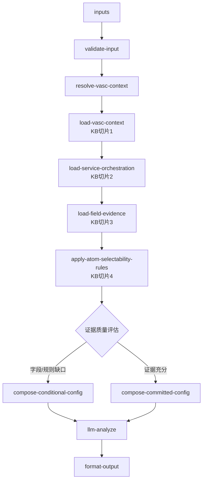

# value-add/value-add-service-config 专家设计

服务项配置：作为**服务配置证据解释器**，在 VASC 已知的前提下，基于服务项编排、字段证据覆盖和原子可选性规则，输出服务项/原子建议、互斥/禁选边界、缺失字段证据和客户可准备信息；不承诺完整下单配置。

---

## 调用说明

### 适用场景

- 用户问某个 VASC 下有哪些服务项/原子、服务项顺序、必选/互斥关系。
- 用户已从 `value-add-product-recommendation` 获得 `handoffToServiceConfig`，需要继续解释服务配置。
- 用户问字段、附件、模板要求时，需要说明当前证据覆盖状态和不可承诺边界。
- 不适用：推荐 VASC（→ `value-add-product-recommendation`）；查询已提交增值单状态或 `vaAtomAttrs`（→ `value-add-order-status`）。

### 最小入参

- `inputs.vascCode` 或 `inputs.handoffToServiceConfig.vascCode`。

### 参数提示

- `handoffToServiceConfig` 来自推荐专家时优先使用；其中 `limitations` 只作为边界线索，不升级为系统禁选规则。
- `customerKnownFields` 用于说明客户已准备的信息，不能替代字段配置来源。
- `scenarioConditions` 用于原子可选性规则，如 `shelveWay`、`isEventVa`、`bookingStatus`、仓库限制等。
- 字段证据不足时输出 `missingFieldEvidence` 或 `blockedClaims`，不能说“无需字段”。

### 示例调用

```json
{
  "query": "说明原单上架下有哪些服务项",
  "customerIntent": "客户想知道补包裹条码和补商品条码是否能一起选",
  "customerCode": "C10001",
  "customerName": "",
  "username": "agent01",
  "language": "zh_CN",
  "inputContext": { "chainId": "case-20260624-005" },
  "inputs": {
    "vascCode": "VASC202407031503503",
    "vascName": "原单上架",
    "serviceIntent": "原单上架",
    "exceptionCode": "B01E1615",
    "objectLevel": "package",
    "scenarioConditions": {
      "isEventVa": true
    }
  }
}
```

```json
{
  "query": "基于推荐结果输出服务项配置",
  "customerIntent": "客户需要新单上架服务项说明",
  "customerCode": "C10001",
  "customerName": "",
  "username": "agent01",
  "language": "zh_CN",
  "inputContext": { "chainId": "case-20260624-006", "sourceExpertId": "value-add-product-recommendation" },
  "inputs": {
    "handoffToServiceConfig": {
      "vascCode": "VASC202407161056217",
      "vascName": "新单上架（客户创建入库单）",
      "customerActionNormalized": "新单上架",
      "objectLevel": "product",
      "exceptionCode": "B01E1315",
      "limitations": ["需要客户提供新入库单号"]
    },
    "customerKnownFields": {
      "newInboundOrderNo": "WI49616708"
    }
  }
}
```

---

## 1. 输入设计

### 框架顶层（不写入 inputSchema）

| 字段 | 类型 | 说明 |
|---|---|---|
| `query` | string | 任务说明 |
| `customerIntent` | string | 业务问题摘要 |
| `customerCode` / `customerName` / `username` / `language` | string | 框架身份字段；不进入 `inputs` |
| `inputContext` | object | `chainId`；可选 `sourceExpertId`、`previousOutput` |

### inputs 业务字段

| 字段 | 类型 | 必填 | 说明 |
|---|---|---|---|
| `vascCode` | string | 条件 | VASC 产品编码。 |
| `vascName` | string | 否 | VASC 产品名称。 |
| `serviceIntent` | string | 否 | 服务方向，如原单上架、新单上架、销毁、拍照。 |
| `exceptionCode` | string | 否 | 异常编码，用于对象和场景解释。 |
| `objectLevel` | string | 否 | 服务对象层级。 |
| `customerKnownFields` | object | 否 | 用户已提供的新单号、条码、授权、附件说明等。 |
| `scenarioConditions` | object | 否 | 仓库、阶段、对象、商品类型、`shelveWay`、`isEventVa` 等规则条件。 |
| `selectedServiceItems` | array | 否 | 用户点名的服务项/原子。 |
| `handoffToServiceConfig` | object | 条件 | 推荐层传入的 VASC、意图、对象层级和限制。 |
| `enrichedContext` | object | 否 | 编排器聚合事实；优先消费 `value-add/value-add-product-recommendation` 最近快照。 |

---

## 2. 知识架构（KB 切片 + LLM Prompt）

参照 `value-add-product-recommendation` 的切片模式，本专家按**配置证据用途**拆为 4 个 KB 切片 + 1 个 LLM Prompt，不配置运行时向量检索，不把 `docs/value-add/` 全量塞进 LLM。

| 分类 | 文件 | 用途 | 消费节点 |
|---|---|---|---|
| VASC 上下文层 | `prompts/kb-vasc-context.md` | VASC 名称、服务方向、与推荐层 handoff 的字段关系 | `resolve-vasc-context` |
| 服务项编排层 | `prompts/kb-service-orchestration.md` | VASC → 服务项/原子顺序、必选、互斥组 | `load-service-orchestration` |
| 字段证据层 | `prompts/kb-field-evidence.md` | 字段、附件、模板证据覆盖状态和 blocked claims | `load-field-evidence` |
| 原子可选性层 | `prompts/kb-atom-selectability.md` | 隐藏、置灰、互斥、联动、前置校验、动态配置依赖 | `apply-atom-selectability-rules` |
| 主 Prompt | `prompts/main.md` | `llm-analyze` 配置解释：只解释已整理证据、缺口和边界 | `llm-analyze` |

---

## 3. handoffToServiceConfig 消费契约

| 字段 | 使用方式 |
|---|---|
| `vascCode` / `vascName` | 作为 VASC 主键和名称；直接入参缺失时优先使用 |
| `customerActionNormalized` | 作为 `serviceIntent` 默认值 |
| `objectLevel` / `exceptionCode` | 作为对象层级和场景条件 |
| `limitations` | 写入 `configBoundaryNotes`，不自动变成禁选规则 |

若 handoff 与直接入参冲突，以 handoff 为主，并把冲突写入 `informationalMissing` 或 `blockedClaims`，供对客说明。

---

## 4. 工作流（配置证据解释链）



### 节点说明

| 节点 | 类型 | 说明 |
|---|---|---|
| `validate-input` | 代码 | 校验 VASC 来源，合并 `handoffToServiceConfig`、直接入参和 `enrichedContext`。 |
| `resolve-vasc-context` | 代码 | 输出统一 `vascContext`、`serviceIntent`、`scenarioConditions`、`limitations`。 |
| `load-vasc-context` | 代码/textNode | 加载 `kb-vasc-context.md`，确认 VASC 服务方向和可解释边界。 |
| `load-service-orchestration` | 代码/textNode | 加载 `kb-service-orchestration.md`，输出服务项/原子编排候选。 |
| `load-field-evidence` | 代码/textNode | 加载 `kb-field-evidence.md`，标记 `fieldEvidenceStatus`、附件/模板覆盖状态。 |
| `apply-atom-selectability-rules` | 代码/textNode | 基于 `kb-atom-selectability.md` 和 `scenarioConditions` 计算可选、禁选、互斥和待确认。 |
| `compose-conditional-config` | 代码 | 缺字段或规则证据时输出 `outputPath=conditional`。 |
| `compose-committed-config` | 代码 | 证据充分时输出 `outputPath=committed`。 |
| `llm-analyze` | **LLM** | 只做对客解释和摘要，不新增字段、附件、服务项。 |
| `format-output` | 代码 | 按四字段规范组装输出。 |

---

## 5. 输出设计

`format-output` 根级必须返回 `structured`、`analysis`、`outputContext`、`enrichedContext` 四字段。

### structured

| 字段 | 类型 | 说明 |
|---|---|---|
| `outputPath` | string | `committed`/`conditional`/`missing_vasc`/`escalated`。 |
| `vasc` | object | VASC 编码、名称、服务方向。 |
| `serviceItems` | array | 服务项/原子清单，含 code、name、sequence、required、mutexGroup、fieldEvidenceStatus。 |
| `selectedServiceItems` | array | 根据意图和对象层级筛选出的建议服务项。 |
| `selectableServiceItems` | array | 当前条件下可选服务项；规则不足时只输出证据充分项。 |
| `blockedServiceItems` | array | 当前条件下不可选或不建议选的服务项。 |
| `mutexGroups` | array | 互斥组。 |
| `blockingReasons` | array | 不可选原因，需带证据来源类型。 |
| `missingConfirmations` | object | `blockingMissing` / `informationalMissing`。 |
| `fieldEvidenceSummary` | object | 字段、附件、模板证据覆盖摘要。 |
| `customerInputHints` | array | 客户可准备的信息。 |
| `blockedClaims` | array | 当前不能承诺的字段、附件、模板、枚举、页面可下单状态。 |
| `configBoundaryNotes` | array | 来自 handoff limitations 或配置证据的边界说明。 |

#### missingConfirmations 结构

```json
{
  "blockingMissing": [
    {
      "dimension": "vascCode",
      "reason": "缺少 VASC 编码，无法定位服务项编排",
      "source": "ask_customer",
      "blocksPath": "serviceItems"
    }
  ],
  "informationalMissing": [
    {
      "dimension": "fieldEvidence",
      "reason": "字段证据只有部分覆盖，不能承诺完整下单字段",
      "source": "knowledge_gap"
    }
  ]
}
```

### analysis 约束

- 先说明当前 VASC 和服务意图，再说明服务项编排和证据状态。
- 只说知识切片能证明的编排、互斥、禁选和字段证据。
- 不把 `missing_field_evidence` 写成“无需字段”。
- 原子可选性规则未覆盖时，明确“待确认”，不编造系统规则。
- 不把已提交增值单的 `vaAtomAttrs` / `vaAtomFiles` 写成事前字段、附件、模板全量配置。
- 不引用内部系统 URL、飞书、内部表或离线来源。

### outputContext

| 字段 | 说明 |
|---|---|
| `expertId` | 固定为 `value-add-service-config`。 |
| `resultSummary` | 200 字以内摘要，概括 VASC、输出路径、建议服务项和证据缺口。 |
| `chainId` | 透传 `inputContext.chainId`，缺失时为空字符串。 |

`outputContext` 是框架字段，不写入 `manifest.outputSchema`。

### enrichedContext

```json
{
  "valueAddServiceConfig": {
    "vascCode": "VASC202407031503503",
    "outputPath": "conditional",
    "serviceItemCount": 3,
    "hasBlockingMissing": false,
    "hasBlockedClaims": true
  }
}
```

---

## 6. 转人工 / 降级条件

- 缺少 VASC 编码且无法从 handoff 或 enrichedContext 补齐。
- VASC 未在服务项编排切片中出现，且用户要求完整下单配置。
- 字段、附件、模板证据缺失但用户要求“必须填哪些字段”。
- 原子可选性规则冲突，或前后端规则效果不一致。
- 用户询问已提交增值单实际填写值、附件或执行进度，应转 `value-add-order-status`。

---

## 7. 待确认事项

- 当前已抽取 18 个 VASC 产品上下文和 64 条 VASC 到服务项/原子编排行；这只是当前知识切片，不等于产品页全量。
- 当前已抽取 52 个服务项字段证据覆盖行，其中 42 个为 `partial_field_evidence`，10 个为 `missing_field_evidence`；字段证据仍不是完整下单配置。
- 实现期需保持 `partial_field_evidence` / `missing_field_evidence`，不得把缺口解释成“无需字段”。
- `atom-selectability-rules.md` 是可用规则源；本轮已裁剪 confirmed inbound 规则行，但动态配置、仓库白名单和后台返回配置仍需保留边界。
- 附件、模板和上传关系若没有 `vaAtomFiles`、页面运行时响应或等价配置来源，不得承诺完整清单。
