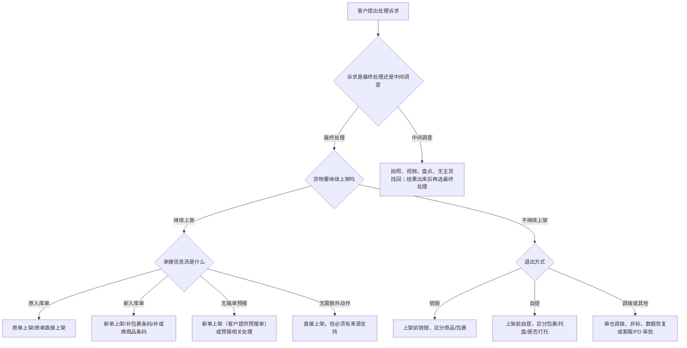

# 客户处理意图到增值选择决策流程

本文件解决“客户想怎么处理货物”到“应该查哪些 VASC/原子”的过渡。它不是字段配置页，也不替代关系映射。

## 决策顺序

## 客户意图矩阵

| 客户说法 | AI 归一化意图 | 必查条件 | 可能 VASC/原子方向 |
|---|---|---|---|
| “用原单继续上架” | 原单上架 | 原单状态、实物与原单是否匹配、异常对象 | 原单上架、入库-补贴原商品条码、入库-补贴包裹条码、入库-第三方商品条码关联。 |
| “重新下一单上架” | 新单上架（客户创建入库单） | 客户是否已有新入库单、新包裹条码、是否需新商品标签 | 新单上架、入库-补贴包裹条码、入库-更换新商品条码。 |
| “Winit 帮我建单” | 新单上架（WINIT 创建入库单） | 来源映射是否支持、提交主体和所需信息 | 仅在映射/业务资料明确支持时推荐。 |
| “直接上架就行” | 直接上架 | 是否无需贴标/包装/关联；状态是否支持 | 原单上架（直接上架）或新单上架（直接上架），必须查映射。 |
| “条码贴错/扫不出/没有条码” | 商品或包裹条码处理 | 异常对象、条码类型、是否可人工识别、是否原单/新单 | 补原商品条码、换新商品条码、补包裹条码、拍照识别。 |
| “第三方条码已经补录了” | 第三方条码关联 | 异常必须是商品有条码但系统无法识别；关联是否完成 | 原单上架 + 入库-第三方商品条码关联。 |
| “先拍照给我确认” | 拍照/暂存 | 拍商品、包裹、箱内还是视频；后续仍需客户决定 | 入库商品拍照、入库-商品开箱拍照、非标拍照或视频。 |
| “帮我查是不是你们少收/少上架” | 调查/盘点 | 卸货记录、POD、预分拣、上架数量、异常事件 | 视频调查、库内盘点、仓库调查；不直接等同异常 VASC。 |
| “销毁” | 上架前销毁 | 异常对象是商品还是包裹；是否特殊品类 | 上架前商品销毁、上架前包裹销毁。 |
| “自提” | 上架前自提 | 包裹/托盘；是否需要 Winit 打托；是否需贴提货标签 | 上架前自提（无需 Winit 打托）、上架前自提（需 Winit 打托）。 |
| “转到正确仓库/调拨” | 串仓调拨/非标 | 实际仓、目的仓、国家、仓群、权限、费用 | 包裹串仓异常调拨、入库非标增值或其他非标。 |
| “这个常规增值没有选项” | 非标需求 | 是否影响上架/出库/二次销售；需求是否清晰；仓库是否可操作 | 已归纳非标、免审核、需审核、拒接。 |

## 原单与新单判断

| 判断问题 | 原单倾向 | 新单倾向 |
|---|---|---|
| 实物是否属于原入库单 | 是，且 SKU/数量/包裹关系能匹配 | 否，或属于计划外/漏下单/错装。 |
| 原入库单状态是否允许继续承接 | 已下单/运输中/可恢复且仓库可处理 | 草稿、客户终止、已上架后后到包裹、状态不支持。 |
| 条码是否只需补贴或关联 | 可补原商品条码、补包裹条码、第三方条码关联 | 需要新包裹条码、新商品标签或新入库单信息流。 |
| 客户是否能确认原入库单 | 能确认 | 不能确认，或需无主货找回后重新建单。 |

## 销毁/自提对象匹配

销毁、自提看起来简单，但最容易因对象错误被退回：

- 商品异常选择商品级销毁，包裹异常选择包裹级销毁。
- 包裹自提与托盘自提要区分是否需要 Winit 打托。
- 若客户只说“销毁/自提”，AI 必须先定位异常对象和货物形态，再推荐。

## 非标前置判断

推荐非标前，AI 必须先排除以下情况：

- 标准 VASC 已能承接，不应绕到非标。
- 需求不影响上架、出库或二次销售。
- 仓库合规、设备、供应商能力不支持。
- 客户需求不清晰，缺少操作步骤、图片、视频、SOP 或耗材工具说明。
- 明确拒接的场景，如客户员工进 Winit 仓操作、代理进出口清关和代付税金等。

## 输出给用户时的回答结构

当用户问“我应该选哪个增值”时，AI 应按以下顺序回答：

1. 先复述识别到的业务分支：入库模式、当前节点、异常对象、客户意图。
2. 说明还缺哪些关键信息，例如异常编码、原单状态、新入库单号、条码关系、POD 或图片。
3. 给出可选 VASC 方向，并标注“需以映射和页面实际可选项为准”。
4. 给出 VASC 下可能涉及的服务项/原子。
5. 字段配置证据不足时明确说明，不编造模板或必填字段。
