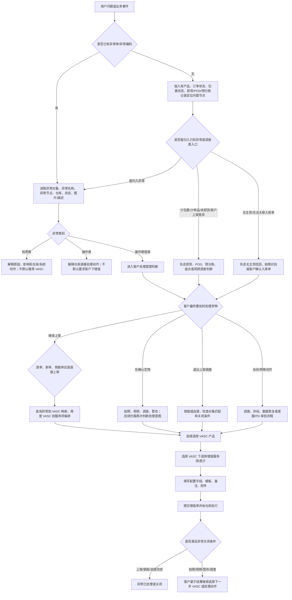

# 入库异常到增值服务总流程

本文件给 AI 建立“入库异常与增值服务关系”的总框架。它不是线性 SOP，而是一个多入口、多分支、多对象的判断模型：用户可以从入库产品、订单状态、异常单、包裹状态、客户反馈、VASC 产品、增值服务项或配置字段任意入口提问。

单个异常解释放在 `inbound-exceptions/`；单个 VASC 产品解释放在 `vasc-products/`；单个增值服务项、字段和附件放在 `value-added-service-items/`；能否选择某个 VASC 或服务项，回到 `relationship-mappings/` 确认。

## 为什么不是线性流程

入库异常不是固定的“入库 -> 发现异常 -> 提交增值 -> 完成”。在万邑通入库场景中，异常可能从以下任一分支出现：

| 分支轴 | 可能取值 | 对增值判断的影响 |
|---|---|---|
| 入库产品/验货方式 | 标准海外仓入库、直发国内验/自验、直发海外验、无箱单预报、100%A+ 无包裹条码方案等 | 决定到仓前后是否有箱单、包裹条码、验货数量、目的仓、可编辑信息和可提交增值入口。 |
| 业务节点 | 下单/发货前、运输中、送仓预约、到仓卸货、预分拣/验货、异常暂存、上架、已上架/终止、库内/出库关联 | 每个节点都可能产生不同异常；同一异常名称在不同节点下可处理方向不同。 |
| 异常对象 | 订单、包裹、子包裹、商品/单品、托盘 | 限制可选 VASC 对象和服务项对象；例如销毁必须区分商品销毁和包裹销毁。 |
| 异常类别 | 知悉类、操作类、操作增值类 | 只有操作增值类通常进入“等待客户提交增值”的主链路。 |
| 客户处理意图 | 原单上架、新单上架、直接上架、拍照/视频、销毁、自提、调拨、非标、盘点/调查 | 决定选择哪类 VASC，以及 VASC 下选哪些增值服务项/原子。 |
| 信息证据 | 入库单状态、包裹状态、卸货记录、POD、预分拣记录、异常单、图片、条码关联、normalized 映射 | 决定是直接处理异常、先调查、还是让客户补充入库单/条码/附件。 |

## 总体决策树

## 入库产品分支

| 入库产品/模式 | 关键业务特点 | 可能出现的异常入口 | 增值判断重点 |
|---|---|---|---|
| 标准海外仓入库 | 通常包含 Winit 承运、国内仓验货、出口/进口、海外仓上架链路 | 商品尺重、包装、条码、订单状态、上架数量差异、作废/终止后到仓 | 先判断当前状态和验货数量；计划外或漏下 SKU 可能需要新单上架和补贴条码。 |
| 直发国内验/自验 | 客户或国内仓完成前置信息，货物直发海外仓 | 自验未完成、目的仓错误、包裹条码覆盖/损坏、少包裹、少单品、POD 与卸货不一致 | 先看是否已完成验货/状态是否可上架；少件类先查卸货记录和预分拣。 |
| 直发海外验 | 海外仓负责验货，直发地址、预约、到仓后扫描/验货很关键 | 直发串仓、入库单状态异常、包裹条码异常、商品有条码但系统无法识别、未卸货 | 目的仓、实际到仓仓库、订单状态、条码与入库单的关系决定原单/新单/调拨/自提/销毁。 |
| 无箱单预报 | 下单不填箱单明细，仅提供 SKU 与件数，依赖识别码/预报单 | 识别码、第三方条码未关联、商品无法识别、已上架后后到包裹不能原单继续上架 | 无箱单预报有单独限制；不能把普通随入库单标准增值规则直接套用。 |
| 100%A+ 无包裹条码等专项方案 | 特定客户/产品方案下，条码和包裹识别规则可能特殊 | 包裹条码、A+ 包裹与商品/包裹对应关系、批次或箱产品校验 | 需回到专项方案和 VASC 映射确认，不按通用包裹条码异常泛化。 |

## 业务节点分支

| 节点 | 主要信息对象 | 可能异常/问题 | 常见后续动作 |
|---|---|---|---|
| 下单/发货前 | 商品信息、SKU、第三方条码、入库单、目的仓、箱单/识别码 | 商品包装属性错误、第三方条码未维护、目的仓选错、无箱单权限或 SKU 限制 | 提醒客户在到仓前改正；已发货后可能只能通过异常单、非标改数或新单承接。 |
| 运输中/预约 | 入库单状态、预约单、发货方式、POD、快递单号 | 状态未更新、预约异常、预计到仓与系统状态不一致 | 入库单状态异常、未卸货异常或送仓调查分支。 |
| 到仓/卸货 | 卸货记录、快递单号、POD、包裹条码、目的仓 | 未卸货、直发串仓、包裹条码异常、无主货 | 查卸货记录和 POD；可能进入视频调查、无主货找回、补贴包裹条码、调拨或新单上架。 |
| 预分拣/验货 | 预分拣记录、商品条码、第三方条码、验货数量、SKU | 商品条码异常、商品有条码但系统无法识别、错装、计划外商品、数量大于验货数量、批次异常 | 原单/新单上架、第三方条码关联、补/换商品条码、补包裹条码、拍照、销毁、自提。 |
| 异常暂存 | 异常单、异常对象、图片、暂存货物 | 操作增值类异常等待客户动作 | 客户提交 VASC；拍照/视频后可能继续暂存并进入下一轮选择。 |
| 上架/已上架 | 入库单状态、上架数量、库存、异常事件、盘点结果 | 少件/多件、包装注册不符、裸装冻结、后到包裹、订单已上架需拦截 | 盘点、补上架、库内增值、新单上架、数据恢复、库存调整或客户解释。 |
| 终止/作废后到仓 | 终止人、终止原因、包裹轨迹、订单状态 | 入库单状态异常、终止后包裹到仓、作废后仍需发货 | 若客户终止，通常需新单+增值或数据恢复；若质控终止，可能仍可原单上架。 |
| 库内/出库关联 | 库存、库位、出库拣选、库内异常 | 库内包装破损、单品条码异常、出库发现单品质量异常、自提单取消出库 | 不再简单归入入库异常；需区分库内/出库 VASC 和入库承接动作。 |

## 客户处理意图到 VASC 方向

| 客户意图 | 先判断什么 | 常见 VASC 方向 | 注意事项 |
|---|---|---|---|
| 原单上架 | 实物是否属于原入库单；原单状态是否允许；条码是否能识别 | 原单上架、原单上架（直接上架） | 可能叠加补贴原商品条码、补贴包裹条码、第三方条码关联、包装处理。 |
| 新单上架 | 原单是否不能承接；客户是否已创建新入库单或预报单 | 新单上架（客户创建入库单）、新单上架（WINIT创建入库单）、新单上架（客户提供预报单） | 计划外商品、订单状态异常、错装、多货、无法定位原单时常见；必须确认新单号/新包裹条码。 |
| 直接上架 | 是否确实无需标签/包装/识别动作；来源是否明确支持 | 原单上架（直接上架）、新单上架（直接上架） | 不能因为客户说“直接上架”就跳过映射和异常场景限制。 |
| 第三方条码关联 | 异常是否为“商品有条码但系统无法识别”；客户是否已补充关联 | 原单上架 + 入库-第三方商品条码关联 | 该服务项有系统强校验，不适用于一般商品条码异常或实物不一致。 |
| 补/换商品条码 | 商品实物与下单商品是否一致；使用原单还是新单 | 入库-补贴原商品条码、入库-更换新商品条码 | “补原商品条码”和“换新商品条码”业务含义不同，不能混用。 |
| 补包裹条码 | 包裹是否能定位原单/新单；包裹条码是否缺失/损坏/冲突 | 入库-补贴包裹条码 | 包裹条码异常、串仓新单上架、计划外商品换单上架都可能用到。 |
| 拍照/视频/调查 | 客户是否需要先识别实物或确认责任 | 入库商品拍照、入库非标拍照或提供视频、视频调查类服务项 | 通常不是最终关闭动作；结果出来后还需继续上架/销毁/自提等。 |
| 销毁 | 异常对象是商品还是包裹；是否上架前或库内 | 上架前销毁、库内销毁 | 对象不匹配会被退回；DG/特殊销毁可能需要非标或供应商限制。 |
| 自提 | 对象是包裹/托盘；是否需要打托 | 上架前自提 | 自提完成后货物离开 Winit 仓；费用和附件需查服务项。 |
| 调拨/转仓/特殊处理 | 是否直发串仓；是否同仓群；是否标准入口已关闭 | 包裹串仓异常调拨、入库非标增值、库内非标增值 | 非标可能需 CEO/PD 审批、报价、SOP；部分需求明确拒接。 |

## 异常关闭口径

随异常单提交的入库增值用于解决已登记异常。来源资料给出的关闭口径可概括为：

1. 提交入口必须是异常单。
2. 处理方式属于上架、销毁或自提。
3. 增值单状态已完成。

拍照、视频、调查、暂存等动作可帮助客户作决策，但不能默认等同于异常关闭。多个异常合并提交一张增值单时，还需满足同一异常类型、同一入库单或均无入库单、同一仓库、异常状态为新提交等条件。

## AI 回答规则

- 不固定从异常开始。用户问 VASC 或原子配置时，可以直接从 `vasc-products/`、`value-added-service-items/` 和映射文件进入。
- 不把 normalized 映射当作业务解释。normalized 证明有关联；客户为什么这样选，需要读流程、SOP 和异常解决方案目录。
- 不把异常解决方案目录中的所有行都当成可下单结论。含“关闭入口”“不推荐使用”“实际未产生异常”“异常无效”等备注的行，需要标注限制或不推荐。
- 不编造字段、附件、模板。字段级证据不足时，回答“当前证据不足，需要查询增值单接口/模板或业务确认”。
- 不跨对象推荐。商品异常、包裹异常、订单异常对应的 VASC 对象和服务项对象必须匹配。
- 不跨阶段套规则。入库、库内、出库、退货相关异常有交叉，但不能把库内/出库服务项直接说成入库异常可选项。

## 相关文件

- `inbound-exception-value-added-process/inbound-business-branch-exception-trigger-map.md`
- `inbound-exception-value-added-process/customer-action-decision-flow.md`
- `inbound-exception-value-added-process/physical-flow-inbound-exception-value-added.md`
- `inbound-exception-value-added-process/information-flow-inbound-exception-value-added.md`
- `relationship-mappings/inbound-exception-to-vasc-product-mapping.md`
- `relationship-mappings/vasc-product-to-service-item-orchestration-mapping.md`
