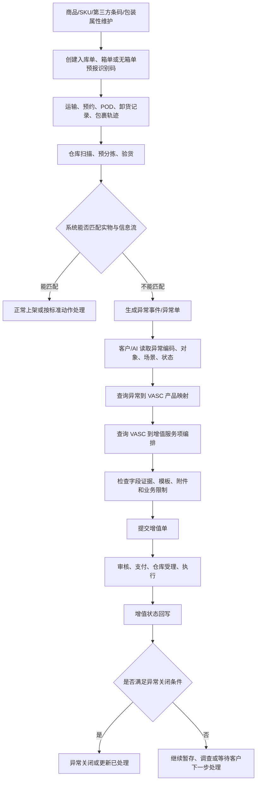

# 入库异常与增值信息流

本文件描述系统对象、状态、数据关系和 AI 检索路径，用于回答“系统里要看哪些信息、为什么能/不能选这个 VASC、异常单和增值单如何关联、字段证据是否足够”。

## 信息对象

| 信息对象 | 业务含义 | 关键字段/线索 |
|---|---|---|
| 商品/SKU 信息 | 商品注册、包装属性、第三方条码、批次/保质期、单品化信息 | SKU、Winit 商品编码、第三方商品条码、包装类型、是否采集第三方包裹码。 |
| 入库单 | 客户下单和仓库上架的主信息流 | 入库单号、Winit 产品、验货方式、目的仓、状态、箱单/无箱单、识别码、包裹信息。 |
| 包裹轨迹/卸货记录 | 判断实物是否到仓、是否扫描、是否分批送仓 | 快递单号、POD、签收地址/签收人、DSCAN、卸货时间、包裹状态、预分拣状态。 |
| 异常事件/异常单 | 仓库登记的异常信息 | 异常编码、异常名称、异常类别、异常对象、异常仓库、关联入库单、图片、状态。 |
| VASC 产品 | 场景级增值产品 | VASC 编码、名称、标准/非标、提交主体、处理方式、是否启用、是否支持无业务单据。 |
| 增值服务项/原子 | 仓库可执行动作组 | 服务项编码、名称、顺序、是否必选、互斥组、字段证据覆盖状态。 |
| 增值单 | 客户或客服提交的执行单 | 入口、关联异常单/入库单、VASC、原子、配置字段、附件、状态、完成时间。 |
| 配置字段/附件/模板 | 执行增值所需参数 | 新入库单号、新包裹条码、条码类型、SKU、附件、备注、SOP、视频/图片等。 |

## 入库单状态线索

| 状态/场景 | 信息流含义 | 异常与增值影响 |
|---|---|---|
| 草稿 | 入库单未正式提交或被回退 | 货物到仓可能触发入库单状态异常；客户需重新提交、恢复状态或新单承接。 |
| 已下单 | 入库单已提交 | 直发海外验等场景可进入后续送仓/到仓；随入库单增值入口仍受节点限制。 |
| 已到仓/部分到仓/已卸货 | 仓库收到或卸货信息已产生 | 可触发验货、预分拣、异常登记；部分场景下“已卸货”不等于每个包裹已逐一扫描。 |
| 已上架 | 入库链路完成或部分完成 | 后到包裹、少件争议、已上架需拦截会进入新单、盘点、数据恢复或异常处理分支。 |
| 终止/作废 | 入库单或包裹信息流中断 | 若客户终止，仓库通常不能原单上架，需新单+增值或数据恢复；若质控终止，可能仍可原单上架。 |

## 异常发生时的信息流状态

异常发生时，信息流可能卡在入库单、包裹轨迹、异常单、增值单或库存记录中的不同位置。AI 不能只看异常名称，必须先确认当前是哪一类信息流卡点。

| 信息流状态 | 典型来源/场景 | 对后续处理的影响 |
|---|---|---|
| 预计到仓或 DSCAN 已有，但未卸货 | 包裹超时未卸货异常、送仓/中转完成后无卸货记录 | 先进入调查和到仓确认；未确认实物前，不进入异常增值执行。 |
| 入库单部分到仓 | 直发类入库单实际发货量少于计划发货量，或部分包裹到仓 | 客户可能操作“已全部上架”关闭在途库存；但存在已卸货、部分上架、上架异常区包裹时，需要质控核实。 |
| 入库单/包裹终止 | 系统自动终止、质控终止或客户自行终止 | 质控终止后实物后到可能仍可原单上架；客户终止后通常需新单承接。 |
| 入库单已上架但后续实物到仓 | 后到包裹、订单状态已上架需拦截、数量差异 | 原信息流可能已关闭或不再承接后到货物，通常要进入异常单、新单、盘点或数据恢复分支。 |
| 异常单待客户处理 | 仓库已登记异常，异常对象、异常编码和图片等信息已存在 | 可从异常单入口提交 VASC；需按异常对象和客户意图选择产品与原子。 |
| 增值单暂存待处理 | 拍照/暂存类增值完成后，客户还未提交最终处理动作 | 这是中间信息流状态；后续仍要选择上架、销毁、自提或非标。 |
| 盘点/视频/调查结果待确认 | 客户对少包裹、少单品、上架数量或责任有异议 | 需要结合盘点结果、视频调查、下单数量和验货数量判断是否补上架、退费、赔付或继续处理。 |
| 新入库单或预报单待承接 | 客户或 WINIT 需要创建新单，或使用无箱单预报单 | 只有新单/预报单信息可用后，异常货物才能转到新信息流上架。 |

## 主信息流

## 异常单入口与非异常入口

| 入口 | 典型用户问题 | 信息流处理 |
|---|---|---|
| 已有异常单 | “这个异常怎么处理”“能选哪些增值” | 读取异常编码、对象、异常仓库、关联入库单和图片；再查映射和业务说明。 |
| 无异常单但客户说少件 | “为什么少上架”“少包裹/少单品怎么办” | 先查入库单、包裹状态、卸货记录、预分拣记录和异常事件；必要时进入盘点或视频调查。 |
| 无异常单但状态异常 | “货到了但订单草稿/终止/作废” | 查询入库单状态、终止人、终止原因；判断恢复状态、新单上架或异常单处理。 |
| 无主货/无法关联 | “包裹寄到了但系统找不到” | 用快递单、POD、无主货异常、图片识别和客户确认建立信息流，再决定增值。 |
| 直接问 VASC/原子 | “某项增值怎么配置” | 可绕过异常解释，直接读 VASC 产品、原子编排、字段证据和接口文档。 |

## 使用 VASC 后的信息流去向

VASC 的作用不是只让仓库“做一个动作”，还会改变异常单、入库单、增值单和库存信息之间的承接关系。

| VASC/处理方向 | 信息流去向 | 是否闭环 | 备注 |
|---|---|---|---|
| 原单上架 | 增值单关联异常单和原入库单；服务项完成后，货物继续由原入库单承接上架 | 通常闭环 | 前提是原入库单状态和实物关系允许继续承接。 |
| 新单上架（客户创建入库单） | 客户提供的新入库单成为承接信息流；异常单通过增值单指向新单处理 | 通常闭环 | 常见于原单终止、已上架后后到、计划外商品、包裹条码无法定位原单等场景。 |
| 新单上架（WINIT 创建入库单） | WINIT 创建的新入库单成为承接信息流 | 通常闭环 | 只能在业务资料或系统入口支持时使用，不能把所有新单场景都归到该产品。 |
| 新单上架（客户提供预报单） | 无箱单预报单/识别码成为承接信息流 | 通常闭环 | 仅限无箱单预报场景；与普通客户创建入库单不同。 |
| 直接上架 | 入库单或新单在不需要复杂补标/包装动作的情况下继续上架 | 通常闭环 | 必须有映射和系统可选项支撑。 |
| 拍照、视频、盘点、调查 | 增值单完成调查或输出结果，但异常单/客户处理意图可能仍未最终关闭 | 中间态 | 需要客户基于结果继续选择上架、销毁、自提、退费或非标。 |
| 上架前销毁 | 异常单入口提交销毁类增值；增值完成后，信息流以销毁处理闭环 | 通常闭环 | 必须按异常对象选择商品销毁或包裹销毁。 |
| 上架前自提 | 异常单入口提交自提类增值；增值完成后，信息流以提走处理闭环 | 通常闭环 | 需区分无需打托和需 Winit 打托。 |
| 入库非标或串仓调拨 | 异常单/增值单进入非标审批、报价、执行或调拨信息流 | 条件闭环 | 取决于审批和实际执行结果，不能作为默认兜底。 |

## VASC 选择的信息约束

| 约束 | AI 判断方式 |
|---|---|
| 异常编码约束 | 先查 `relationship-mappings/inbound-exception-to-vasc-product-mapping.md`；没有映射时不能说“可选”，只能说需业务确认。 |
| 异常对象约束 | 商品、包裹、订单对象影响 VASC/服务项对象；销毁、自提、补标签尤其要匹配。 |
| 入库产品约束 | 无箱单预报、直发、标准海外仓、自验/海外验在入口和信息字段上不同。 |
| 状态约束 | 草稿、终止、已上架、已卸货等状态会改变原单/新单/数据恢复选择。 |
| 服务项编排约束 | VASC 下有哪些原子、是否必选、是否互斥，以 VASC 到服务项映射为准。 |
| 字段证据约束 | 字段证据缺失时，不得生成确定版字段要求。 |
| 标准/非标约束 | 非标需求需看免审核、需审核、报价、SOP 和拒接场景。 |

## 第三方条码信息流

第三方商品条码问题必须区分两个层次：

1. 客户是否已在商品信息中维护第三方条码与 Winit SKU 的关联。
2. 异常是否属于“商品有条码但系统无法识别”。

只有实物第三方条码正确、但系统未识别到关联关系时，才可考虑“入库-第三方商品条码关联”。若实物与下单商品不一致，或条码本身无法扫描、缺失、错误，应转入补/换商品条码、新单上架、拍照或其他处理方向。

## 无箱单预报信息流

无箱单预报不填写箱单明细，依赖识别码、SKU 和件数建立入库信息流。其限制包括：

- 仅适用于特定直发海外验/预报类场景。
- 地址、识别码、商品信息可编辑窗口受入库单状态和预约状态限制。
- 已上架后后送来的包裹通常不能继续使用原预报单，建议创建新预报单。
- 若到仓后发现第三方条码未关联，需先补充关联并让异常状态进入仓库可处理状态，或改走换标/新单上架。

## 数量差异与调查信息流

客户反馈上架数量异常时，信息流不一定来自已登记异常单。AI 应先判断是否已有异常事件；没有异常事件时，再结合入库单类型、下单数量、验货数量、盘点数量和上架数量判断。

| 调查结果 | 信息流含义 | 后续方向 |
|---|---|---|
| 盘点数量大于上架数量，且漏验为计划内单品 | 仓库可能漏验计划内货物 | 标准海外仓入库单通常需要补一个特定入库单并提交增值；直发海外验场景可能由海外仓在原单补上架。 |
| 盘点数量大于上架数量，且漏验为计划外单品 | 实物超出原入库单计划 | 通常需要客户新建入库单并提交补标签/换标增值；是否退费需按来源规则判断。 |
| 盘点数量等于上架数量 | 当前盘点未证明漏验或多验 | 通常不进入补上架流程；客户可选择再次盘点但可能收费。 |
| 盘点数量小于上架数量 | 可能存在多验或库存差异 | 需要仓库更新单品状态、退费或继续内部处理，不直接等同异常 VASC 选择。 |

## 非标信息流

非标增值不是普通 VASC 的兜底答案。信息流上需要区分：

| 非标类型 | 信息流要求 |
|---|---|
| 已归纳服务项/免审核 | 来源中已有场景，可能直接进入产品报价或客服提交。 |
| 新场景/需审核 | 需要说明需求背景、仓库、订单号、商品信息、M 码、第三方条码、操作步骤、耗材工具、附件、SOP、视频或沟通记录。 |
| 拒接场景 | 不影响上架/出库/二次销售、仓库合规不支持、设备不支持、需求不清晰、客户员工进仓、代理清关代付税等，不能推荐。 |

## 异常关闭与 SLA 信息

异常关闭通常要求：异常单入口提交、处理方式为上架/销毁/自提、增值状态完成。入库/库内/非标增值的 SLA 起点依提交入口不同而不同：

- 随异常单入口：通常以增值订单状态为“已下单”作为 SLA 起点。
- 随入库订单入口：可能以包裹卸货时间等业务时间作为 SLA 起点。
- 非标增值：SLA 需产品审核时输出，不能默认等同于标准增值。

## 字段与接口证据边界

- 接口文档可用于确认系统字段、查询链路和响应结构，不直接证明业务可选性。
- normalized 数据可用于关系映射和服务项编排，但不完整承载客户处理动作和字段配置。
- `service-item-config-field-evidence-coverage.md` 只说明字段证据覆盖状态，不是字段清单。
- 字段证据缺失时，AI 应说明“当前知识库没有足够字段级证据”，并引导查看接口、模板或业务确认。
