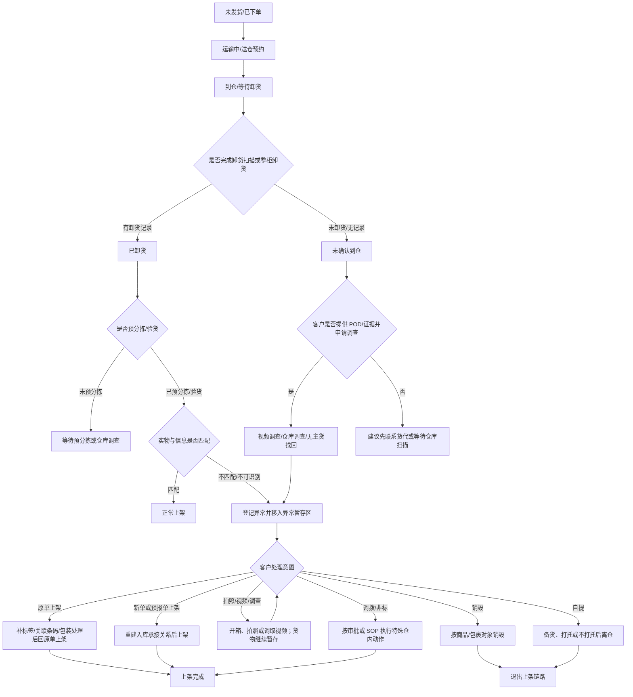

# 入库异常与增值实物流

本文件描述异常货物在仓内的物理状态变化，用于回答“货在哪里、为什么暂存、仓库下一步能做什么、提交某类增值后货物怎么动”。

## 物理对象

| 对象 | 说明 | 常见异常/增值关系 |
|---|---|---|
| 整单货物 | 入库单关联的整批货物 | 订单状态异常、整单终止、整单直接上架、整单销毁/自提。 |
| 包裹 | A+ 包、A 包、BC 包、2B 箱、直发快递包裹等 | 包裹条码异常、直发串仓、无主货、少包裹、包裹销毁、自提、补贴包裹条码。 |
| 子包裹 | 包裹内的子包装单元 | 子包裹条码异常、子包裹错装、子包裹包装破损。 |
| 商品/单品 | SKU 对应实物或单品化库存 | 商品条码异常、第三方条码无法识别、包装/质量、批次、少单品、商品销毁。 |
| 托盘 | 送仓、暂存、自提、调拨时的集合载体 | 上架前自提、需 Winit 打托、仓间调拨、整托暂存。 |

## 异常发生时的实物流状态

异常发生时，实物不一定已经进入同一个“异常区”。AI 回答时要先判断货物当前处于哪个物理层级，再判断是否能进入增值处理。

| 实物流状态 | 典型触发 | 对增值判断的影响 |
|---|---|---|
| 预计到仓或 DSCAN 后未卸货 | 快递送仓已有 DSCAN，或非快递送仓相关预订单/送仓单/海外中转单已完成，但仓库超时未卸货 | 先进入卸货调查或等待仓库确认；未确认实物在仓前，不应直接推荐贴标、上架、销毁或自提。 |
| 已卸货但未稳定关联包裹 | 包裹到仓后因包裹条码缺失、破损、冲突或无法录入系统，无法确认包裹号或入库单 | 可能转入包裹条码异常、无主货找回、拍照识别或客户确认入库单；确认承接关系后再选择原单/新单上架。 |
| 已预分拣/验货但实物与信息不匹配 | 商品条码、第三方条码、商品/包裹关系、质量包装、批次或数量与系统信息不一致 | 通常登记异常并移入异常暂存区；后续由客户选择上架、拍照、销毁、自提或非标。 |
| 上架异常区或异常暂存区 | 异常单已经登记，货物不能在当前信息流下继续完成上架 | 这是多数操作增值类异常的前置物理状态；可以进入异常单入口提交 VASC。 |
| 拍照、视频或盘点处理中 | 客户需要先确认实物、条码、数量、责任或包装状态 | 这是中间态；货物通常继续暂存，调查结果出来后再选择最终处理。 |
| 部分上架后剩余货物异常 | 入库单已有部分货物上架，后到包裹、错装商品、多货或少件争议仍需处理 | 已上架部分和异常暂存部分要拆开判断；异常货物可能需要新单承接、补标上架、销毁、自提或盘点。 |
| 待销毁或待自提 | 客户明确不再上架，选择销毁或提走 | 实物将退出上架链路；仍需按异常对象选择商品/包裹销毁，或按包裹/托盘选择自提动作。 |

## 仓内物理状态机

## 到仓与卸货分支

| 物理状态 | 判断口径 | 可能后续 |
|---|---|---|
| 没有卸货记录 | 不等于 Winit 一定未收到；需看直发/承运方式、POD 地址、签收人、是否整柜或分批送仓 | 客户提供 POD；仓库或视频调查；货代申诉；若后续找到但无条码，可能转无主货/包裹条码异常。 |
| 有卸货记录但未关联包裹 | 可能是包裹条码缺失/损坏，也可能是仓库遗漏扫描 | 找回后若有 Winit 编码可补登记或上架；无包裹条码但有商品编码可能补包裹条码；无任何条码可能无主货找回。 |
| 有卸货记录且进入预分拣 | 表示货物至少进入仓内操作；后续看预分拣、验货、上架或异常区 | 若预分拣后缺件，进入少包裹/少单品或客户上架差异分支。 |
| 整柜卸货 | “已卸货”可能代表整柜层面完成，不一定证明每个包裹都被逐一扫描 | 少包裹调查需结合开柜/关柜视频、POD、卸货时间和预分拣记录。 |

## 终止、部分到仓与后到实物

终止状态不能只看订单表面状态，要区分谁终止、实物是否后到、包裹是否已经进入仓内操作。

| 场景 | 实物流判断 | 后续物理去向 |
|---|---|---|
| 包裹超时未卸货 | 系统可基于 DSCAN 或送仓/中转完成记录生成未卸货异常，并由质控调查 | 调查确认到仓后进入卸货、预分拣或异常暂存；未确认到仓前不进入贴标/销毁/自提。 |
| 包裹或入库单质控终止 | 若后续实物到仓，来源说明仓库仍可能原单操作上架 | 需结合质控终止原因和仓库处理结果判断是否回原单上架。 |
| 客户自行终止 | 来源说明客户终止后仓库通常无法原单上架 | 实物后到时更可能需要新入库单承接，再走补标签、上架、销毁或自提。 |
| 直发类部分到仓 | 未到仓包裹可能自动终止；已卸货、部分上架或上架异常区的包裹需要质控核实 | 已确认不再上架的货物可转销毁/自提；仍需上架的货物按原单或新单承接。 |
| 已上架后后到包裹 | 原入库单或包裹信息流可能已经关闭或处于已上架状态 | 后到包裹通常先被拦截或异常暂存，再按新单、销毁、自提或数据恢复处理。 |

## 异常暂存分支

操作增值类异常的核心物理动作是“异常货物暂存”。暂存表示仓库不能在当前信息流下完成上架，但并不代表处理结束。

| 暂存原因 | 典型场景 | 后续动作 |
|---|---|---|
| 条码无法识别 | 商品条码异常、第三方条码未关联、包裹条码缺失/损坏/冲突 | 关联第三方条码、补/换商品条码、补包裹条码、拍照识别、新单/原单上架。 |
| 货物与订单不匹配 | 错装、计划外商品、到仓数量大于验货数量、A+ 包校验不一致 | 客户新建入库单、补贴包裹条码/商品条码、新单上架、销毁或自提。 |
| 目的仓/状态不匹配 | 直发串仓、入库单草稿/终止/状态未更新、已上架后后到包裹 | 改目的仓、实际仓新单上架、调拨、自提、销毁、数据恢复。 |
| 客户需先确认实物 | 无主货、包裹无法定位、商品包装/质量异常、少件争议 | 拍照、视频调查、无主货找回、盘点，再进入下一步处理。 |

## 上架类实物流

| 上架路径 | 物理结果 | 适用判断 |
|---|---|---|
| 原单上架 | 异常货物重新并入原入库单，上架到可销售或指定库存状态 | 原单状态允许，实物与原单 SKU/包裹/商品关系可匹配。 |
| 原单直接上架 | 不新增贴标/包装动作，直接上架 | 只有来源明确支持时才可推荐；需注意入库单状态和异常对象。 |
| 新单上架（客户创建入库单） | 客户提供新入库单/新包裹信息，仓库按新单上架 | 计划外商品、原单状态不支持、包裹无法使用原单、客户要求换单。 |
| 新单上架（WINIT 创建入库单） | Winit 创建新入库单承接异常货物 | 仅限映射和业务资料明确支持的场景。 |
| 新单上架（客户提供预报单） | 货物按无箱单预报或预报信息承接上架 | 无箱单预报有独立限制，不能套普通入库单增值入口。 |

## 拍照、视频、调查实物流

拍照、视频和调查不是最终物流去向，而是“帮助客户做下一步决定”的中间动作：

- 入库商品拍照通常用于客户识别异常商品、确认条码、包装或实物。
- 上架前视频/少包裹调查用于判断仓库是否收到、是否遗漏、责任方是谁。
- 无主货找回用于没有可识别 Winit 信息或未能关联入库单的货物。
- 调查后可能转为上架、补标签、销毁、自提、退费、赔付或继续等待。

## 使用 VASC 后的实物流去向

同一个异常可以进入多个 VASC，实物流的去向取决于客户处理意图和所选服务项。下表只描述流向，不替代异常到 VASC 映射。

| VASC/处理方向 | 典型服务项/动作 | 执行后的实物流去向 | 终态判断 |
|---|---|---|---|
| 原单上架 | 补贴原商品条码、补贴包裹条码、第三方商品条码关联、更换商品包装 | 异常暂存货物完成补标、关联或包装处理后，回到原入库单上架 | 通常为终态，上架完成后退出异常暂存。 |
| 新单上架（客户创建入库单） | 补贴包裹条码、更换新商品条码、必要时更换商品包装 | 异常暂存货物改由客户新建入库单承接并上架 | 通常为终态，但前提是客户新单和条码资料可用。 |
| 新单上架（WINIT 创建入库单） | 更换新商品条码、包装处理、特定场景下补贴包裹条码 | 异常暂存货物改由 WINIT 创建的新入库单承接并上架 | 通常为终态；部分场景并不需要补包裹条码。 |
| 新单上架（客户提供预报单） | 提供无箱单预报单上架 | 货物按预报单/识别码重建承接关系后上架 | 通常为终态；只适用于来源支持的无箱单预报场景。 |
| 直接上架 | 直接上架、覆盖包裹标签等 | 不经过额外或复杂贴标包装动作，扫描或处理后直接上架 | 只有系统和业务来源明确支持时才能作为终态。 |
| 拍照、视频、盘点、调查 | 商品开箱拍照、异常包裹开箱拍照、监控视频、库存盘点 | 货物通常继续暂存或保持在库，等待客户基于结果选择下一步 | 中间态，不等同异常关闭。 |
| 上架前销毁 | 上架前商品销毁、上架前包裹销毁 | 货物从异常暂存中被销毁，退出上架链路 | 终态；必须匹配异常对象。 |
| 上架前自提 | 无需 Winit 打托自提、需 Winit 打托自提 | 仓库备货或打托后，客户/承运商提走，货物离仓 | 终态；需区分包裹自提和托盘自提。 |
| 入库非标/串仓调拨 | 包裹串仓异常调拨、入库其他服务需求 | 货物按审批或 SOP 转仓、调拨、特殊处理或继续暂存 | 可能是中间态或终态，必须看非标审批结果。 |

## 销毁与自提实物流

| 处理方式 | 物理结果 | 关键限制 |
|---|---|---|
| 上架前商品销毁 | 商品从异常暂存中退出上架链路 | 异常对象为商品时选择商品销毁，不能误选包裹销毁。 |
| 上架前包裹销毁 | 包裹从异常暂存中退出上架链路 | 异常对象为包裹时选择包裹销毁。 |
| 上架前自提（无需打托） | 仓库备货，客户或承运商提走 | 适用于包裹或无需打托场景。 |
| 上架前自提（需打托） | 仓库打托后等待提走 | 涉及托盘动作、费用和提货安排。 |
| DG/特殊销毁 | 需特定供应商或证明能力 | 可能被非标拒接或需特殊审批，不能默认支持。 |

## 串仓与无主货实物流

直发串仓和无主货是两个容易混淆的分支：

- 直发串仓：货物有一定可识别信息，但实际到仓仓库与入库单目的仓不一致。客户可选择实际仓上架、新单上架、调拨到目的仓、自提或销毁，具体受国家、仓群、仓库权限和产品限制影响。
- 无主货：仓库无法通过外箱/内部信息定位到明确入库单或客户。通常先找回/拍照/客户确认，再决定上架、销毁、自提或非标处理。

## 证据边界

- 本文件描述物理状态和动作，不证明某个异常编码一定支持某个 VASC。
- 可选 VASC 以 `relationship-mappings/inbound-exception-to-vasc-product-mapping.md` 为准。
- VASC 下可选服务项以 `relationship-mappings/vasc-product-to-service-item-orchestration-mapping.md` 为准。
- 费用、价卡、国家限制和最新 SLA 不在本文件定版，需回到最新价卡或对应服务项页面。
