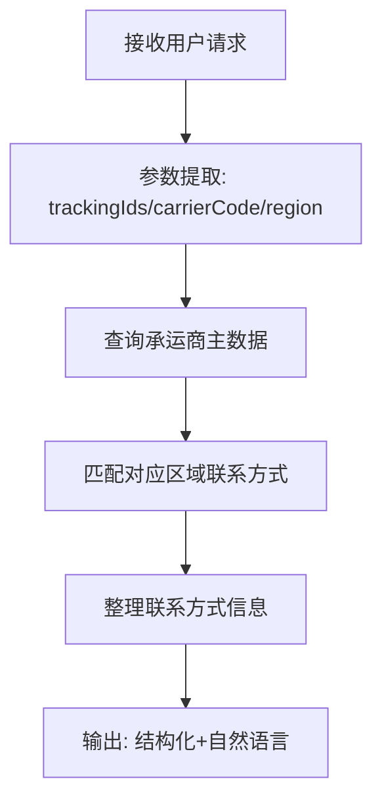

# 尾程专家系统 - carrier-contact 设计文档

## 业务场景
提供承运商服务商、自提点等客服联系方式，用户需要联系快递服务商时提供正确的联系电话和地址信息。

## 专家ID
`carrier-contact`

## 专家名称
服务商自提点联系方式

---

## 一、业务处理流程



---

## 二、SOP 关键信息整理

| 项目 | 说明 |
|------|------|
| **适用场景** | 用户需要服务商客服电话、自提点地址/电话等联系方式 |
| **不适用场景** | 无法提供承运商或区域线索，也无跟踪号时 |
| **定位精度** | `trackingIds` + `carrierCode` + `region` 组合越多，定位越准确 |

---

## 三、输入输出 Schema

### 输入设计

#### 框架顶层（调用边界，不在 manifest.inputSchema 内）

| 字段 | 类型 | 说明 |
|------|------|------|
| `query` | string | 委托任务说明，可为空 |
| `customerIntent` | string | 业务摘要，可为空 |
| `inputContext` | object | 可选；链式上下文 |
| `customerCode` | string | 租户代码（框架约定，顶层保留） |
| `customerName` | string | 客户名称（框架约定，顶层保留） |
| `username` | string | 用户名（框架约定，顶层保留） |
| `language` | string | 语言（框架约定，顶层保留） |

#### `inputs` 内业务字段（与 manifest.json 一致）

| 字段 | 类型 | 必填 | 说明 |
|------|------|------|------|
| `trackingIds` | string[] | 否 | 轨迹单号，用于反查承运商 |
| `carrierCode` | string | 否 | 承运商编码，与主数据一致 |
| `region` | string | 否 | 区域信息（国家/州省/城市） |

### 输出设计

| 字段 | 类型 | 说明 |
|------|------|------|
| `structured` | object | 结构化标识符（承运商、自提点ID等） |
| `analysis` | string | 服务商电话、自提点地址与联系方式、联系建议 |

---

## 四、调用说明

### 最小入参
建议至少提供 `trackingIds`、`carrierCode`、`region` 中一项；组合越多定位越准。

### 参数提示
- `carrierCode` 请与主数据或轨迹中的承运商编码一致
- `region` 可用国家/州省/城市等粒度，与上游规范对齐

### 示例调用

```json
{
  "query": "我要打快递客服电话",
  "customerIntent": "包裹异常需要联系人工处理",
  "customerCode": "",
  "customerName": "",
  "username": "",
  "language": "",
  "inputContext": {
    "chainId": "cc-001",
    "sourceExpertId": "",
    "previousOutput": ""
  },
  "inputs": {
    "trackingIds": ["1Z999AA10123456784"],
    "carrierCode": "",
    "region": "California, US"
  }
}
```

```json
{
  "query": "",
  "customerIntent": "",
  "customerCode": "",
  "customerName": "",
  "username": "",
  "language": "",
  "inputContext": {},
  "inputs": {
    "trackingIds": [],
    "carrierCode": "UPS",
    "region": "DE"
  }
}
```

---

## 五、代码实现状态

- ✅ 框架结构已创建 (`manifest.json`)
- ✅ 设计文档已完成 (`design.md`)
- ⚠️ `nodes/` 目录已创建，节点待实现
- ⚠️ `prompts/` 目录已创建，提示词待完善
- ⚠️ 工作流 `workflow/` 未创建，需要后续编排

---

## ⚠️ 外部系统依赖

本专家流程需要调用以下外部系统/服务才能完成自动处理：

- **万邑通主数据系统**（承运商联系方式数据表）
- **TOM系统**（可选，通过运单号反查承运商信息）

---

**文档生成时间**：2026年04月27日
**数据源**：代码仓库 `design.md` + `manifest.json` 分析整理
