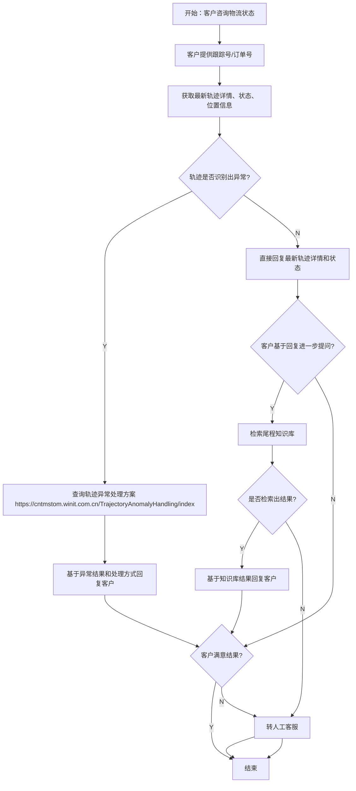

# 尾程专家系统 - delivery-status 设计文档

## 业务场景
**物流状态及轨迹查询**

客户提供跟踪号或订单号，咨询包裹当前物流最新状况和轨迹信息。这是尾程专家系统的核心基础专家。

## 专家ID
`delivery-status`

## 文档链接
- 客服SOP文档：[海外仓-尾程](https://winitlink.feishu.cn/wiki/wikcnPWDYgTm9UdVCy5RTMpSOmc)
- AI处理流程文档：[物流状态及轨迹查询处理流程](https://winitlink.feishu.cn/wiki/TlyMwLNTlicfZBkfACccpBb4nFe)

---

## 一、业务处理流程

---

## 二、核心能力说明

`delivery-status` 是尾程专家系统的**核心基础模块**，统一负责所有物流轨迹数据的获取和解析。其他专家（如 claim、pod-request、delivered-not-received 等）**不再自行获取轨迹**，而是通过 delivery-status 获取已解析的轨迹数据后，再执行各自业务逻辑。

核心能力：

1. **多路径数据获取**：通过三种方式获取轨迹数据（已在代码中实现）
   - 直接从 Winit 订单系统获取
   - 调用第三方物流商 API 实时拉取
   - 从历史轨迹缓存库读取

2. **事实抽取**：从原始轨迹数据中抽取：
   - 当前最新轨迹状态（已发货/运输中/清关中/妥投/异常等）
   - 当前位置信息
   - 最后更新时间
   - 全程轨迹事件列表

3. **异常识别**：自动识别轨迹异常情况：
   - 长时间未更新
   - 长时间未上网
   - 轨迹停滞
   - 派送失败等

4. **LLM分析**：对抽取的事实进行自然语言整理
5. **format-output**强制格式化输出（最新 f226649 改动增强）：保证输出格式一致性，减少LLM幻觉

---

## 三、流程节点说明

| 节点 | 处理动作 | 说明 |
|------|---------|------|
| **客户输入** | 提取跟踪号/订单号 | 客户必须提供单号，没有则追问 |
| **获取轨迹** | 调用数据接口获取最新轨迹 | 三路径数据获取 |
| **异常判断** | 是否识别出异常结果 | 有异常 → 查异常处理方案；无异常 → 直接回复 |
| **异常处理** | 查询内部异常处理方案库 | 外部链接：https://cntmstom.winit.com.cn/TrajectoryAnomalyHandling/index |
| **进一步提问** | 客户得到基础回复后继续提问 | 进入知识库检索 |
| **知识库检索** | 在尾程知识库中搜索问题答案 | 找到 → 回复；找不到 → 转人工 |
| **满意度判断** | 判断客户对结果是否满意 | 满意 → 结束；不满意 → 转人工 |

---

## 四、AI 处理要点

### 关键参数提取
1. **跟踪号或订单号** → 必须从客户消息提取，没有则追问
2. **客户问题意图** → 单纯查询状态，还是有进一步疑问
3. **异常识别结果** → 从轨迹数据分析是否存在异常
4. **客户满意度** → 判断对话是否可以结束，还是需要转人工

### 需要对接的系统数据
- Winit 订单系统 → 获取基础订单信息
- 第三方物流商 API → 实时拉取最新轨迹
- 轨迹缓存数据库 → 提高查询效率
- 轨迹异常处理方案库 → 异常情况解决方案
- 尾程知识库 → 回答客户进一步提问

### 特殊规则
- **异常识别优先**：只要识别出异常，必须查询异常处理方案并一起回复
- **链式处理**：客户进一步提问必须走知识库检索，不能直接臆测答案
- **转人工条件**：知识库找不到答案 **OR** 客户不满意结果 → 必须转人工
- **格式强制输出**：最新改动使用 `format-output` 覆盖 LLM 原始输出，保证输出格式的一致性和确定性

---

## 五、代码实现状态

根据 experts 项目代码：
- 整体框架已完成
- 三路径数据获取逻辑已实现
- 事实抽取模块已完成
- LLM分析 + 强制格式化输出已完成（`f226649` 提交增强确定性）
- 知识库检索对接待完成？

---

## 缺失信息说明

> [!WARNING]
> 客服SOP文档未能成功读取，具体标准话术内容未获取。以上流程基于AI处理流程图整理和现有代码知识结合。

---

**文档生成时间**：2026年4月25日
**数据源**：飞书文档 AI处理流程图提取 + 现有代码分析

---

## ⚠️ 外部系统依赖

本专家流程需要调用以下外部系统/服务才能完成自动处理：

- **订单系统**
