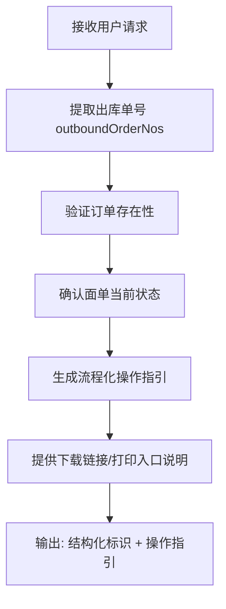

# 尾程专家系统 - label 设计文档

## 业务场景
为客户提供面单获取、面单打印、面单下载的流程化操作指引，解答客户关于如何获取和打印出库面单的问题。

## 专家ID
`label`

## 专家名称
面单获取流程化

---

## 一、业务处理流程



---

## 二、SOP 关键信息整理

| 项目 | 说明 |
|------|------|
| **适用场景** | 用户咨询面单获取、面单打印、面单下载操作方法，需要流程化指引完成操作 |
| **关联场景** | `shipping-label`（查询出库面单地址/派送方式）与本专家互补，一个偏数据查询，一个偏操作指引 |
| **不适用场景** | 无出库单号且无法关联订单时 |
| **性能建议** | 多单时分批请求可减少超时风险 |

---

## 三、输入输出 Schema

### 输入设计

#### 框架顶层（调用边界，不在 manifest.inputSchema 内）

| 字段 | 类型 | 说明 |
|------|------|------|
| `query` | string | 委托任务说明，可为空 |
| `customerIntent` | string | 业务摘要，可为空 |
| `inputContext` | object | 可选；链式上下文 |
| `customerCode` | string | 租户代码（框架约定，顶层保留） |
| `customerName` | string | 客户名称（框架约定，顶层保留） |
| `username` | string | 用户名（框架约定，顶层保留） |
| `language` | string | 语言（框架约定，顶层保留） |

#### `inputs` 内业务字段（与 manifest.json 一致）

| 字段 | 类型 | 必填 | 说明 |
|------|------|------|------|
| `outboundOrderNos` | string[] | 建议至少一个 | 出库单号列表 |

> 最小入参要求：`outboundOrderNos` 至少一个有效出库单号。

### 输出设计

| 字段 | 类型 | 说明 |
|------|------|------|
| `structured` | object | 结构化标识符：订单号、面单ID |
| `analysis` | string | 面单获取流程、打印指引、下载入口说明 |

---

## 四、调用说明

### 最小入参
`inputs.outboundOrderNos` 至少包含一个有效出库单号。

### 参数提示
- 多单时分批请求可减少超时风险
- 单号必须放在 `inputs` 内，不要放在顶层 `query`
- 建议透传 `inputContext.chainId`

### 示例调用

```json
{
  "query": "面单怎么打印？",
  "customerIntent": "客户第一次发货不知道怎么操作",
  "customerCode": "",
  "customerName": "",
  "username": "",
  "language": "",
  "inputContext": {
    "chainId": "lbl-001",
    "sourceExpertId": "",
    "previousOutput": ""
  },
  "inputs": {
    "outboundOrderNos": ["OB20250401001"]
  }
}
```

```json
{
  "query": "",
  "customerIntent": "",
  "customerCode": "",
  "customerName": "",
  "username": "",
  "language": "",
  "inputContext": {},
  "inputs": {
    "outboundOrderNos": ["OB001", "OB002"]
  }
}
```

---

## 五、代码实现状态

- ✅ 框架结构已创建 (`manifest.json`)
- ✅ 设计文档已完成 (`design.md`)
- ⚠️ `nodes/` 目录已创建，节点待实现
- ⚠️ `prompts/` 目录已创建，提示词待完善
- ⚠️ 工作流 `workflow/` 未创建，需要后续编排

---

## ⚠️ 外部系统依赖

本专家流程需要调用以下外部系统/服务才能完成自动处理：

- **TOM系统**（查询订单和面单状态）
- **万邑通客户系统**（获取面单下载链接）

---

**文档生成时间**：2026年04月27日
**数据源**：代码仓库 `design.md` + `manifest.json` 分析整理
