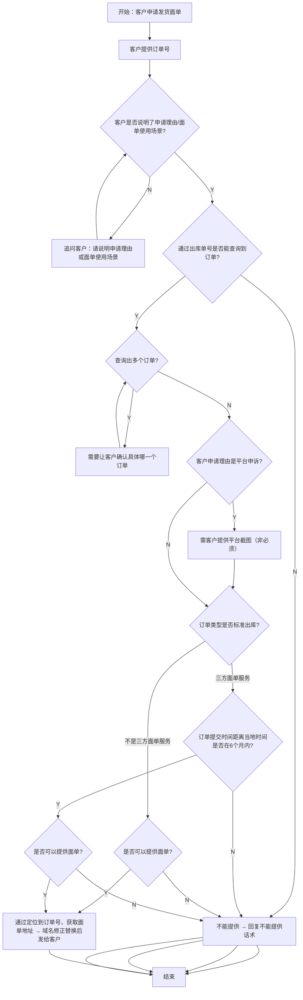

# 尾程专家系统 - shipping-label 设计文档

## 业务场景
**申请发货面单**

客户因平台申诉需要，或出库后需要查看发货面单，向客服申请提供发货面单。

## 专家ID
`shipping-label`

## 文档链接
- 客服SOP文档：[海外仓出库申请发货面单](https://winitlink.feishu.cn/wiki/OQ6twHYvXiRRLtkrW7xccAw0nvc)
- AI处理流程文档：[申请发货面单处理流程](https://winitlink.feishu.cn/wiki/LmMQwpkiwiExqikODdBckatznlg)

---

## 一、常见申请理由

1. **平台问题需要提供面单申诉**
2. **海外仓出库单更新出库后，客户要求查看发货面单**

---

## 二、业务处理流程

---

## 三、判定节点说明

| 判定节点 | 判定条件 | 分支逻辑 |
|---------|---------|---------|
| **客户是否说明申请理由** | 用户消息中是否包含了为什么需要面单 | 未说明 → 追问；已说明 → 继续 |
| **能否查询到订单** | 根据客户提供的出库单号查询订单 | 查不到 → 无法提供；查到 → 继续 |
| **是否查询出多个订单** | 一个单号匹配到多个订单 | 多个 → 让客户确认；唯一 → 继续 |
| **是否平台申诉** | 申请理由是否为平台申诉 | 是 → 提示客户提供平台截图（非必须）；否 → 直接继续 |
| **订单类型** | 是否为标准出库 / 三方面单服务 | 三方面单服务需要额外检查时间限制；其他直接检查能否提供 |
| **是否在 6 个月内** | 订单提交时间到当前是否小于 6 个月（当地时间） | 超过 → 不能提供；在范围内 → 检查能否提供 |
| **能否提供面单** | 系统配置是否允许提供该订单的面单 | 不能 → 回复话术结束；能 → 获取地址发送 |

---

## 四、处理步骤说明

### 步骤 1：信息收集
- 客户必须提供**出库单号**
- 如果客户没有说明申请理由，必须追问客户说明理由

### 步骤 2：订单查询
- 用客户提供的出库单号查询订单
- 查询不到 → 回复无法提供，结束
- 查询到多个 → 请客户确认具体是哪一个订单

### 步骤 3：特殊情况处理（平台申诉）
- 如果客户说明是用于平台申诉，**提示客户提供平台截图**（非必须，不强制要求）

### 步骤 4：资格检查
- **三方渠道面单**：必须在出库 6 个月内才能提供，超过 6 个月无法提供
- **非三方渠道**：直接检查是否能提供

### 步骤 5：获取并发送面单
- 从系统定位到订单，获取面单下载地址
- **必须对地址进行域名修正替换**
- 将修正后的链接发给客户

---

## 五、AI 处理要点

### 关键参数提取
1. **出库单号** → 必须从客户消息提取，没有则追问
2. **申请理由** → 判断是否平台申诉
3. **订单查询结果** → 是否存在，是否多个匹配
4. **订单类型** → 是否三方面单服务
5. **出库时间** → 判断是否在 6 个月内
6. **系统配置** → 是否允许提供面单

### 需要对接的系统数据
- 订单查询接口 → 根据出库单号查订单
- 面单地址获取接口 → 获取面单下载链接
- 渠道配置表 → 判断是否三方面单服务，是否允许提供面单

### 强制规则
- **域名修正替换**：获取到面单地址后必须替换域名才能发给客户，这是强制步骤
- **6个月限制**仅对**三方面单服务**有效，其他渠道不受此限制
- **平台截图是非必须**，只需要提示，不需要强制客户提供

---

## 六、缺失信息说明

> [!WARNING]
> 客服SOP文档未能成功读取，具体话术内容未获取。以上流程基于AI处理流程图整理，标准回复话术需要人工补充。

---

**文档生成时间**：2026年4月25日
**数据源**：飞书文档 AI处理流程图提取
