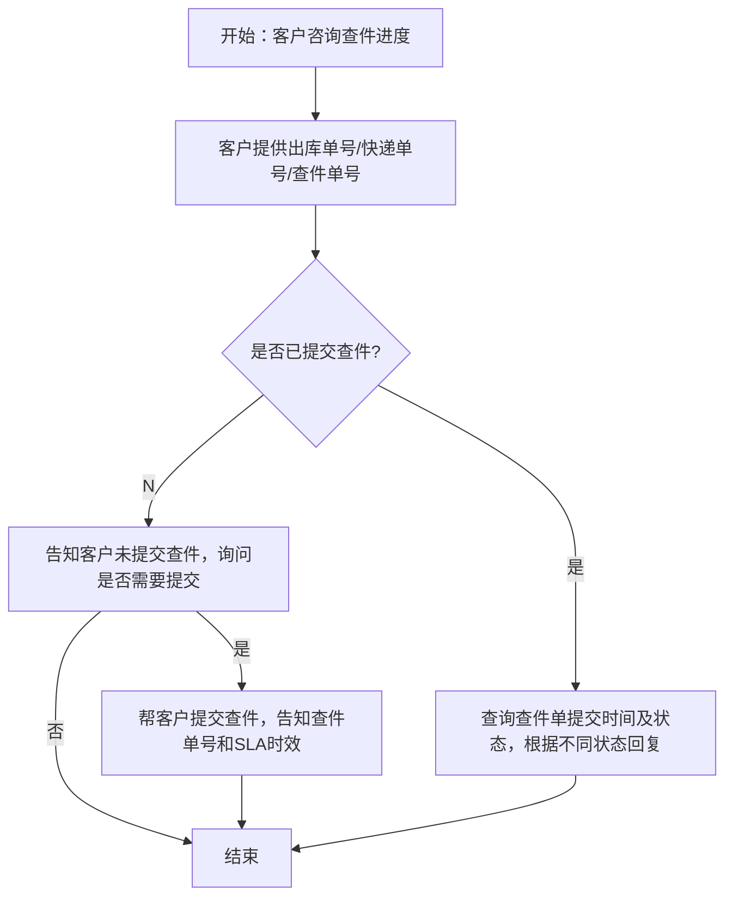

# 尾程专家系统 - tracking-inquiry 设计文档

## 业务场景
**查件申请进度查询**

客户已提交标准出库单尾程查件，主动咨询查件当前处理进度。

## 专家ID
`tracking-inquiry`

## 文档链接
- 客服SOP文档：[标准出库单查件进度查询](https://winitlink.feishu.cn/wiki/HOEwwoCRXikIYzkQ2fQcaIBAnPb)
- AI处理流程文档：[查件申请进度查询](https://winitlink.feishu.cn/wiki/SOzTwOjV6iuVzZktf3jcEwKpnif)

---

## 一、业务处理流程



---

## 二、适用场景定义

**查件**定义：标准出库单出库后，出现以下情况时，向物流商发起的包裹调查流程：

| 查件场景 | 说明 |
|---------|------|
| 超时未妥投 | 尾程超派送时效未派送、轨迹断更，需调查运输情况 |
| 部分妥投 | 一单多面单渠道，部分妥投、部分未收到 |
| 申请签收证明 (POD) | 买家反馈未收到，需申请签收/妥投证明 |
| 查退回原因 | 派送失败，需核实退回/派送失败原因 |
| 妥投未收到 | 官网显示妥投，买家反馈未收到，需调查妥投情况 |

## 三、系统操作路径

### 查件申请路径
> 万邑联 → 售后管理 → 海外仓尾程查件 → 新增海外仓尾程查件

### 查件进度查询路径
- **万邑联**：万邑联 → 售后管理 → 海外仓尾程查件 → 全部海外仓尾程查件
- **TOM**：TOM → 综合查询 → 尾程查件 → 输入单号查询

## 四、标准查件时效

| 阶段 | 时效标准 |
|------|---------|
| **受理时效** | 提交后 **1个工作日内** 完成受理 |
| **整体时效** | 预计 **10个工作日内** 完成调查 |

---

## 五、基于状态的标准回复话术

### 情况1：出库单暂未提交查件

> 你好，出库单未查询提交查件申请，可在万邑联 → 售后管理 → 海外仓尾程查件 → 新增海外仓尾程查件进行查件申请

---

### 情况2：查件状态 = 待受理（已提交未受理）

| 提交时间 | 话术 |
|----------|------|
| **≤ 1 个工作日** | 您好，此单查件刚提交，请耐心等待受理，我们会持续跟进。 |
| **> 1 个工作日（超期未受理）** | 您好，此单查件受理已超期，我们已为您申请加急处理，会尽快同步受理进度。 |

---

### 情况3：查件状态 = 已提交供应商查件（已受理）

| 提交时间 | 话术 |
|----------|------|
| **≤ 3 个工作日（调查初期）** | 您好，您的包裹已提交至物流商进行调查，目前尚在调查初期（提交第 X 天）。正常查件回复时效为 10 个工作日内，我们会持续跟进，一旦有结果将立即通知您，请您耐心等待。 |
| **3 ～ 10 个工作日（调查中）** | 您好，包裹目前正在物流商调查中（提交第 X 天），暂未收到最终反馈。我们已为您备注催促，正常调查时效内请您稍候，有进展我们会第一时间同步。 |
| **> 10 个工作日（超期未出结果）** | 非常抱歉，查件已超过标准时效仍未返回结果。我们已升级给查件专员加急跟进，要求物流商优先处理，有结果会第一时间邮件反馈给您，请您稍等。 |

---

### 情况4：查件状态 = 已完成

> 您好，您的出库单查件已完成，结果为：XXX。您可在万邑联 - 售后管理 - 海外仓尾程查件 - 全部海外仓尾程查件中查询详细结果。

---

## 六、查件申请加急处理规则

### 场景1：查件提交时间 ≤ 1 个工作日 → **无法加急**

> 您好，核实到您的查件申请提交尚未满 1 个工作日。目前工单正在正常受理流程中，物流商系统同步及受理需要一定时间。建议您先耐心等待，我们会按标准时效持续跟进，一旦有受理进度会立即更新，感谢您的理解。

---

### 场景2：查件提交时间 ＞ 3 个工作日 → **可申请加急，需询问原因**

**第一步（询问原因）：**
> 您好，理解您对包裹进度的焦急。目前该单查件已提交超过 3 个工作日，我们可以为您尝试申请加急催促。 为了更有效地向物流商施压，**麻烦您提供一下具体的加急原因**（例如：买家投诉严重、平台考核临近、高价值商品等），我们备注后可优先升级处理。

**客户提供原因后（第二步）：**
> 已经为您登记加急需求并备注具体原因，现已升级给查件专员优先催促物流商。 温馨提示： 虽然已申请加急，但最终回复时效仍取决于物流商的调查进度（标准时效为 10 个工作日内）。我们会密切监控，一有最新进展会第一时间邮件/消息反馈给您，请您稍候。

---

### 场景3：查件提交时间 ＞ 10 个工作日 → **超期加急，必须升级**

> 非常抱歉，该单查件已超过标准调查时效。我们非常重视您的体验，已将此单标记为"严重超期"，并升级给查件专员进行专项跟进。我们会要求物流商优先处理此单，有结果会第一时间通知您，感谢您的耐心等待。

**内部操作**：按模板填写信息发送至【尾程救火群】，@查件负责人
```
查件升级类型：超标准查件时效・异常超期/客户原因加急等
查件流水号：[填写]
快递单号：[填写]
查件申请时间：[填写]
救火原因：已超过标准查件时效，异常超期，需加急专项跟进 @查件负责人 请优先处理，谢谢。
```

---

## 七、AI 处理要点

### 关键参数提取
1. **查询单号** → 出库单号 / 快递单号 / 查件单号（任意一种）
2. **客户是否申请加急** → 判断客户是否明确要求加急
3. **加急原因** → 如果客户要求加急且满足条件，必须追问加急原因

### 需要对接的系统数据
- TOM / 万邑联系统 → 查询查件单状态、提交时间
- 查件状态机 → 根据状态选择对应话术回复

### 特殊规则
- **话术标准化**：必须严格使用SOP规定的标准话术，保证回复一致性
- **超期必须升级**：超过10个工作日必须内部升级到尾程救火群
- **主动告知时效**：任何状态都需要告知客户当前时效情况和预期完成时间

---

## 八、代码实现状态

- 整体框架已在专家系统中创建
- 业务逻辑清晰，规则明确，容易实现
- 需要对接 TOM/万邑联 查询查件状态接口

---

**文档生成时间**：2026年4月25日
**数据源**：飞书文档 AI处理流程图提取 + 客服SOP文档完整内容获取（完整获取）


---

## ⚠️ 外部系统依赖

本专家流程需要调用以下外部系统/服务才能完成自动处理：

- **TOM**
