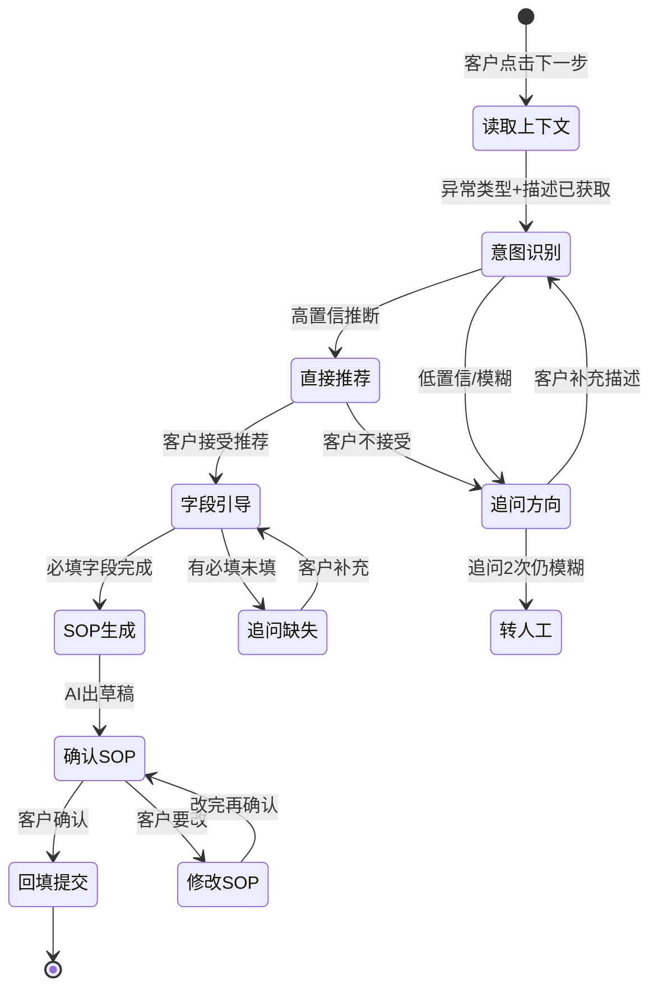

# 维度 E：动态对话与状态管理

> 核心问题：如何让 AI 系统在多步交互中保持状态、根据条件分支、优雅地处理异常路径？
> 当前层级：**L1-2**（从纯 one-shot 刚进入单层条件分支）
> 目标层级：**L3**（能画出 ≥5 状态的对话状态机，每个转移有明确条件）

---

## 五级阶梯详解

### L1 感知：纯 one-shot 模式

**标志**：系统设计为"一进一出"，无多步交互。
**我的历史实证**：
- 库存健康度 = 输入 L1 xlsx → 输出报告.md，中间无交互
- 增值配置 DAG = 输入 PRD → 产出 xlsx + report，每步确定性执行

### L2 入门：单层条件分支

**标志**：有 if-else 分支，但不超过一层，无状态保持。
**我的当前实证**：

1. **增值引导 inference-rules**（最新进步）：
   - 设计了"关键词→推断处理方式→推荐产品"的决策逻辑
   - 有 6 条规则覆盖 6 种意图，每条规则是独立的 if-else
   - 但规则之间没有顺序/状态依赖（不是"先判断 A，A 不成立再判断 B"）

2. **增值引导 system-prompt 规则 2-5**（微型决策树）：
   - 推断得到 → 直接推荐
   - 推断为新单 → 追问单号
   - 模糊 → 追问方向
   - 这是从 L1 到 L2 的关键进步

3. **非标增值会议中描述的对话流**（设计级 L2→L3）：
   ```
   原始需求 → AI润色 → 客户确认?
     → 确认 → 回填需求描述
     → 不确认 → 提醒可能被打回 → 客户坚持? 
       → 坚持 → 用原始版提交
       → 接受AI版 → 回填
   ```
   这是一个 4-5 状态的状态机设计！但还停留在会议讨论中，未落地为代码/配置。

### L3 熟练：多轮状态机 + 上下文保持 ← 下一目标

**标志**：
- 能画出 ≥5 状态的对话状态机
- 每个状态转移有明确触发条件
- 异常路径有兜底（超时/用户不响应/不合预期输入）
- 上下文在多轮间保持（不重复问已知信息）

**L3 应该设计的模式（以非标增值为例）**：



**状态保持的关键设计**：
- 每个状态保留"已收集信息"（slot）：异常类型、推断意图、已确认字段、已生成SOP版本
- 转移条件要量化：追问次数上限、字段完成度百分比
- 异常出口：每个状态都有"客户不响应 >5min → 保存草稿 + 提示稍后继续"

### L4 精通：自适应对话策略

**标志**：
- 对话策略根据用户类型/场景动态调整（高频用户简化流程/新用户详细引导）
- 具备"对话修复"能力（发现前面判断错了→回退→重新走）
- 多智能体间的状态传递设计

### L5 创造：定义对话编排范式

**标志**：设计出可配置的"对话编排 DSL"，非技术人员可以定义对话流

---

## 我的进步时间线（实证）

| 时间 | 项目 | 交互模式 | 层级 |
|---|---|---|---|
| 2026-02~05 | 库存健康度 | 纯单步管线 | L1 |
| 2026-07-17 | 增值配置 | 固定 DAG，无交互 | L1（但 DAG 本身是 L3-4 水平） |
| 2026-07-20 | 增值引导 | 条件分支推荐逻辑 | L2 |
| 2026-07-21 | 非标增值会议 | 设计了 4-5 状态的对话流（未落地） | L2→L3 设计级 |

---

## 补齐知识的学习路径

### 入门读物
- 搜索：`finite state machine for chatbot` —— 最基础的对话状态管理
- 搜索：`slot filling dialogue systems` —— 如何收集多个必填字段
- 搜索：`dialogue policy optimization` —— 何时问/何时答/何时转人工的策略

### 工具/框架参考
- **Rasa**（开源对话系统）：看它的 stories + rules + forms 设计范式
- **Voiceflow/Botpress**：低代码对话设计，体验"可视化状态机编辑"
- **LangGraph**：用代码定义带状态的 agent workflow（比纯 DAG 多了条件边和循环）

### 项目实战
1. 把非标增值会议中讨论的对话流画成 mermaid 状态图（上面已给出框架）
2. 为每个状态定义：触发条件、保留的 slot、输出话术模板、异常出口
3. 在增值引导下一版中，把"追问"从无状态的一次性问答改为"有追问次数限制 + 不重复问已知信息"

---

## 关键概念对照表

| 我的旧思维 | 新思维 | 翻译 |
|---|---|---|
| 一步到位出结果 | 分步收集信息 | DAG 的每一步可能需要等用户输入 |
| 无状态函数调用 | 有状态的会话 | 需要"记住"前面收集了什么 |
| 固定路径执行 | 条件分支 + 回退 | 用户可能否定前面的结果 |
| 异常 = 报错退出 | 异常 = 走兜底路径 | 每种"走不通"都有对应处理 |
| 用户输入一次就够 | 多轮补充直到完整 | slot filling 模式 |

---

## 自检：我到 L3 了吗？

- [ ] 画出了 ≥5 状态的对话状态机（不是停留在脑子里）
- [ ] 每个状态转移有明确条件（不是"看情况"）
- [ ] 设计了异常路径兜底（超时/追问上限/用户中途退出）
- [ ] 多轮间有 slot 保持机制（不重复问已知信息）
- [ ] 代码/配置中能看到状态定义（不只是文档里画了图）
