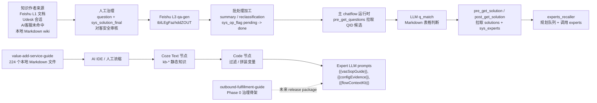
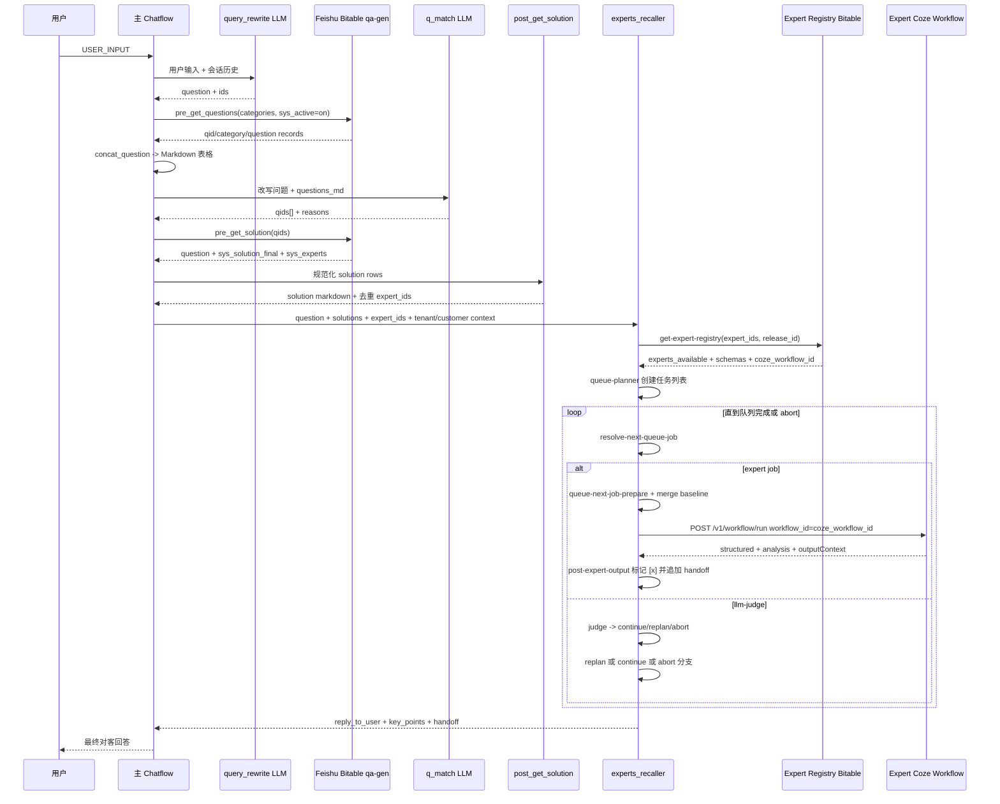
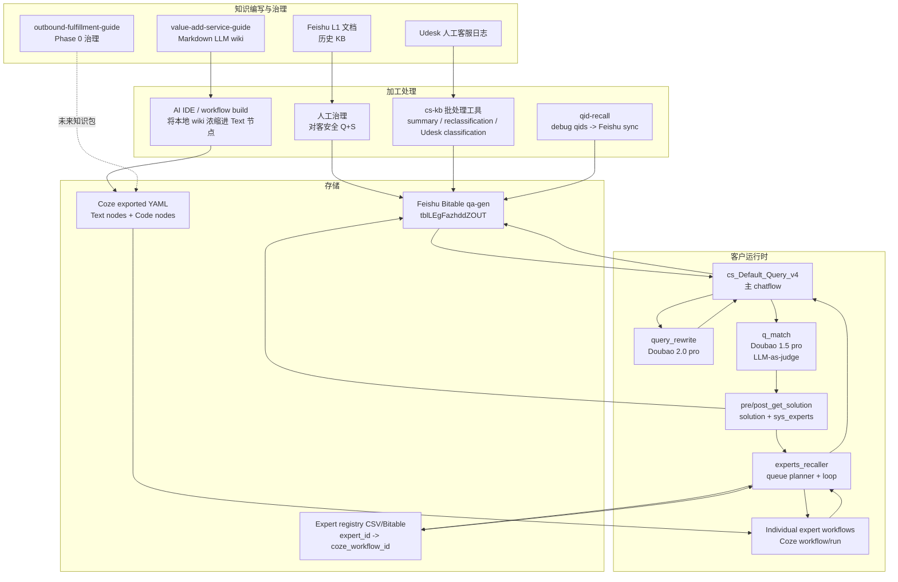

# ai-cs-expert-study 架构分析

## 执行摘要

本项目没有实现传统意义上的 RAG 流水线，即“知识库切分 -> 向量嵌入 -> 相似度检索 -> LLM 生成”。Coze 工作流中的 LLM 节点虽然都有 `knowledgeFCParam` 字段，但实际值持续为空对象 `{}`；当前生产形态是把知识预先写入 Coze Text 节点，再由 Code 节点过滤或拼装，并通过模板变量注入 LLM prompt。运行时 QID 匹配也不是向量检索，而是让 LLM 在 Feishu Bitable 候选问题表生成的 Markdown 表格上做判断。专家系统采用两段式编排：主 chatflow 改写用户问题、匹配 QID、取回 solution 与 `sys_experts`，再调用 `experts_recaller`，由它根据专家注册表规划并执行一个有界专家队列。

## Q1 分析：是否应用了 RAG 系统？

### 结论

未发现传统 RAG 流水线在运行时工作流中被应用。

最强证据来自项目基线文档本身：它明确区分 Coze RAG 与本项目实际实现，并说明 Coze RAG 未使用，因为 5 个增值相关专家的 `knowledgeFCParam` 都是 `{}`；同时它说明实际采用的是“预注入”方式，即知识写入工作流 Text 节点，运行时由 Code 节点过滤，再通过变量注入 LLM prompt。证据：

- `study/current-baseline.md:69-77` 定义了 Coze 平台给 LLM 节点提供知识的两种方式，并标记运行时 Coze RAG 未使用。
- `study/current-baseline.md:81-97` 描述了实际的 Text node -> Code node -> LLM variable 路径，并明确写出 `knowledgeFCParam: {} = 不走 Coze RAG`。
- `study/current-baseline.md:101-107` 列出了 5 个 value-add expert 的 Text 节点、Code 节点和 LLM 节点配合方式。

### 向量数据库

未在目标项目运行时代码中发现向量数据库实现。针对 FAISS、Chroma、Pinecone、Milvus、Weaviate、embedding、vector、similarity 等关键词的搜索，没有发现运行时向量库代码。少量相关命中属于：

- 个别设计文档中的“RAG chunk or static mapping”描述，不是已实现的向量库。
- API 调用或字符串处理中的普通分批/chunk 逻辑。
- `outbound-fulfillment-guide` 中空的 retrieval 测试脚手架。

`outbound-fulfillment-guide` 的 `package.json` 也没有向量库或 embedding 依赖，只声明了 Node/npm 元信息和若干 `kb:*` 脚本。证据：

- `agentic/outbound-fulfillment-guide/package.json:10-18` 只声明 `kb:inventory`、`kb:validate`、`kb:generate`、`kb:index`、`kb:coverage`、`kb:test`、`kb:build-release`、`kb:verify-release`，没有 embedding/vector 依赖。
- `agentic/outbound-fulfillment-guide/scripts/kb-command-stub.mjs:33-49` 对 stub 命令返回 `CAPABILITY_NOT_IMPLEMENTED` / `UNKNOWN_COMMAND` 风格报告，而不是执行检索或构建逻辑。

### Embedding 生成

未在被检查的运行时路径中发现 embedding 生成代码。没有 embedding API 调用、向量模型依赖，也没有生成 embedding artifact 的逻辑。最接近的 `chunk` 命中用于非 RAG 场景，例如固定大小的 API 请求分批。

### 文档切分或分块

未发现类似 LangChain text splitter 或向量库 ingestion 的通用文档切分流水线。部分 expert 代码使用 `kbChunks` 变量名，但这些是静态 KB 文本块或过滤后的映射，不是向量 chunk。例如，静态 Text 节点和 Code 节点负责加载/过滤 KB 字符串，并传给 LLM prompt。

### Coze `knowledgeFCParam`

检查到的 Coze 工作流导出均使用空知识参数。证据：

- 主 chatflow 的 `query_rewrite` 节点在 `agentic/Coze工作流导出/Chatflow-cs_Default_Query_v4_staging_D_1-draft-5799/workflow/cs_Default_Query_v4_staging_D_1-draft.yaml:45-48` 中为 `knowledgeFCParam: {}`。
- 主 chatflow 的 `q_match` 节点在 `agentic/Coze工作流导出/Chatflow-cs_Default_Query_v4_staging_D_1-draft-5799/workflow/cs_Default_Query_v4_staging_D_1-draft.yaml:211-214` 中为 `knowledgeFCParam: {}`。
- Value-add guide LLM 在 `agentic/Coze工作流导出/Workflow-value_add_guide_20260608_1-draft-4575/workflow/value_add_guide_20260608_1-draft.yaml:816` 中为 `knowledgeFCParam: {}`。
- Value-add service config LLM 在 `agentic/Coze工作流导出/Workflow-value_add_service_config_20260630_1-draft-4606/workflow/value_add_service_config_20260630_1-draft.yaml:1283` 中为 `knowledgeFCParam: {}`。
- 对工作流的全局搜索显示，主 chatflow、experts recaller、value-add 工作流以及大量 individual expert workflow 都呈现相同的空参数模式。

### `outbound-fulfillment-guide`

`agentic/outbound-fulfillment-guide/` 是知识治理骨架，不是运行时检索实现。

证据：

- README 说明项目处于 Phase 0，不包含正式业务事实，也没有可消费的 runtime knowledge package：`agentic/outbound-fulfillment-guide/README.md:5-10`。
- 核心设计是 source/canonical/generated-view/release 生命周期，不是在线检索：`agentic/outbound-fulfillment-guide/README.md:27-37`。
- `tests/retrieval/` 目前只是脚手架；`agentic/outbound-fulfillment-guide/tests/README.md:9-14` 提到 retrieval 测试目录，但该目录当前只有 `.gitkeep`。
- package scripts 多数指向 stub；Phase 0 只实现 `kb:validate`：`agentic/outbound-fulfillment-guide/README.md:68-77`。

## Q2 分析：实际知识交付流水线

### 1. 知识来源

项目存在多个知识来源，各自承担不同职责：

| 来源 | 作用 | 证据 |
|---|---|---|
| Feishu L3 `qa-gen` Bitable | 面向客户 QA 的主要在线 `question -> solution` 知识源 | `agentic/cs-kb/README.md:36-55` |
| Feishu L1 知识空间 | 历史客服知识，上游来源，但不是干净的运行时知识源 | `agentic/cs-kb/README.md:7-13` |
| Udesk 人工客服会话 | 用于发现问题缺口，不是运行时直接检索 KB | `agentic/cs-kb/README.md:24` 与 `agentic/cs-kb/README.md:40-43` |
| `agentic/value-add-service-guide/` | 面向入库异常/增值服务领域的本地 LLM wiki | `agentic/value-add-service-guide/README.md:1-17` |
| individual expert 本地文件 | 专家专用 prompt、Code 节点、manifest、生成的 Coze YAML | `agentic/experts/experts/...` |
| `agentic/outbound-fulfillment-guide/` | 未来 outbound 知识包的治理骨架 | `agentic/outbound-fulfillment-guide/README.md:5-10` |
| `agentic/qid-recall/` | 从数据库/debug 日志同步 QID 数据到 Feishu Bitable | `agentic/qid-recall/README.md:1-10` |

`cs-kb` README 明确说明，L3 `qa-gen` 是 AI 客服唯一线上知识源，`sys_solution_final` 进入 L3 前必须由人工撰写或确认，并确保对客安全。证据：

- `agentic/cs-kb/README.md:36-43` 说明 L3 是唯一线上知识源，并描述 Udesk / AI客服缺口回补来源。
- `agentic/cs-kb/README.md:47-55` 展示 L3 从人工确认 Q+S 到 AI 加工再到线上检索的流程。
- `agentic/cs-kb/README.md:63-67` 说明 `sys_solution_final` 始终由人工撰写或确认，内外部披露边界在写入 L3 时检查。

### 2. 部署前的处理与浓缩

主要有两条处理路径。

第一条是 QA/solution 路径：

- Udesk 会话或 AI 客服未命中记录转化为候选问题。
- 人工撰写或确认 `question` 与 `sys_solution_final`。
- 批处理 Coze 工具生成摘要/分类，并将记录标记为 done。

证据：

- `agentic/cs-kb/README.md:40-61` 描述来源 -> 人工 Q+S -> AI summary/reclassification -> online service。
- `agentic/cs-kb/README.md:87-96` 描述 batch 工具流水线：`init_param.ts`、`get_records.ts`、Coze LLM 节点、update 脚本、`scripts/batch_run.py`。
- `agentic/cs-kb/tools/summary/scripts/batch_run.py:8-13`、`agentic/cs-kb/tools/reclassification/scripts/batch_run.py:8-11`、`agentic/cs-kb/tools/udesk-classification/scripts/batch_run.py:8-16` 显示本地脚本会反复触发指定 Coze workflow ID。
- `agentic/cs-kb/shared/batch_run_base.py:90-148` 以异步方式运行 Coze workflow，直到没有待处理数据。

第二条是本地 wiki 到 expert 的路径：

- 领域知识以带 frontmatter、索引、source refs、关系映射的结构化 Markdown 文件维护。
- 被选中或浓缩后的知识写入 expert workflow YAML 的 Coze Text 节点。
- Code 节点按条件过滤或拼装相关内容。
- LLM 节点通过 prompt 变量接收过滤后的知识。

证据：

- `agentic/value-add-service-guide/README.md:21-33` 描述 LLM wiki 设计、索引、Schema、稳定 slug 和显式关系映射。
- `agentic/value-add-service-guide/index.md:1-6` 报告索引及业务知识/来源文件数量。
- `agentic/value-add-service-guide/vasc-products/putaway-services/vasc-product-new-order-direct-putaway.md:1-26` 展示典型知识文件的 frontmatter、source refs、状态、编码和实体元数据。
- `agentic/Coze工作流导出/Workflow-value_add_guide_20260608_1-draft-4575/workflow/value_add_guide_20260608_1-draft.yaml:269-318` 包含 Text 节点 `kb-vas` 和 Code 节点 `load-vas-kb`。
- `agentic/Coze工作流导出/Workflow-value_add_guide_20260608_1-draft-4575/workflow/value_add_guide_20260608_1-draft.yaml:383-418` 构造 `vasSopGuide`。
- `agentic/Coze工作流导出/Workflow-value_add_guide_20260608_1-draft-4575/workflow/value_add_guide_20260608_1-draft.yaml:922-925` 将 `{{vasSopGuide}}` 注入 LLM prompt。
- `agentic/Coze工作流导出/Workflow-value_add_service_config_20260630_1-draft-4606/workflow/value_add_service_config_20260630_1-draft.yaml:384-433` 与 `:508-641` 展示 VASC context 和 service orchestration 的静态 Text 节点。
- `agentic/Coze工作流导出/Workflow-value_add_service_config_20260630_1-draft-4606/workflow/value_add_service_config_20260630_1-draft.yaml:1110-1230` 拼装 conditional/committed config evidence。
- `agentic/Coze工作流导出/Workflow-value_add_service_config_20260630_1-draft-4606/workflow/value_add_service_config_20260630_1-draft.yaml:1384-1387` 将 `{{configEvidence}}` 注入 LLM prompt。

### 3. 运行时如何交付给 LLM

运行时交付不是向量检索，而是以下机制的组合：

1. 通过 Feishu Bitable API 拉取候选 Q/S 记录。
2. 让 LLM 在已知问题 Markdown 表格上做匹配判断。
3. Code 节点抽取 `sys_solution_final` 与 `sys_experts`。
4. 调用子流程执行 expert。
5. expert 工作流内部使用 Text 节点知识与 Code 节点过滤后的变量。

### 4. 关键知识目录的角色

`agentic/value-add-service-guide/`

- 面向入库异常与增值服务知识的本地结构化 LLM wiki。
- 它是 value-add 业务知识的 authoring/maintenance source，但运行时工作流使用的是嵌入 workflow YAML Text 节点中的浓缩知识。
- 本次分析时该目录包含 224 个文件。

`agentic/cs-kb/`

- 围绕 Feishu L3 `qa-gen` 的 QA 知识生命周期批处理工具。
- 负责导入/分类 Udesk 会话，生成 summary/reclassification，并更新 Bitable 记录。
- 不实现向量检索；它编排 Coze workflow 与 Feishu 表更新。

`agentic/outbound-fulfillment-guide/`

- 面向未来 outbound fulfillment 知识的 Phase 0 治理项目。
- 定义 Schema、目录、校验和 release 脚手架。
- 当前没有正式业务事实、没有 runtime package，也没有检索实现。

### 知识生命周期



## Q3 分析：QID 匹配与专家分发如何工作？

### Step A：Query Rewrite

主 chatflow 从 `query_rewrite` LLM 节点开始，使用 `豆包·2.0·pro`。该节点把最新用户消息与会话历史改写成一个独立、完整的客服问题，解析代词指代，并保留业务标识。它必须输出：

- `question:<rewritten question>`
- 最后一行 `ids:<comma-separated ids>`，或 `ids: NONE`

证据：

- 节点身份：`agentic/Coze工作流导出/Chatflow-cs_Default_Query_v4_staging_D_1-draft-5799/workflow/cs_Default_Query_v4_staging_D_1-draft.yaml:36-48`。
- 模型：`:81-88`。
- Prompt 角色与目标：`:116-124`。
- 标识保留规则：`:127-148`。
- 输出格式：`:150-163`。

### Step B：QID Matching

QID 候选列表来自 Feishu Bitable app `Oup1bQvrJabY24sOyphcQ0C1nic` 下的表 `tblLEgFazhddZOUT`。工作流先按分类结果派生出的 `categories` 过滤记录；非 batch 模式下还要求 `sys_active = on`。它请求字段 `qid`、`category`、`question`。证据：

- `pre_get_questions` 节点定义：`agentic/Coze工作流导出/Chatflow-cs_Default_Query_v4_staging_D_1-draft-5799/workflow/cs_Default_Query_v4_staging_D_1-draft.yaml:4697-4708`。
- 字段列表与分类过滤：`:4716-4746`。
- active 记录过滤：`:4748-4756`。
- 表/app ID 与分页 Feishu Bitable search：`:4758-4780`。

候选记录会被格式化成 Markdown 表格：

- `concat_question` 创建 `| category | question | qid |`，并为每条记录追加一行：`agentic/Coze工作流导出/Chatflow-cs_Default_Query_v4_staging_D_1-draft-5799/workflow/cs_Default_Query_v4_staging_D_1-draft.yaml:863-873`。

匹配模型是 `doubao-1.5-pro-32k-250115-online`，不是 embedding/vector 模型。它接收改写后的 `question` 和 `questions_md`，输出 `qids:[...]` 与 `reasons:...`。证据：

- `q_match` 节点及空 `knowledgeFCParam`：`agentic/Coze工作流导出/Chatflow-cs_Default_Query_v4_staging_D_1-draft-5799/workflow/cs_Default_Query_v4_staging_D_1-draft.yaml:202-214`。
- 模型与 prompt 变量：`:239-254`。
- 匹配指令与输出格式：`:267-289`。
- 类型化输出 `qids` 与 `reasons`：`:323-332`。

结论：这是 **LLM-as-judge over a bounded candidate table**，不是语义向量检索。

### Step C：Solution 与 Expert Lookup

QID 匹配完成后，`pre_get_solution` 会从同一个 Feishu Bitable 表中取回对应 solution 行。它用 `max_solutions` 截断 QID 数量，对 `qid` 构造 OR filter，并请求：

- `qid`
- `question`
- `sys_solution_final`
- `sys_experts`
- debug 模式下可选 `question_mock`

证据：

- 字段列表与 QID 截断：`agentic/Coze工作流导出/Chatflow-cs_Default_Query_v4_staging_D_1-draft-5799/workflow/cs_Default_Query_v4_staging_D_1-draft.yaml:933-956`。
- 对 QID 的 OR filter：`:958-977`。
- Feishu table/app ID 与 API 调用：`:979-1015`。

随后 `post_get_solution`：

- 从每条记录读取 `sys_experts`。
- 拆分逗号分隔的 expert IDs。
- 通过 `Set` 去重。
- 基于 `question` 与 `sys_solution_final` 生成 Markdown `solution` 段落。
- 返回 `expert_ids` 与 `solution`。

证据：

- `post_get_solution` 节点与输出契约：`agentic/Coze工作流导出/Chatflow-cs_Default_Query_v4_staging_D_1-draft-5799/workflow/cs_Default_Query_v4_staging_D_1-draft.yaml:1073-1083`。
- `:1083` 内嵌代码包含对 `sys_experts` 的 `Set<string>()` 去重、solution Markdown 拼装和 `expert_ids` 返回。

### Step D：Expert Orchestration

主 chatflow 会把改写问题、solution 文本、tenant token、客户字段、去重后的 `expert_ids` 传入 `experts_recaller` 子流程。证据：

- 子流程输入定义：`agentic/Coze工作流导出/Chatflow-cs_Default_Query_v4_staging_D_1-draft-5799/workflow/cs_Default_Query_v4_staging_D_1-draft.yaml:6728-6775`。
- 主流程到 recaller 的 `expert_ids`、`question`、`solutions`、`tenant_token` 和客户字段绑定：`:6776-6822`。
- recaller 子流程 workflow ID/version：`:6846-6849`。

`experts_recaller` 内部运行时循环如下：

1. 根据允许的 expert IDs 拉取专家注册表元数据。
2. Planner 只使用允许的 `expert_id` 与 `llm-judge` 生成线性任务队列。
3. 解析下一条 pending 任务。
4. 按目标专家 schema 准备 expert input JSON。
5. 合并系统管理的 baseline 字段。
6. 按 `coze_workflow_id` 调用 expert Coze workflow。
7. 将结果追加到队列记忆，并把计划行标记为 `[x]`。
8. Judge 可返回 `continue`、`replan` 或 `abort`。
9. Replanner 可修改 pending 任务，但必须保留 completed 任务。
10. Final summary 只报告 expert 执行结果确认过的事实。

证据：

- Recaller README 对简单流程的概述：`agentic/experts/experts_recaller/readme.md:4-11`。
- session handoff 与循环记忆设计：`agentic/experts/experts_recaller/readme.md:13-23`。
- 完成/最终总结路径：`agentic/experts/experts_recaller/readme.md:25-30`。
- 导出的 recaller workflow 节点标题展示运行时节点：`agentic/experts/experts_recaller/coze_workflow/workflow/experts_recaller-draft.yaml:100`、`:777`、`:909-912`、`:991`、`:1277`、`:1997`、`:2248`、`:2569`、`:2826`、`:3452`、`:3714`、`:4066`、`:4461`、`:5011`、`:5819`、`:6672`。

Planner 行为：

- 初始 Planner 先判断上游 `solution_summary` 是否已经完全回答用户问题；如果是，可以输出 `SOLUTIONS_SUFFICIENT`。
- 否则生成最多 10 条 pending task。
- 每条 task 必须是 `[ ] job_id: short description` 格式，其中 `job_id` 必须是允许的 expert ID 或 `llm-judge`。
- 必须逐字符保留业务标识，并用 Markdown inline code 包裹。

证据：

- `agentic/experts/experts_recaller/prompts/queue-planner-initial.md:1-20`。
- 规则和允许专家列表：`agentic/experts/experts_recaller/prompts/queue-planner-initial.md:22-32` 与 `:67-73`。
- `llm-judge` 放置语义：`agentic/experts/experts_recaller/prompts/queue-planner-initial.md:33-52`。

Resolve-next 行为：

- `resolve-next-queue-job` 解析 plan，区分 `expert`、`llm-judge` 与 `none`。
- 它从 `experts_available` 挂载 manifest/schema 文本，暴露上一跳上下文，并为 expert job 返回 `coze_workflow_id`。

证据：

- 返回契约：`agentic/experts/experts_recaller/nodes/resolve-next-queue-job.ts:1-100`。
- 任务行 parser：`agentic/experts/experts_recaller/nodes/resolve-next-queue-job.ts:345-379`。
- 主解析逻辑：`agentic/experts/experts_recaller/nodes/resolve-next-queue-job.ts:420-575`。

Prepare-params 行为：

- `queue-next-job-prepare` prompt 输出一次 expert call 的 `input_params` JSON，并按 expert input schema 塑形。
- 它把 inline-code task identifiers 视为权威标识，并要求 LLM 不覆盖系统管理的 chain 字段。

证据：

- `agentic/experts/experts_recaller/prompts/queue-next-job-prepare.md:1-18`。
- 标识规则：`agentic/experts/experts_recaller/prompts/queue-next-job-prepare.md:20-35`。
- 系统管理字段：`agentic/experts/experts_recaller/prompts/queue-next-job-prepare.md:67-76`。
- 输出要求：`agentic/experts/experts_recaller/prompts/queue-next-job-prepare.md:78-88`。

Call-expert 行为：

- `call-expert.ts` 使用 `coze_workflow_id` 或 `workflow_id` 调用 Coze `/v1/workflow/run`。
- 它校验必填顶层参数，并把 expert 响应解析为 `structured`、`analysis`、`outputContext` 和可选 `enrichedContext`。

证据：

- `agentic/experts/experts_recaller/nodes/call-expert.ts:1-17`。
- 必填参数和 API base：`agentic/experts/experts_recaller/nodes/call-expert.ts:40-55`。
- 响应结构解析：`agentic/experts/experts_recaller/nodes/call-expert.ts:122-183`。
- Coze workflow 调用：`agentic/experts/experts_recaller/nodes/call-expert.ts:185-240`。

Post-output 行为：

- `post-expert-output` 将当前任务标记完成，把 expert 结果追加到 accumulated summary，更新 `chainContext`，并向 `sessionHandoff` 追加有界 step。

证据：

- `agentic/experts/experts_recaller/nodes/post-expert-output.ts:1-20`。
- 运行时更新与 session step 追加：`agentic/experts/experts_recaller/nodes/post-expert-output.ts:387-470`。

Judge 行为：

- Judge 是 workflow controller，不是 domain expert。
- 它只能决定 `continue`、`replan` 或 `abort`。
- 它必须把业务事实限定为 completed expert execution records 中的内容。

证据：

- `agentic/experts/experts_recaller/prompts/queue-llm-judge.md:1-4`。
- 证据规则：`agentic/experts/experts_recaller/prompts/queue-llm-judge.md:5-23`。
- 决策策略和 verdict：`agentic/experts/experts_recaller/prompts/queue-llm-judge.md:70-79`。
- JSON 输出格式：`agentic/experts/experts_recaller/prompts/queue-llm-judge.md:81-95`。

最终面向用户响应：

- final summary prompt 只报告由 expert 执行结果确认的事实。
- 不得暴露原始内部日志、prompt、token、credentials、thinking 或 workflow metadata。

证据：

- `agentic/experts/experts_recaller/prompts/queue-user-facing-summary.md:1-4`。
- 权威证据规则：`agentic/experts/experts_recaller/prompts/queue-user-facing-summary.md:25-45`。
- grounding/action boundary：`agentic/experts/experts_recaller/prompts/queue-user-facing-summary.md:46-79`。
- JSON 输出：`agentic/experts/experts_recaller/prompts/queue-user-facing-summary.md:81-90`。

### Step E：Expert Registration

专家注册表是 `agentic/qa-gen_expert_system_experts.csv`。本 workspace 中它包含 55 条 CSV 记录，分布在两个 release batch：`rel-experts-20260608` 与 `rel-experts-20260626`。CSV header 字段为：

```text
expert_id, available, coze_workflow_id, ver, release_id, name, detail, runtime, local_repo_path, io, inputSchema, outputSchema, manifest, invoke_url
```

证据：

- CSV header 位于 `agentic/qa-gen_expert_system_experts.csv:1`。
- 第一条 expert row 的 schema cell 示例从 `agentic/qa-gen_expert_system_experts.csv:63`（`inputSchema`）与 `:90`（`outputSchema`）开始。
- 当前 recaller release ID 在 `agentic/experts/experts_recaller/nodes/release-id.ts:2-8` 中硬编码为 `rel-experts-20260626`。

recaller 通过读取注册表行中的 `coze_workflow_id` 知道要调用哪个 Coze workflow。证据：

- `get-expert-registry.ts` 在 `RegistryRow` 中定义 `coze_workflow_id`、`input_schema`、`output_schema`、`manifest`、`release_id` 字段：`agentic/experts/experts_recaller/nodes/get-expert-registry.ts:1-24`。
- 它按 `available = on` 和可选 `release_id` 过滤：`agentic/experts/experts_recaller/nodes/get-expert-registry.ts:133-166`。
- 它将 `inputSchema` / `outputSchema` 列转换成 LLM-readable schema 文本：`agentic/experts/experts_recaller/nodes/get-expert-registry.ts:233-258`。
- 它调用 Feishu Bitable search，并映射记录为 `experts_available`：`agentic/experts/experts_recaller/nodes/get-expert-registry.ts:505-549`。
- `resolve-next-queue-job` 从匹配到的注册表行提取 `coze_workflow_id`：`agentic/experts/experts_recaller/nodes/resolve-next-queue-job.ts:517-568`。
- `call-expert` 要求 `coze_workflow_id` / `workflow_id`，并把它作为 `workflow_id` 发送给 Coze：`agentic/experts/experts_recaller/nodes/call-expert.ts:185-211`。

`release_id` 是专家注册表行的批次/版本门控字段。它让 recaller 只选择属于指定发布批次且 available 的 expert 定义。本快照中，`release-id.ts` 返回 `rel-experts-20260626`，`get-expert-registry` 要求传入该参数，并将其应用到 Feishu Bitable filter。

## QID 到 Expert 的时序图



## 架构图



## 关键发现

1. **项目使用的是 LLM 匹配，不是向量语义检索。** QID 匹配是在候选问题 Markdown 表格上执行 prompt 判断，并以 `qids:[...]` 作为结构化输出。

2. **知识交付确定性强，但部署成本高。** 静态 Text 节点注入能避免检索漏召回，但任何知识更新都需要重新生成/导入工作流，或以其他方式更新 Coze 节点内容。

3. **Feishu Bitable 是在线 QA 的运营事实源。** L3 `qa-gen` 表同时驱动候选 QID 匹配和 solution/expert lookup。

4. **专家分发由注册表驱动。** solution 行中的 `sys_experts` 不是直接 workflow ID，而是 expert IDs；recaller 会通过带 release 过滤的注册表解析出 `coze_workflow_id`、schemas、manifest 和描述信息。

5. **已有 release 管理，但粒度较粗。** recaller 硬编码 `rel-experts-20260626`，而 CSV 同时包含旧批次与新批次。这个方式简单可审计，但 release ID 过期时可能静默隐藏有效专家。

6. **安全卫生需要关注。** 部分工作流代码块包含 app credentials，或要求在 Code 节点中硬编码 Coze PAT。即使这是 Coze 导入的现实约束，把它们放在生产快照仓库中仍有泄露风险。

7. **`outbound-fulfillment-guide` 是面向未来的治理项目。** 目录名中已有 retrieval/tests/release 概念，但当前包是 Phase 0 骨架，不应描述为已实现 retriever。

8. **recaller 有较强的反幻觉护栏。** Judge 和 final-summary prompts 明确禁止把 planner 文本或一般 solution summary 当作业务事实；只有 expert execution records 才算业务证据。

