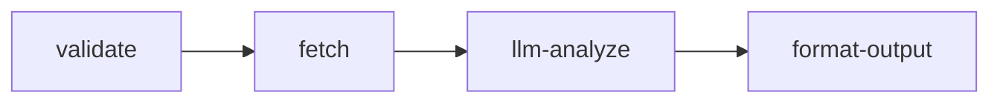

# Multi-Expert 项目文档风格指南

> 从 `agentic/experts/` 的 8 篇设计文档中提炼的通用写作范式。
> 适用于：新增 expert 的 design.md、项目规范文档、操作手册等。

---

## 文档体系分层

本项目的文档按**读者意图**分为四层，每层有固定的文件命名和写法：

| 层次 | 文件 | 读者问题 | 写法特征 |
|------|------|---------|---------|
| **Why & What** | `REQUIREMENTS.md` | "这个项目的硬约束是什么？" | 条目式规则，用"禁止/必须/不得" |
| **Spec** | `design-spec.md` | "接口形状、字段含义、数据流是什么？" | Schema 表格 + Mermaid 图 + 分节编号 |
| **How-to (设计)** | `how-to-design-expert.md` | "从 0 到 design.md 怎么走？" | 步骤式 + 模板 + 产出物 |
| **How-to (实现)** | `how-to-create-expert.md` | "从 design.md 到可导入 Coze 包怎么做？" | 步骤式 + CLI 命令 + 检查清单 |
| **集成指南** | `winit-openapi-integration.md` | "接某个外部系统的标准做法？" | 模式选型 → 契约 → 环境变量 → Checklist → FAQ |
| **操作手册** | `LOCAL-INVOCATION.md`, `COZE-WORKFLOW.md` | "怎么跑/怎么导出？" | CLI 用法 → 字段映射 → 平台约束 → 排错 |
| **单专家设计** | `experts/{id}/design.md` | "这个 expert 的业务逻辑和编排？" | 边界卡 + 工作流图 + 输入输出 + 降级策略 |
| **升级/批量** | `how-to-upgrade-expert.md` | "批量发版的步骤？" | 前置条件 → 编号步骤 → CLI → 验证 |

---

## 通用写作范式

### 1. 开头三件套

每篇文档前三行必须回答：

```markdown
# 标题（动词短语或名词短语）

本文面向**{谁}**，说明{做什么}。

**前置**：若 xxx 尚未完成，请先读 **[yyy](yyy.md)**。
```

- **面向谁** — 明确读者角色（新建 expert 的开发者 / 产品同学 / AI Agent）
- **做什么** — 一句话说清本文产出
- **前置** — 阅读依赖链，避免读者跳步

### 2. 分工表（与其他文档的关系）

如果文档是某个流程的一环，紧接开头用表格说明分工：

```markdown
| 阶段 | 文档 | 产出 |
|------|------|------|
| 规划与设计（本文） | how-to-design-expert.md | 边界卡、API 矩阵、design.md |
| 实现与交付 | how-to-create-expert.md | manifest、nodes、workflow、Coze 包 |
```

### 3. 建议阅读顺序

紧接分工表，给出编号的阅读链：

```markdown
**建议阅读顺序**
1. REQUIREMENTS.md — 硬约束
2. design-spec.md — Schema 与上下文
3. 本文 — 设计流程
4. how-to-create-expert.md — 实现
```

### 4. 编号步骤结构

操作类文档（How-to / 手册）统一用：

```markdown
## 步骤 N：{动词短语}

**目标**：一句话。

| 动作 | 说明 |
|------|------|

**产出**：{文件路径或产出物描述}
```

- **目标** — 这一步做完后世界变了什么
- **表格** — 将并列的子动作用表格而非散文
- **产出** — 明确输出物（文件路径 / 状态变化）

### 5. 模板/卡片嵌入

设计类文档在关键步骤中嵌入可复制的模板：

```markdown
**边界卡片模板**（复制到 plan 或 docs/experts/）：

### `{domain}/{expert-id}`

**问**：客户哪些问题由本专家处理
**不问**：明确路由到其他 Expert 的情形
**衔接**：与上下游的数据交接
**输入**：业务最小入参
**输出**：structured 关键字段 + analysis 原则
**依赖**：API / KB / 共享域
```

### 6. 规范类用"禁止/必须"表

约束类内容用表格 + 强语气词：

```markdown
| 字段 | 注意 |
|------|------|
| `inputSchema` | **禁止**声明框架保留键（query、inputContext 等） |
| `id` | **必须**与目录名一致，仅小写+数字+连字符 |
```

### 7. CLI 命令 + 等价调用

所有可执行操作给出 npm script + 等价的 npx 直调：

```markdown
```bash
npm run export:coze -- experts/<领域>/<专家id>
```

等价调用：

```bash
npx ts-node -P scripts/tsconfig.json scripts/expert-to-coze-cli.ts <专家目录>
```
```

### 8. FAQ 段

集成指南和操作手册以 FAQ 结尾，用粗体问题 + 紧跟回答：

```markdown
## FAQ

**两套 WORKFLOW_ID 混用会怎样？**
会导致 parameters 与线上预期不一致，表现为非预期错误或空数据。

**PowerShell 下参数未生效？**
见 COZE-WORKFLOW.md §3.2；可改用 cmd /c 或 npx 直跑。
```

### 9. 交叉引用与索引表

文档末尾统一放"相关文档"表：

```markdown
## 相关文档

| 文档 | 内容 |
|------|------|
| [design-spec.md](design-spec.md) | Schema、上下文规范 |
| [COZE-WORKFLOW.md](../COZE-WORKFLOW.md) | 导出与导入 |
```

### 10. Mermaid 图用于数据流

架构关系和工作流用 Mermaid flowchart，保持简洁（5-8 个节点以内）：

```markdown

```

---

## 单专家 design.md 的标准结构

从已有 expert 的 design.md 归纳出的模板：

```markdown
# {expert-name} 设计说明

## 1. 定位与边界

- **处理**：{1-3 句话说清什么问题进这个 expert}
- **不处理**：{明确排除的场景 → 指向其他 expert}
- **触发条件**：`Use when ...`

## 2. 输入/输出契约

### 输入（inputSchema 业务字段）
| 参数 | 类型 | 必填 | 说明 |
|------|------|------|------|

### 输出（structured + analysis）
| 字段 | 说明 |
|------|------|

## 3. 工作流编排



### 节点说明
| 节点 | 职责 | 依赖 |
|------|------|------|

## 4. 数据依赖

| API / 数据源 | 用途 | 降级策略 |
|-------------|------|---------|

## 5. 对客话术原则

- {一句话描述 analysis 的口吻和边界}

## 6. enrichedContext（可选）

- 是否开启透传：`x_recaller_propagate_previous_enriched_context`
- 消费哪些上游 expert 的输出
```

---

## 命名约定速查

| 对象 | 规则 | 示例 |
|------|------|------|
| expert-id | `[a-z0-9-]+`，≤64 字符，与目录名一致 | `delivery-status` |
| domain | 小写英文，连字符分隔 | `last-mile`, `value-add` |
| Coze slug | 仅下划线（禁止连字符） | `delivery_status` |
| draft 文件名 | `{slug}-draft.yaml` | `delivery_status-draft.yaml` |
| manifest 字段名 | camelCase | `trackingIds`, `outboundOrderNos` |
| 文档文件名 | 小写+连字符 | `how-to-design-expert.md` |
