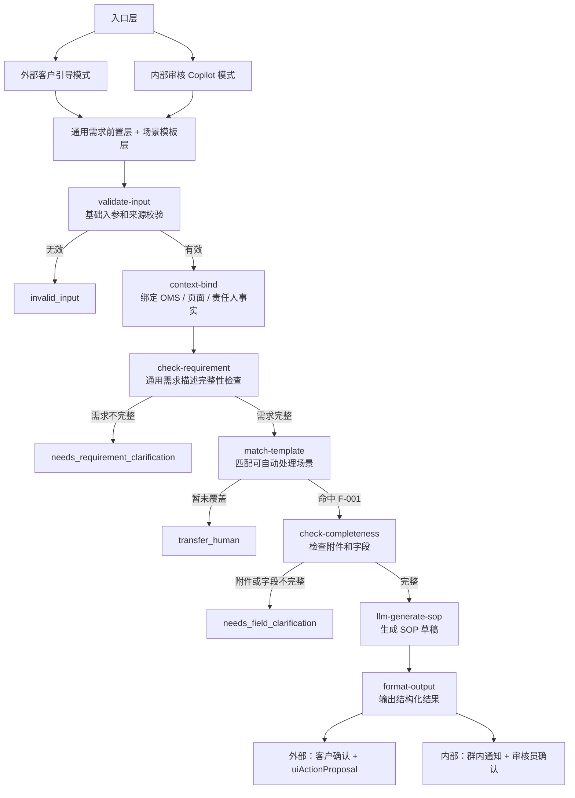
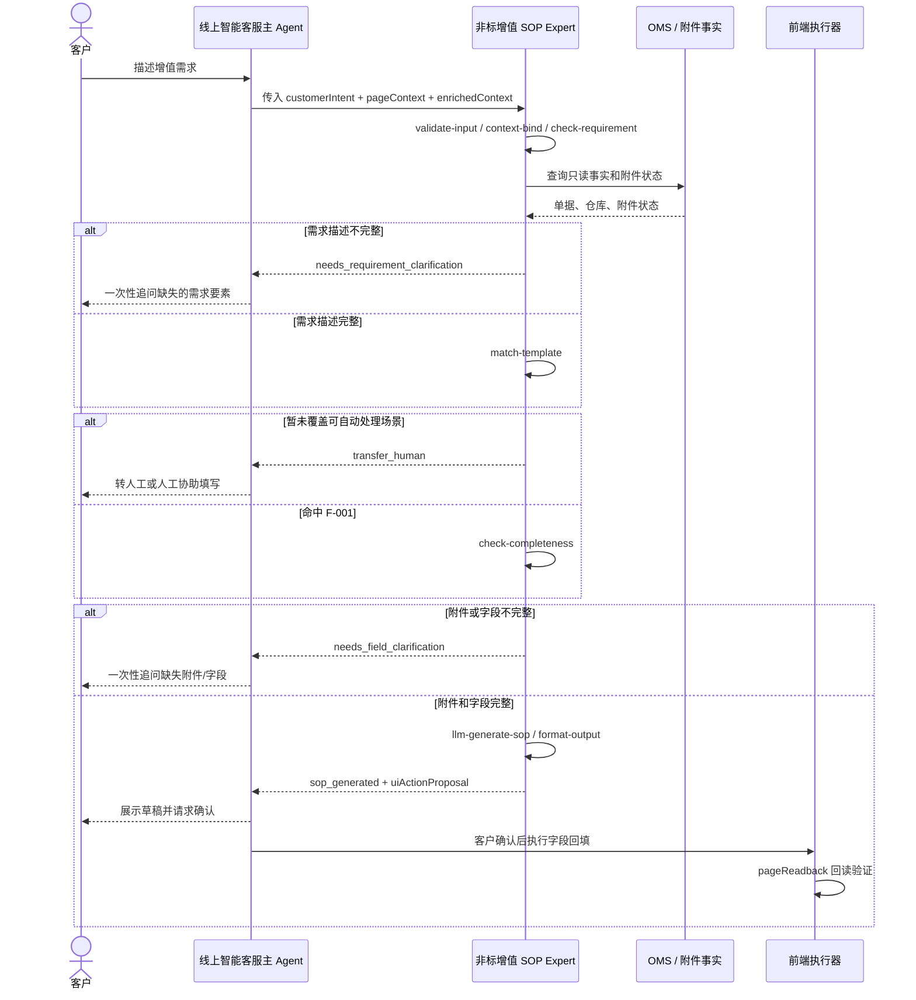
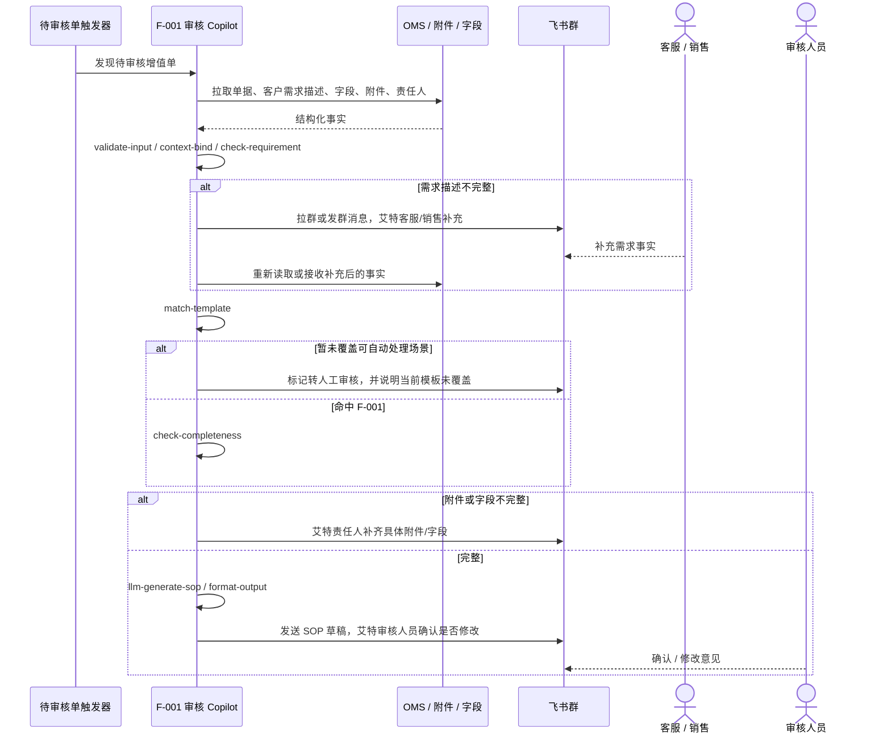

# 系统设计：F-001 非标增值 SOP Agent 工作流

## 元信息

| 字段 | 内容 |
| --- | --- |
| 状态 | 草案 |
| 所有人 | 产品 / Agent 工程 |
| 评审方 | 业务、前端、后端、Coze 工作流负责人 |
| 关联 PRD | `agent-inventory-assist/02_design/PRD-非标增值生成Agent-V1.0.md` |
| 运行时真源 | `experts/value-add/nonstandard-sop-guide/` |
| 试点范围 | F-001 `inbound_label_identify` / `OW01V1602` / `VASC202411192246131` |

## 摘要

F-001 不是“全部非标增值 Agent”，而是当前已经被纳入模板库的第一个可自动处理场景。完整工作流先做通用需求完整性检查，再做场景匹配；当前只对 F-001 自动生成 SOP，其他需求完整但暂未覆盖的场景先转人工，后续随着模板补充逐步扩大可自动处理范围。

当前项目缺的不是 BRD、PRD 或更多案例，而是运行时节点骨架。后续所有任务必须挂到一个节点、一个边、一个数据契约或一个验收闸门上；挂不上去的任务，默认不进入 F-001 试点执行。

## 两个应用场景

同一个通用需求前置层和场景模板层可以支持两个产品入口，但入口、输出对象、交互动作不同。当前场景模板层只开放 F-001，后续可逐步补入更多场景。

| 模式 | 使用对象 | 入口 | 主要目标 | 上线难度 | 建议阶段 |
| --- | --- | --- | --- | --- | --- |
| 外部客户引导模式 | 线上智能客服里的客户侧 Agent / Expert | 客户咨询或异常处理链路 | 引导客户补齐需求，生成可确认的需求描述和 SOP，再等待客户确认 | 高：要兼容线上 Agentic 调度、Coze Expert、前端页面联动、客户可见话术 | 第二阶段 |
| 内部审核 Copilot 模式 | 客服、销售、审核人员 | 待审核增值单列表 / 审核工作台 / 群通知 | 审核客户已提交内容是否完整，缺则拉人补充，齐则生成 SOP 给审核人员确认 | 中：面向内部，权限和兜底更可控，可先不接客户侧 Agentic 主链路 | 第一阶段 |

结论：内部审核 Copilot 更适合先上线。它避开了客户侧实时对话、线上智能客服编排兼容、页面自动执行和客户确认写入等高成本环节，但仍能验证最核心的通用规则：需求完整性、场景匹配、附件/字段完整性、SOP 生成、人工确认。

## 总体架构



## 核心设计原则

1. **一套通用前置层，两种入口模式。** 不要为内部和外部分别写两套需求完整性规则，否则后续必然漂移。
2. **内部先上，外部后接。** 内部模式先验证规则和 SOP 质量；外部模式再验证客户话术、线上 Agentic 兼容和页面联动。
3. **Agent 不直接做最终业务决定。** 内部模式里，Agent 只给审核建议、缺失项和 SOP 草稿；是否通过、是否修改，由审核人员确认。
4. **补充动作走组织链路。** 缺需求描述、附件或字段时，Agent 可以定位客服/销售/责任人并在群内艾特，但不替人编造内容。
5. **所有客户提交事实必须来自 OMS / 附件 / 已有沟通记录。** LLM 只做归纳和成稿，不做事实发明。

## 两种模式的工作流

### 模式 A：外部客户引导



外部模式的难点是端到端兼容：线上智能客服主链路、Coze Expert 输入输出、客户可见话术、前端控件映射、确认后写 OMS、页面回读都要一起打通。

### 模式 B：内部审核 Copilot



内部模式的价值是把 Agent 放在审核前置质检位：先减少审核人员看到的不完整单，再把完整单整理成可审核 SOP。它不需要一开始就做客户侧自动回填和客户确认闭环，因此更容易形成真实上线闭环。

## 运行时输入契约

### 外部客户引导输入

```json
{
  "mode": "external_customer_guidance",
  "query": "",
  "customerIntent": "",
  "serviceAtom": "OW01V1602",
  "recommendedVasc": {
    "vascCode": "VASC202411192246131",
    "vascName": "入库非标增值（特批）"
  },
  "sceneKey": "inbound_label_identify",
  "sceneName": "【入库】尺重/标签辨识后换标上架",
  "pageContext": {
    "entryScene": "UNUSUAL_INBOUND",
    "vaSource": "UNUSUAL",
    "warehouseCode": "",
    "customerCode": "",
    "eventNo": "",
    "businessOrderNo": "",
    "attachmentStatus": {}
  },
  "providedFields": {},
  "enrichedContext": {}
}
```

### 内部审核 Copilot 输入

```json
{
  "mode": "internal_review_copilot",
  "vascNo": "",
  "serviceAtom": "OW01V1602",
  "recommendedVasc": {
    "vascCode": "VASC202411192246131",
    "vascName": "入库非标增值（特批）"
  },
  "omsFacts": {
    "customerRequirementDescription": "",
    "requirementBackground": "",
    "warehouseCode": "",
    "customerCode": "",
    "eventNo": "",
    "businessOrderNo": "",
    "fieldValues": {},
    "attachmentStatus": {}
  },
  "responsiblePeople": {
    "customerService": [],
    "sales": [],
    "reviewers": []
  },
  "conversationEvidence": []
}
```

## 统一输出契约

```json
{
  "structured": {
    "mode": "external_customer_guidance|internal_review_copilot",
    "outputPath": "invalid_input|transfer_human|needs_requirement_clarification|needs_field_clarification|sop_generated",
    "sceneKey": "inbound_label_identify",
    "missingRequirementItems": [],
    "missingFields": [],
    "missingAttachments": [],
    "requirementDescription": "",
    "requirementBackground": "",
    "warehouseSop": "",
    "uiActionProposal": {},
    "imActionProposal": {}
  },
  "analysis": "",
  "outputContext": {
    "expertId": "nonstandard-sop-guide",
    "outputPath": ""
  },
  "enrichedContext": {
    "nonstandardSopGuide": {}
  }
}
```

## 节点契约

| 节点 | 职责 | 输入 | 输出 | 终止条件 |
| --- | --- | --- | --- | --- |
| `validate-input` | 做基础入参和来源校验 | `mode`、客户意图或待审核单事实、页面/OMS 上下文 | `sopInput`、`validationResult.ok/reason/message` | `ok=false` → `invalid_input` |
| `context-bind` | 固定 OMS / 页面 / 责任人事实，避免重复追问 | `pageContext` 或 `omsFacts`、`responsiblePeople`、`enrichedContext` | `contextFacts`、`ownerFacts` | 页面/OMS 已有事实不得进入缺失项 |
| `check-requirement` | 通用判断客户需求描述是否完整，不依赖是否已命中 F-001 | 客户需求描述、沟通证据、通用需求描述规则 | `requirementCheck.complete`、`missingRequirementItems[]`、`normalizedRequirement` | 不完整 → `needs_requirement_clarification` |
| `match-template` | 在需求完整后匹配可自动处理场景；当前只支持 F-001 | `normalizedRequirement`、`sopInput`、`contextFacts` | `matchResult.sceneKey`、`scenarioName`、`category`、`supported` | `supported=false` → `transfer_human` |
| `check-completeness` | 对已命中场景检查 OMS 字段和附件是否完整 | `fieldValues`、`attachmentStatus`、已命中场景的必填策略 | `completenessResult.complete`、`missingFields[]`、`missingAttachments[]` | 不完整 → `needs_field_clarification` |
| `llm-generate-sop` | 基于已确认事实生成三段草稿 | `contextFacts`、完整需求、完整附件/字段、SOP KB | `requirementDescription`、`requirementBackground`、`warehouseSop` | 缺事实时不得运行 |
| `format-output` | 生成调用方可消费的统一结构 | 全部前序节点结果 | `structured`、`analysis`、`outputContext`、`enrichedContext` | 总是终态 |
| `uiActionProposal` | 外部模式的页面回填建议 | 三段草稿、前端字段映射 | `fieldKey` + `valueCode/value`，不含提交动作 | 客户确认和回读前不得写入 |
| `imActionProposal` | 内部模式的群消息建议 | 缺失项、责任人、审核人 | 群、被艾特人、消息正文、待办动作 | 人工确认前不得代替审核结论 |

`check-requirement` 是通用前置节点，不能放在 F-001 匹配之后。否则系统会先假设这是 F-001，再用 F-001 的规则判断需求完整性，导致未覆盖场景被错误追问。正确逻辑是：先把客户需求收完整，再判断是否有可用模板；当前模板库只支持 F-001，其他完整需求先转人工。

## 输出路径

| outputPath | 含义 | 外部模式行为 | 内部模式行为 |
| --- | --- | --- | --- |
| `invalid_input` | 缺少基础入参、来源非法或无法取得必要上下文 | 转主链路兜底 | 标记不处理或转人工审核 |
| `transfer_human` | 需求描述完整，但当前模板库暂未覆盖该场景 | 建议人工客服处理 | 进入普通人工审核，并记录为后续模板扩展候选 |
| `needs_requirement_clarification` | 客户需求描述不完整，尚不足以判断具体场景或生成 SOP | 追问客户补需求 | 群内艾特客服/销售补充客户意图、SKU、数量、处理方式等 |
| `needs_field_clarification` | 需求完整，但 OMS 字段或附件不完整 | 追问客户补附件/字段 | 群内艾特责任人补字段或附件 |
| `sop_generated` | 需求、字段、附件都完整 | 给客户确认草稿，并输出可选页面回填建议 | 发 SOP 草稿给审核人员，要求确认是否修改 |

## 关键设计决策与取舍

| 决策 | 选择 | 替代方案 | 理由 |
| --- | --- | --- | --- |
| 先上哪个入口 | 先上内部审核 Copilot | 先接线上智能客服外部链路 | 内部入口权限、话术、失败兜底更可控；能先验证规则内核和 SOP 质量 |
| 是否两套 Agent | 一套通用需求前置层和场景模板层，两套入口适配 | 内外各做一套 Agent | 两套规则会漂移，后续很难证明外部和内部判断一致 |
| 信息完整性顺序 | 先查通用需求描述，再做场景匹配，再查该场景附件/字段 | 先匹配 F-001 再查需求描述 | 需求描述是场景匹配的输入；先匹配会把未覆盖场景误判成 F-001 缺参 |
| 通知方式 | 内部用群消息提案 `imActionProposal` | Agent 自动建群、自动催办、自动判通过 | 内部可以自动提醒，但审核结论和事实补充必须有人负责 |
| 页面操作 | 外部仅输出 `uiActionProposal`，不直接提交 | 自然语言驱动页面执行器 | 已有探测显示自然语言页面执行风险高；结构化字段更可控 |
| 场景扩展方式 | 需求完整后由 `match-template` 匹配可支持模板；当前只支持 F-001 | 每加一个场景复制一套流程 | 通用前置节点保持稳定，新增场景只扩模板和对应必填策略 |
| 业务待签项 | 必填附件做成策略配置 | 签批前阻塞全部设计 | 骨架稳定，签批只影响 `check-completeness` 的必填集合 |

## 现有资产映射

| 资产 | 在工作流里的角色 | 不是它的角色 |
| --- | --- | --- |
| BRD / 业务评审包 | 定义业务价值、签批问题和通过线 | 运行时节点契约 |
| PRD | 定义产品行为、边界和页面协同 | 自动化测试真源 |
| `workflow/workflow.json` | 声明 Coze 节点链路 | 业务验收材料 |
| `nodes/*.ts` | 确定性门禁、匹配、完整性检查、格式化 | 长期业务知识库 |
| `prompts/inbound/main.md` | SOP 生成 Prompt | 完整性校验器 |
| `tests/pilot-f001/cases/P-*.json` | 当前 4 条试点验收用例 | 案例库叙事 |
| `workspace/knowledge/cases/f001-*` | 案例库和规则提炼 | 自动回归入口 |
| `03_evaluation/datasets/oms-scene-f001-v0.1` | 后续扩展评测池 | 当前试点通过线 |
| PageAgent 探测文件 | 页面执行风险证据 | 真实 OMS Ant Design 已验证通过的证据 |
| OMS 拉取脚本 | 内部审核模式的数据入口基础 | 外部客户话术验证 |

## 验收闸门

| 闸门 | 验收对象 | 通过标准 |
| --- | --- | --- |
| G1 节点单测 | 确定性节点 | 能完成基础校验、上下文绑定、通用需求完整性检查、F-001 匹配、附件/字段检查，并输出正确 `outputPath` |
| G2 试点干跑 | P-001 到 P-004 | P-001/P-002 必过；P-003/P-004 作为加固通过 |
| G3 内部审核试跑 | 真实待审核增值单样本 | 能把单据分成“需求缺失 / 附件字段缺失 / 可生成 SOP”三类 |
| G4 业务复评 | `sop_generated` 草稿 | 平均分 >= 4，且无维度 < 3，无事实编造和承诺 |
| G5 群通知联调 | `imActionProposal` | 能准确找到客服、销售、审核人并生成可执行补充消息 |
| G6 Coze 回归 | 外部 Expert 测试空间 | 与本地同一批用例的 `outputPath`、缺失项、SOP 边界一致 |
| G7 页面回填 | `uiActionProposal` + 前端映射 | 只输出允许字段，不含提交/保存/上一步；回读一致后才允许确认写入 |

## 任务收敛规则

所有新任务执行前必须打标签：

| 标签 | 示例 | 完成标准 |
| --- | --- | --- |
| `N1 validate-input` | 基础入参、来源、模式校验 | 正反例通过 |
| `N2 context-bind` | EB、WI、仓库、客户、责任人绑定 | 已有事实不会进入追问项 |
| `N3 check-requirement` | 通用客户需求描述完整性 | 缺 SKU、数量、换标关系、上架去向等能被识别；完整需求才能进入场景匹配 |
| `N4 match-template` | 可自动处理场景匹配；当前只支持 F-001 | F-001 能稳定命中；非 F-001 完整需求转人工并沉淀为候选模板 |
| `N5 check-completeness` | 附件白名单、必填附件、OMS 字段 | 只用已命中场景的必填策略拦截 |
| `N6 llm-generate-sop` | Prompt、KB、拒编造 | 三段草稿包含必要事实且不承诺审核/费用/时效 |
| `N7 format-output` | 统一 schema、输出路径、结构化动作 | 外部/内部调用方都能消费 |
| `E eval` | 用例、报告、测试入口 | 失败能归因到一个节点 |
| `F frontend` | 字段映射、页面回读 | 只做建议和回读，不自动提交 |
| `B backend` | OMS 只读事实、确认写入、责任人查询 | Agent 可查事实，不直接越权写审核结论 |
| `IM notify` | 群、艾特、消息模板、待办 | 找对人、说清缺什么、保留人工确认 |

挂不上标签的任务，是背景研究或素材整理，不进入 F-001 试点主线。

## 推荐推进顺序

1. [ ] 冻结本文档作为 F-001 工作流骨架。
2. [ ] 先做内部审核 Copilot 的最小闭环：待审核单输入 → 通用需求完整性检查 → 场景匹配 → 附件/字段完整性检查 → SOP 草稿或群内补充消息。
3. [ ] 把 `context-bind` 和通用 `check-requirement` 显性化，至少先在测试和输出 schema 中可见。
4. [ ] 把必填附件集合抽成单一策略源，业务签批只改策略，不改节点逻辑。
5. [ ] 建一条 P-001 到 P-004 一次跑完的本地权威测试入口。
6. [ ] 选 10 到 20 张真实待审核单做内部试跑，按三类结果统计准确率。
7. [ ] 内部 SOP 草稿经审核人员确认可用后，再同步到 Coze Expert 外部模式。
8. [ ] 最后再接前端 `uiActionProposal`、客户确认、pageReadback 和 OMS 受控写入。

## 待确认问题

- [ ] F-001 五个 OMS 附件字段里，正式必填项是哪几个？
- [ ] 需求描述完整性的最低规则是什么：是否必须含 SKU、数量、原标签/新标签关系、上架去向、是否补贴包裹标签？
- [ ] 内部模式的责任人来源以哪个系统为准：OMS 单据字段、客户归属客服/销售表，还是现有群关系？
- [ ] 群内通知是只发消息，还是同步创建待办？
- [ ] `sop_generated` 是否必须拆成 `requirementDescription`、`requirementBackground`、`warehouseSop` 三个字段，替代当前单一 `sopText`？
- [ ] 外部模式的 `uiActionProposal` 是否首期关闭，只保留内部 SOP 审核闭环？
