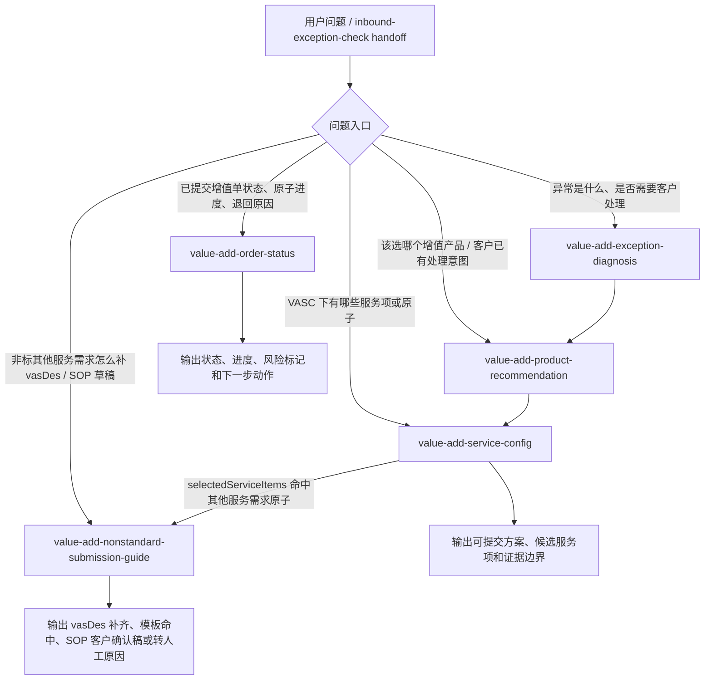

# value-add-experts-plan delta: 新增非标增值提交指引 expert

> 产物阶段：S2 domain plan 实验 delta 草案  
> 来源基线：`ai/agentic/experts/docs/plan/value-add-experts-plan.md`  
> 正式同步目标路径：`docs/plan/value-add-experts-plan.md`  
> 当前状态：实验区草案，待总控、产品/客服和后续 API/实现评审确认；不得直接作为正式结论同步。

## 1. Delta 结论

建议将 `value-add` 域从现有 4 个 experts 扩展为 5 个 experts，新增：

| 状态 | 建议优先级 | Expert ID | 定位 | 核心职责 |
|---|---|---|---|---|
| 待规划确认 | P0/P1 待定，建议 P0.5 | `value-add/value-add-nonstandard-submission-guide` | 非标其他服务提交前指引层 | 在 VASC 和 VaAtom 已确认进入“其他服务需求”类原子后，补齐客户 `vasDes`，匹配历史 `sceneOverviewName + sop` 模板，生成 SOP 客户确认稿或转人工原因。 |

推荐扩展为 5 experts，而不是把该能力塞进 `value-add-service-config`。

理由：

- 现有 4 experts 的链路已经稳定覆盖“异常诊断 -> VASC 推荐 -> 服务项/原子配置 -> 已提交增值单状态查询”。
- S1 业务参考引入的是新的对客任务：围绕 `OW01V1602 入库其他服务需求` 等“兜底非标原子”补齐自然语言需求，并生成可供客户确认的 SOP 草稿。
- 该任务不是简单的字段配置解释，也不是已提交订单状态查询；它需要多轮追问、模板匹配、草稿生成和人工停点治理，独立边界更清晰。
- 若并入 `service-config`，会冲淡其“配置证据状态”职责，并与其“不承诺完整字段、附件、模板”的既有边界冲突。

本 delta 不设计 API 矩阵，不写 workflow/nodes/prompts，不定义实现 design，不创建或提交增值单。

## 2. 新 expert 定位

`value-add/value-add-nonstandard-submission-guide` 是“提交前需求补齐与 SOP 客户确认稿”expert。

它只在以下条件同时满足时承接：

1. 上游已判断客户需求应进入 value-add 推荐链。
2. `value-add-product-recommendation` 已排除更明确的标准 VASC 或明确命名原子优先路径。
3. `value-add-service-config` 已确认候选或选中 VaAtom 为“其他服务需求”类原子。
4. 当前期核心原子为 `OW01V1602 入库其他服务需求`；`OSF6V1603 库内其他服务需求`、`OSF8V1601 出库其他服务需求` 可作为后续同类扩展，但需样例单/API 补证。
5. 用户问题处于提交前准备阶段，而不是已提交增值单状态查询。

它的核心输出不是“正式可执行 SOP”，而是：

- 需求理解。
- 已识别槽位和缺失槽位。
- `vasDes` 补齐建议。
- 历史模板命中/未命中判断。
- 命中模板时的 SOP 客户确认稿。
- 未命中、低置信度或风险命中时的转人工原因。
- 可传递给后续审核/人工的 `preparedSubmissionDraft` 草稿口径。

## 3. 是否从 4 experts 扩展为 5 experts

建议正式 plan 改为“当前 4 个已上线 experts + 1 个新增规划中 expert”。

不建议把现有 4 experts 改写为“已全部覆盖 value-add 域”。更准确的表述是：

- 4 个已上线 experts 覆盖基础链路。
- 新增非标提交指引 expert 覆盖“已确认非标其他服务需求原子后的提交前需求补齐/SOP 草稿”链路。
- 新 expert 不影响 4 个已上线 experts 独立调用；只增加从 `service-config` 之后的可选下游。

建议优先级：

- 若业务目标是减少 `OW01V1602 入库其他服务需求` 提交前反复沟通，应列为 P0/P1 之间的新增规划项。
- 若本期仍缺少 API/样例单来证明历史模板来源、同义归并和匹配阈值，应在正式 plan 中标为“规划中 / 需补证后实现”，不要标为已上线。

## 4. 与现有 4 experts 的关系

### 4.1 与 `value-add-exception-diagnosis`

| 关系 | 说明 |
|---|---|
| 上游事实来源 | `exception-diagnosis` 负责异常编码、异常名称、对象层级、发生节点和是否进入 value-add 推荐链。 |
| 新 expert 消费内容 | 可消费异常事实、异常单号、入库单号、对象层级和客户意图线索，作为 `vasDes` 补齐上下文。 |
| 边界 | 新 expert 不做异常责任核实，不解释异常是否真实存在，不替代入库异常诊断。 |
| 回退 | 如果客户只有异常描述、还没判断是否进入增值链，应先路由 `exception-diagnosis` 或 `inbound/inbound-exception-check`。 |

### 4.2 与 `value-add-product-recommendation`

| 关系 | 说明 |
|---|---|
| 上游分流 | `product-recommendation` 决定是否存在更合适的标准 VASC、非标 VASC 或明确方向。 |
| 新 expert 消费内容 | 消费候选 VASC、首选推荐、客户意图归一、限制说明和缺失确认项。 |
| 边界 | 新 expert 不重新推荐 VASC，不把标准服务或明确命名原子包装成 `OW01V1602`。 |
| 回退 | 若客户问“该选哪个增值产品”，仍由 `product-recommendation` 承接；若命中拍照、销毁、串仓调拨、包材采购等明确方向，应回推荐/配置链分流。 |

### 4.3 与 `value-add-service-config`

| 关系 | 说明 |
|---|---|
| 直接上游 | `service-config` 确认 VASC 下的服务项/原子、顺序、互斥、可选性和字段证据状态。 |
| 新 expert 消费内容 | 消费 `selectedServiceItems`、`service_item_code`、`service_item_name`、`blockedServiceItems`、`mutexGroups`、`fieldEvidenceStatus`、`customerInputHints`、`blockedClaims`。 |
| 边界 | `service-config` 仍只说明配置和证据状态；新 expert 才负责围绕 `vasDes` 多轮追问、历史 SOP 模板匹配和 SOP 客户确认稿。 |
| 回退 | 原子是否可选、互斥是否命中、字段证据是否缺失，仍回 `service-config`；新 expert 不自行裁定配置规则。 |

这里的关键改动是把 `service-config` 的“用户准备资料提示”收窄为通用、证据边界型提示；`value-add-nonstandard-submission-guide` 承接“其他服务需求”场景下的结构化追问和草稿生成。

### 4.4 与 `value-add-order-status`

| 关系 | 说明 |
|---|---|
| 阶段区分 | 新 expert 处理提交前；`order-status` 处理已提交增值单后的状态、原子进度、退回、部分完成和费用增强。 |
| 可互相分流 | 用户已经有 `vasOrderNo` 并问处理进度时，转 `order-status`；用户问退回后如何补充需求描述，可由 `order-status` 输出退回事实，再回新 expert 整理补充草稿。 |
| 边界 | 新 expert 不查询增值单状态、不承诺审核结果、报价、SLA 或仓库一定执行。 |

## 5. 路由树调整建议

建议将正式 plan 第四章“业务链路分层”和第九章“路由速查”从 4 节点链路扩展为 5 节点链路：

```text
客户问题
|
+-- 入库异常是什么 / 是否要客户处理 / 是否进入增值链
|   -> value-add/value-add-exception-diagnosis
|
+-- 已知异常 + 客户问该选哪个增值产品
|   -> value-add/value-add-product-recommendation
|
+-- 已知 VASC / 服务方向 + 问服务项、原子、互斥、配置证据
|   -> value-add/value-add-service-config
|
+-- 已确认非标其他服务需求原子 + 问怎么补需求描述 / 怎么生成 SOP 草稿 / 有没有历史模板
|   -> value-add/value-add-nonstandard-submission-guide
|
+-- 已提交增值单 + 问状态、原子进度、退回/部分完成原因
|   -> value-add/value-add-order-status
|
+-- 入库差异责任、少货、多货、破损、签收争议
|   -> inbound/inbound-exception-check
|
+-- 未下单前估价 / 报价承诺 / SLA 承诺
    -> v1 不承接，必要时转人工
```

建议链路图调整为：



路由判定建议：

| 用户问题/上下文 | 推荐 expert | 判定依据 |
|---|---|---|
| “这个异常是不是要走增值？” | `value-add-exception-diagnosis` | 仍在异常事实归一和增值候选判断阶段。 |
| “这个异常该选哪个增值？” | `value-add-product-recommendation` | 目标是 VASC 推荐。 |
| “这个 VASC 下面选哪个原子？能不能选？” | `value-add-service-config` | 目标是服务项/原子编排、互斥、可选性。 |
| “入库其他服务需求怎么写？`vasDes` 缺什么？有没有 SOP 模板？” | `value-add-nonstandard-submission-guide` | 已进入其他服务需求原子，目标是需求补齐和 SOP 草稿。 |
| “V106075100 处理到哪了？为什么退回？” | `value-add-order-status` | 已提交增值单状态查询。 |
| “能不能保证通过/报价多少/多久做完？” | 不承接或转人工 | 当前正式 plan 已排除未下单前报价和 SLA 承诺。 |

## 6. 新 expert 边界卡

### `value-add/value-add-nonstandard-submission-guide`

**问**：

- 已确认进入“其他服务需求”类 VaAtom 后，客户的 `vasDes` 还缺什么。
- `OW01V1602 入库其他服务需求` 的客户需求如何补成审核人员可理解的描述。
- 补齐后的需求是否能匹配历史 `sceneOverviewName + sop` 模板。
- 命中历史模板后，如何生成替换了本次客户、单据、SKU、仓库、数量、附件等字段的 SOP 客户确认稿。
- 未命中模板、同义归并不明、字段缺失或风险命中时，如何输出转人工原因和已知上下文。

**不问**：

- 不判断异常责任、少货/多货/签收争议。
- 不推荐最终 VASC。
- 不裁定服务项/原子是否可选、是否互斥。
- 不查询已提交增值单状态。
- 不承接未下单前报价、审批结论、仓库 SLA 或一定可执行承诺。
- 不替客户创建、提交、修改增值单。
- 不在历史模板未命中时自由生成确定 SOP。

**衔接**：

- 上游：`value-add-product-recommendation` 的 VASC 推荐结果；`value-add-service-config` 的 `selectedServiceItems`、`fieldEvidenceStatus`、`blockedClaims`。
- 下游：客户确认后的审核/人工流程；若用户已提交单据并问进度，则转 `value-add-order-status`。
- 旁路：若客户需求被识别为明确命名原子，例如拍照、销毁、盘点、包材采购、串仓调拨，应回 `product-recommendation` / `service-config` 分流。

**输入**：

- `vascCode`、`vascName`。
- `service_item_code` / `service_item_name`，本期核心为 `OW01V1602 入库其他服务需求`。
- 客户原始需求、客服对话、需求背景、已知单据和附件描述。
- 上游异常事实：`exceptionCode`、`exceptionName`、`inboundOrderNo`、`eventNo`、`objectLevel`。
- 配置层输出：`selectedServiceItems`、`blockedServiceItems`、`mutexGroups`、`fieldEvidenceStatus`、`customerInputHints`、`blockedClaims`。
- 历史模板证据：`sceneOverviewCode`、`sceneOverviewName`、`data.list[].sop`，以及已确认可复用的 SOP 知识库模板。

**输出**：

- `nonstandardAtomScope`：是否属于本 expert 覆盖的“其他服务需求”原子。
- `requirementUnderstanding`：客户需求理解。
- `vasDesSlots`：已识别槽位、缺失槽位、阻塞/条件阻塞/建议补充分类。
- `clarifyingQuestions`：面向客户/客服的最小追问计划。
- `templateMatch`：历史模板命中、候选、未命中或需同义归并状态。
- `preparedSubmissionDraft`：提交前草稿，包含已确认字段、SOP 客户确认稿、缺口、不可承诺项。
- `manualHandoffReason`：转人工原因、风险点和建议人工确认事项。

**依赖**：

- `docs/experts/value-add/value-add-nonstandard-submission-guide.md`（新增业务参考目标）。
- `value-add-service-guide/vasc-products/nonstandard-and-other-services/` 中非标 VASC 与 VaAtom 资料。
- `value-add-service-guide/relationship-mappings/vasc-product-to-service-item-orchestration-mapping.md`。
- `value-add-service-guide/relationship-mappings/service-item-config-field-evidence-coverage.md`。
- SOP 知识库、样例单或 API 证据，用于证明 `sceneOverviewName + sop` 的历史模板来源。

**降级**：

- 未确认 VASC 或 VaAtom：回 `product-recommendation` / `service-config`。
- 命中明确命名原子：回 `product-recommendation` / `service-config` 分流。
- `vasDes` 关键槽位缺失：继续追问，不进入模板匹配。
- 历史模板未命中：转人工，不自由生成确定 SOP。
- 同义归并或匹配阈值未确认：标记待确认或转人工。
- 涉及审批、报价、SLA、合规、仓库能力承诺：转人工或输出不可承诺边界。

## 7. 哪些正式 plan 段落需要改

正式同步目标：`docs/plan/value-add-experts-plan.md`。

建议修改点：

| 段落 | 当前口径 | Delta 建议 |
|---|---|---|
| `一、结论` | value-add 域建设 4 个 experts。 | 改为“4 个已上线 experts + 1 个新增规划中 expert”，新增 `value-add-nonstandard-submission-guide` 行。 |
| `二、域边界 / value-add 域负责什么` | 覆盖解释、推荐、配置和查询。 | 增加“非标其他服务需求提交前 `vasDes` 补齐和 SOP 客户确认稿”。 |
| `二、域边界 / value-add 域不负责什么` | 不负责未下单前费用预估、直接创建/提交增值单。 | 增加“不在历史模板未命中时自由生成确定 SOP；不承诺审批、报价、SLA、仓库一定可执行”。 |
| `三、知识库依据` | 运行时 KB 只列 4 个 experts。 | 增加新 expert 的 KB/参考占位，但需标注“待后续 S3/S4 补 API/样例单证据后定版”。 |
| `三、当前覆盖事实` | 字段证据 42/52 partial，10 missing。 | 增加非标 SOP 证据事实：`OW01V1602` 为本期核心；历史模板来源、同义归并、匹配阈值需补证。 |
| `四、业务链路分层` | D -> R -> C，C 输出可提交方案；S 为状态查询。 | 在 C 之后增加 N：`selectedServiceItems` 命中其他服务需求原子时进入新 expert；C 不直接输出 SOP 草稿。 |
| `六、场景覆盖映射` | 未包含“入库其他服务需求怎么写 / SOP 模板”场景。 | 增加 `vasDes` 补齐、历史模板 SOP 匹配、SOP 客户确认稿场景。 |
| `七、Expert 边界卡片` | 4 张边界卡。 | 增加第 5 张新 expert 边界卡；同步调整 `service-config` 边界，避免其承诺模板生成。 |
| `九、路由速查` | 4 个 value-add expert 路由。 | 增加“已确认非标其他服务需求原子 + 提交前补描述/SOP 草稿”路由。 |
| `十、专家状态追踪` | 4 个已上线专家。 | 增加规划中行，状态不得写已上线；API/KB 就绪度建议标为“业务参考已出，API/样例单证据待补”。 |
| `十一、批次产物进度` | Batch 1-6 已完成并上线 6.30。 | 增加新实验批次，不要改写 6.30 已上线结论；建议写“后续批次：非标提交指引 expert 规划中”。 |
| `十二、当前待确认项` | 原待确认项均已评估关闭。 | 增加新待确认项：历史模板 SOP 来源、字段稳定定义、同义归并、匹配阈值、草稿状态和可见对象。 |

## 8. 旧表述可能产生的冲突

| 旧表述 | 冲突风险 | 建议修正 |
|---|---|---|
| “围绕入库异常 -> 增值推荐 -> 增值配置 -> 增值单状态查询链路，value-add 域建设 4 个 experts” | 容易被理解为 value-add 域已封闭，不再容纳提交前 SOP 指引。 | 改为“已上线 4 个基础链路 experts；新增规划中 expert 扩展非标提交前指引”。 |
| “旧 `value-add-guide` 是占位实现，不作为本轮设计约束；正式规划只围绕上表 4 个 experts 展开” | 与新增第 5 expert 冲突。 | 保留旧 guide 非约束结论，但把“只围绕 4 个”改成“6.30 批次只围绕 4 个；本 delta 新增第 5 个规划项”。 |
| “value-add 域负责解释、推荐、配置和查询” | 缺少“提交前需求补齐/SOP 草稿”能力段。 | 增加第五类能力段，限定为其他服务需求原子。 |
| “VASC 下需要哪些服务项/原子由 `service-config` 承接” | 如果不补充边界，可能让 service-config 继续承接 `vasDes` 和 SOP 草稿。 | 明确 service-config 只确认原子和配置证据；新 expert 负责其他服务需求原子后的描述补齐和模板草稿。 |
| “service-config 输出可供用户准备资料的提示” | 可能与新 expert 的追问计划重叠。 | 将 service-config 的提示定义为通用准备资料和证据边界；新 expert 的追问必须以 `vasDes` 和 SOP 模板段落为目标。 |
| “字段证据不足时不编造字段、附件、模板和枚举” | 新 expert 生成 SOP 草稿时可能被误读为突破此限制。 | 新 expert 只能在历史模板命中且本次业务字段已替换时生成客户确认稿；未命中模板仍转人工。 |
| “未下单前费用预估 v1 不承接” | 非标提交前指引容易被客户追问报价或 SLA。 | 新 expert 边界卡必须复用费用/SLA 不承诺规则。 |
| “Batch 6 已完成并上线 6.30：4 专家 manifest/workflow/nodes/Coze” | 新增 expert 不能被误标为已上线。 | 状态追踪中分开“已上线基础 4 expert”和“规划中新 expert”。 |

## 9. 与 S1 业务参考的对齐情况

对齐：

- S1 明确 SOP 生成对象是 VaAtom，不是 VASC 产品；本 delta 将新 expert 放在 `service-config` 确认 VaAtom 之后。
- S1 明确本期核心为 `OW01V1602 入库其他服务需求`；本 delta 将其作为新 expert v1 核心范围。
- S1 明确明确命名原子不进入本期 SOP 主流程；本 delta 要求回 `product-recommendation` / `service-config` 分流。
- S1 明确未命中历史模板 SOP 时转人工；本 delta 将该规则写入新 expert 降级和 plan 边界。
- S1 明确不承诺审批、报价、SLA、仓库一定执行；本 delta 复用正式 plan 的费用边界并扩展到新 expert。

待补证但不阻塞本 S2 delta：

- `OW01V1602` 的历史模板 SOP 来源接口/样例单路径。
- `sceneOverviewCode`、`sceneOverviewName`、`data.list[].sop` 的稳定字段定义。
- SOP 知识库标题与事实表 `sceneOverviewName` 的同义归并规则。
- 历史模板匹配阈值和人工确认规则。
- `preparedSubmissionDraft` 的正式字段范围、草稿状态和可见对象。

## 10. 同步策略建议

建议正式 plan 同步时采用小步更新：

1. 先把 `value-add-experts-plan.md` 从“4 experts 封闭规划”改为“4 已上线 + 1 规划中”。
2. 增加新 expert 的边界卡和路由入口，但保持“规划中 / 待补证”状态。
3. 调整 `service-config` 的描述，明确它不生成 `vasDes` 补齐稿或 SOP 草稿。
4. 在待确认项中新增 S1 遗留补证问题，避免把低置信度内容写成正式结论。
5. 等 S3 API/KB gap 和 S4 implementation review 完成后，再决定是否进入 manifest/workflow/nodes/prompts 设计。

## 11. 不建议写入正式 plan 的内容

以下内容不应在当前 S2 delta 阶段同步为正式结论：

- 历史模板匹配算法、阈值、向量检索或规则实现。
- `preparedSubmissionDraft` 的最终 JSON schema。
- workflow / nodes / prompts / Coze 导出结构。
- 未经 API/样例单证明的 SOP 模板覆盖范围。
- 未经产品/客服确认的同义归并映射。
- 任何审批通过、报价、SLA 或仓库可执行承诺。

## 12. 建议进入下一步

建议进入 S3 API/KB gap。

S3 应优先回答：

- `sceneOverviewCode` / `sceneOverviewName` / `data.list[].sop` 是否有稳定 API 或样例单来源。
- `OW01V1602`、`OSF6V1603`、`OSF8V1601` 的历史模板 SOP 覆盖是否可证明。
- SOP 知识库和事实表场景名如何同义归并，是否需要人工审核白名单。
- `preparedSubmissionDraft` 是否已有系统字段、状态或仅作为 AI 草稿。
- 哪些 `vasDes` 缺失项是硬阻塞，哪些允许带缺口转人工。
